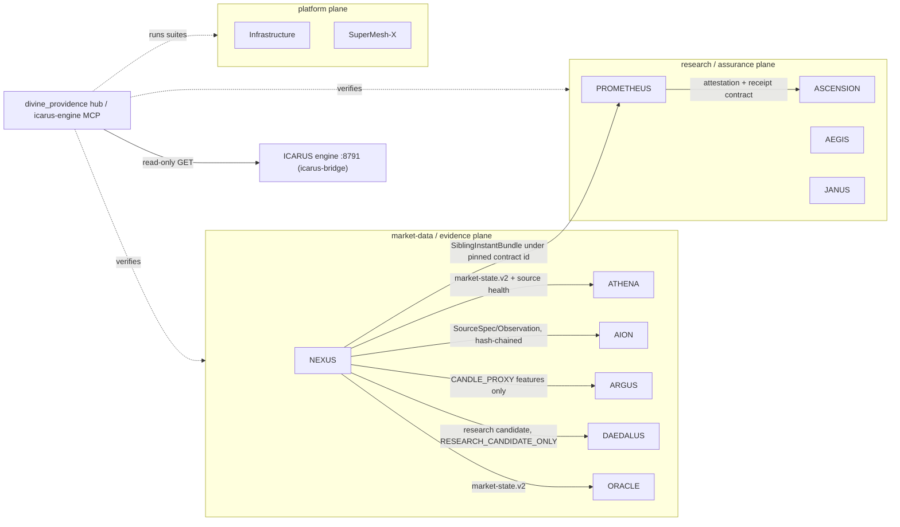

# Architecture and dependency map

ICARUS is an evidence-oriented system-of-systems. The rule that shaped this build
(recovered master handoff, §1 and §13): subsystems exchange **proof-carrying
handoffs** but never silently absorb a sibling's authority. The monorepo therefore
co-locates the subsystems without merging them; connections are explicit contract
checks run by the hub.

## Runtime topology

Recovered integration direction (descriptive, not an execution pipeline):
`NEXUS → JANUS → AEGIS → VECTOR → ASCENSION → SuperMesh-X`, with Infrastructure
supplying persistence/recovery and the Master Loop Governor coordinating work.

## Verified connections (`dp connect`)

| Connection | Contract | What is exercised |
|---|---|---|
| `nexus-siblings` | NEXUS `SiblingInstantRouter` → AION `EventStore`, ARGUS `MicrostructureFeature`, ATHENA `Provenance`, DAEDALUS `bridge` | One causally atomic instant validated against the exact sibling contract modules (NEXUS's own `validate_sibling_contracts`). |
| `nexus-contract-drift` | `nexus.contract-drift-snapshot.v1` vs the pinned path-independent v1.15 baseline `b394df6c…` (the v0.3 release `1119ef3d…` is also reported) | Per-boundary raw/AST drift of the sibling contracts PROMETHEUS pins (ADR 0004). |
| `nexus-oracle` | `nexus.market-state.v2` → `oracle.nexus_ingest` → `FinancialState` | A NEXUS packet becomes ORACLE features with no invented fields. |
| `nexus-prometheus` | `SiblingInstantBundle` → `prometheus_loop.adapters.nexus` → `normalize_nexus_bundle` | PROMETHEUS binds only under a pinned contract identity, supplied only when there is no drift, and normalizes the bundle into sibling observations. Any drift ⇒ `CONTRACT_DRIFT` quarantine. |
| `prometheus-ascension` | `prometheus_loop.attestation` ↔ ASCENSION conformance profile | Field-level alignment with exact `_REQUIRED_CHECKS`; `authenticated=false`, Transfer BLOCKED. |
| `supermesh-witness` | NEXUS bundle + pinned contract baseline → SuperMesh-X `RFC9162WitnessedCheckpointLedger` → `GossipReceiptStore` | The artifacts are witnessed in a 2-of-2 quorum-signed append-only log and re-verified independently; a history rewrite and a rollback must both be rejected. The log is generic by design (opaque leaves); evidence only, no authority. |

### Coverage (`connection_coverage` MCP tool)

9 of 12 systems take part in at least one verified connection. **AEGIS, JANUS and Infrastructure
are standalone by design.** Import audits and repo-wide searches in both directions (2026-09-27)
found no code-level contract with any sibling:
- AEGIS and JANUS import only the standard library (JANUS also uses `cryptography`), and JANUS's
  spec states it does not alter sibling responsibilities.
- Infrastructure's proof, receipt and checkpoint schemas are closed to its own intervention
  lifecycle.

Wiring any of them would mean inventing semantics, which the corpus's authority rules forbid.
All three still deploy, validate and appear in the MCP server like every other system.

ORACLE's own suite additionally validates ORACLE → AION/ARGUS/ATHENA/DAEDALUS exact
contracts against the monorepo trees (`systems/oracle/tests/conftest.py`).

## Authority map

| System | Owns | Must not |
|---|---|---|
| NEXUS | market-data fabric, sibling-safe bundles | absorb sibling/ICARUS authority; call candle proxies L2 |
| DAEDALUS | protected holdouts, promotion decisions | spend holdouts on scanned history; grant execution |
| AION | durable evidence memory | execute (exports `execution_authorized=false`) |
| ARGUS | microstructure truth tiers | relabel proxies as depth; broker authority |
| ATHENA | supervision, abstention, advisory risk | place orders |
| ORACLE | research orchestration | promote/supervise/execute |
| PROMETHEUS | research hypotheses, experiment routing | self-authorize production; claim crypto verification |
| ASCENSION | evaluation, transfer gating | manufacture signatures/trust roots; treat conformance as Transfer |
| AEGIS | challenger discovery, adversarial validation | live execution; spend final holdouts |
| JANUS | descriptive project-twin truth | pick branch winners; absorb sibling authority |
| Infrastructure | persistence/recovery/locking | market/research authority |
| SuperMesh-X | capability/provider orchestration | automatic business/trading authority |
| ICARUS engine (external) | production execution (paper today) | — reached read-only from the hub |

## Isolation model

`runner.py` starts a fresh interpreter per suite or driver with `PYTHONPATH` limited
to the declared import roots (`registry.System.import_roots`). This is required, not
cosmetic: SuperMesh-X ships a top-level `scripts` package, Infrastructure ships flat
`recovery_*` modules and ASCENSION ships flat `evaluator_fabric_*` modules.

## Programs without runnable code

Recovered as documentation only (`docs/programs/`): HELIOS PRIME, VECTOR ∞,
MÖBIUS, Central Orchestration, and design frontiers such as PROMETHEUS v0.6 and
JANUS next-model packets. OMNIVISION and PARALLAX have no recovered implementation.
