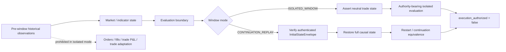
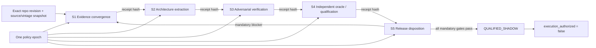
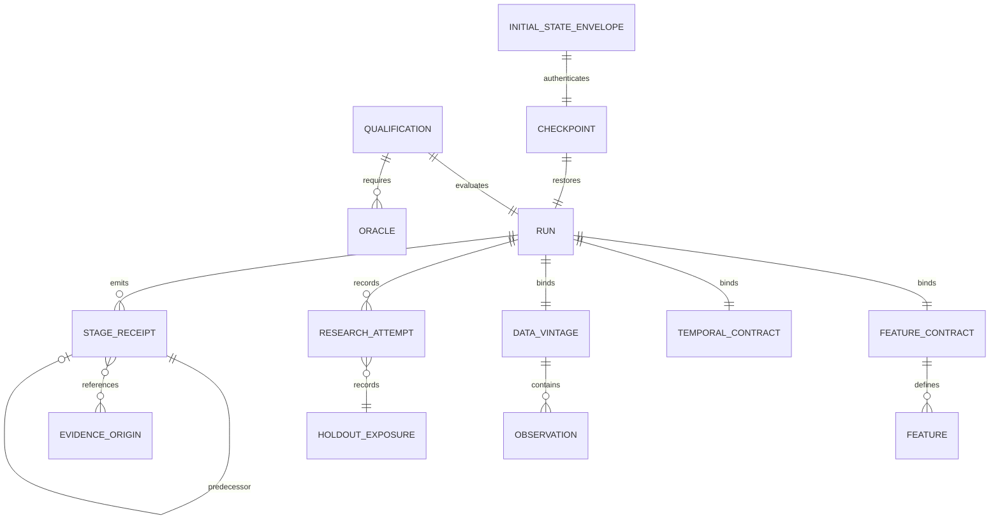
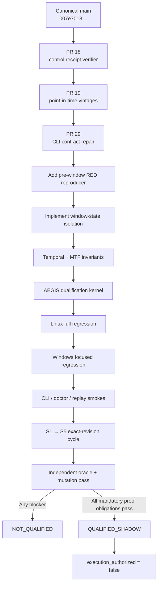

# AEGIS / ICARUS Foreground Masterbuild Engineering Report

## Executive summary

The foreground masterbuild can advance materially now, and this pass does so without changing the governing safety boundary: **`execution_authorized=false` remains absolute; deterministic replay and fail-closed behavior remain mandatory; synthetic bars may not masquerade as empirical evidence; no trainer slot or feature may be invented; Pulse is not rewritten.** Those constraints are already encoded in the ICARUS control-plane handoff and remain appropriate for every implementation batch below. fileciteturn16file0L1-L6

The most important correction from the older handoff is that the **PR #18 CLI defect is no longer an unfixed coding defect**. A later PR, **PR #29**, added a RED regression first, demonstrated failure on Linux and Windows, then added the parser repair and obtained a successful GitHub Actions run. The repair supports the documented `icarus-plant setup --root DIR` form while preserving the older global-option form. It is therefore now an **integration/canonicalization issue**, not a P0 engineering mystery. fileciteturn20file0L1-L2 The actual patch adds `--root` to each relevant subparser using `default=argparse.SUPPRESS`, which avoids clobbering a root already parsed globally. fileciteturn5file0L1-L2 The GREEN workflow at head `3a7da656b5e20a7b8aaa628b2b203d3e2ccaee51` completed successfully. fileciteturn6file0L1-L2

The genuinely load-bearing blockers are now:

**pre-window state isolation → AEGIS qualification kernel → same-cycle S1→S5 continuity → integrated release qualification.**

The canonical default branch is still pinned at `007e70189945b8e112904cf92b2b1a12e43792d6`, so the later control-plane, data-vintage, and CLI fixes must not be described as canonical-main behavior yet. fileciteturn4file0L1-L3 PR #18 remains an open stacked implementation of the deterministic receipt verifier, and PR #19 remains an open stacked implementation of point-in-time market-data vintages. fileciteturn17file0L1-L2 fileciteturn18file0L1-L2

The **reported pre-window trade-state leakage is serious enough to treat as P0, but I did not locate a revision-pinned repository-native RED reproduction of that exact defect** in the recovered archive/current handoff material. That distinction matters: it should be treated as a high-confidence failure class and immediate test target, not falsely promoted to “verified repository defect” until a RED test demonstrates it. The repository already has a separately verified temporal trainer leak: the trainer can reach an event-window path that sees events after the current bar, violating its frozen `ts_event <= ts_bar` rule. fileciteturn11file0L1-L6 The XGB implementation plan correctly says not to introduce the stronger learner until that temporal leak is repaired. fileciteturn12file0L1-L6

The research scan reinforces the design direction. Scikit-learn explicitly warns that ordinary cross-validation is inappropriate for time-ordered observations because it can train on future data and evaluate on past data; `TimeSeriesSplit` exists to preserve temporal ordering. citeturn16search0turn16search20 QuantConnect describes the same fundamental invariant from the simulation side: an algorithm should see only information belonging to the present or past simulated time, specifically to prevent look-ahead bias. citeturn16search35 Those principles imply that ICARUS needs not merely chronological rows, but a **causal state boundary**: market/indicator state that can legitimately be warmed from past observations must be separated from trade-state side effects that would contaminate an isolated evaluation window.

I executed a **17-case specification-level adversarial harness in the foreground** against the proposed new contract. All 17 cases produced the expected PASS/BLOCK result. This is not being misrepresented as repository CI: it validates the proposed contract and test vectors in the chat execution environment. Repository-native RED/GREEN implementation remains the next engineering step.

The complete new reproducibility packet is downloadable now:

**[Download the ICARUS/AEGIS foreground masterbuild engineering packet](sandbox:/mnt/data/ICARUS_AEGIS_FOREGROUND_MASTERBUILD_2026-09-26.zip)**

Package SHA-256:

```text
7d5bc852af217ff3dcc925ed24e055b1f48d6fe15bb222bd788364a7ba361ce4
```

The ZIP integrity check found no corrupt entry. It contains the fresh artifact inventory, hashes, current repository snapshot, proposed pre-window state contract, all adversarial vectors and results, implementation batches, priority table, effort data/chart, handoff checklist, source index, and package manifest.

## Evidence inventory and verified state

### Recovered artifact corpus

The previously produced recovery archive was re-inventoried rather than merely trusted by filename. It contains **62 file entries**, and this foreground package records a fresh SHA-256 for every recovered member in `artifact_inventory.csv`.

The major source artifacts presently available in the chat runtime hash to:

| Artifact | Fresh SHA-256 |
|---|---|
| `ICARUS_AEGIS_ABSOLUTE_EVERYTHING_2026-09-24.zip` | `a63274543f0983762211530baa653146022af95043f4bc495f5f3a40921ef14a` |
| `ICARUS_AEGIS_ABSOLUTE_EVERYTHING_MASTER_HANDOFF_2026-09-24.txt` | `b6e2c80c58ea2e79dc185db78236105bffe6911c898af5d62009053bd406bc04` |
| `ICARUS_AEGIS_FULL_DOSSIER.txt` | `36122b7eaddb1bcb0eb3c376334220d7dab301151daf433f8e116a1244dec005` |
| `ICARUS_AEGIS_MASTERBUILD_FULL_HANDOFF.md` | `cb5edcc2e9bd12de756d6f9a91ab07f4b055f13305463d57f317956699be37bb` |
| `ICARUS_AEGIS_MASTERBUILD_PACKAGE.zip` | `0387527ee44697bfc91de0f6515a6e8a878758288a211c27ccaae1f7b155b8ba` |

The prior full recovery archive remains downloadable:

[Download the prior complete recovery archive](sandbox:/mnt/data/ICARUS_AEGIS_ABSOLUTE_EVERYTHING_2026-09-24.zip)

[Download the prior master handoff](sandbox:/mnt/data/ICARUS_AEGIS_ABSOLUTE_EVERYTHING_MASTER_HANDOFF_2026-09-24.txt)

The recovered corpus includes the AEGIS Findings 001–030 program, control-cycle material, empirical-qualification material, OMNIVISION and Stage-5 evidence, prior S3/S4/S5 handoffs, implementation/repository evidence, worklogs, Atlas material, and the earlier architecture/masterbuild documents. The important epistemic distinction remains: **archived design is not automatically implemented code, and archived reports of implementation are not automatically current canonical code**. The repository’s integration index explicitly requires a known implementation location, immutable revision, explicit timing/provenance semantics, deterministic replay expectations, passing tests, and no load-bearing unresolved conflict before a component is admitted. fileciteturn16file0L1-L6

### Current repository truth

The latest repository inspection materially improves the handoff state:

| Surface | Current evidence | Engineering classification |
|---|---|---|
| `main` | SHA `007e70189945b8e112904cf92b2b1a12e43792d6`. fileciteturn4file0L1-L3 | Canonical, but predates the new stack |
| PR #18 | Deterministic `icarus_control` receipt verifier with canonical JSON, SHA-256 chain, same-cycle/policy checks, maturity ceilings, deduplication, S4 provenance and fail-closed promotion validation. fileciteturn17file0L1-L2 | Implemented on open stacked branch |
| PR #19 | Point-in-time observation/revision preservation, source SHA identity, idempotence, revision linkage and provenance-before-overwrite fail-closed behavior. fileciteturn18file0L1-L2 | Implemented/tested on open stacked branch |
| PR #29 | RED→GREEN fix for subcommand-local `--root`; no trading/Pulse/model/feature changes. fileciteturn20file0L1-L2 | Coding fix verified; canonicalization outstanding |
| Empirical qualification lane | SOURCE→DATA→TIME→BASELINE→XGB→ECONOMICS→ROBUSTNESS documentation exists; its stated next dependency is implementation of the SOURCE+DATA kernel. fileciteturn19file0L1-L2 | Qualification design ahead of implementation |
| XGB Slot 1 | Still documented as an explicit unimplemented path at the pinned baseline; causal trainer-event repair is a prerequisite. fileciteturn12file0L1-L6 | Correctly blocked |

PR #19 also has explicit residual proof obligations: its append-only semantics are primarily SQLite-trigger based; cryptographic head/chain verification, tamper regressions, complete deterministic `as_of` reconstruction and stronger canonical-row/vintage linkage remain future hardening. fileciteturn18file0L1-L2

That means the build should **not** jump directly into XGB, expert proliferation, or strategy expansion. The causal/provenance kernel is still the dependency root. This is consistent with the repository’s own XGB handoff, which explicitly says a stronger learner introduced before temporal leakage repair would strengthen the leak rather than the evidence. fileciteturn12file0L1-L6

## Prioritized engineering actions

The ordering below is intentionally different from simply following finding numbers. It orders work by **invalidating power**: a defect capable of making later test results untrustworthy comes before a defect that merely prevents convenient release.

| Issue | Severity | Proposed fix | Required artifacts | Tests | Estimated effort |
|---|---|---|---|---|---:|
| **Pre-window trade-state leakage** | **P0 / Critical** | Introduce explicit `ISOLATED_WINDOW` versus `CONTINUATION_REPLAY` semantics. Permit causal market-state warm-up but prohibit pre-window trade side effects in isolated evaluation. Assert a neutral trading state at the evaluation boundary. | `WindowState` contract, window-mode enum, trade-state inventory, boundary receipt, replay integration point | Inherited position/order/P&L/cooldown/history negatives; warm-up positive; future-tail mutation; adaptive-memory contamination | **12–20 h** |
| **AEGIS qualification kernel** | **P0 / Critical** | One qualification receipt must bind source/vintage, time, feature contract, repository revision, research lineage, oracle lineage and deterministic replay state. | Evidence envelope, `FeatureContract`, temporal contract, qualification schema/validator, state digest | Tamper, missing lineage, stale/late input, incompatible feature contract, replay mismatch, uncertainty escalation | **20–32 h** |
| **S1→S5 same-cycle continuity** | **P0 / Critical** | Run the five assurance stages under one policy epoch, exact revision and snapshot set, predecessor-linked end to end. | Stage receipts, policy epoch, snapshot manifest, evidence-origin ledger | Missing stage, mixed policy, mixed revision, broken predecessor, duplicate evidence, invalid maturity advancement | **12–18 h** |
| **Release/integration readiness** | **P0 / High** | Canonicalize one coherent `main → PR18 → PR19 → PR29` stack and rerun the assurance suite on the exact resulting revision. | Integrated revision, compare manifest, CI receipts, release disposition | Linux full, Windows focused, CLI smokes, temporal/kernel suites, independent review | **16–28 h** |
| **PR #18 CLI contract** | **P1 / Medium** | Carry the already-tested PR #29 repair into the canonical stack; preserve both supported argument placements. fileciteturn20file0L1-L2 | PR #29 patch and GREEN CI receipt | Both CLI forms, every plant subcommand, Linux/Windows smoke | **2–5 h** |
| **Finding 029 feature parity** | **P1 / High** | Versioned `FeatureContract` proving train/batch/incremental/serve equivalence and binding units, order, missingness and lineage. | Feature schema/digest, dependency lineage, runtime identity | Value/order/unit/sign/missingness parity; ancestry; stale-source blocks | **24–40 h** |
| **Finding 026 causal MTF parity** | **P1 / High** | Make higher-timeframe data explicitly `PARTIAL` or `FINAL`; only FINAL values after known finality. | MTF evidence envelope, finality/calendar contract, causal fixtures | Future-extrema mutation, partial/final legality, incremental=batch equivalence | **18–30 h** |
| **Finding 030 research multiplicity** | **P1 / High** | Durable attempt and holdout-exposure ledger covering failed/discarded variants as well as winners. | Trial ledger, exposure ledger, experiment lineage | Changed-study holdout reuse, omitted trial, repeated exposure, replay-vs-new-study classification | **14–24 h** |
| **Finding 020 recovery equivalence** | **P1 / High** | Authenticated checkpoints, explicit offsets, idempotent redelivery, torn-state fail-closed behavior. | State manifest, checkpoint hash chain, source offsets | Crash injection, duplicate delivery, torn write, uninterrupted-vs-restored prefix equality | **18–30 h** |
| **Finding 023 oracle independence** | **P1 / High** | Separate regression tests from independent correctness oracles; record ancestry and mutation score. | Oracle registry, ancestry DAG, mutant corpus | Intentional mutants must fail; cloned-oracle dependency must reduce confidence | **18–32 h** |

The effort values are planning estimates, not claims about wall-clock completion. They primarily show where engineering mass remains. The dominant work is **feature parity, qualification, oracle independence, temporal aggregation, and recovery—not the CLI repair**.


The temporal design is grounded in the same reason scikit-learn gives for time-series-specific splitting: ordinary validation is unsafe when it permits the future to enter training relative to the evaluation observation. citeturn16search0turn16search20 ICARUS needs to enforce that idea more strongly than a splitter alone because the leakage surface includes not just rows, but mutable trading state, adaptive memory, data revisions, event availability and aggregated timeframe state.

## Extraction-ready implementation architecture

### Pre-window isolation batch

This should be the first repository-native RED→GREEN batch.

The key design decision is **not “reset everything”**. That would destroy legitimate causal market context and create an unrealistic cold-start test. The correct separation is:

```text
MARKET STATE
past bars -> indicators -> rolling market features -> regime context
                    ALLOWED to warm causally

TRADE STATE
orders -> fills -> position -> P&L -> trade counters -> cooldowns ->
closed-trade adaptation -> stop/ratchet state
                    BLOCKED before isolated-window boundary
```

The system should expose two explicit evaluation modes:

```python
class WindowMode(Enum):
    ISOLATED_WINDOW = "isolated_window"
    CONTINUATION_REPLAY = "continuation_replay"
```

For `ISOLATED_WINDOW`, the warm-up interval may update pure market/indicator state, but the decision boundary must fail closed unless trade state satisfies an invariant equivalent to:

```python
position_qty == 0
pending_orders == 0
realized_pnl == 0
day_trade_count == 0
loss_streak == 0
cooldown_origin is None
last_entry_time is None
position_age == 0
```

Any adaptive variable derived from previous trades must be either explicitly **RESET** or shown to be **TRAINING_ONLY**. This prevents a holdout from inheriting knowledge such as earlier win rates, stop-out history, realized MAE distributions, cooldown state, or P&L-dependent risk state.

`CONTINUATION_REPLAY` solves a different problem. A restart-equivalence test legitimately needs to resume positions and adaptive state. It therefore requires an authenticated `InitialStateEnvelope`, approximately:

```json
{
  "schema": "icarus-initial-state-v1",
  "as_of": "...",
  "source_run_id": "...",
  "source_revision": "...",
  "market_state_sha256": "...",
  "trade_state_sha256": "...",
  "risk_state_sha256": "...",
  "adaptive_state_sha256": "...",
  "open_positions": "...",
  "pending_orders": "...",
  "predecessor_receipt_sha256": "...",
  "execution_authorized": false
}
```

A continuation replay must never be relabelled an “untouched isolated OOS” result. This separates **causal realism** from **evaluation independence**.

The repository already has an analogous causal rule for event features: future events must not enter trainer rows, and exact/past events must remain usable. fileciteturn12file0L1-L6 The conceptual rule is the same as QuantConnect's simulated-time rule: a decision receives only information belonging to the simulated present or past, not information learned later. citeturn16search35



### Temporal and multiscale batches

Every authority-bearing datum should ultimately carry enough temporal identity to answer **when was this fact actually usable?** At minimum:

\[
t_{\text{event}}
\le
t_{\text{observed}}
\le
t_{\text{ready}}
\le
t_{\text{decision}}
\]

The distinction matters because an economic event can occur at one instant, reach the provider later, be processed later still, and only then become eligible for a model decision. The repository’s known trainer leak demonstrates why event timestamp alone is insufficient: a broad event-window implementation can expose later records to a current row. fileciteturn11file0L1-L6

The temporal envelope should therefore bind:

```text
event_time
observed_time
ready_time
decision_time
source_vintage_id
semantic_identity
provenance_sha256
```

Missing mandatory knowledge-time metadata is **UNKNOWN**, not an invitation to infer a convenient timestamp.

The multitimeframe contract then extends the envelope with:

```text
value_state = PARTIAL | FINAL
period_start
period_end
observed_through
final_time
```

A `FINAL` 20-minute high, low, close, confirmation flag, or extrema-derived feature is illegal for a five-minute decision before that 20-minute bar becomes final. A `PARTIAL` value can be used earlier only when it is computed from the prefix genuinely observed by that decision time. The decisive regression is **future-tail mutation invariance**: mutate the future portion of an aggregate and assert that every earlier decision remains byte-for-byte/state-hash equivalent.

### Qualification and control-cycle batches

The AEGIS kernel should not output “good model/bad model.” It should output a **qualification disposition bound to evidence identity**:

```text
UNQUALIFIED
QUALIFIED_SHADOW
BLOCKED
```

There should be no state transition from this gate directly to live execution. `QUALIFIED_SHADOW` still carries `execution_authorized=false`.

A qualifying receipt should bind at least:

```text
repository_revision
dataset_sha256
data_vintage_manifest_sha256
feature_contract_sha256
temporal_contract_sha256
configuration_sha256
runtime_environment_identity
research_attempt_ledger_head
oracle_registry_head
test_evidence_head
replay_state_sha256
predecessor_receipt_sha256
execution_authorized=false
```

This builds directly on PR #18's existing deterministic receipt-chain machinery rather than creating a second competing control plane. PR #18 already defines canonical receipt hashing, predecessor links, same-cycle policy/revision checks, evidence-origin deduplication and structural promotion gating. fileciteturn17file0L1-L2



The presently documented empirical lane is not yet at this kernel state: its own handoff says the SOURCE+DATA kernel and tests are the next dependency before proceeding through TIME or XGB. fileciteturn19file0L1-L2

## Adversarial test and falsification plan

The foreground adversarial harness covers 17 contract-level scenarios. **Seventeen of seventeen produced the expected oracle outcome.** Again, that result validates the proposed contract/harness only; it does not substitute for running the actual ICARUS implementation.

| Scenario | Expected | Foreground result | Why it matters |
|---|---:|---:|---|
| Causal warm-up primes market features only | PASS | PASS | Legitimate historical context remains available |
| Isolated holdout inherits an open position | BLOCK | BLOCK | Detects pre-window position leakage |
| Warm-up changes fills/P&L/trade counters | BLOCK | BLOCK | Detects hidden strategy side effects |
| Pre-window trade-history adaptation survives boundary | BLOCK | BLOCK | Detects learned trade-state contamination |
| Authenticated continuation replay | PASS | PASS | Allows legitimate restart equivalence |
| Continuation is labelled untouched OOS | BLOCK | BLOCK | Stops evidence-class laundering |
| Evidence becomes ready after decision | BLOCK | BLOCK | Enforces availability time |
| Future-tail mutation leaves decision prefix unchanged | PASS | PASS | Positive causal-invariance control |
| Future-tail mutation changes earlier prefix | BLOCK | BLOCK | Detects future leakage |
| FINAL HTF feature used before finality | BLOCK | BLOCK | Detects aggregation look-ahead |
| Explicit causal PARTIAL HTF state | PASS | PASS | Allows valid intraperiod information |
| Post-decision vendor revision affects old decision | BLOCK | BLOCK | Protects point-in-time truth |
| Checkpoint restore equals uninterrupted state | PASS | PASS | Positive recovery control |
| Restored checkpoint changes state | BLOCK | BLOCK | Detects restart inconsistency |
| Duplicate redelivery leaves state unchanged | PASS | PASS | Confirms idempotence |
| More uncertainty raises authority | BLOCK | BLOCK | Enforces monotonic safety |
| Execution authority becomes true | BLOCK | BLOCK | Hard safety invariant |

The test philosophy is deliberately **metamorphic**, not merely example-driven. Instead of asking only “does output equal fixture X?”, tests perturb things that *must not* affect earlier decisions:

\[
\operatorname{DecisionPrefix}(D)
=
\operatorname{DecisionPrefix}(\operatorname{MutateFuture}(D))
\]

for every mutation strictly beyond the relevant knowledge boundary.

Similarly, recovery must satisfy:

\[
\operatorname{State}_{t}^{\text{uninterrupted}}
=
\operatorname{State}_{t}^{\text{checkpoint+restore}}
\]

and duplicate delivery must satisfy:

\[
F(F(S,e),e)=F(S,e)
\]

for an event \(e\) whose delivery identity is already recorded.

These properties are stronger than a collection of happy-path snapshots because they directly test causality, restart equivalence and idempotence.

The next repository-native RED suite should therefore begin with six tests **before production implementation changes**:

```text
test_isolated_window_rejects_inherited_position
test_isolated_window_rejects_warmup_trade_side_effects
test_isolated_window_rejects_trade_history_adaptation
test_isolated_window_allows_causal_indicator_warmup
test_future_tail_mutation_cannot_change_decision_prefix
test_continuation_requires_authenticated_initial_state
```

The temporal suite should then add:

```text
test_future_event_is_not_trainer_visible
test_future_realized_surprise_is_not_trainer_visible
test_ready_after_decision_fails_closed
test_later_data_revision_cannot_mutate_prior_asof_decision
test_asof_reconstruction_is_deterministic
```

Those trainer tests are consistent with the repository’s already documented Phase-0 requirement that future FOMC/events and future surprise values be excluded while exact-time/past events remain usable. fileciteturn12file0L1-L6

For model evaluation itself, chronological validation must remain non-shuffled. Scikit-learn documents `TimeSeriesSplit` specifically for ordered data where ordinary CV would allow future-to-past contamination. citeturn16search0turn16search20 The existing ICARUS XGB design also preserves a frozen chronological **60/20/20** train/validation/terminal split, uses validation for early stopping, and reserves raw terminal scoring for final authority before any calibration step. fileciteturn12file0L1-L6

The entity relationships for the resulting assurance system should look like this:



This structure closes several AEGIS findings at once: feature skew cannot hide outside the `FeatureContract`; later data revisions cannot silently replace the `DATA_VINTAGE`; research variants cannot vanish from the attempt ledger; checkpoint recovery gains an authenticated state identity; and the final qualification cannot be asserted without its oracle lineage.

## Integration disposition and reproducible handoff

The correct release sequence now is:



PR #29 provides a clean integration target for the CLI piece: its RED run failed before the production repair, its GREEN run passed after the repair, and its branch is based on the PR #19 data-vintage stack. fileciteturn20file0L1-L2 The exact code change is small and reviewable—16 added parser lines plus the regression test in the inspected PR file list. fileciteturn5file0L1-L2

PR #19 should not be considered the end of temporal provenance. Its own current description explicitly leaves deterministic cryptographic chain verification, tamper testing, complete `as_of` reconstruction and stable row-to-vintage linkage as outstanding hardening. fileciteturn18file0L1-L2 Those items belong inside the AEGIS qualification gate because a model cannot prove “what it knew then” if historical source revisions are not reconstructible.

Likewise, a green PR #18 control-chain check proves structural coherence, **not scientific validity or execution authorization**; PR #18 itself explicitly makes that distinction. fileciteturn17file0L1-L2 That is why S4 needs independent oracle evidence and why S5 must still return `NOT_QUALIFIED` whenever one of the causal, lineage, recovery, research-exposure, or integration gates is unknown.

### Reproducibility checklist

The new handoff has already completed the non-repository parts: fresh source-archive hashes, 62-member archive inventory and hashes, current canonical SHA capture, current PR #18/#19/#29 identities, corrected CLI classification, serialized pre-window contract, serialized adversarial vectors, foreground contract-harness execution, extraction-ready implementation batches, effort data, and a package SHA-256 manifest.

The repository-bound obligations remain intentionally open:

- produce the **repository-native RED reproduction** for the reported pre-window trade-state leakage;
- implement the isolation contract without touching Pulse;
- rerun causal event, temporal availability and MTF tests against the real runtime;
- choose/canonicalize the PR #18 → #19 → #29 stack and prove no restack semantic drift;
- execute Linux full and Windows focused suites on the exact integrated SHA;
- regenerate all S1→S5 receipts against that exact SHA and one policy epoch;
- perform independent-oracle/mutation qualification;
- keep release disposition `NOT_QUALIFIED` on any mandatory UNKNOWN/BLOCK condition;
- preserve `execution_authorized=false` throughout.

The repository already documents that current XGB qualification is too dependent on artifact existence and needs stronger structural provenance validation. fileciteturn11file0L1-L6 Accordingly, implementation of XGB Slot 1 belongs **after** this causal-integrity sequence, not alongside it.

### Downloadable verification artifacts

**Foreground engineering packet**

[Download `ICARUS_AEGIS_FOREGROUND_MASTERBUILD_2026-09-26.zip`](sandbox:/mnt/data/ICARUS_AEGIS_FOREGROUND_MASTERBUILD_2026-09-26.zip)

```text
SHA-256
7d5bc852af217ff3dcc925ed24e055b1f48d6fe15bb222bd788364a7ba361ce4
```

**Machine-readable SHA-256 manifest**

[Download `SHA256_MANIFEST.json`](sandbox:/mnt/data/ICARUS_AEGIS_FOREGROUND_MASTERBUILD_2026-09-26/SHA256_MANIFEST.json)

**Priority table**

[Download `prioritized_action_table.csv`](sandbox:/mnt/data/ICARUS_AEGIS_FOREGROUND_MASTERBUILD_2026-09-26/prioritized_action_table.csv)

**Proposed pre-window contract**

[Download `pre_window_state_contract.json`](sandbox:/mnt/data/ICARUS_AEGIS_FOREGROUND_MASTERBUILD_2026-09-26/pre_window_state_contract.json)

**Adversarial scenarios and foreground results**

[Download `red_team_scenarios.json`](sandbox:/mnt/data/ICARUS_AEGIS_FOREGROUND_MASTERBUILD_2026-09-26/red_team_scenarios.json)

[Download `red_team_results.json`](sandbox:/mnt/data/ICARUS_AEGIS_FOREGROUND_MASTERBUILD_2026-09-26/red_team_results.json)

**Extraction-ready engineering batches**

[Download `implementation_batches.md`](sandbox:/mnt/data/ICARUS_AEGIS_FOREGROUND_MASTERBUILD_2026-09-26/implementation_batches.md)

**Current repository snapshot**

[Download `current_repo_snapshot.json`](sandbox:/mnt/data/ICARUS_AEGIS_FOREGROUND_MASTERBUILD_2026-09-26/current_repo_snapshot.json)

**Fresh recovered-artifact inventory**

[Download `artifact_inventory.csv`](sandbox:/mnt/data/ICARUS_AEGIS_FOREGROUND_MASTERBUILD_2026-09-26/artifact_inventory.csv)

**Effort source data**

[Download `effort_distribution.csv`](sandbox:/mnt/data/ICARUS_AEGIS_FOREGROUND_MASTERBUILD_2026-09-26/effort_distribution.csv)

The package has deliberately kept three evidence classes separate: **repository-verified implementation/test evidence**, **recovered historical design/report evidence**, and **new foreground specification-level test evidence**. That separation is itself an AEGIS control: nothing in this report promotes a design into tested code, a branch into canonical main, a successful structural verifier into scientific proof, or a qualification result into trading authority. The masterbuild’s next dependency is therefore sharply defined: **turn the pre-window leakage hypothesis into a failing repository test, repair that state boundary, then make the resulting temporal/provenance contract a mandatory input to the AEGIS kernel and S1→S5 release chain.**