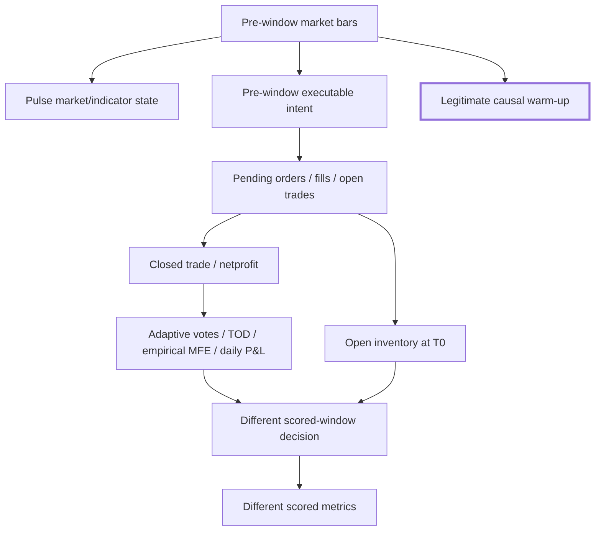
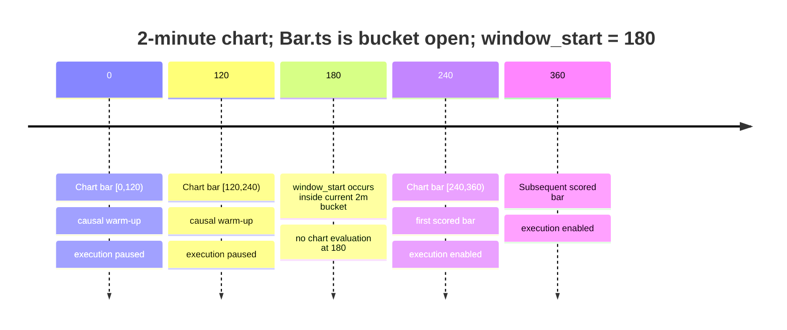

# AEGIS/ICARUS Implementation-Ready Repair Package for Pre-Window Trade-State Leakage

## Executive summary

The pinned subject is ICARUS revision **`76569e1962e721b0f4dc973df21358f40c31ce81`**. The commit exists and identifies tree `89e28ef45c8d154d6c3d8be3a9a4d8fa1013fc20`. All recommendations below are tied to that revision; no repository write, merge, deployment, publication, or trading action was performed. fileciteturn17file0L2-L2

`AEGIS-BACKTEST-PREWINDOW-TRADE-STATE-LEAK-001` is **source-verified and HIGH severity for empirical/holdout validity**. The root cause is narrow: `run_backtest()` replays every pre-window chart bar through the normal `AssetRunner._on_chart_bar()` execution path and applies `window_start` only afterward when deciding what P&L, positions, path points, and trade pieces to report. The function's current docstring explicitly describes the legacy behavior as retaining earlier strategy/**position** warm-up state. fileciteturn2file0L2-L2 fileciteturn3file0L2-L2

That reporting filter is not an isolation boundary. `AssetRunner` starts with `paused=False`; its real chart-bar path copies the runner pause flag into `PulseStrategy`, cancels pending entries when paused, processes broker orders, derives HTF/LTF state, and still calls `PulseStrategy.on_bar()`. Thus the repository already contains exactly the mechanism needed to separate market/indicator warm-up from execution. fileciteturn4file0

The minimal behavioral repair is a **single production line immediately before `orig(real, live)`**:

```diff
@@ def hooked(real: Bar, live: bool) -> None:
         if window_end is not None and r.cal.bucket_end(real.ts, r.chart_minutes) > window_end:
             return
+        r.paused = window_start is not None and real.ts < window_start
         orig(real, live)
```

This is preferable to resetting the emulator at `window_start`. A reset would have to find and correctly reset every outcome-trained Pulse field, while Pulse currently persists empirical MFE buffers, time-of-day wins/losses, adaptive hit/miss state, per-trade queues, daily realized P&L state, and closed-trade cursors. Those fields are updated from emulator trade outcomes and can influence later entry and exit decisions. fileciteturn8file0

The patch works on the pinned implementation because all currently reachable initial RATE and TIDE entry paths are already pause-aware: RATE's `entry_allowed` requires `not self.paused`; TIDE's long and short entry predicates independently require `not self.paused`; the pullback fallback entry path is reachable only through `rate_pend_dir`, which begins at zero and is armed by the RATE entry machinery. fileciteturn8file0 The emulator starts with empty `open`, `closed`, `fills`, pending-entry, pending-close, and exit collections; market entries submitted on bar N normally fill at bar N+1. fileciteturn5file0L2-L2

The existing `tests_engine/test_backtest_window.py` cannot by itself be the GREEN oracle. Its `ScriptedRunner` overrides `_on_chart_bar()` and never consults `self.paused`, and two existing tests explicitly encode the legacy contaminated behavior: `test_start_preserves_positions_but_excludes_their_pnl` asserts that the pre-window `"carry"` position survives, while `test_pre_start_open_position_is_not_reported` asserts that `"carry"` remains open but is hidden from the reported trade list. fileciteturn6file0L2-L2 These tests should be retained only as **defensive reporting-filter tests for intentionally injected impossible state**, renamed accordingly; new pause-aware tests must establish the repaired execution semantics.

The implementation package therefore requires functional changes only in **`icarus_engine/backtest.py::run_backtest()`**, with regression work in **`tests_engine/test_backtest_window.py`** and a real-Pulse warm-up negative control in **`tests_engine/test_frozen_replay.py`**. No functional changes are indicated in `runtime.py`, `emulator.py`, or `strategy/pulse.py`. The control-plane validator likewise needs no change for this particular defect; it already requires `execution_authorized` to be exactly false, and the control-plane documentation states that structural validation does not authorize merge, deployment, publication, or trading. fileciteturn10file0L2-L2 fileciteturn11file0L2-L2 fileciteturn14file0L2-L2

### Repair disposition

| Item | Disposition |
|---|---|
| Defect | `AEGIS-BACKTEST-PREWINDOW-TRADE-STATE-LEAK-001` |
| Severity | **HIGH — empirical/holdout validity** |
| Pinned revision | `76569e1962e721b0f4dc973df21358f40c31ce81` |
| Root cause | `window_start` filters reporting but does not suppress pre-window execution |
| Production repair | One pause assignment in `run_backtest()::hooked()` before `orig()` |
| Pulse rewrite | **No** |
| Emulator reset | **No** |
| Indicator warm-up | **Preserved** |
| Historical P&L impact | **UNKNOWN — not measured** |
| Repository writes | **None** |
| Trading authority | **`execution_authorized=false`** |

## Repository evidence and root-cause analysis

### Exact affected interfaces

The defect spans several interfaces causally, but only one requires a production behavior change.

| File | Function/interface | Role in defect | Change required |
|---|---|---|---|
| `icarus_engine/backtest.py` | `run_backtest()` | Replays warm-up through normal runtime, then filters reported state by `included()` | **Yes — one functional line + docstring correction** |
| `icarus_engine/backtest.py` | inner `included(ts)` | Defines current reporting start semantics using chart `Bar.ts` | No logic change |
| `icarus_engine/backtest.py` | inner `hooked(real, live)` | Correct boundary seam; currently calls `orig()` before any start suppression | **Yes** |
| `icarus_engine/runtime.py` | `AssetRunner.__init__()` | Fresh runner begins `paused=False` | No |
| `icarus_engine/runtime.py` | `AssetRunner._on_chart_bar()` | Propagates `paused` to Pulse, cancels entries while paused, processes broker state, still runs indicators/Pulse | No |
| `icarus_engine/runtime.py` | `AssetRunner._cancel_pending_entries()` | Removes pending entries plus unattached exit/close ancestry | No |
| `icarus_engine/emulator.py` | `Emulator.entry()`, `exit()`, `close()`, `process_bar()` | Persists executable orders/positions; next-bar market execution makes boundary leakage consequential | No |
| `icarus_engine/strategy/pulse.py` | `PulseStrategy.on_bar()` | Contains current pause-aware RATE/TIDE entries and trade-outcome adaptive state | No |
| `tests_engine/test_backtest_window.py` | `replay()` / `ScriptedRunner` | Current test double bypasses pause semantics | Test clarification + new independent fixture |
| `tests_engine/test_backtest_window.py` | `test_start_preserves_positions_but_excludes_their_pnl` | Explicitly codifies defective carry behavior | Rename/reframe |
| `tests_engine/test_backtest_window.py` | `test_pre_start_open_position_is_not_reported` | Explicitly codifies hidden carried position | Rename/reframe |
| `tests_engine/test_frozen_replay.py` | `source()` and replay tests | Best existing primary fixture for real-`AssetRunner`, no-network, frozen-history negative control | Add one negative-control test |
| `icarus_control/validation.py` | `validate_receipt()` | Enforces `execution_authorized=false`; not part of defect mechanism | No |
| `docs/icarus-control-plane/contracts/icarus-pipeline-v1.json` | common receipt contract | Requires execution-authority and S4 oracle/negative-control metadata | No |

The current backtest creates a **fresh `AssetRunner` with an in-memory journal**, then defines `included(ts)` as `ts >= window_start`/`ts <= window_end`. But the `hooked()` path calls `orig(real, live)` before using `included()` to accumulate realized P&L or append the scored equity path. Later it filters closed and open `Piece`s again by `t.entry_ts`. Thus the window is presently an accounting/reporting filter, not an execution-isolation boundary. fileciteturn3file0L2-L2

```mermaid
flowchart LR
    A[Frozen deep history + subbars] --> B[run_backtest]
    B --> C[Fresh AssetRunner]
    C --> D[hooked chart-bar callback]

    D -->|current pinned behavior| E[orig / AssetRunner._on_chart_bar]
    E --> F[Emulator.process_bar]
    E --> G[HTF/LTF + Pulse.on_bar]
    G --> H[entry / exit / close intents]
    H --> F
    F --> I[open / closed / fills / netprofit]

    I --> J[included entry_ts filter]
    J --> K[reported trades / P&L / equity]

    style J stroke-width:3px
```



The defect lies between **D and E**: `window_start` is enforced only later at **J**. A pre-window trade can therefore mutate **I** and Pulse state even when the reporting layer later suppresses the offending trade.

### Why filtering P&L is insufficient

The emulator's contract makes pre-window state persistent. `entry()` appends a `PendingEntry`; market entries are processed at the next bar open; `exit()` can install attached exit state; `close()` creates pending close state; `process_bar()` converts these into open/closed trades and fills; and realized profits increment `netprofit`. fileciteturn5file0L2-L2

Pulse then consumes those outcomes. Its initialized persistent state includes `emp_mfe_pct_buf`, `emp_buf_trend`, `emp_buf_chop`, `tod_wins`, `tod_losses`, adaptive vote hit/miss arrays, `daily_pnl`, per-trade frozen state, outcome queues, `_prev_closed`, and `_p_netprofit`. fileciteturn8file0 Completed RATE trades can pop `w_slot_queue`, update adaptive records and time-of-day wins/losses; completed trade excursion can be appended to empirical MFE buffers; and changes in emulator `netprofit` are accumulated into `daily_pnl`, which participates in future entry qualification. fileciteturn8file0

Therefore the causal failure is:



The required repair must retain **B/J** while removing **C→I** before `window_start`.

### Why the existing pause mechanism is the correct seam

The real `AssetRunner._on_chart_bar()` performs the following sequence: initialize the strategy if necessary, select calculation/fill bars, increment `bar_index`, assign `self.strat.paused = self.paused`, cancel pending entries when paused, call `em.process_bar()`, derive HTF/LTF values, and call `strat.on_bar()`. Consequently, pausing does **not** skip chart bars or indicator processing. fileciteturn4file0

`_cancel_pending_entries()` additionally clears pending entry orders and removes exit/close ancestry associated solely with those unfilled entries, while retaining exits needed to protect already-open positions. fileciteturn4file0 That behavior is appropriate for the live pause feature; for backtest isolation the stronger fact is that a newly constructed emulator starts empty, so if it is paused from its first chart bar it should have no pre-existing position requiring protection. The emulator's constructor initializes all executable/trade collections empty and `netprofit=0`. fileciteturn5file0L2-L2

The pinned Pulse also currently cooperates with this mechanism. RATE's top-level `entry_allowed` includes `not self.paused`; TIDE separately requires `not self.paused` in both entry predicates. fileciteturn8file0 A source search at the pinned revision finds four `em.entry()` call sites: pullback fallback, RATE long, RATE short, and TIDE. The direct RATE/TIDE creation paths are pause-gated; the pullback fallback is driven by `rate_pend_dir`, whose initial value is zero and which is armed by the RATE entry sequence. fileciteturn8file0

This yields the intended boundary invariant, by inference from the cited implementation:

> **Before the first scored chart-bar evaluation, the runner may contain causal market/indicator history, but it must contain no execution ancestry and no outcome-trained observations attributable to pre-window trading.**

## Minimal production repair

### One-line functional patch

The recommended functional patch is deliberately smaller than an emulator/Pulse state reset:

```diff
diff --git a/icarus_engine/backtest.py b/icarus_engine/backtest.py
@@ def hooked(real: Bar, live: bool) -> None:
         nonlocal closed_seen, realized, replayed
         if window_end is not None and r.cal.bucket_end(real.ts, r.chart_minutes) > window_end:
             return
+        r.paused = window_start is not None and real.ts < window_start
         orig(real, live)
         for t in r.em.closed[closed_seen:]:
             if included(t.entry_ts):
                 realized += t.profit
```

`Bar.ts` is explicitly the bar **open timestamp**, and `run_backtest()` already applies its start criterion to that same timestamp via `included(ts)`. The aggregator emits chart bars whose `ts` is their bucket open. fileciteturn13file0L2-L2 fileciteturn3file0L2-L2 The proposed predicate therefore does not invent a competing timestamp semantic: a chart bar is execution-enabled exactly when its open timestamp satisfies the existing scored-start criterion.

An equivalent implementation would be:

```python
r.paused = window_start is not None and not included(real.ts)
```

under the current preceding `window_end` early-return rule. I recommend the explicit `real.ts < window_start` form because the pause state is specifically a **start-boundary** control; it should not become accidentally coupled to future changes in end-window accounting.

### Required documentation correction

The current `run_backtest()` docstring says earlier bars retain “strategy/position warmup state.” That becomes false after the repair. fileciteturn2file0L2-L2 The non-functional companion edit should be:

```diff
-    Earlier bars retain strategy/position warmup state but their trades do not
-    contribute to the reported equity.
+    Earlier bars retain causal strategy/indicator warmup state, but execution
+    remains paused until the scored window begins.
```

This documentation edit is not part of the one-line behavioral fix, but leaving the legacy statement in place would create specification drift.

### Why not reset at `window_start`

A post-hoc reset is materially riskier. It would need to distinguish legitimate market state from execution and trade-outcome state across the emulator and Pulse. Pulse's persistent state includes both classes in the same object, and closed-trade outcomes feed adaptive vote statistics, TOD statistics, empirical excursion buffers, stop cooldown state, and daily realized P&L. fileciteturn8file0

Suppressing warm-up trades at the source is therefore smaller and safer:

| State class | Before `window_start` | Rationale |
|---|---:|---|
| Price/volume series | Advance | Causal warm-up |
| EMA/ATR/DMI/Kalman/etc. | Advance | Causal warm-up |
| HTF/LTF chains | Advance | Causal warm-up |
| Session/structure state | Advance | Causal warm-up |
| New broker entries | **Forbidden** | Would contaminate scored population |
| Pending entry ancestry | **Empty** | Must not fill at boundary |
| Open positions | **Empty** | Must not carry into scored population |
| Closed warm-up trades | **Empty** | Outcome contamination |
| Warm-up fills | **Empty** | Execution contamination |
| Trade-trained adaptive observations | **Empty** | Holdout contamination |
| `netprofit` from warm-up | `0` | No hidden prior execution P&L |

No changes are required to `runtime.py`, `emulator.py`, or Pulse for the pinned implementation. The one-line boundary control activates functionality they already contain. fileciteturn4file0 fileciteturn5file0L2-L2 fileciteturn8file0

## TDD and independent regression package

### Existing tests that must be reclassified

The current `ScriptedRunner` is useful for testing accounting/reporting because it directly drives the emulator, but it overrides the production chart-bar method and does not inspect `self.paused`. It therefore cannot be the proof that the new boundary control works. fileciteturn6file0L2-L2

Do **not** delete the two useful reporting tests. Rename them so they are no longer mistaken for the canonical execution contract:

```diff
-def test_start_preserves_positions_but_excludes_their_pnl(replay):
+def test_reporting_filter_excludes_injected_prewindow_trade_pnl(replay):

-def test_pre_start_open_position_is_not_reported(replay):
+def test_reporting_filter_excludes_injected_prewindow_open_position(replay):
```

Add a comment above the existing `ScriptedRunner`:

```python
# This runner deliberately bypasses AssetRunner's pause/strategy path.
# It is a reporting-filter oracle only; do not use it to establish
# window-start execution isolation.
```

The existing expected values can remain for those renamed tests. They prove defense in depth: even if impossible/foreign state is injected, reporting still hides entries whose `entry_ts` is before the requested start. They must no longer be interpreted as the desired `run_backtest()` execution semantics.

### RED-to-GREEN execution-boundary fixture

Add the following fixture to **`tests_engine/test_backtest_window.py`**. It deliberately derives its oracle from emulator internals rather than `result["trades"]`.

```python
@pytest.fixture
def execution_boundary_replay(monkeypatch, tmp_path):
    """Execution-boundary oracle independent of reported trade filtering."""
    runners = []
    mode = {"warm_signal": True}

    class BoundaryRunner(AssetRunner):
        def __init__(self, *args, **kwargs):
            super().__init__(*args, **kwargs)
            self.seen = []
            self.pause_trace = []
            self.pre_action = {}
            runners.append(self)

        def _execution_snapshot(self):
            return {
                "open": tuple(
                    (t.entry_id, t.entry_ts, t.qty)
                    for t in self.em.open
                ),
                "closed": tuple(
                    (t.entry_id, t.entry_ts, t.exit_ts)
                    for t in self.em.closed
                ),
                "fills": tuple(
                    (f.entry_id, f.ts, f.kind, f.position_after)
                    for f in self.em.fills
                ),
                "pending_entries": tuple(
                    (p.id, p.placed_bar)
                    for p in self.em._pending_entries
                ),
                "pending_closes": tuple(
                    c.entry_id
                    for c in self.em._pending_closes
                ),
                "exits": tuple(sorted(self.em._exits)),
                "netprofit": self.em.netprofit,
            }

        def _on_chart_bar(self, bar, live):
            assert live is False
            self.seen.append(bar.ts)
            self.pause_trace.append((bar.ts, self.paused))

            self.bar_index += 1
            self.em.process_bar(bar, self.bar_index)

            # Snapshot BEFORE this chart bar creates any new intent.  At T0
            # this is the independent oracle for state crossing the boundary.
            self.pre_action[bar.ts] = self._execution_snapshot()

            # This test strategy explicitly honors the runner pause contract.
            if self.paused:
                return

            # Adversarial warm-up opportunity.  On the defective implementation
            # run_backtest never pauses us, so this becomes a real position.
            if bar.ts == 0 and mode["warm_signal"]:
                self.em.entry("warm", 1, 1)

            # Scored logic is identical regardless of warm_signal.
            if (
                bar.ts == 180
                and self.em.position_size == 0
                and not self.em._pending_entries
            ):
                self.em.entry("scored", 1, 1)

            if bar.ts == 300 and self.em.qty_open("scored") > 0:
                self.em.close("scored", comment="done")

    monkeypatch.setattr(backtest, "AssetRunner", BoundaryRunner)
    monkeypatch.setattr(
        backtest,
        "resolve_inputs",
        lambda *args: (Inputs(), {}, []),
    )

    spec = AssetSpec(
        "TEST",
        "Test",
        "yahoo",
        "TEST",
        "crypto",
        1,
        1,
        chart_tf="1",
        capital=100000,
        commission=1,
        roll="none",
    )

    bars = [
        (Bar(i * 60, p, p, p, p, 1), 1)
        for i, p in enumerate(range(100, 180, 10))
    ]

    src = SimpleNamespace(
        spec=spec,
        cfg=RunnerConfig(spec, Inputs()),
        lock=threading.RLock(),
        deep={2: bars.copy()},
        subbars=bars,
    )

    port = SimpleNamespace(
        runners={"TEST": src},
        preset_for=lambda src: None,
        base_dir=str(tmp_path),
        profile="nq",
        feeds={},
    )

    def run(*, warm_signal=True, chart_tf="1", **kwargs):
        mode["warm_signal"] = warm_signal
        spec.chart_tf = chart_tf
        result = backtest.run_backtest(port, "TEST", **kwargs)
        return result, runners[-1]

    return run
```

This fixture is intentionally simple. It uses the real aggregator and real emulator, but a tiny independent execution policy. That prevents Pulse complexity from becoming the test oracle for the boundary mechanism it depends on. The emulator's documented next-bar market-fill semantics make `"warm"` submitted at `ts=0` fill on the next processed chart bar when unpaused. fileciteturn5file0L2-L2

### Primary RED/current-failing witness and GREEN acceptance oracle

Add:

```python
def test_window_start_blocks_prewindow_execution_ancestry(
    execution_boundary_replay,
):
    result, runner = execution_boundary_replay(
        warm_signal=True,
        window_start=180,
        window_end=420,
    )

    # Negative control: causal warm-up chart bars were processed.
    assert runner.seen[:4] == [0, 60, 120, 180]

    # Independent boundary oracle: snapshot immediately after processing T0's
    # inherited broker state, before T0 itself creates a new order.
    boundary = runner.pre_action[180]

    assert boundary["open"] == ()
    assert boundary["closed"] == ()
    assert boundary["fills"] == ()
    assert boundary["pending_entries"] == ()
    assert boundary["pending_closes"] == ()
    assert boundary["exits"] == ()
    assert boundary["netprofit"] == 0.0

    # No hidden warm-up execution exists anywhere in the final emulator.
    assert all(f.ts >= 180 for f in runner.em.fills)
    assert all(t.entry_ts >= 180 for t in runner.em.open)
    assert all(t.entry_ts >= 180 for t in runner.em.closed)

    # The scored strategy action is still able to execute normally.
    assert [t["entry_signal"] for t in result["trades"]] == ["scored"]
    assert result["trades"][0]["entry_ts"] >= 180
```

**RED expectation on `76569e…`:** `run_backtest()` never changes `runner.paused`, so `"warm"` is submitted at chart bar `0`, fills before `T0`, and `boundary["open"] == ()` fails. This follows directly from the pinned `hooked()` implementation and emulator fill ordering. fileciteturn3file0L2-L2 fileciteturn5file0L2-L2

**GREEN expectation after the one-line patch:** bars `0`, `60`, and `120` are processed with the boundary test strategy paused. The first unpaused action may be created at `180`; because market orders fill next bar, `"scored"` fills at or after `240`. The pre-action snapshot at `180` is empty, while `runner.seen` proves that warm-up history was not discarded.

I did **not** execute this newly proposed test in the repository; no patched checkout or write authorization was provided. The RED/GREEN outcome above is source-derived. Fresh test execution is therefore part of `NEXT`, not claimed as DONE.

### Metamorphic contamination test

The defect is stronger than “a position existed.” Pre-window execution should be unable to alter the scored execution trace. Add:

```python
def _scored_fill_trace(runner, start):
    return [
        (
            f.ts,
            f.entry_id,
            f.kind,
            f.qty,
            f.price,
            f.position_after,
        )
        for f in runner.em.fills
        if f.ts >= start
    ]


def test_prewindow_execution_opportunity_cannot_change_scored_trace(
    execution_boundary_replay,
):
    _, with_warm_opportunity = execution_boundary_replay(
        warm_signal=True,
        window_start=180,
        window_end=420,
    )
    _, without_warm_opportunity = execution_boundary_replay(
        warm_signal=False,
        window_start=180,
        window_end=420,
    )

    assert _scored_fill_trace(
        with_warm_opportunity, 180
    ) == _scored_fill_trace(
        without_warm_opportunity, 180
    )
```

On the current code, the `warm_signal=True` run can carry `"warm"` inventory into the scored interval and prevent the test policy from creating `"scored"` at `180`; the `warm_signal=False` run is free to enter. After repair, both warm-up variants are paused and their scored traces converge. This test is independent of final performance-summary calculations.

### Real-Pulse negative control

The execution-boundary fixture intentionally does not use Pulse as its oracle. A separate test should prove that the real strategy still sees pre-window market history.

Add to **`tests_engine/test_frozen_replay.py`**:

```python
def test_window_start_preserves_real_strategy_market_history(
    source,
    monkeypatch,
):
    port, _, calls = source
    built = []
    original = backtest.AssetRunner

    class InspectingRunner(original):
        def __init__(self, *args, **kwargs):
            super().__init__(*args, **kwargs)
            self.pre_start_closes = None
            built.append(self)

        def _on_chart_bar(self, bar, live):
            # Before evaluating T0, Pulse must already contain every prior
            # chart close.  This is legitimate causal warm-up state.
            if bar.ts == 300:
                assert self.strat is not None
                self.pre_start_closes = self.strat.c.window(5)
            return super()._on_chart_bar(bar, live)

    monkeypatch.setattr(backtest, "AssetRunner", InspectingRunner)

    backtest.run_backtest(
        port,
        "TEST",
        window_start=300,
        window_end=600,
    )

    runner = built[-1]

    # source fixture closes are 100, 101, ..., and bars 0..240 are all
    # strictly before T0=300.
    assert runner.pre_start_closes == [100, 101, 102, 103, 104]

    # The scored bar itself and earlier market bars all traversed the real
    # chart path rather than being sliced away.
    assert [b.ts for b in runner.bars[:6]] == [
        0, 60, 120, 180, 240, 300
    ]

    # Frozen replay remains offline.
    assert not calls
```

`test_frozen_replay.py` already establishes that frozen replays preserve temporary inputs and scale, avoid live-feed calls, remain stable after the original source changes, hash source/effective configuration and bar sets, and reject missing HTF history. fileciteturn7file0L2-L2 This new negative control extends that suite with the precise invariant needed here: **execution isolation must not become history truncation**.

### Backward-compatibility oracle

Retain the existing `test_zero_start_and_unbounded_replay_agree`; it already compares reported trades, equity, buy-and-hold, summary, and range between an unbounded replay and `window_start=0`. fileciteturn6file0L2-L2 Add an emulator-level companion:

```python
def _full_fill_trace(runner):
    return [
        (
            f.ts,
            f.entry_id,
            f.kind,
            f.qty,
            f.price,
            f.position_after,
        )
        for f in runner.em.fills
    ]


def test_zero_start_and_unbounded_execution_trace_agree(
    execution_boundary_replay,
):
    unbounded_result, unbounded = execution_boundary_replay(
        warm_signal=True,
        window_end=420,
    )
    zero_result, zero = execution_boundary_replay(
        warm_signal=True,
        window_start=0,
        window_end=420,
    )

    assert _full_fill_trace(zero) == _full_fill_trace(unbounded)

    for key in ("trades", "equity", "buy_hold", "summary", "range"):
        assert zero_result[key] == unbounded_result[key]
```

This guards against accidentally turning ordinary, non-windowed backtests into pause-mode replays.

## Temporal boundary semantics and aggregated-timeframe matrix

`Bar.ts` is an open timestamp. `Aggregator` assigns an aggregated bar the bucket-open timestamp and emits it only when the bucket is complete. Thus a `window_start` that falls **inside** an aggregated chart bar does not split that chart bar; the next chart bar whose open time is at or after `window_start` is the first currently scoreable bar. fileciteturn13file0L2-L2

For a 2-minute chart built from 1-minute sub-bars, `window_start=180` behaves as follows:



That result is not an invented repair rule; it follows the existing scored-path comparison `included(real.ts)` plus the repository's bar-open timestamp convention. fileciteturn3file0L2-L2 fileciteturn13file0L2-L2

### Required matrix test

Add to `tests_engine/test_backtest_window.py`:

```python
@pytest.mark.parametrize(
    ("window_start", "expected_first_chart_bar"),
    [
        (0, 0),
        (1, 120),
        (119, 120),
        (120, 120),
        (121, 240),
        (180, 240),
        (239, 240),
        (240, 240),
    ],
)
def test_aggregated_start_boundary_execution_matches_scoring(
    execution_boundary_replay,
    window_start,
    expected_first_chart_bar,
):
    result, runner = execution_boundary_replay(
        warm_signal=False,
        chart_tf="2",
        window_start=window_start,
        window_end=480,
    )

    first_execution_enabled = next(
        ts
        for ts, paused in runner.pause_trace
        if not paused
    )

    assert first_execution_enabled == expected_first_chart_bar
    assert result["range"]["start"] == expected_first_chart_bar
```

The acceptance property is not merely that either side is reasonable. It is:

> **first execution-enabled chart bar == first scored chart bar**

for the current timestamp contract.

| 2m chart `window_start` | Bar `0` | Bar `120` | Bar `240` | Expected first scored/executable |
|---:|---|---|---|---:|
| `0` | enabled | enabled | enabled | `0` |
| `1` | paused | enabled | enabled | `120` |
| `119` | paused | enabled | enabled | `120` |
| `120` | paused | enabled | enabled | `120` |
| `121` | paused | paused | enabled | `240` |
| `180` | paused | paused | enabled | `240` |
| `239` | paused | paused | enabled | `240` |
| `240` | paused | paused | enabled | `240` |

The repository already has an aggregated-timeframe **end** test proving an incomplete final chart bar is not flushed; that should remain unchanged and GREEN. fileciteturn6file0L2-L2

### RED versus GREEN contract

| Observable | Pinned `76569e…` | Repaired acceptance |
|---|---|---|
| Pre-window chart bars processed | Yes | Yes |
| Market/indicator history advances | Yes | Yes |
| `AssetRunner.paused` before T0 | False | True |
| Pre-window `em.entry()` possible | Yes | No under pinned Pulse contract |
| Pre-window pending entries possible | Yes | No |
| Pre-window fills possible | Yes | No |
| Pre-window open inventory at T0 possible | Yes | No |
| Pre-window closed trades possible | Yes | No |
| Trade-trained adaptive observations from warm-up possible | Yes | No |
| Reporting hides `entry_ts < T0` | Yes | Yes, defense in depth |
| Post-T0 result may depend on warm-up trade outcomes | Yes | Must not |
| Post-T0 result may depend on causal pre-T0 market history | Yes | **Yes — intentionally** |
| `window_start=None` legacy behavior | Full execution | Unchanged |
| `window_start=0` behavior | Full execution | Unchanged |

The distinction between the final two dependency rows is central: the repair removes **execution/outcome leakage**, not legitimate causal information.

### Mutation test for oracle strength

A useful mutation campaign should remove `not self.paused` from either RATE or TIDE in a disposable mutation build. The new boundary tests should fail. This matters because the runtime clears existing pending entries **before** strategy evaluation; a malicious or regressed strategy that submits a new entry while paused on the last warm-up bar could otherwise leave a pending order for the next chart bar. Current Pulse source prevents that path, which is why the one-line production repair is sufficient at this pinned revision. fileciteturn4file0 fileciteturn8file0

This mutation is an **oracle validation technique**, not an instruction to harden Pulse or rewrite its architecture.

## Regression, compatibility, and historical-impact protocol

### Backward-compatibility constraints

The repair is intentionally narrow.

`window_start=None` must remain a full-history execution replay. `window_start=0` must be equivalent to unbounded replay. `window_end` semantics must remain unchanged, including the existing rule that a partially completed final chart bar is not simulated. Commission, slippage, chart-vs-real fill selection, session handling, HTF availability checks, frozen input selection, source/effective configuration hashes, and deterministic frozen-source behavior are untouched by the proposed line. The current frozen-replay suite already tests many of these invariants. fileciteturn3file0L2-L2 fileciteturn6file0L2-L2 fileciteturn7file0L2-L2

One behavior is **intentionally not backward-compatible**: carrying an executable pre-window position into the scored evaluation population. That is the verified defect, not a compatibility requirement.

No synthetic bars are needed for empirical impact measurement. The control-plane implementation matrix explicitly preserves no-synthetic-bar evidence, no Pulse rewrite, fail-closed qualification, deterministic replay, and uncertainty-not-increasing-authority as existing constraints. fileciteturn15file0L2-L2

### TDD/regression ordering

The repository's own control-plane continuation rule calls for pinning the revision, reproducing the defect, writing an independent failing test first, implementing the smallest fix, running focused and full verification, and preserving `execution_authorized=false`. fileciteturn14file0L2-L2 The repair should follow that exact ordering:

| Order | Action | Required result |
|---:|---|---|
| 1 | Confirm subject SHA `76569e…` and clean test environment | Exact pinned baseline |
| 2 | Add `execution_boundary_replay` and `test_window_start_blocks_prewindow_execution_ancestry` only | **RED** |
| 3 | Capture the RED failure details, especially boundary `open/fills/pending` | Reproducible witness |
| 4 | Add one-line `r.paused = ...` production change | No other functional change |
| 5 | Rerun primary boundary test | **GREEN** |
| 6 | Run metamorphic warm-opportunity test | GREEN |
| 7 | Run aggregated boundary matrix | GREEN |
| 8 | Run real-Pulse warm-up negative control | GREEN |
| 9 | Run zero/unbounded internal-trace compatibility | GREEN |
| 10 | Rename/reframe the two legacy reporting tests | No false semantics |
| 11 | Run complete `tests_engine/test_backtest_window.py` | GREEN |
| 12 | Run complete `tests_engine/test_frozen_replay.py` | GREEN |
| 13 | Run aggregation/bar tests and backtest-validation tests | GREEN |
| 14 | Run entire `tests_engine` suite | GREEN |
| 15 | Run control-plane/doctor/ledger validation applicable to the branch | GREEN; authority remains false |
| 16 | Repeat deterministic qualification replay where frozen artifacts exist | Byte/semantic stability |
| 17 | Only then measure paired historical impact | Recorded, not inferred |

Suggested focused commands, to be run only on an authorized implementation checkout:

```bash
pytest -q tests_engine/test_backtest_window.py
pytest -q tests_engine/test_frozen_replay.py
pytest -q tests_engine/test_backtest_validation.py
pytest -q tests_engine/test_bars.py
pytest -q tests_engine
```

The repository's `tests_engine` directory contains the referenced backtest-window, backtest-validation, frozen-replay, and bar-oriented test surfaces at the pinned revision. fileciteturn18file0L2-L2

### Historical-impact measurement protocol

**No historical P&L impact is established by this report.** The impact status remains `UNKNOWN` until baseline and repaired implementations are run against identical frozen empirical artifacts.

For each historical qualification/backtest window with an available frozen source:

1. Freeze or recover the exact same source configuration, effective configuration, sub-bars, deep history, cost model, start/end timestamps, and strategy inputs. `run_backtest()` already emits SHA-256 identities for source configuration, effective configuration, sub-bars, and deep history, plus counts and scaling provenance. fileciteturn3file0L2-L2
2. Record the executable code identity externally for both runs: baseline `76569e…` and the eventual patched SHA. The current `reproducibility` payload records data/configuration hashes but does not itself include a repository revision, so code identity must not be inferred from those input hashes. fileciteturn3file0L2-L2
3. Run baseline and repaired replay with identical frozen input. Repeat each side at least once to verify deterministic self-equivalence before comparing A versus B.
4. Instrument the baseline boundary internally and classify whether any pre-window execution ancestry existed: pending entry/close, attached exit, fill, open trade, closed trade, `netprofit`, or Pulse trade-trained observations.
5. Record the **first divergence timestamp** between baseline and repaired execution traces.
6. Compare exact entry/exit traces before comparing aggregate statistics. Record entry ID, side, quantity, entry/exit timestamps, prices, exit reason, and fill sequence.
7. Then compare trade count, gross/net P&L, open P&L, commission, profit factor, win rate, maximum drawdown, equity path, and any qualification decision driven by those metrics.
8. Classify each historical window separately rather than extrapolating one affected window to all history.

Recommended impact record:

```json
{
  "baseline_revision": "76569e1962e721b0f4dc973df21358f40c31ce81",
  "repaired_revision": "<patched-sha>",
  "source_config_sha256": "<same-on-both>",
  "effective_config_sha256": "<same-on-both>",
  "subbars_sha256": "<same-on-both>",
  "deep_sha256": "<same-on-both>",
  "window_start": 0,
  "window_end": 0,
  "baseline_prewindow_execution": true,
  "first_execution_divergence_ts": null,
  "trade_count_delta": null,
  "net_pnl_delta": null,
  "profit_factor_delta": null,
  "max_drawdown_delta": null,
  "win_rate_delta": null,
  "qualification_status_before": null,
  "qualification_status_after": null
}
```

Do not substitute reconstructed or synthetic bars for unavailable frozen empirical evidence. A missing source/config artifact means:

```text
HISTORICAL_IMPACT = UNKNOWN / BLOCKED_FOR_THAT_WINDOW
```

not “no impact.”

### Fail-closed release interpretation

The control-plane contract requires `execution_authorized` as a common receipt field, and `validate_receipt()` rejects any value other than exactly `false`. S4 receipts are also expected to record test-oracle provenance, negative controls, and a mutation/fault-injection plan. fileciteturn11file0L2-L2 fileciteturn10file0L2-L2

Accordingly, even a fully GREEN repair package establishes only engineering evidence for the backtest defect. It does not itself authorize merge, deployment, publication, model promotion, or trading; the control-plane README explicitly makes that distinction. fileciteturn14file0L2-L2

## Assumptions, blockers, and remediation disposition

### Explicit assumptions and unspecified items

| Assumption / unspecified item | Treatment |
|---|---|
| `window_start` semantics are chart-bar-open based | **Verified from current code**: `included(real.ts)` and `Bar.ts` open-time convention. fileciteturn3file0L2-L2 fileciteturn13file0L2-L2 |
| Clean holdout should retain causal indicator history but not warm-up executions | **Repair contract**, not the current legacy docstring |
| Fresh replay runner begins without broker inventory | **Verified** from emulator constructor. fileciteturn5file0L2-L2 |
| Current Pulse entry creation honors pause | **Verified at pinned revision** for current RATE/TIDE paths. fileciteturn8file0 |
| A future Pulse path could ignore pause | Possible future regression; cover by mutation test |
| Paired historical artifacts are available | **UNKNOWN** |
| Historical qualification results changed materially | **UNKNOWN; not measured** |
| The proposed new tests have been executed on a checkout | **No — BLOCKED/not performed in this report** |
| A patched SHA exists | **No evidence established here** |
| Runtime/emulator/Pulse need code changes | No evidence supports such changes |
| Control validator needs a defect-specific code change | No; its role here is evidence/authority enforcement |
| Repository-write authority exists | **No** |
| Trading execution authority exists | **No; `execution_authorized=false`** |

### Remediation target summary

| Target | Exact file/interface | Remediation | Owner/lane | Severity |
|---|---|---|---|---|
| Primary production defect | `icarus_engine/backtest.py::run_backtest()` → inner `hooked()` | Add one pause assignment before `orig()` | Masterbuild / engine maintainer | **HIGH** |
| Stale contract text | `icarus_engine/backtest.py::run_backtest()` docstring | Replace position-warmup wording with causal-state-only wording | Masterbuild | HIGH-context |
| Boundary RED/GREEN oracle | `tests_engine/test_backtest_window.py` | Add `execution_boundary_replay` and internal-state acceptance test | Engine tests | HIGH |
| Metamorphic oracle | same | Add warm-opportunity invariance test | Engine tests / Red-Team support | HIGH |
| Aggregate boundary oracle | same | Add 2m start matrix | Engine tests | HIGH temporal |
| Misleading legacy tests | same | Rename two tests as defensive reporting-filter tests | Engine tests | MEDIUM oracle hygiene |
| Market-warmup negative control | `tests_engine/test_frozen_replay.py` | Add real-Pulse history-preservation test | Engine tests | HIGH regression control |
| Runtime | `icarus_engine/runtime.py` | **No code change** | N/A | — |
| Emulator | `icarus_engine/emulator.py` | **No code change** | N/A | — |
| Pulse | `icarus_engine/strategy/pulse.py` | **No rewrite/change** | N/A | — |
| Control plane | `icarus_control/validation.py` + contracts | Preserve authority/oracle evidence; no defect-specific logic change | Unified Control | Release gate |

### DONE / NEXT / BLOCKED

**DONE:** The pinned revision was re-established as the subject. The exact defect mechanism is repository-verifiable: `window_start` currently constrains reporting only after normal pre-window runtime execution has occurred. fileciteturn3file0L2-L2

**DONE:** The existing production seam was verified. `AssetRunner.paused` propagates into Pulse while chart/HTF/LTF processing continues, and the pinned Pulse currently suppresses new RATE/TIDE entry creation while paused. fileciteturn4file0 fileciteturn8file0

**DONE:** A minimal repair is implementation-ready: one functional line in `icarus_engine/backtest.py`, with no Pulse rewrite and no emulator-state reset.

**DONE:** The existing test-oracle problem is identified. `tests_engine/test_backtest_window.py::ScriptedRunner` bypasses pause handling, and two existing test names/assertions describe legacy pre-window-position behavior rather than the repaired execution contract. fileciteturn6file0L2-L2

**DONE:** A complete TDD package is specified: independent emulator-state RED/GREEN oracle, causal-history negative control, metamorphic pre-window-opportunity test, aggregate-timeframe boundary matrix, and `window_start=None`/`0` compatibility protection.

**NEXT:** On an authorized implementation checkout, add only the RED tests first and capture the actual pinned failure; then apply the one-line production patch, obtain GREEN from the focused suite, run the full engine suite, preserve control/doctor/ledger invariants, and record the resulting patched SHA.

**NEXT:** After GREEN, perform paired frozen-artifact impact replay. Historical P&L or qualification impact should be reported only per actually replayed artifact.

**BLOCKED:** No patched revision exists in the evidence established for this report, so the defect cannot be marked repaired.

**BLOCKED:** Fresh execution of the proposed RED/GREEN tests was not performed here; the predicted outcomes are source-derived, not claimed test-run evidence.

**BLOCKED:** Availability of all historical frozen qualification artifacts is unknown. Any missing artifact keeps that window's historical impact `UNKNOWN`.

**BLOCKED:** Historical P&L, profit-factor, drawdown, win-rate, or qualification deltas are unmeasured and must not be estimated.

The final implementation target is therefore deliberately small:

```text
PRODUCTION
icarus_engine/backtest.py::run_backtest()
    + one pre-orig() pause assignment
    + corrected docstring

TESTS
tests_engine/test_backtest_window.py
    + independent boundary RED/GREEN
    + metamorphic warm-opportunity test
    + aggregate boundary matrix
    + internal backward-compatibility trace
    ~ reframe two legacy reporting tests

tests_engine/test_frozen_replay.py
    + real-Pulse causal-warmup negative control

NO FUNCTIONAL CHANGE
runtime.py
emulator.py
strategy/pulse.py
icarus_control/validation.py
control contracts
```

`execution_authorized=false` remains the governing invariant; nothing in this repair package authorizes merge, deployment, publication, or trading. fileciteturn10file0L2-L2 fileciteturn14file0L2-L2