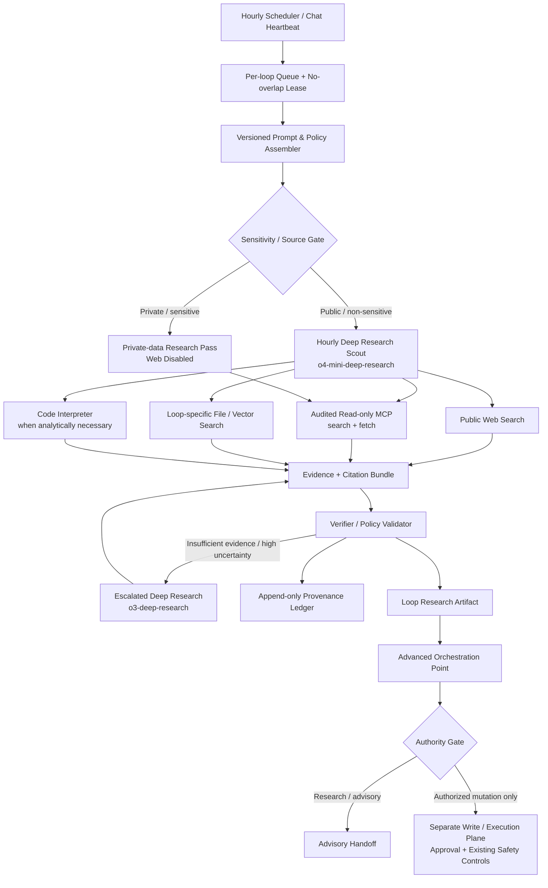
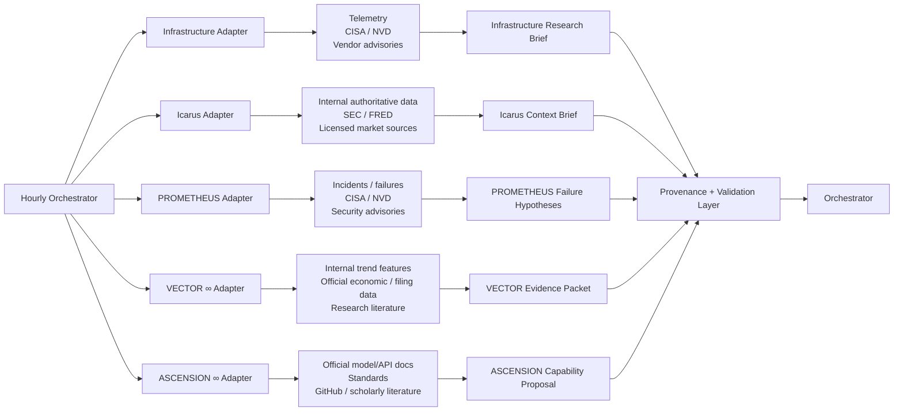
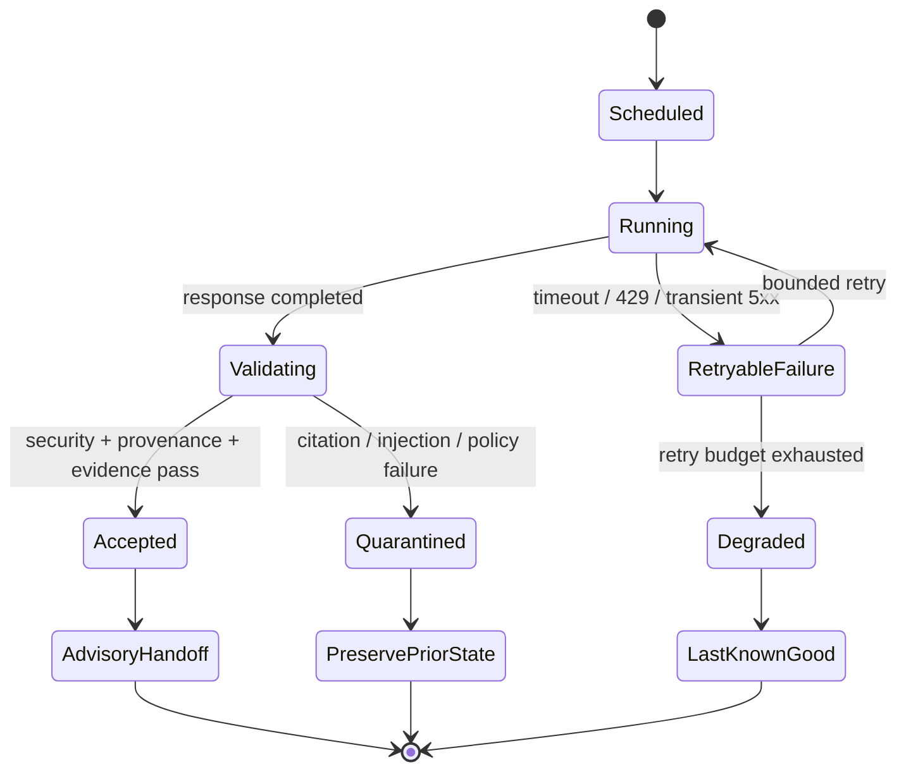
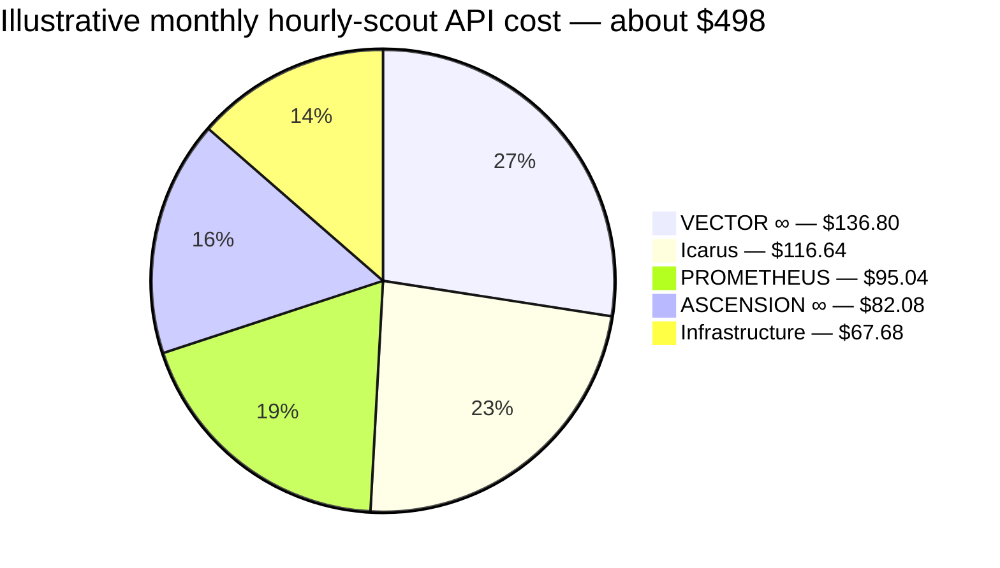
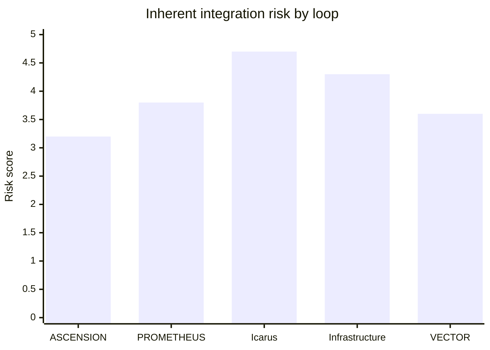

# Deep Research Integration Blueprint for Five Hourly Orchestration Loops

## Executive summary

The strongest architecture is **not** to give all five loops a general-purpose browsing plugin with unrestricted permissions. The safer and more scalable design is a shared **Deep Research Core** with five isolated loop-specific adapters, separate source policies, separate credentials/budgets, a common provenance ledger, and a hard separation between **research** and **execution**.

OpenAI currently documents Deep Research as a specialized capability exposed through the Responses API using `o3-deep-research` and `o4-mini-deep-research`. These models can combine web search, file search, read-oriented remote MCP data sources, and optional Code Interpreter; they are designed for multi-step research that can take tens of minutes, so background execution is recommended. citeturn18view2turn19view3 Native ChatGPT scheduled tasks can return to the same chat with existing context and can use uploaded files, connected tools, skills, and plugins available to that chat, so the five one-hour loops are compatible with a per-chat scheduled-task architecture as well. citeturn18view0turn21view1

For a serious orchestration system, however, I recommend treating “Deep Research plugin” as a **research service/adapter layer**, rather than assuming there is a single universal plugin that should be granted identical access everywhere. The Deep Research API does not support arbitrary function calling; its remote MCP integration is specifically based on `search` and `fetch`, and Deep Research requires MCP approval mode to be `never` because that interface is expected to be read-only. citeturn20view3turn20view4 That restriction is actually desirable for your architecture: **research proposes; the orchestrator validates; a separate executor performs any authorized mutation.**

The recommended deployment order is **Infrastructure first, Icarus second, PROMETHEUS third, VECTOR fourth, ASCENSION fifth**. Infrastructure establishes telemetry and failure containment; Icarus receives the strongest production firewall; PROMETHEUS gets access to failures without the ability to mutate production; VECTOR receives research as advisory evidence rather than self-modifying truth; and ASCENSION receives the widest discovery scope but the weakest direct authority.

| Loop | Deep-research mission | Initial priority | Inherent risk | Recommended authority | Estimated hourly-scout cost/month* |
|---|---|---:|---:|---|---:|
| **Infrastructure Loop Build** | Reliability, vulnerabilities, dependency/status changes, operational diagnosis | P0 | 4.3/5 | Advisory + urgent alerting | ~$68 |
| **Icarus Build Loop** | Production-context research, filings, macro/regulatory context, engineering evidence | P0 | 4.7/5 | **Read-only research; never direct execution** | ~$117 |
| **PROMETHEUS Loop** | Failure mining, incident synthesis, adversarial hypotheses, vulnerability correlation | P1 | 3.8/5 | Shadow research only | ~$95 |
| **VECTOR ∞ Loop** | Trend/regime intelligence, evidence synthesis, adaptive research hypotheses | P1 | 3.6/5 | Advisory/shadow | ~$137 |
| **ASCENSION ∞ Series** | Capability discovery, architecture evolution, standards/API/research monitoring | P2 | 3.2/5 | Proposal/handoff only | ~$82 |

\*Illustrative assumptions are detailed in the cost section. They are not quotations from OpenAI pricing calculators.

The central design principle is:

**No Deep Research output directly changes production, trades, infrastructure, model weights, permissions, source configuration, or sibling-loop state.**

That control follows directly from the documented attack surface around prompt injection and data exfiltration: OpenAI recommends trusted MCP servers, logging tool calls, validating tool arguments, screening returned links, and splitting sensitive/private research from open-web research into separate phases. citeturn20view5 Recent 2026 agent-security research independently reinforces the problem: indirect prompt injection can manipulate tool-using agents, provenance-aware controls can improve resistance to poisoning, and evaluating the *trajectory* of research agents—not merely their final answer—is increasingly important. citeturn23search4turn23search2turn23search17


## Assumptions and target architecture

The following are explicit design assumptions rather than externally verified facts about your private system:

**ASCENSION ∞** is treated as capability amplification/system evolution; **PROMETHEUS** as failure mining and adversarial research; **Icarus** as the protected production/execution system; **Infrastructure** as supervisory reliability/resilience; and **VECTOR ∞** as adaptive trend/intelligence research. These definitions come from the orchestration context established in this conversation.

“One-hour loop” means each loop should receive **one launch opportunity every wall-clock hour**, not that every research job must finish in exactly one hour. This distinction matters because OpenAI explicitly notes that Deep Research jobs may take tens of minutes. citeturn19view3 A no-overlap lease should therefore suppress duplicate instances when a prior run remains active.

No cloud provider is assumed. The design uses portable concepts: scheduler, durable queue, secrets manager, evidence/object store, provenance database, OpenTelemetry-compatible telemetry, and HTTP/MCP/API adapters.

For first-party Deep Research, `o4-mini-deep-research` should be the **hourly scout model**: it is documented as the faster, more affordable Deep Research model and currently costs $2 per million input tokens, $0.50 per million cached input tokens, and $8 per million output tokens. `o3-deep-research` should be reserved for escalations requiring greater research depth; it currently costs $10/$2.50/$40 per million input/cached-input/output tokens. citeturn19view0turn18view5

A shared architecture should look like this:



This architecture reflects several important constraints. Deep Research requires at least one data source and supports web search, file search, remote MCP, and Code Interpreter. citeturn18view2turn20view4 It does **not** support function calling or structured outputs in the Deep Research model itself, so a downstream validator/normalizer should convert the research result into your strict orchestration schema rather than trusting the research model to serve as the final executable interface. citeturn19view0

For scheduling, there are two viable modes. Inside ChatGPT, a scheduled task in an existing chat can reuse that chat's context and available plugins/tools. citeturn18view0turn21view1 At larger scale, the API-based architecture above provides cleaner central quotas, provenance, concurrency control, and cross-loop observability. Those approaches are complementary: the chat can remain the human-facing loop surface while an external research service performs the controlled Deep Research run.

A recommended hourly launch sequence is:

**`:00 Infrastructure → :08 Icarus → :16 PROMETHEUS → :24 VECTOR → :32 ASCENSION`**

Each still runs once per hour, but staggering lowers burst pressure and lets later research consume recently validated supervisory context. OpenAI rate limits are organization/project/model dependent and can apply across RPM, RPD, TPM, TPD and other dimensions, so the implementation should read the actual limits from the account rather than embedding invented fixed values. citeturn18view7


## Loop-specific integration profiles

The five adapters should share the Deep Research Core without sharing unrestricted context or credentials:



The source choices below deliberately emphasize original and official material. SEC's EDGAR APIs expose filings/XBRL as JSON and are updated throughout the day as submissions disseminate; FRED provides programmatic economic-series access; CISA's KEV catalog is intended as an authoritative list of vulnerabilities known to be exploited; GitHub exposes security advisories through its official API; and OpenTelemetry provides a vendor-neutral framework for traces, metrics, and logs. citeturn16search0turn16search1turn15search3turn16search2turn15search10

**ASCENSION ∞ Series**

| Dimension | Recommended design |
|---|---|
| **Research role and objectives** | Continuously scan for material advances in models, APIs, orchestration methods, security practices, standards, benchmarks and relevant scholarly work. Output should be an **upgrade hypothesis**, not an automatic architecture change: what changed, why it matters, which component it affects, compatibility risk, expected gain, evidence, and a test plan. |
| **Required capabilities** | Public web search; official-document retrieval; scholarly discovery; read-only GitHub/repository metadata; internal architecture/file search; optional Code Interpreter for benchmark/result comparison; background/async execution; stable prompt caching; per-source delta/change detection. Deep Research natively supports web/MCP/file search plus Code Interpreter. citeturn18view2 |
| **Integration architecture** | ASCENSION adapter → official docs/changelogs + standards + scholarly sources → Deep Research → evidence comparison → compatibility/evaluation stage → orchestrator proposal. No package install, permission modification or sibling-loop rewrite belongs inside the research step. |
| **Security/privacy** | Primary threats are poisoned documentation/repositories, malicious tool descriptions, dependency/supply-chain manipulation, and research text that instructs the agent to modify its own environment. Treat all retrieved content as data, sandbox experiments, lock dependency versions, and require an execution-plane review before adoption. Indirect tool/prompt injection remains an active research problem. citeturn23search0turn23search4 |
| **Failure and rollback** | If evidence is contradictory, an API change cannot be reproduced, or a suggested upgrade fails compatibility tests, retain the current configuration and mark the proposal rejected/deferred. Rollback is therefore normally **discard proposal → preserve prior known-good architecture**. |
| **Resources/cost** | Initial planning assumption: 15k total input/retrieval tokens, 3k output tokens, ~6 web searches/run on `o4-mini-deep-research`; ≈$0.114/run or ≈$82/month at 720 runs. Escalate to o3 only for high-impact proposals. |
| **Monitoring** | Initial SLO: ≥98% scheduled-run completion; p95 ≤40 min; ≥80% of decision-critical evidence from primary/official or peer-reviewed sources; ≥95% claim-to-source provenance coverage. Alert on two consecutive failures, uncited high-impact recommendations, or a critical API/deprecation change that conflicts with a deployed dependency. These are proposed operating thresholds, not vendor limits. |
| **Governance/provenance** | Preserve prompt version, model/snapshot, retrieval time, publication/effective date, source identity, content hash, license/usage restrictions, claim-to-source mappings, benchmark artifact hashes and final orchestrator disposition. |
| **Implementation sequence** | Implement last in the first wave, after the provenance, observability and action-gating infrastructure is tested. Begin in shadow mode, then permit proposal generation, and only later allow approved handoffs into engineering workflows. |
| **Authoritative sources/APIs** | OpenAI model/API documentation and changelogs; NIST AI RMF/GenAI Profile; GitHub REST API, release metadata and security advisories; W3C standards; Crossref API; PubMed for biomedical domains; arXiv for early technical work with an explicit **preprint/not-peer-reviewed** flag. NIST's GenAI profile is a cross-sector companion to AI RMF, while Crossref provides a scholarly metadata API and PubMed indexes biomedical literature. citeturn15search0turn16search3turn17search0turn17search1 |

**PROMETHEUS Loop**

| Dimension | Recommended design |
|---|---|
| **Research role and objectives** | Mine failures, regressions, incidents, rejected actions and adversarial cases; correlate them with known vulnerabilities, prior failure signatures and system changes; produce falsifiable hypotheses and recommended experiments. It remains research-only and cannot mutate Icarus or Infrastructure. |
| **Required capabilities** | Internal incident/SLO/log search through a tightly audited private MCP; public CISA KEV/NVD/vendor-advisory/GitHub-advisory research; file search over postmortems; Code Interpreter for clustering and statistical comparison; async execution; deduplication/cache by incident fingerprint. |
| **Integration architecture** | Public threat-research pass and private incident-analysis pass are separated → evidence merger receives sanitized findings → PROMETHEUS generates hypothesis/test bundle → orchestrator routes tests to an isolated environment. OpenAI specifically recommends separating public-web work from sensitive MCP work so private data is not exposed to web-search context. citeturn20view5 |
| **Security/privacy** | Highest concerns are incident details, credentials embedded in logs, exploitable configuration data and internal vulnerability information. Redact secrets before indexing, segregate incident stores, use least-privilege service identities, disable public web during sensitive-data passes, and never provide exploit-capable write tools to the research model. |
| **Failure and rollback** | Likely failures include false causal correlations, duplicate incidents interpreted as independent evidence, outdated CVE data and adversarial log text. Rollback is simple because PROMETHEUS is shadow-only: invalidate the hypothesis/artifact and preserve production unchanged. |
| **Resources/cost** | Assumption: 20k input/retrieval tokens, 4k output, ~6 web-search calls/run → ≈$0.132/run or ≈$95/month for hourly mini-model scouts. Heavy incident investigations trigger o3 rather than making every hourly cycle expensive. |
| **Monitoring** | ≥98% completion; p95 ≤40 min; provenance completeness ≥95%; internal incident ingestion lag <15 min where technically feasible; 429/503 tool-call failure rate warning >2%, critical >5%; any detected secret exfiltration attempt or unauthorized sensitive-data egress is critical. |
| **Governance/provenance** | Store incident IDs rather than unnecessary raw sensitive text; map each hypothesis to exact logs/events/source advisories; include timestamps, inventory match, software version, CVE/advisory identifiers, model version, confidence, and experimental result. |
| **Implementation sequence** | Enable after Infrastructure telemetry is stable. Run several days in shadow evaluation, compare generated hypotheses with known incidents, then enable automatic escalation to the orchestrator while retaining a hard production-mutation prohibition. |
| **Authoritative sources/APIs** | Internal incident records and telemetry first; CISA KEV; NIST NVD; vendor security advisories; GitHub global security advisories; official dependency/package advisories. CISA describes KEV as vulnerabilities exploited in the wild, while GitHub exposes reviewed global security advisories through its API. citeturn15search3turn16search9turn22search0 |

**Icarus Build Loop**

| Dimension | Recommended design |
|---|---|
| **Research role and objectives** | Supply production engineering and market/execution context: regulatory/filing changes, macroeconomic releases, dependency/API changes, post-event explanation and research supporting candidate system improvements. **Deep Research must not be the real-time price/execution substrate.** Its documented multi-minute/tens-of-minutes operating profile is unsuitable as an order-routing or tick-data path. citeturn19view3 |
| **Required capabilities** | Read-only access to the authoritative internal market/data fabric; official SEC/FRED/regulatory sources; licensed exchange/vendor feeds where appropriate; internal system documentation; async research; strict publication/effective-time tracking; low-TTL source cache for rapidly changing information; longer cache for filings/specifications. |
| **Integration architecture** | Authoritative production data and Deep Research remain parallel: production data → Icarus execution logic; Deep Research → contextual evidence brief → validation → orchestrator → optional approved engineering/risk handoff. **The Deep Research path never feeds raw orders.** |
| **Security/privacy** | This lane has the highest consequence if research contaminates production. Strategy data, credentials, positions, customer information or possible material nonpublic information must never be placed into unrestricted public-web research. Private analysis should be a web-disabled pass. Research credentials must have no execution permission. OpenAI recommends the same phase separation when sensitive MCP data is involved. citeturn20view5 |
| **Failure and rollback** | Stale data, wrong effective dates, corporate-action errors, hallucinated financial facts and regulatory ambiguity must fail closed with respect to execution. If research fails, Icarus continues using its existing validated production data and logic; the research brief is marked unavailable/stale. |
| **Resources/cost** | Assumption: 25k input/retrieval tokens, 4k output, ~8 searches → ≈$0.162/run or ≈$117/month. High-consequence filing/regulatory analyses can escalate to o3. |
| **Monitoring** | Target ≥99% research-run completion but **zero dependency of production availability on that SLO**. Delivery after T+45 minutes is marked stale for the hourly cycle. Missing effective timestamp or provenance on a decision-critical financial claim is a hard rejection. Cost/run >150% of its rolling seven-day median warns; >200% triggers budget quarantine pending review. |
| **Governance/provenance** | Store observed-at time separately from event/publication/effective time; preserve filing accession/source identifiers; hash raw source artifacts; label source licensing/redistribution restrictions; map each conclusion to evidence. This is particularly important because SEC data updates throughout the day as filings are disseminated. citeturn16search0 |
| **Implementation sequence** | Integrate immediately after Infrastructure, but spend the initial period entirely in shadow mode. Verify that no research credential can call production write/execution interfaces before enabling hourly runs. |
| **Authoritative sources/APIs** | Existing internal authoritative market-data fabric; direct licensed exchange/vendor feeds for executable prices; SEC EDGAR APIs for filings/XBRL; FRED/ALFRED for economic time series; official statistical/regulatory releases. SEC APIs require no API key and provide filing/XBRL data; FRED provides REST economic-data services and requires application API keys for its v1 web services. citeturn16search0turn16search1turn16search8 |

**Infrastructure Loop Build**

| Dimension | Recommended design |
|---|---|
| **Research role and objectives** | Maintain visibility into reliability, capacity, security advisories, dependency risk, provider/API changes, recurring incidents and rollback readiness. Research should explain system health and generate remediation options, while the Infrastructure control plane retains execution authority. |
| **Required capabilities** | OpenTelemetry-compatible metrics/logs/traces; internal status/SLO search; CISA/NVD/vendor advisory research; dependency/release metadata; Code Interpreter for anomaly calculations; background execution; last-known-good cache; circuit breakers and webhook completion handling. OpenTelemetry standardizes traces, metrics and logs and is vendor-neutral. citeturn15search2turn15search10 |
| **Integration architecture** | Telemetry → deterministic health rules/anomaly detector → Deep Research enrichment → incident/risk brief → orchestrator. Deterministic alerts must not wait for Deep Research; research enriches rather than blocks observability. |
| **Security/privacy** | Telemetry can reveal topology, internal hostnames, credentials, tokens and customer data. Apply redaction before indexing; prohibit raw secret values; isolate production telemetry MCP access; use separate read-only service credentials; never permit web research to receive private topology context. |
| **Failure and rollback** | Deep Research outage must be **fail-open for monitoring**: deterministic health monitoring continues. Hallucinated remediation or an alert storm cannot self-execute. On failure, show last-known-good research plus age/staleness and fall back to conventional runbooks. |
| **Resources/cost** | Assumption: 12k input/retrieval tokens, 2.5k output, ~5 searches → ≈$0.094/run or ≈$68/month. This is the cheapest lane because the bulk of raw telemetry analysis should occur locally/deterministically before research enrichment. |
| **Monitoring** | Target scheduler success ≥99.5%; start delay warning >5 min, critical >10 min; two consecutive hourly failures = critical; p95 research completion ≤30 min; telemetry ingestion lag warning >5 min; any inventory match against a relevant KEV should generate immediate security triage rather than waiting for the next normal research cycle. |
| **Governance/provenance** | Record trace/metric/log correlation IDs, incident ID, source advisory, affected inventory/version, retrieval timestamp, model/prompt version and remediation disposition. OpenTelemetry supports correlating telemetry signals using shared context. citeturn15search6turn15search38 |
| **Implementation sequence** | **First loop to deploy.** Establish telemetry, provenance, no-overlap locking, webhook verification, rate/cost monitoring and rollback semantics here; reuse the validated control plane for the other four loops. |
| **Authoritative sources/APIs** | Internal OTel telemetry; CISA KEV; NIST NVD; official vendor security/status information; GitHub global/repository security advisories; official dependency release feeds. CISA KEV and GitHub's advisory API provide complementary exploited-vulnerability and software-advisory intelligence. citeturn15search3turn16search2 |

**VECTOR ∞ Loop**

| Dimension | Recommended design |
|---|---|
| **Research role and objectives** | Detect and explain emerging trends/regime changes, connect external evidence to internal observations, maintain competing hypotheses, and produce evidence-weighted advisory signals. Research must not silently rewrite its own production weighting or decision rules. |
| **Required capabilities** | Public macro/filing/research feeds; internal feature/history search; time-aware caching; comparison against prior runs; source diversity scoring; optional Code Interpreter for trend/regime calculations; asynchronous research; contradiction detection and confidence decay. |
| **Integration architecture** | Internal trend candidates + external official evidence → Deep Research → contradiction/source-diversity evaluator → VECTOR advisory packet → orchestrator. Only separately evaluated changes may feed a learning/update pipeline. |
| **Security/privacy** | Main risks are feedback poisoning, confirmation bias, single-source manipulation, recency bias and cross-loop propagation of an erroneous narrative. Require independent-source corroboration, cap influence from one publisher/domain, and preserve explicit counter-evidence. Provenance-capped trust is also consistent with recent research showing benefits against memory poisoning. citeturn23search2 |
| **Failure and rollback** | If a trend hypothesis loses corroboration, ages out or conflicts with authoritative data, decay or invalidate the advisory without changing historical records. No autonomous model-weight or production-rule update should occur from a single research run. |
| **Resources/cost** | Assumption: 25k input/retrieval tokens, 5k output and ~10 searches → ≈$0.190/run or ≈$137/month, the highest scout cost because VECTOR benefits most from cross-source breadth. |
| **Monitoring** | ≥98% completion; ≥80% primary/official-source share for high-impact conclusions; provenance ≥95%; alert on sudden source-diversity collapse, repeated contradiction across two consecutive runs, or dramatic signal change supported by only one source. Production escalation should generally require persistence and multi-source corroboration rather than a one-run threshold. |
| **Governance/provenance** | Persist the full evolution of each hypothesis: first seen, evidence added/removed, contradictory evidence, source authority, data vintage, model/prompt versions and downstream disposition. Never overwrite historical state merely because the current interpretation changed. |
| **Implementation sequence** | Deploy after Icarus/PROMETHEUS protections are proven. Run advisory-only initially; establish a baseline for trend stability and false-positive frequency before permitting any downstream model-development handoff. |
| **Authoritative sources/APIs** | Internal authoritative feature/data layer; SEC EDGAR; FRED/ALFRED; official regulator/statistical releases; licensed exchange data; Crossref/PubMed/arXiv where scholarly evidence is relevant. SEC and FRED are particularly suitable for machine-readable filing and macroeconomic evidence. citeturn16search0turn16search1 |


## Security, privacy, governance, and provenance

The most important security assumption is that **retrieved information is hostile until proven otherwise**. A web page, file-search result, MCP result, repository README, incident note or scholarly-looking document may contain text that functions as an indirect instruction to the model. OpenAI explicitly identifies prompt injection and exfiltration as risks of combining web, vector stores and MCP; its recommendations include using only trusted MCP servers, logging model/tool interactions, validating tool arguments, screening links and splitting public and private phases. citeturn20view5 Recent work on indirect prompt injection demonstrates that attacks can target tool invocations directly and that attacks may remain effective even in sophisticated agentic workflows, reinforcing the need for system-level controls rather than prompt wording alone. citeturn23search4turn23search11

The Deep Research MCP boundary is unusually useful here. OpenAI requires a specialized MCP interface consisting of `search` and `fetch`; arbitrary MCP/function tools are not supported by the Deep Research model. Its MCP configuration uses `require_approval: "never"` precisely because these functions are supposed to be read-only. citeturn20view3turn20view4 The architectural inference is therefore strong: **never expose mutation through a Deep Research MCP server.** Place writes in a separate executor that supports approvals, policy checks and least privilege.

Authentication should be isolated by loop: separate project/service identity, separate MCP token, explicit source allowlist and separate cost quota for Infrastructure, Icarus, PROMETHEUS, VECTOR and ASCENSION. Secrets should come from a secrets manager rather than prompt text; credentials should be scoped to the smallest set of read operations possible; and cross-loop tokens should not be interchangeable. This is a recommended control model, consistent with the need to treat MCP servers as security boundaries. OpenAI's general MCP guidance also recommends approval controls for sensitive actions outside the specialized read-only Deep Research use case. citeturn14view3

A practical data classification scheme is:

| Class | Examples | Research rule |
|---|---|---|
| **Public** | SEC filings, FRED releases, official documentation, public papers | Web search allowed; cache subject to source terms |
| **Internal** | Architecture docs, non-sensitive runbooks, sanitized historical research | Private file/MCP access; public-web mixing only after classification |
| **Confidential** | Incident logs, strategy data, positions, customer metadata, topology | Private MCP/file pass only; public web disabled |
| **Restricted** | Secrets, credentials, personal sensitive data, legally restricted information, possible MNPI | Do not place directly into general research context; use deterministic/redacted or separately authorized workflows |

OpenAI states that API data is not used to train its models unless the customer explicitly opts in to sharing. Its current data-control documentation says `/v1/responses` normally has abuse-monitoring retention and may have application-state retention depending on configuration; eligible organizations can use Modified Abuse Monitoring or Zero Data Retention controls. Third-party MCP services have their own retention policies. citeturn14view0turn14view1 These policies must therefore be evaluated jointly with the policies of every plugin, MCP server and external retrieval provider.

Background mode requires special attention. It allows long-running asynchronous execution and polling, which is well suited to hourly Deep Research. OpenAI currently documents that ZDR background responses with `store=false` are temporarily written to disk for roughly ten minutes to enable asynchronous operation/polling. citeturn18view4 Any compliance regime that interprets “zero retention” literally should account for that documented operational behavior.

Caching should have three layers. First, use **source caching** with HTTP validators/content hashes and a TTL based on each source's update cadence. Second, use **evidence caching** keyed by normalized source + publication/effective version so unchanged documents do not undergo repeated analysis. Third, use model **prompt caching** for stable orchestration instructions and source policy. OpenAI exposes cached-token usage for measuring realized cache-hit rates; cache hits are not guaranteed, and retention behavior depends on the model and data-control setting. citeturn14view6turn14view7 Confidential data should never be kept merely to increase cache efficiency.

For provenance, use an append-only record modeled conceptually on W3C PROV's entities, activities and agents. PROV-O exists specifically to represent and interchange provenance across systems and contexts. citeturn15search1turn15search17 Every research artifact should carry at least:

```text
run_id
loop_id
parent_orchestration_run_id
scheduler_timestamp
research_started_at
research_completed_at

prompt_template_id
prompt_template_version
model_id
model_snapshot_if_pinned
tool_configuration_hash

source_id
source_type
publisher / authority
retrieved_at
published_at
effective_at
content_hash
license_or_terms_class
confidentiality_class

claim_id
claim_text_hash
supporting_source_ids
contradicting_source_ids
evidence_strength
verification_state

input_token_count
cached_input_tokens
output_token_count
web_search_count
mcp_search_count
mcp_fetch_count
run_cost

validator_result
security_monitor_result
orchestrator_disposition
downstream_handoff_id
```

This makes provenance an operational control rather than decorative citations. NIST's Generative AI Profile is also useful as the governance framework above the individual controls: NIST positions it as a cross-sector companion to AI RMF, whose operational functions are Govern, Map, Measure and Manage. citeturn15search0turn15search28


## Reliability, observability, and rollback

Every research invocation should produce an end-to-end trace from **scheduler → prompt assembly → source gate → model → each tool interaction → validator → provenance commit → loop artifact → orchestrator handoff**. OpenTelemetry is a suitable provider-neutral substrate because its specification encompasses traces, metrics and logs and supports correlation between signals. citeturn15search2turn15search22

These are recommended starting SLOs and alert thresholds rather than OpenAI defaults:

| Metric | Healthy target | Warning | Critical / action |
|---|---:|---:|---|
| Scheduled launch success | ≥99.5% | One missed run | Two consecutive misses |
| Deep Research completion | ≥98% rolling 24h | <98% | <95% |
| Start delay | <5 min | 5–10 min | >10 min |
| p95 research duration | <35 min overall | >35 min | >50 min or overlap into next lease |
| Duplicate concurrent run | 0 | — | Any duplicate for same `loop_id/hour` |
| Provenance completeness | ≥95% of material claims | 90–95% | <90%; reject handoff |
| Citation/source resolution | ≥98% | 95–98% | <95% |
| 429/503 tool/API errors | <2% | 2–5% | >5% rolling hour |
| Cost/run | ≤125% seven-day median | >150% | >200% or projected budget breach |
| Tool usage | Inside loop budget | >90% of cap | Cap reached repeatedly |
| Prompt-injection/exfiltration monitor | 0 high-risk events | Suspicious retrieved instructions | Any attempted secret/sensitive-data egress |
| Stale research artifact | Within loop TTL | Near TTL | Expired: block downstream use |

OpenAI recommends `max_tool_calls` as the principal Deep Research control for constraining tool activity, cost and latency. citeturn19view3 Initial caps should be tuned from observations rather than maximized: approximately 14 tool calls for Infrastructure, 20 Icarus, 16 PROMETHEUS, 24 VECTOR and 16 ASCENSION are reasonable **starting engineering limits**, with smaller expected numbers of billable web-search calls.

Rate-limit handling should implement bounded exponential backoff with jitter, per-loop token buckets and an overall orchestrator concurrency budget. OpenAI's limits vary by organization/project/model, may be shared by model families, and can be hit across multiple measures, so hard-coded RPM assumptions would be unsafe. citeturn18view7

Webhook completion events should be signature-verified before a result changes orchestration state. OpenAI's webhook documentation provides signature-verification support and demonstrates rejection of invalid signatures. citeturn14view4 Idempotency at the orchestration layer should additionally ensure that duplicate webhook delivery cannot create duplicate handoffs.

The rollback strategy should be **artifact-centric**, because the research plane is read-only:



Rollback behavior by lane should differ deliberately. **Infrastructure** retains deterministic monitoring and uses last-known-good enrichment. **Icarus** continues its established production path and discards bad research. **PROMETHEUS** discards the hypothesis. **VECTOR** freezes/degrades the disputed advisory signal. **ASCENSION** retains the deployed architecture and rejects the upgrade proposal. No failure should require “undoing” a production action generated by Deep Research, because Deep Research should never have had direct production-write authority in the first place.

This trajectory-level instrumentation is also consistent with recent research arguing that final-answer metrics alone are inadequate for evaluating deep-research agents. citeturn23search17


## Cost, capacity, and scaling

OpenAI currently prices `o4-mini-deep-research` at $2/M input, $0.50/M cached input and $8/M output tokens; `o3-deep-research` at $10/M input, $2.50/M cached input and $40/M output. Web search on reasoning models is currently $10 per 1,000 calls plus search-content tokens billed at the model's token rates. File search costs $2.50/1,000 calls with storage at $0.10/GB/day after the included first GB; eligible Code Interpreter/hosted-container usage has separate container charges. citeturn19view0turn18view5turn20view0turn20view1

The following planning model assumes 24 runs/day × 30 days = **720 hourly runs/month per loop**, or **3,600 scout runs/month overall**. Input-token assumptions include retrieved search content; no caching discount is assumed, making the model easier to audit. Code Interpreter, vector-storage charges, external commercial data, third-party plugin subscriptions and network/host infrastructure are excluded.

| Loop | Input tokens/run | Output tokens/run | Web searches/run | Est. cost/run | Est. 720-run month |
|---|---:|---:|---:|---:|---:|
| ASCENSION ∞ | 15,000 | 3,000 | 6 | $0.114 | **$82.08** |
| PROMETHEUS | 20,000 | 4,000 | 6 | $0.132 | **$95.04** |
| Icarus | 25,000 | 4,000 | 8 | $0.162 | **$116.64** |
| Infrastructure | 12,000 | 2,500 | 5 | $0.094 | **$67.68** |
| VECTOR ∞ | 25,000 | 5,000 | 10 | $0.190 | **$136.80** |
| **Total** | — | — | — | — | **$498.24/month** |



A representative **o3 escalation** using 50k input tokens, 10k output tokens and 15 web-search calls costs about **$1.05/run** under current pricing assumptions. One such escalation per loop per day would add approximately **$157.50/month**, bringing the modeled base to about **$655.74/month**. A 20% operating buffer yields a planning envelope near **$790/month**, excluding third-party feeds and general infrastructure. The actual invoice should be computed from response usage and tool counts rather than these estimates. citeturn18view5turn20view0

Running every single hourly cycle as the heavier o3 example instead would be roughly **$3,780/month** for 3,600 runs under the same assumptions, which is why the mini-scout plus escalation architecture is economically preferable.

The relative cost distribution is driven more by research breadth and retrieved context than by scheduler overhead. Prompt caching can lower recurring stable-prefix costs; OpenAI exposes cached-token counts so realized savings can be measured rather than assumed. citeturn14view6

The following risk chart is a **design-time qualitative assessment**, not historical incident data. It measures consequence × exposure before the controls proposed above:



Icarus ranks highest because erroneous research reaching execution would have the greatest consequence. Infrastructure is next because it sees sensitive operational context and can influence incident response. PROMETHEUS processes adversarial/failure data; VECTOR is vulnerable to evidence poisoning and feedback loops; ASCENSION has broad external exposure but can be kept safely in proposal-only mode.

At the current scale—five jobs launched each hour—specialized distributed computing is unnecessary. The orchestration problem is primarily one of **state, security, rate control, provenance and asynchronous lifecycle management**, not raw compute. Background mode exists specifically for long-running asynchronous model tasks. citeturn18view4

Scaling should proceed by changing the *shape* of work, not simply multiplying expensive full-research calls:

At roughly **5–20 loops**, use one scheduler, durable queue, per-loop leases, two or three concurrent research workers, source caching and a central provenance database.

At **20–100 loops**, shard worker pools by sensitivity/domain, deduplicate shared public-source retrievals, enforce per-loop budget policies, add source-adapter services and separate o4-mini scout capacity from o3 escalation capacity.

Above **100 loops**, adopt tenant/project isolation, distributed quota management, dedicated public/private research pools, event-driven prioritization and hierarchical research: a cheap change detector first, Deep Research only when evidence changed materially.

The crucial optimization is **delta research**. An hourly task should ask “what materially changed since the last validated run?” rather than re-researching the entire world every sixty minutes.


## Implementation roadmap and authoritative source map

A safe rollout can reach real hourly automation quickly without granting premature authority.

| Phase | Target | Work | Exit condition |
|---|---|---|---|
| **Foundation** | Day 1 | Freeze the five loop roles; classify sources/data; define per-loop read permissions; establish run IDs, prompt versions and provenance schema; create separate service identities/budgets. | No cross-loop credential reuse; write tools absent from research plane. |
| **Research core** | Days 2–3 | Implement background Deep Research adapter, source gates, `max_tool_calls`, no-overlap leases, retry logic, webhook verification, provenance storage, cost accounting and validator. Deploy Infrastructure in shadow mode. | ≥20 test runs with complete traces/provenance; rollback verified. |
| **Protected production integration** | Days 4–5 | Add Icarus read-only adapter and PROMETHEUS public/private split. Exercise prompt-injection, stale-data and outage tests. | Demonstrated inability of either research path to mutate production. |
| **Intelligence integration** | Days 6–7 | Add VECTOR and ASCENSION; enable source-diversity/contradiction controls; verify scholarly/source authority labeling. | All five produce validated advisory artifacts. |
| **Hourly activation** | Week 2 | Activate staggered hourly launches; operate mini-model scouts only; collect duration, cost, cache, failure and citation baselines. | ≥99% scheduler reliability and no unresolved high-severity security findings. |
| **Escalation tier** | Week 3 | Enable o3 only on anomaly/uncertainty/high-impact triggers; tune budgets and source TTLs; introduce daily/weekly deeper syntheses. | Escalation rate and monthly projection remain inside budget. |
| **Maturity** | Week 4 onward | Run periodic adversarial evals, provenance audits, retention reviews, source-provider reviews and false-positive/false-negative analysis. | Continuous governance rather than one-time deployment review. |

For a **ChatGPT-native version**, create each hourly job as a scheduled task **inside its existing loop chat** so the run returns to the same chat context. OpenAI documents that scheduled tasks in a chat preserve that context and that web scheduled tasks can use plugins, skills, connected tools and uploaded files available to the chat. citeturn18view0turn21view1 Durable source material should live in an accessible project/upload/connected service, because web scheduled tasks do not retain a local folder/worktree between runs. citeturn18view0

For the more advanced orchestration system you described, the API-backed approach remains preferable because it gives this orchestration point one place to enforce budget, provenance, source policies, synchronization and production separation.

The authoritative source hierarchy should be:

| Loop | Tier-one sources/APIs | Tier-two research sources | Sources that should never be sole authority |
|---|---|---|---|
| **Infrastructure** | Internal telemetry; CISA KEV; NIST NVD; official vendor advisories; GitHub advisories; OpenTelemetry standards citeturn15search3turn16search2turn15search2 | Security papers and reproducible benchmarks | Search snippets, forums, unauthenticated reposts |
| **Icarus** | Internal authoritative production data; licensed exchange feeds; SEC EDGAR; FRED/ALFRED; official regulators/statistical agencies citeturn16search0turn16search1 | Peer-reviewed quantitative/financial research | General web pages for executable prices or production orders |
| **PROMETHEUS** | Internal incidents/logs; CISA KEV; NVD; vendor advisories; GitHub advisories citeturn15search3turn16search9 | Agent/security research and reproducible exploit-defense studies | Unverified exploit blogs as sole basis for production changes |
| **VECTOR ∞** | Internal validated features; SEC; FRED/ALFRED; official releases; licensed market feeds citeturn16search0turn16search1 | Peer-reviewed papers, Crossref-discovered literature, clearly labeled preprints | Social/trending content without independent corroboration |
| **ASCENSION ∞** | Official product/API docs, standards bodies, NIST, official repository releases/security metadata citeturn15search0turn16search17 | Crossref, PubMed and clearly labeled arXiv research citeturn16search3turn17search0turn17search1 | Vendor marketing claims or secondary summaries without original evidence |

Third-party research/retrieval plugins can still augment this system. The plugin directory available in this session exposes tools oriented toward web retrieval/crawling and scholarly discovery, including Exa, Tavily, Firecrawl, Consensus and Scite. They should be treated as **retrieval/discovery infrastructure, not as the provenance authority**: the artifact should cite and hash the underlying original source, record which intermediary retrieved it, and apply the intermediary's authentication, rate-limit, privacy and retention policy as an additional governance layer.

The final operating pattern is therefore:

**Hourly trigger → isolated loop research → authoritative-source retrieval → asynchronous Deep Research → security/provenance verification → append-only evidence record → loop-specific advisory → orchestration decision → separately authorized execution, if any.**

That design gives all five loops continuous Deep Research capability while preserving their existing boundaries. It also avoids the most dangerous form of “integration”: allowing a browsing/research agent to become an invisible global administrator. OpenAI's own Deep Research security guidance argues for restricted trusted data sources, phased handling of private information and reviewable tool trajectories; NIST's AI RMF framework supplies the governance structure; W3C PROV supplies a portable provenance model; and OpenTelemetry supplies a vendor-neutral observability substrate. citeturn20view5turn15search0turn15search1turn15search10