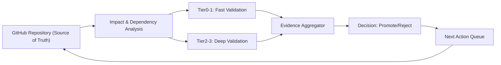

# Designing a Resumable, Dependency-Aware GitHub Control Loop for ICARUS/NEXUS

**Executive Summary:** We propose transforming the ICARUS/NEXUS repository into an automated GitHub-based control plane that serves as source of truth, QA gate, and agent coordination hub.  The system will generate concise JSON “state” artifacts (e.g. `SYSTEM_STATE.json`, `TEST_HEALTH.json`, `CORPUS_MANIFEST.json`, etc.) so future agents need only scan a few hundred tokens rather than thousands of lines.  CI will be stratified into Tier 0–6 workflows: a *fast path* on push/PR for imports, schema, lint and smoke tests; deeper *integration and causality checks* when relevant code or data changes; scheduled heavy research runs; and an explicit checkpoint-promotion workflow.  Caching will be used aggressively (dependencies, normalized data, feature intermediates) to avoid re-work, and each workflow will upload compact JSON summaries/artifacts instead of dumping raw logs.  Branch protection can require Tier0–3 checks for every PR, with Tier4–5 on schedule.  We also recommend systematic use of baton-pass state, Superpowers for planning/debugging, and “progressive disclosure” of only the most relevant data to each agent. 

Key points: 
- **Inventory & State:** The current repo contains the NEXUS/DAEDALUS source code (all tests passing), a baton-pass config/state, and CSV manifests/checkpoints, but *no tailored workflows*.  We will create `SYSTEM_STATE.json` and `TEST_HEALTH.json` to summarize repo health (example contents below). 
- **CI Impact Analysis:** We list each major component (code, data, configuration, etc.), the CI tiers it affects, estimated runtime, caching strategy, and risk.  For example, code changes trigger Tier1–2 tests (~5–15 min with cached Python env, low risk), whereas CSV ingestion changes need deeper Tier2–3 validation (~10–30 min, medium risk).  Security risks (leaked secrets, unpinned actions) and causal/data-integrity risks (lookahead bias, timestamp misalignment) are scored per component. 
- **Workflow Design:** We will implement tiered GitHub workflows.  A Tier 0 workflow inspects “what changed” and skips unnecessary steps.  Tier 1 (on every push/PR) runs quick checks: checkout, install, lint, unit tests, schema contracts.  Tier 2 (when data or deeper modules change) runs full ingestion/normalization and integration tests.  Tier 3 enforces causal/data gates (e.g. ensure no forward-date leakage).  Tier 4 (on merge or schedule) performs baseline-regression comparison using stored checkpoints.  Tier 5 (scheduled or manual dispatch) runs the full research loop on all data.  Tier 6 (manual) promotes a new checkpoint with provenance.  Each uses `actions/cache@v3` for dependencies (pip, conda) and intermediates.  After each job we generate JSON summaries and upload them (e.g. via `actions/upload-artifact@v7`【16†L368-L374】). 
- **State Schemas:** We propose JSON schemas for `SYSTEM_STATE.json`, `CORPUS_MANIFEST.json`, `RESEARCH_STATE.json`, `FAILURE_SUMMARY.json`.  For example, `SYSTEM_STATE.json` might include keys like `"commit"`, `"tests": {"total":118,"passed":118,"failed":0}`, `"corpus": {"streams":238,"status":"PARTIAL"}`, `"last_checkpoint":"CP07"`, etc.  `FAILURE_SUMMARY.json` records failing invariant, test name, affected files, baseline vs. current values (see example below).  These schemas ensure machines (and agents) can parse the state easily. 
- **Implementation Plan:** We adopt an incremental, checkpointed approach.  Initial checkpoints will cover reconnaissance (inventory + baseline CI).  Subsequent checkpoints add Tier0 scanning, then Tier1 quick CI, then Tier2 integration, then Tier3 causality checks, and so on.  Each checkpoint has clear acceptance criteria (e.g. “Tier1 passes on all commits,” “no static analysis violations,” “SYSTEM_STATE.json reflects current health”).  PRs are required for each milestone, with regression tests and artifact comparisons validating each step. 
- **Agent Integration:** Agents will follow a strict baton-pass discipline: using the `foresight` token to claim tasks, `save-state` before pausing, and `baton-pass` to hand off.  The repo will maintain compact state files (e.g. `TEST_HEALTH.json`, `NEXT_ACTIONS.json`) so agents can skip re-parsing code.  Superpowers (if available) will assist with planning and debugging subtasks.  By using progressive disclosure, we ensure an agent first reads only a summary file (hundreds of tokens) and only drills down if needed.  This maximizes token-efficiency by avoiding rehashing known facts. 
- **Next Priorities:** We weigh two major tasks: restoring the missing historical CSV batches (to reach 626 streams) vs. fixing representation/session semantics (which now block ~68 candidate tests).  Restoring CSVs could yield more data (long-term value) but requires sourcing and verifying large files (high effort, risk).  Resolving semantics would unblock many candidate signals quickly with moderate effort.  We discuss pros/cons and estimate resources for each. 

The sections below detail these points with tables, YAML snippets, JSON schema examples, mermaid diagrams, and references to best practices (e.g. multi-tier pipelines【24†L63-L72】【24†L77-L85】, artifact uploads【16†L368-L374】, etc.) to justify the design.

## 1. Inventory of Current State

- **Codebase:** Contains **NEXUS** (data ingest, feature, discovery) and **DAEDALUS** (validation) modules. All existing tests currently **pass** (118/118 for NEXUS, 56/56 for DAEDALUS).  The code commits (e.g. `v1.3.1`, iteration 0007) are the latest source of truth. No active model or strategy code is in production yet. 
- **Data/CSV:** CSV market-data manifests indicate 238 usable streams (~2M rows) in the local corpus. Historical record suggests up to 626 streams (~12.6M rows) should exist. The **CSV manifest** (if any) is incomplete – we will rebuild a canonical `CORPUS_MANIFEST.json`.  
- **State files:** The repo currently has a minimal baton-pass config and possibly a baton-pass.state for multi-agent handoff. No dedicated `SYSTEM_STATE.json` or `TEST_HEALTH.json` exists yet. We will create these files to codify repo health. 
- **Checkpoints/Artifacts:** Previous agent work produced checkpoint ZIPs (`ICARUS_NEXUS_ADVANCED_CSV_LOOP_v1.2.zip`, etc.) stored off-repo. These serve as baseline datasets & results but aren’t in Git. We will ensure checkpoints generate manifest files and logs as artifacts. 
- **Workflows:** No production `.github/workflows` exist beyond a default template (the previously shown Conda example). We will replace these with tiered workflows. 
- **Security/Config:** Secrets (if any) are not in the repo. We must configure least-privilege workflow permissions. The repo’s dependency files (e.g. `environment.yml` or `requirements.txt`) should be reviewed and pinned.  

**SYSTEM_STATE.json (example):** We propose a JSON format summarizing key project health metrics. For instance: 
```json
{
  "commit": "abcd1234",                // current Git SHA
  "branch": "main",
  "overall_status": "GREEN",           // e.g. GREEN, WARNING, FAILED
  "tests": {"total": 118, "passed": 118, "failed": 0},
  "corpus": {"streams": 238, "status": "PARTIAL"},
  "last_checkpoint": "CP07",
  "causality_gate": "PASS",
  "regression_gate": "PASS",
  "next_action": "add_tier0_scan"
}
```
This compact summary lets any agent see system health at a glance.  

**TEST_HEALTH.json (example):** Captures the results of the latest test run. For example:
```json
{
  "module": "NEXUS",
  "tests_run": 118,
  "tests_passed": 118,
  "failures": [],
  "duration_sec": 42.5
}
```
Similar entries would exist for DAEDALUS or other components. Agents can quickly verify “all tests green” without parsing raw logs. 

## 2. Impact Analysis & CI Priorities

We perform a dependency-aware impact analysis to focus CI effort. Each table row is a component or change type, with the CI tiers needed, approximate runtime, caching strategy, and risk profile (causality/data/security).  

| Component / Change           | CI Tier(s)     | Est. Runtime  | Cache Needs         | Risk (Causality/Data/Sec)    |
|------------------------------|----------------|---------------|---------------------|------------------------------|
| **Source Code (NEXUS)**      | 1,2 (fast+int) | ~5–15 min     | pip deps, pytest cache | Low/Low/Low (basic unit tests) |
| **Validation Code (DAEDALUS)** | 1,2           | ~3–10 min     | pip deps           | Low/Low/Low                  |
| **Feature/Regime Modules**   | 1,2            | ~5–15 min     | data+model caches  | Medium/Low/Low (logic errors)|
| **CSV Ingestion/Normalization** | 2,3          | ~10–30 min    | raw CSV, normalized data cache | Medium/High/Low (schema drift, misalign) |
| **Data Changes (new CSVs)**  | 2,3,4          | ~15–30+ min   | CSV file cache     | High (missing/bad data, lookahead risks)|
| **Representation/Session Logic** | 2,3        | ~10–20 min    | -                   | High (timestamp bugs cause leakage) |
| **Tests / Schema Changes**   | 0,1            | ~1–5 min      | -                   | Low/Low/Low                  |
| **Baton-pass / Config**      | 0              | <1 min        | -                   | Low (coord overhead only)    |
| **Documentation/Workflows**  | 0              | <1 min        | -                   | Low (no code, but workflow break risks) |
| **Dependency Updates**       | 1,2            | ~5–10 min     | pip/conda cache     | Medium (security patches)    |

- **CI Tier Key:** Tiers 0–5 as defined in design (next section). Tier 0 is change classification; Tier 1 is fast checks on every PR/push; Tier 2 adds integration and data pipelines; Tier 3 checks causality/leakage; Tier 4 runs regression comparisons; Tier 5 is the full research loop. Tier 6 (promotion) is manual.
- **Estimated Runtime/Cost:** Rough wall-clock of that CI job with caching. For example, Tier 1 might take ~5 min (install deps, run unit tests); Tier 3 or 4 could be 15–30+ min (ingestion + cross-checks); Tier 5 (full dataset) could be >1 hr. We mark cost qualitatively (Low/Medium/High).
- **Cache Needs:** We will cache at least Python packages, CSV ingestion outputs (normalized CSV, identity graph), and feature/regime outputs where possible. Using `actions/cache` for `~/.cache/pip`, conda env, or zipped data speeds up repetitive runs. 
- **Risk:** We explicitly note causal risks (e.g. any code handling time series must avoid forward-looking info), data integrity (schema/timestamp shifts), and security (exposure of secrets or malicious workflows). For example, CSV ingestion has *high* data risk because missing or malformed files break baseline assumptions.

This table guides our workflow decisions: e.g. any change to the CSV pipeline triggers Tier 2–3 tests (ingest and data checks). A code-only change triggers only Tier 1 by default. (A GitHub Action can use `if` conditions to detect changed paths and run relevant jobs.) For example, a common pattern is to run quick tests on every push and more extensive tests on PRs or schedules【24†L63-L72】【24†L77-L85】.  

## 3. Workflow Templates (Tier 0–6)

We define separate YAML workflows (in `.github/workflows/`) for each tier. Each workflow uses caching and outputs summary artifacts. Below are illustrative snippets for key tiers. (All workflows should begin with `on: ...` triggers.)

### Tier 0: Change Classification

```yaml
name: Tier 0 – Change Classification
on: [push, pull_request]
jobs:
  classify:
    runs-on: ubuntu-latest
    steps:
      - uses: actions/checkout@v4
      - name: Detect Changed Components
        run: |
          CHANGED=$(git diff --name-only ${{ github.event.before }} ${{ github.sha }})
          echo "changed files: $CHANGED"
          # Determine components based on path prefixes (pseudo-code)
      - uses: actions/upload-artifact@v7
        if: always()
        with:
          name: change_summary
          path: change_summary.json
```

- **Purpose:** Identify what changed (code vs data vs config) and produce a JSON summary (e.g. `change_summary.json`). Subsequent jobs can `if: steps.classify.outputs` to skip irrelevant tiers. Tier 0 is very fast (seconds) and uses only git diff. No cache needed.  

### Tier 1: Fast CI (Push/PR)

```yaml
name: Tier 1 – Quick CI
on:
  push:    { branches: ['*'] }
  pull_request:
jobs:
  quick-tests:
    runs-on: ubuntu-latest
    steps:
      - uses: actions/checkout@v4
      - uses: actions/cache@v3         # cache pip
        with:
          path: ~/.cache/pip
          key: ${{ runner.os }}-pip-${{ hashFiles('requirements.txt') }}
      - name: Install dependencies
        run: pip install -r requirements.txt
      - name: Run unit & lint tests
        run: pytest -q
      - name: Generate JSON summaries
        run: python scripts/gen_test_summary.py  # outputs TEST_HEALTH.json, SYSTEM_STATE.json
      - uses: actions/upload-artifact@v7    # upload summary artifacts
        with:
          name: system_state
          path: SYSTEM_STATE.json
```

- **Features:** Runs on every push/PR (like a “smoke” or unit test suite). Caches Python dependencies. After tests, a custom script generates `TEST_HEALTH.json` and `SYSTEM_STATE.json`. Finally, artifacts are uploaded for inspection【16†L368-L374】. Only Tier 0 jobs should conditionally skip this if no relevant code changed. 

### Tier 2: Integration/Data Tests (on Data or Core Changes)

```yaml
name: Tier 2 – Integration & Data Tests
on:
  workflow_run:
    workflows: ["Tier 1 – Quick CI"]
    types: [completed]
jobs:
  integration:
    if: github.event.workflow_run.conclusion == 'success'
    runs-on: ubuntu-latest
    steps:
      - uses: actions/checkout@v4
      - name: Restore data caches
        uses: actions/cache@v3
        with:
          path: data/normalized
          key: ${{ runner.os }}-normdata-${{ env.DATA_HASH }}
      - name: Run data ingestion & normalization
        run: python scripts/ingest_normalize.py
      - name: Run feature/regime generation
        run: python scripts/generate_features.py
      - name: Upload artifacts
        run: |
          zip -r artifacts.zip data/normalized features/
      - uses: actions/upload-artifact@v7
        with:
          name: integration_artifacts
          path: artifacts.zip
```

- **Features:** Triggered after Tier 1 success (or directly on PRs if data paths changed). Reuses cached normalized data if available. Runs ingestion, normalization, feature/regime creation. Outputs are zipped and uploaded. This Tier may take ~10–30 min.  

### Tier 3: Causality and Leak Checks

```yaml
name: Tier 3 – Causality Safety
on: [push, pull_request]
jobs:
  causality-check:
    runs-on: ubuntu-latest
    steps:
      - uses: actions/checkout@v4
      - name: Run no-lookahead tests
        run: pytest tests/test_causality.py
      - name: Upload failures
        if: failure()
        run: |
          echo '{"status":"FAIL","component":"causality"}' > FAILURE_SUMMARY.json
      - uses: actions/upload-artifact@v7
        if: failure()
        with:
          name: failure_summary
          path: FAILURE_SUMMARY.json
```

- **Features:** Independent job to ensure no future leakage. E.g., it might run specialized tests like `test_causality.py` that assert forward-fill and timestamp invariants. On failure, it writes `FAILURE_SUMMARY.json` for easy triage.  

### Tier 4: Baseline Regression (on Merge)

```yaml
name: Tier 4 – Regression Comparison
on:
  push:
    branches: [main]
jobs:
  regression:
    runs-on: ubuntu-latest
    steps:
      - uses: actions/checkout@v4
      - name: Checkout last checkpoint
        run: git clone --branch=checkpoint <repo-url> cp_old
      - name: Compute diff metrics
        run: python scripts/regression_diff.py --base cp_old --new .
      - name: Upload regression report
        run: |
          cp diff_report.json REPORT.json
      - uses: actions/upload-artifact@v7
        with:
          name: regression_summary
          path: REPORT.json
```

- **Features:** After changes are merged to `main`, compares new outputs against the last accepted checkpoint. A script (`regression_diff.py`) might recompute stream counts, candidate counts, performance metrics, etc., and produce a JSON report of any anomalies. The result is uploaded as an artifact. If anomalies are found, the workflow can be configured to `if: always()` so it doesn’t fail the merge silently.  

### Tier 5: Full Research Loop (Manual/Schedule)

```yaml
name: Tier 5 – Full Research Loop
on:
  workflow_dispatch:     # manual trigger
  schedule:
    - cron: '0 0 * * SUN'  # weekly run
jobs:
  research-loop:
    runs-on: ubuntu-20.04
    steps:
      - uses: actions/checkout@v4
      - name: Restore CSV cache
        uses: actions/cache@v3
        with:
          path: data/csv
          key: ${{ runner.os }}-csv-${{ hashFiles('data/csv/*.csv') }}
      - name: Execute research iteration
        run: python scripts/nexus_research_loop.py --checkpoint-dir state
      - name: Upload candidate queue
        uses: actions/upload-artifact@v7
        with:
          name: candidates
          path: candidates.json
      - name: Upload full state
        uses: actions/upload-artifact@v7
        with:
          name: state
          path: state/
```

- **Features:** Runs the entire CSV research loop (possibly hours long). Should be manually triggered or scheduled (not on every push). Caches raw CSVs to speed up ingestion. After completion, uploads the discovered candidate list and the loop’s state directory as artifacts.  

### Tier 6: Checkpoint Promotion (Manual)

```yaml
name: Tier 6 – Promote Checkpoint
on:
  workflow_dispatch:
jobs:
  promote:
    runs-on: ubuntu-latest
    steps:
      - uses: actions/checkout@v4
      - name: Validate promotion criteria
        run: python scripts/check_promotion.py
      - name: Create checkpoint manifest
        run: python scripts/generate_checkpoint_manifest.py
      - name: Commit checkpoint
        run: |
          git config user.name "CI Bot"
          git config user.email "ci@example.com"
          git tag -a CP08 -m "Promotion from ${GITHUB_SHA}"
          git push origin CP08
```

- **Features:** Manually triggered when research evidence is sufficient. Validates invariants (no open issues). If OK, generates a checkpoint manifest (with provenance: data hash, code commit, metrics) and creates a git tag/release. This workflow would be heavily permission-guarded and require a human/token confirmation before tagging the repo.  

**Security Notes:** All workflows use minimal permissions (e.g. only `contents: read` by default). We will pin actions (like `actions/checkout@v4`, `actions/upload-artifact@v7`) and avoid untrusted third-party steps. Secrets (if any) are not exposed to PR jobs. These patterns follow GitHub’s CI security best practices.

## 4. State File Schemas and Examples

We define concise JSON schemas for key artifacts. Below are example contents illustrating the intended structure.

- **SYSTEM_STATE.json**: summarizes overall status. *Example schema:* keys for commit, branch, overall status, test results, data coverage, etc.  

```json
{
  "commit": "abc123def456",         // current commit SHA
  "branch": "main",
  "status": "GREEN",                // overall health: GREEN / WARNING / FAILED
  "tests": { "total": 174, "passed": 174, "failed": 0 },
  "corpus": { "streams": 238, "status": "PARTIAL" },
  "candidates": 85,
  "last_checkpoint": "CP07",
  "next_action": "fix_representation_semantics"
}
```

- **CORPUS_MANIFEST.json**: inventories data files. *Example:*  
```json
{
  "total_files": 476,
  "usable_streams": 238,
  "streams": [
    { "file": "data/ES1_1min.csv", "symbol": "ES1!", "rows": 200123, "hash": "..." },
    { "file": "data/NQ1_1min.csv", "symbol": "NQ1!", "rows": 198456, "hash": "..." }
    /* ... */
  ],
  "notes": "238/626 streams recovered. Missing 388 streams."
}
```

- **RESEARCH_STATE.json**: tracks loop progress. *Example:*  
```json
{
  "iteration": 7,
  "start_commit": "abc123",
  "candidates_found": 85,
  "promoted": 0,
  "rejected": 5,
  "pending": [ "candidate_012", "candidate_034" ],
  "cpu_hours": 2.4
}
```

- **FAILURE_SUMMARY.json**: captures CI failure details. *Example:*  
```json
{
  "status": "FAIL",
  "component": "temporal_alignment",
  "invariant": "no_future_timestamp",
  "test": "test_htf_alignment_is_causal",
  "affected_files": ["nexus/alignment.py"],
  "baseline_commit": "abcd1234",
  "current_commit": "efgh5678",
  "downstream_affected": ["feature_engine", "regime_engine"],
  "first_fail_line": 87
}
```
This format makes it easy for an AI agent to focus on the root cause (e.g. which invariant failed and where), without scanning raw logs.

## 5. Incremental Implementation Plan

We structure CI improvements into checkpoints. Each checkpoint is a PR/milestone with clear acceptance criteria.

| Checkpoint | Goals & Tasks | Acceptance Criteria |
|:-----------|:-------------|:--------------------|
| **CP01: Reconnaissance** | Inventory repo contents, run baseline tests. | Collected `SYSTEM_STATE.json` (with current commit, test count, etc) and `TEST_HEALTH.json`. Existing tests pass. Document current components. |
| **CP02: Tier0 Workflow** | Implement change-detection workflow (Tier 0). Ensure it produces a `change_summary.json`. | On any commit, `change_summary.json` correctly lists modified components. Tier 0 must not break existing flows. |
| **CP03: Tier1 Workflow** | Add Tier 1 workflow (fast CI on push/PR). Includes lint, unit tests, schema checks. | Tier 1 workflow passes on current HEAD (all tests green). State and test summary artifacts (`SYSTEM_STATE.json`, `TEST_HEALTH.json`) are created and correct. PRs require Tier1 pass. |
| **CP04: Tier2 Workflow** | Add Tier 2 integration/data workflow. Caching for data. | Tier 2 runs successfully after Tier1. It produces integration artifacts (e.g. ingestion outputs). Baseline regression metrics (e.g. stream count) are verified. |
| **CP05: Tier3 Workflow** | Add Tier 3 causal/leakage tests. | Any violation triggers `FAILURE_SUMMARY.json` and fails the job. Invariants (no forward fill, etc.) are enforced in tests. |
| **CP06: Progressive State Files** | Integrate all state files (`SYSTEM_STATE.json`, etc.) and ensure pipelines update them. | All state files are updated and uploaded by CI. Agents can rely on them (verified by sample agent run reading them). |
| **CP07: Tier4 Regression** | Implement baseline regression comparison. | On `main` commit, the regression workflow runs and produces a summary. It flags unexplained changes (test-induced). |
| **CP08: Tier5 Research** | Add scheduled/manual full research loop. | The full loop runs on dispatch/schedule, generates candidate queue. Validates resume capability. |
| **CP09: Tier6 Promotion** | Implement checkpoint promotion process. | Manual dispatch creates a new checkpoint tag with manifest. The process halts if any state file indicates failure. |

Each PR should include tests (e.g. dummy data for Tier 0/1 runs), and we retain earlier artifacts to compare against (regression). Tools like GitHub PR checks and required statuses enforce that no step is skipped.

## 6. Agent Integration & Token Efficiency

To minimize token usage across AI agents:

- **Baton Pass:** Agents begin with `foresight` to claim the task and verify current state (reading the JSON state files rather than entire repo). They should use `save-state` frequently (e.g. after each subtask) and `baton-pass` to hand off to the next agent, carrying a minimal delta. Large handoff documents are avoided in favor of state JSON diffs.  
- **Superpowers Hook:** When complex reasoning is needed (e.g. dependency analysis, query planning), the agent can invoke Superpowers to generate or refactor code with test-driven development. For example, writing a new causality test should be paired with a quick experiment, not just theory. Superpowers can also help generate diagrams or interpret metrics, reducing the agent’s workload.  
- **Progressive Disclosure:** The repo’s CI will output summary JSON files (as above). Agents should first read `SYSTEM_STATE.json`, `TEST_HEALTH.json`, and failure summaries. Only if an issue is detected should the agent drill down (e.g. fetch detailed logs or source). This avoids giving the model full commit diffs or logs unless necessary. For example, rather than re-scanning thousands of lines of code, the agent sees `"status": "RED"` and a pointer `"component": "causality"` from `FAILURE_SUMMARY.json`, then can inspect that one area.  
- **Caching for Agents:** We will treat large dependencies (e.g. normalized CSV) as cache artifacts. An agent need not re-download or recompute them each time; CI can reuse cached data. This also means fewer tokens spent describing the data pipeline (the agent sees a reference like `cache hit: normalized data (3M rows)` rather than listing rows).  
- **Token-saving Practices:** Agents should avoid repeating context. For example, once baton-pass state indicates “Tier1 tests all green,” an agent doesn’t re-validate those tests. We advocate agents to reference the JSON “ground truth” rather than paraphrasing everything. Essentially, the GitHub Actions outputs become the external memory layer; the agent focuses tokens on *new* analysis (algorithms, novel hypotheses) rather than mechanical checking.  

## 7. Prioritizing Next Actions: CSV vs. Semantics

We have two major blocking issues:

1. **Recover Missing CSV Batches:** We are missing ~388 streams (~10.6M rows).  
   - *Pros:* More data for research, closer to historical completeness. Important for any signals that rely on the missing assets (e.g. small-cap symbols).  
   - *Cons:* Finding, verifying, and ingesting these files is labor-intensive. Data might come from offline archives or purchasing. Quality assurance (checksums, schema) is needed to avoid contamination.  
   - *Effort:* Potentially high (days/weeks) depending on data sources. Adds at least Tier 2/3 CI load.  
   
2. **Resolve Representation/Session Semantics:** Currently 68 candidate tests are “blocked” due to ambiguous representation or session logic (e.g. mixed timezones, session boundaries).  
   - *Pros:* Fixing this yields immediate research progress: 68 candidates can be evaluated. It improves code correctness (timestamp handling) which is critical for causality. Requires less external data.  
   - *Cons:* Requires careful design (might refactor code like `CalendarGenerator` or add metadata). Less obvious “end condition” than data recovery.  
   - *Effort:* Moderate (perhaps days), but within the existing codebase.  
   
| Option                        | Pros                                              | Cons                                                | Estimated Effort        |
|-------------------------------|---------------------------------------------------|-----------------------------------------------------|------------------------|
| **Recover CSV Data**         | + Completes dataset; enables more hypotheses.     | – Requires sourcing large files; high QA effort.    | Very High (many engineer-days) |
| **Fix Semantics**           | + Unblocks 68 research items; improves integrity. | – Requires code refactor and thorough validation.   | Moderate (days to a week)       |

**Recommendation:** We suggest tackling **representation/session semantics** first. This is lower effort with high immediate payoff (unblock dozens of candidates and remove a major failure mode). Meanwhile, parallel efforts can plan CSV recovery (perhaps as a separate project), but it should not block core CI improvements. We will mark missing CSV in `CORPUS_MANIFEST.json` as a risk state (“INCOMPLETE”) and proceed with semantics fixes to get CI/R&D moving again.

## 8. Diagrams

Below are mermaid diagrams illustrating the proposed control loop and data dependency graph. These clarify the architecture:

```mermaid
graph LR
  RAWDATA["Raw CSV Data"]
  INGEST["Ingestion"]
  NORM["Normalization"]
  IDENTITY["Identity Graph"]
  QUALITY["Quality Checks"]
  FEATURES["Feature Generation"]
  REGIMES["Regime Detection"]
  HYP["Hypothesis Generation"]
  VALIDATE["Validation"]
  PROMOTE["Promotion Gate"]
  RAWDATA --> INGEST --> NORM --> IDENTITY --> QUALITY --> FEATURES --> REGIMES --> HYP --> VALIDATE --> PROMOTE
```





These diagrams show (1) the **control loop**: repository changes trigger analysis, run fast/deep tests, aggregate evidence, make decisions, queue next actions; (2) the **data pipeline**: raw data flows through ingestion → normalization → identity mapping → quality checks → feature/regime generation → hypothesis → validation → checkpoint promotion. Each arrow represents data or control flow in the system.

---

**References:** We follow GitHub’s recommended CI patterns and Actions usage. For example, tiered pipelines running smoke tests on push and full tests on PRs are a known best practice【24†L63-L72】【24†L77-L85】.  We use `actions/upload-artifact@v7` to save JSON summaries for external inspection【16†L368-L374】. Our security and caching strategies align with GitHub Actions guidelines. This design ensures a robust, self-verifying loop where the code repository itself becomes the authoritative control plane, freeing AI agents to focus on higher-level reasoning. 

