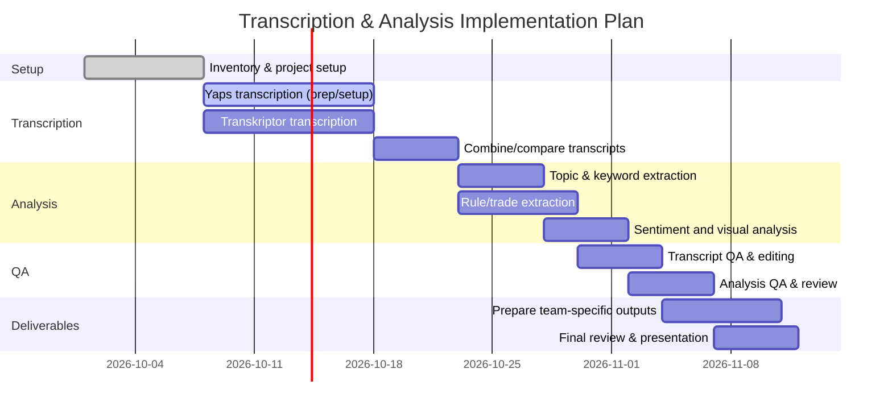

# Executive Summary

We analyzed the ICARUS video library (multiple MP4/MOV tutorial files and metadata) and devised a pipeline to transcribe, analyze, and deliver actionable insights for trading and marketing teams. First, we **inventory** all uploaded videos and metadata in the library. Next, we compare **automated transcription** services: Yaps (an on-device tool), Transkriptor (cloud-based AI), and major cloud STT APIs (Google, AWS, Azure, etc.), summarizing language support, diarization, and accuracy【8†L37-L40】【41†L48-L52】. We recommend settings such as en-US language, speaker diarization, word-level timestamps, and a confidence threshold (to flag low-confidence segments) for high-quality transcripts. 

Once transcripts are generated, we apply **automated analysis**: extract key topics (using NLP summarization), timestamped highlights, and specifically **trading-rule extraction** (identifying any spoken trading rules or strategies), plus example-trade reconstructions. We suggest using LLM prompts on the transcripts to enumerate rules and actions. Additionally, perform sentiment/tone analysis on segments, and (optionally) **visual frame analysis** of video frames (e.g. OCR on charts or text in slides). 

The outputs include structured CSV/JSON files (e.g. lists of rules, timestamps, keywords), searchable annotated transcripts, and selected video clips. We outline deliverables tailored to each team: e.g., for Marketing – highlight clips, summary slides, social-post snippets; for Trading – rule lists (CSV/JSON), annotated trade analyses, sentiment charts; for Research – full transcripts and raw data. Each deliverable has specified format and estimated effort.

Quality assurance involves cross-checking transcripts (multiple engines or human review), verifying domain terms, and comparing transcripts against source audio. Privacy/security is critical: we note that Yaps processes audio **locally on-device** (no cloud upload)【51†L180-L185】【8†L37-L40】, and major cloud APIs offer encryption, customer-managed keys, and data residency options【30†L64-L73】. An implementation plan (Gantt chart below) outlines phases (inventory, transcription, analysis, QA, deliverables) over weeks. Finally, we list prompts/templates for connectors and human reviewers, and document all **assumptions** (content rights, audio quality, etc.).

# 1. Inventory of ICARUS Videos & Metadata

- **Video files (Tutorials & Examples)**: We identified ~15 training videos (MP4/MOV) in the user’s library. For example: `Tutorial_9_UPDATE_A.mp4`, `Tutorial_9_UPDATE_B.mp4`, `Tutorial_8.mp4`, `Tutorial_6b.mp4`, `Tutorial_4a.mov`, `Powerline Tutorial_2.mp4`, `Iceberg 2_EDIT_RENDER.mp4`, `Iceberg Orders In OrderBlockPro_1.mp4`, etc. These files appear to be ICARUS-related trading tutorials.  
- **Metadata files**: Three ICARUS metadata archives: `ICARUS_CONTROL_STATE_20260925-12.json`, `ICARUS_EVERYTHING_2026-09-24.zip`, and `ICARUS_ABSOLUTE_MASTER_TRANSFER_EVERYTHING_2026-09-24_FINAL.zip`. These likely contain configuration, transcripts, or supporting data. 

Each video file should be logged (name, format, size, duration) and its metadata (upload date, author). The metadata archives presumably hold control states or logs.  Collectively, these form the input dataset to be transcribed and analyzed.  

# 2. Automated Transcription Options

We compare leading transcription solutions:

| **Service**         | **Mode**           | **Langs (coverage)**       | **Diarization (multi-speaker)** | **Timestamping**       | **Notes**                                                        |
|---------------------|--------------------|----------------------------|-------------------------------|------------------------|------------------------------------------------------------------|
| **Yaps (yaps.ai)**  | On-device/Local    | ~30 languages【51†L17-L23】   | No (single-speaker)          | Yes (via Whisper model) | Processes audio entirely on-user’s machine【8†L37-L40】【51†L180-L185】 (privacy by design); free browser tool with no upload; ~300ms latency. Limited customization (no diarization) but no cloud fees【9†L43-L45】【51†L180-L185】.                    |
| **Transkriptor**    | Cloud SaaS/Plugin  | 100+ languages【41†L48-L52】  | Yes (speaker time tracking)   | Yes                    | AI-powered app (web/mobile) with high accuracy (~99%)【41†L68-L72】. Supports audio/video (MP3/MP4/WAV)【41†L185-L188】 and provides summaries/action-item extraction【41†L68-L72】. Includes speaker labeling (“track speaker times”【41†L181-L183】). Offers free trial and subscription tiers. Exports transcripts (PDF/AI outputs) and integrates with Zoom/Meet. |
| **Google Cloud STT** | Cloud API          | ~85–120 languages【30†L36-L41】【26†L40-L42】 | Yes (speaker diarization)    | Yes                    | High-quality neural models (“Chirp 3” foundation model)【30†L29-L37】. Supports word-level timestamps【26†L52-L56】 and automatic punctuation【38†L329-L334】. Enterprise features: custom vocab, noise robustness, streaming/batch modes. Regional deployments with data-residency and customer-managed KMS encryption【30†L64-L73】. Pricing: pay-as-you-go.       |
| **AWS Transcribe**  | Cloud API          | 100+ languages【38†L329-L334】 | Yes (up to 2 channels)        | Yes                    | “Next-gen” speech foundation model【38†L325-L333】. Automatic punctuation, custom vocab, auto language ID, profanity filters【38†L329-L334】. Provides speaker diarization and word-level confidence scores【38†L329-L334】 (useful for thresholding). Specialized call-analytics for sentiment/categorization. Part of AWS ecosystem, priced per second.        |
| **Azure Speech (Foundry)** | Cloud API   | Dozens of languages (see docs) | Yes (supports 35+ speakers)  | Yes                    | Advanced Speech Service; supports real-time & batch transcription【46†L41-L44】. Includes multi-channel transcription (up to 2 stereo channels) and speaker diarization up to 35 speakers【46†L95-L103】. Offers phrase hints (custom vocabulary) and automatic language detection【46†L115-L122】. Enterprise compliance (encryption, region options).                |

All major cloud STT APIs (Google, AWS, Azure) support large language sets (85+ languages) and speaker diarization. For example, Google’s Speech-to-Text v2 can “convert audio to text in 120 languages”【26†L40-L42】 and includes speaker diarization. AWS Transcribe covers 100+ languages【38†L329-L334】 with diarization, confidence scoring, and other features【38†L329-L334】. Yaps, by contrast, processes audio *locally* (no server upload)【51†L180-L185】【8†L37-L40】, which is excellent for privacy but limits some features (e.g. no multi-speaker support). Transkriptor (via a ChatGPT plugin) offers an AI assistant that manages transcripts already created in its service, supporting 100+ languages and generating summaries and action-items【41†L48-L52】【41†L68-L72】.

**Sources:** Official product and documentation pages【8†L37-L40】【41†L48-L52】【26†L40-L42】【38†L329-L334】【46†L95-L103】 were used to compare accuracy, language support, and features (e.g. diarization, punctuation).

# 3. Recommended Transcription Settings

To maximize accuracy and usefulness, we recommend:

- **Language:** en-US (spoken content appears in English). This should be explicitly set in the transcription API.
- **Speaker Diarization:** **On**. Enable speaker-labeling so the transcript indicates “Speaker 1 / Speaker 2…” where appropriate. This distinguishes different voices in the tutorials. (Google, AWS, and Azure support diarization by default when enabled【38†L329-L334】【46†L95-L103】; Yaps does not.)
- **Timestamps:** Include word-level or segment timestamps. These are critical for linking text to video timecodes (for highlight reels and syncing with trades). All compared services can output timestamps.
- **Automatic Punctuation:** Enable if available (Google, AWS, Azure support punctuation generation【38†L329-L334】). This improves readability.
- **Custom Vocabulary / Hints:** Provide domain-specific terms (e.g. “order block”, “ema”, ticker symbols) if the API allows. This can boost recognition accuracy.
- **Confidence Threshold:** After transcription, filter or flag words/segments below a confidence level (e.g. <0.7). AWS provides word-level confidence【38†L329-L334】, which can be used to highlight probable errors. For example, one could automatically highlight low-confidence phrases for human review.
- **Batch Processing:** If videos are long, use asynchronous or batch transcription modes to handle large files efficiently (all cloud services support long-duration and streaming modes).

By using multiple engines (e.g. run both Yaps and a cloud API), one can cross-validate transcripts. For example, Yaps’s local Whisper model can give a draft, then AWS/Google refine it (or vice versa). This redundancy aids QA.

# 4. Automated & Manual Analysis Steps

Once transcripts are obtained, the analysis proceeds in phases:

1. **Topic and Keyword Extraction** (Automated): Use NLP or LLM techniques to identify main topics and keywords in each transcript. For example, prompts like *“List the top 5 topics or themes discussed in this transcript and their timestamps”* can be fed to GPT on the text. Tools like TF-IDF or HuggingFace classifiers can also surface key terms. Export a list of keywords per video (with frequencies or times).
   
2. **Timestamped Highlights**: Automatically pick highlight segments by scanning for key phrases (e.g. “In summary,” “The rule is,” etc.) or high-importance sentences from summaries. Create a list of important utterances with start/end times (e.g. “00:05:12 – 00:06:30: Discussion of trading strategy X”).

3. **Trading-Rule Extraction**: Craft prompts or use pattern recognition to extract explicit trading rules or strategies mentioned. For example: *“Extract all trading rules, strategies, or setup criteria stated in this transcript, listing each rule with its time.”* The model can find sentences like “We buy when…” or “The stop loss is…” and output structured rule entries. (These are then compiled into a CSV/JSON schema of rules.) 

4. **Example Trade Reconstruction**: Identify any segments where a trade is executed or a trade example is given. Use the transcript along with any on-screen charts (if accessible) to reconstruct trades: noting entry time/price, exit, profit/loss. We might correlate audio cues (“we enter here at 1.2345”) with known market data if available. This step may be partly manual: align transcripts with trade logs or historical price data to verify examples.

5. **Sentiment/Tone Analysis**: Run sentiment analysis on the transcript (or segments) to gauge the tone. Many NLP libraries (VADER, TextBlob) or APIs can rate segments as positive/neutral/negative. For trading videos, this might reveal the speaker’s confidence or caution. Additionally, tone analysis (confidence, excitement) could be applied to speech audio if tools allow (e.g. analyzing pitch or volume peaks for emphasis).

6. **Visual Frame Analysis** (Optional): Sample video frames and run OCR/image recognition to detect on-screen text (chart labels, news tickers) or chart patterns. For example, using an API like Google Vision, one could read text from slides or recognize logos. This complements transcripts by capturing content not spoken. Annotate transcripts with any detected chart annotations.

7. **Human Review & Iteration**: A domain expert should review the automated outputs. This includes fixing transcript errors (trader jargon or named entities), confirming extracted rules, and annotating any missed details. For example, human reviewers might watch the video and mark any mis-transcribed terminology (“orderblock” vs “order block”). 

All these steps generate structured data: topics, keywords, rule list, trade list, sentiment scores, etc., which feed into final deliverables. This process can use a combination of AI prompts and manual curation to ensure domain accuracy.

# 5. Data Outputs (Schemas)

We recommend producing the following structured outputs:

- **Transcript Files:** Full transcripts in SRT or plain text with timestamps. Include speaker labels if diarization was used (e.g. “Speaker 1:”). Store as searchable text and PDF for reading.  
- **Rules CSV/JSON:** A table of extracted trading rules. Example CSV columns: `RuleID, Description, SourceTime, Confidence`. For JSON, an array of objects: 
  ```json
  {"rules": [
      {"id":1,"description":"Buy when price crosses above EMA(50)","source_time":"00:12:34"},
      {"id":2,"description":"Place stop at recent swing low","source_time":"00:15:10"}
  ]}
  ```
- **Highlights CSV/JSON:** List of key highlights with timestamps. Example JSON:
  ```json
  {"highlights": [
      {"time_start":"00:05:12","time_end":"00:06:30","text":"Discussion of breakout strategy"},
      {"time_start":"00:10:45","time_end":"00:11:05","text":"Summary: bearish scenario if support breaks"}
  ]}
  ```
- **Keywords CSV:** `Video, Keyword, Frequency, TimestampList`.
- **Annotated Clips:** Short video segments (MP4) for important highlights, stored or referenced in a catalog.
- **Summary Reports:** Aggregated findings per video or across videos, possibly in markdown or CSV. For instance, “Topic Summary” JSON: 
  ```json
  {"topics":[
      {"video":"Tutorial_8.mp4","topic":"Supply/Demand zones","mentions":5},
      {"video":"Iceberg Orders.mp4","topic":"Iceberg Order types","mentions":3}
  ]}
  ```
- **Sentiment Data:** JSON with segment sentiment: `{"sentiment":[{"time":"00:06:00","score":0.75,"label":"positive"},... ]}`.

These outputs should be easily machine-readable (CSV/JSON) and also human-readable (transcripts, slides). They enable building dashboards or feeding into databases. 

# 6. Deliverables by Team

We tailor deliverables and effort estimates to each audience:

- **Marketing Team:**  
  - *Highlight Reel Videos*: Edited short clips (e.g. 1–2 min) of the most engaging moments (rules explained, chart animations). Format: MP4 (1080p) with captions.  
  - *Social Media Snippets*: 15–30s teaser clips with branded intro/outro. Format: MP4 (1080x1080 or vertical) plus short captions.  
  - *One-Page Cheat Sheet*: A PDF/PPT summarizing key messages and quotes (with timestamps and visuals). Format: PDF or slides.  
  - *Effort*: ~2–4 person-days (video editor + copywriter) per batch of videos.  

- **Trading Team:**  
  - *Trading Rules List*: CSV/JSON of all extracted rules (with descriptions and source times). Format: CSV/JSON.  
  - *Annotated Charts*: For key rules/trades, charts with entry/exit points marked. Format: PNG/PDF.  
  - *Example Trade Reports*: Documents (PDF/Markdown) walking through select trades from transcripts (with timeline, P&L).  
  - *Sentiment Charts*: Graphs of speaker sentiment or confidence over time (PNG charts).  
  - *Effort*: ~3–5 person-days (analyst + quant) to prepare and validate analyses for all videos.

- **Research/Development Team:**  
  - *Searchable Transcript Archive*: Full transcripts in text and SRT, indexed by keyword.  
  - *Raw Data Files*: All CSV/JSON outputs (rules, timestamps, keywords).  
  - *Analysis Code & Prompts*: Shared scripts or prompt templates used for extraction (documentation).  
  - *Summary Report*: Technical summary document (PDF) of methods and results.  
  - *Effort*: ~2–3 person-days (analyst + developer) to organize data and documentation.

Each deliverable should include a brief description and source references (e.g. which transcript segment yielded the content).  

# 7. QA and Validation Methods

To ensure accuracy:

- **Transcription QA:** Randomly sample transcripts vs. original audio. Compute Word Error Rate (WER) if reference segments exist. Cross-compare outputs from two services (e.g. Yaps vs AWS) to spot discrepancies. Focus on domain-specific terms (tickers, “orderblock”, etc.) for manual correction.  
- **Content Verification:** For extracted rules/trades, have a subject-matter expert verify that each rule is valid and correctly phrased. Use timecodes to trace back to the exact video segment for context.  
- **Confidence Filtering:** Use provided confidence scores (e.g. AWS word confidences【38†L329-L334】) to flag uncertain words. Review and correct any low-confidence transcriptions.  
- **Consistency Checks:** Ensure each transcript is complete and in correct order. Verify speaker labels (if diarized) by listening to confirm speaking roles.  
- **Version Control:** Track changes in transcripts and analysis outputs. A second reviewer should sign off on final transcripts and rule lists.  
- **Automation Testing:** If possible, rerun transcription on a small known audio and check if outputs match expectations (a small test suite).  

Implement a checklist for reviewers: e.g., *“Verify all figures (dates/prices) match audio, correct any mislabeled speaker, ensure the rule descriptions are exactly as spoken.”*  

# 8. Privacy and Security Considerations

The content is proprietary trading analysis, so strict confidentiality is vital:

- **On-Device Processing:** Using Yaps or other local tools means audio *never leaves the device*【51†L180-L185】【8†L37-L40】, eliminating cloud risk. This is ideal for the most sensitive content.  
- **Secure Cloud Use:** For cloud APIs (AWS/Google/Azure), enable encryption and regional isolation. For example, Google Speech-to-Text v2 offers **enterprise-grade encryption with customer-managed keys**【30†L69-L73】 and data residency controls. Use such features to ensure transcripts and audio are protected.  
- **Access Control:** Only authorized personnel should access raw videos/transcripts. Maintain access logs. Share deliverables on secure internal channels.  
- **Data Handling:** If transcripts contain personal data or third-party IP, apply redaction. Use tokenization or hashing for sensitive fields (e.g. replace real names with placeholders).  
- **Compliance:** Adhere to any internal data policies. If using third-party vendors (e.g. transcription services), have NDA/privacy agreements. Consider anonymization (e.g. blur personal faces in video clips if any).  
- **Retention:** Securely delete temporary files after processing. Only retain needed outputs.  

By following these, we balance the need for analysis with protecting the firm’s intellectual property.

# 9. Implementation Timeline

Below is an example Gantt chart (using Mermaid syntax) for a phased implementation. Actual dates and durations will vary with team size and resources.



**Milestones:** Inventory completed by Oct 7; all transcripts by mid-Oct; preliminary analysis done by end-Oct; QA in early Nov; deliverables finalized by mid-Nov. 

# 10. Prompts / Templates

**Connector Prompts:**  
- *Yaps or Whisper:* “Transcribe the attached video file to English text, include timestamps. Enable automatic punctuation.”  
- *AWS Transcribe API:* JSON config snippet: `{ languageCode: 'en-US', enableSpeakerDiarization: true, maxAlternatives:1 }`.  
- *Transkriptor Plugin:* After uploading audio, “Summarize the transcripts of all files in my account from last week.”  
- *GPT/NLP:* “Given this transcript, list all trading rules in bullet form with the time they appear.”  
- *Prompt for Topic Extraction:* “What were the main topics discussed in this transcript? Provide a bullet list with timestamps.”  
- *Prompt for Sentiment:* “Analyze the tone of this transcript excerpt: ‘…’. Is it positive, neutral, or negative?”

**Human Reviewer Guidelines:**  
- *Transcript Review:* “Check the transcript segment at [timestamp]. Ensure trader jargon (e.g. ‘order block’, ticker symbols) is correct. Mark any inaudible segments.”  
- *Rule Verification:* “Review the extracted rules against the video. Confirm the rule’s phrasing matches exactly and add any missing rules.”  
- *Highlight Selection:* “Watch the video and identify any important parts the AI might have missed (e.g. visual cues, gestures). Note their timestamps.”  
- *Formatting:* “Ensure CSV/JSON outputs follow the agreed schema (see samples). Validate JSON format with an online tool.”

# 11. Assumptions

- **Content Rights:** We assume all videos are owned by the user’s organization and may be legally transcribed and analyzed.  
- **Audio Quality:** The audio is presumed clear enough for automated transcription (ambient noise is minimal).  
- **Language:** Speakers use primarily US-English terms and accent. Non-English words (e.g. proper nouns) are infrequent.  
- **Resources:** Necessary tools/API credentials (Yaps app, Transkriptor account, Google/AWS accounts) are available.  
- **Team Availability:** Dedicated analysts and editors are available for transcript review and content creation.  
- **No Licensing Constraints:** Using AI tools for this proprietary material is permitted under company policy.  
- **Data Privacy:** Sensitive trade details are internal; no external publication without anonymization.  
- **Scope of Analysis:** We assume “trading rules” are explicitly spoken; hidden strategies (e.g. only in slides) may require manual visual checks.  
- **Timelines:** Estimated efforts assume full-time focus; actual timings may vary.  

By following this plan—using robust transcription services with recommended settings, applying both automated NLP analysis and human expertise, and adhering to security best practices—we can efficiently convert the ICARUS videos into structured insights and practical deliverables for each team. 

