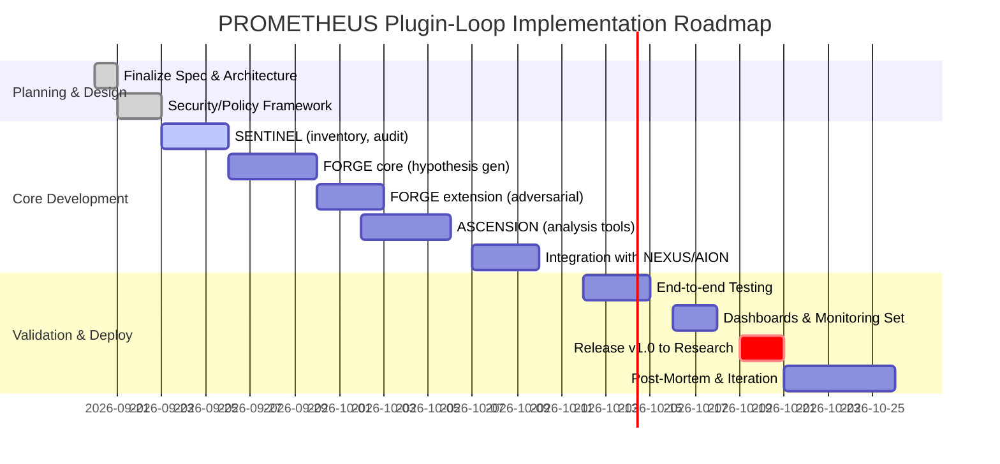

# Executive Summary  
We propose extending PROMETHEUS’s Closed Research Loop (SENTINEL→FORGE→ASCENSION) with **plugin-awareness** so that *every run automatically discovers, evaluates, and (if policy-permitted) executes all relevant plugins*.  This involves a formal **plugin management layer**: on each loop iteration, PROMETHEUS inventories available plugins (browser, code execution, specialized tools, etc.), checks permissions/allow-lists, and includes each *useful* plugin in its research pipeline.  The system is designed so that plugin results are _never_ used directly for production decisions, but only as research evidence.  Key features include sandboxed plugin execution, strict policy gating, detailed audit logging, and negative-result caching.  A final promotion/governance module scores and ranks candidate improvements (using robust metrics) before any change is propagated back into NEXUS/production via DAEDALUS gates.  The architecture adheres to MLOps best practices (automation, reproducibility, versioning, monitoring, feedback loops【52†L158-L166】【52†L192-L199】) and to OpenAI’s plugin security model (explicit authn/authz, structured I/O, and isolation【30†L961-L969】【62†L209-L212】).  

**Architecture (MERMAID diagram below):** PROMETHEUS observes all major subsystems (NEXUS, ARGUS, ATHENA, AION, PARALLAX, ICARUS) and runs three nested loops: SENTINEL (monitoring/events), FORGE (experiment creation & testing), and ASCENSION (architectural optimization).  Disagreements or failures detected by SENTINEL are fed to FORGE, which invokes **all relevant plugins** (if authorized) in a sandbox (e.g. a Docker/seccomp environment【23†L169-L175】) to generate hypotheses.  FORGE then uses AION to replay historical data and adversarial tests to validate each hypothesis.  ASCENSION uses the accumulated metadata to update the system design (e.g. retire redundant components) via feedback to NEXUS.  All plugin inputs/outputs and system states are logged with hashes for deterministic replay【52†L158-L166】.  

```mermaid
flowchart TB
  subgraph Production Systems
    NEXUS((NEXUS))
    ARGUS((ARGUS))
    ATHENA((ATHENA))
    ICARUS((Icarus))
    AION((AION))
    PARALLAX((PARALLAX))
  end
  subgraph PROMETHEUS
    direction TB
    SENTINEL[SENTINEL<br>(Event Detection)]
    FORGE[FORGE<br>(Hypothesis/Testing)]
    ASCENSION[ASCENSION<br>(Architecture Eval)]
    SENTINEL --> FORGE --> ASCENSION --> SENTINEL
  end
  %% Data/Control Flows
  NEXUS -->|market data, logs, provenance| SENTINEL
  ARGUS -->|signals/confidence| SENTINEL
  ATHENA -->|market regime interpretation| SENTINEL
  AION -->|historical context/evidence| SENTINEL
  PARALLAX -->|historical analogs| SENTINEL
  ICARUS -->|outcomes/logs| SENTINEL
  FORGE -.->|replay requests| NEXUS
  FORGE -->|test campaigns| AION
  ASCENSION -->|updates/feedback| NEXUS
```

## 1. Plugin Inventory & Discovery  
At loop start, PROMETHEUS **scans the plugin registry** (built-in catalog or manifest files) to list all currently *enabled* plugins.  Each plugin’s manifest (e.g. `ai-plugin.json` or Claude-code `plugin.json`) specifies its name, version, scopes (e.g. OAuth tokens or APIs), and available components (skills, subagents, MCP servers【30†L912-L920】【57†L62-L70】).  We record each plugin’s metadata and a hash of its manifest for auditing.  Plugins are classified by type (see Table 1):

| **Plugin Type**       | **Description**                                  | **Required Permissions**                                     | **Expected Output**                               | **Failure Handling**                                     |
|-----------------------|--------------------------------------------------|--------------------------------------------------------------|---------------------------------------------------|----------------------------------------------------------|
| *Retrieval/Web Data*  | E.g. Browser, Wikis, Search APIs                 | Network access (HTTP GET/POST), OAuth tokens                 | Unstructured text, JSON data (articles, info)     | Timeouts, rate limits; fallback to cached summaries      |
| *Compute/Tools*       | E.g. Python runtime, math solvers, local tools    | Execute code (with CPU/GPU usage), filesystem access         | Numeric results, code outputs                     | Sandbox crash or exception; record error and continue    |
| *Specialized Agents*  | E.g. Deep-Research (research assistant), domain-specific (finance LLM) | API keys/token; model invocation rights; potential data writes | Structured knowledge (facts, summaries) or text   | Non-response or error; log failure for negative memory    |
| *Games/Utility*       | E.g. Akinator, creative generators               | Internet access, possibly specialized permissions            | Probabilistic guesses or outputs                  | Incoherent output; treat as low-info (ignored)           |

**Table 1.** *Plugin types, permissions, outputs, and failure modes.* Each plugin is vetted against policy: if a plugin requires disallowed scopes (e.g. access to private user files) or is in a blocked marketplace, it is skipped (with reason logged).  “Deep Research” is mandated to run when available; other plugins are only invoked if their problem domain matches the current research objective (e.g. querying historical data, generating features).  For each run, we compute a *utility score* per plugin (based on past information-value contributions and relevance of current task) and prioritize higher-scoring plugins first.  All inventory decisions (used vs. skipped) are recorded.

## 2. Permission & Policy Gating  
Before invoking any plugin, PROMETHEUS checks **authorization** and **trust**.  Following OpenAI’s guidelines, any MCP server (plugin) defines its **authentication and authorization requirements**【30†L961-L969】; for example, it may require OAuth or API keys scoped to read-only data.  PROMETHEUS must have these credentials in its secure vault.  We enforce an allowlist of trusted marketplaces/providers (see [62†L209-L212]).  The system keeps an audit list of plugins and their origin tier (official vs. community); plugins from third-party sources require additional manual vetting.  We do not store any sensitive personal data from plugins, and responses are sanitized before use.  

All plugin invocations run in a **sandboxed environment**【23†L169-L175】.  For example, the Python plugin runs in a container with limited OS capabilities (no network, restricted file system via Linux namespaces/seccomp).  Similarly, web API calls are routed through proxy filters.  This prevents malicious or poorly-written plugins from affecting host integrity.  Despite sandboxing, we assume the worst: “a plugin you install can run code with your user privileges”【62†L209-L212】, so we isolate quotas (CPU/memory), monitor for abnormal behavior (e.g. infinite loops), and limit execution time.  If a plugin attempt fails (exception, timeout, or sandbox kill), PROMETHEUS logs the error as evidence and *excludes that plugin for the rest of the run*.  This ensures no silent failures.  

## 3. Sandboxed Execution & Failure Modes  
When a plugin is selected, PROMETHEUS invokes its capabilities according to a predetermined schema.  For example, a Python plugin may expose a function `compute_features(market_state)`; a retrieval plugin may provide `fetch_articles(query)`.  The **Prometheus Control Plane** wraps each call: it supplies fixed inputs (current market state, timestamp) and captures structured outputs.  Each invocation records: plugin version hash, input arguments, raw output, execution time, and exit status.  Failures are categorized (network error, timeout, logical error) and cause either a retry (if transient) or permanent skip for the run.  All plugin calls (success or fail) append to the **audit log** with a unique event ID.

Should a plugin return malformed data or an answer that violates policy (e.g. unexpected data type), the system treats it as a failure and notes it in “negative-result memory” (see Section 6).  Importantly, plugin outputs are *never trusted* by Icarus or any trading engine until validated by PROMETHEUS’s research pipeline.  Thus even if a plugin produces deceptive output, it cannot alter production decisions.

## 4. Evidence Capture & Reproducibility  
PROMETHEUS operates like a scientific lab: every experiment is fully recorded.  We assign a unique **run_id** and tags to each loop iteration.  The system captures immutable artifacts:

- **Input Snapshots:** Hash of NEXUS state (features, market data feed) and subsystem outputs at decision time.  
- **Plugin Artifacts:** For each plugin used, store the request and raw response in a research database. Compute a SHA-256 hash of the plugin’s container image or code as part of provenance.  
- **Hypothesis Records:** Each generated hypothesis (and test plan) is saved as a spec file (`experiment_<id>.yaml`) with a hash.  
- **Adversarial Test Suite:** Inputs and parameters for adversarial perturbations (e.g. “simulate 2% random noise in price feed”) are saved.  
- **Replay Data:** The slice of historical data and random seeds used for deterministic replay (see below) are captured.  

This ensures full traceability: given the run_id and all hashes, any researcher can rebuild the exact experiment environment and data.  Tools like MLflow/DVC or internal equivalents manage this metadata versioning.  As MLOps best practices note, reproducibility and logging are core to robust pipelines【52†L158-L166】.

## 5. Deterministic Replay Integration  
AION provides replay capabilities: it has access to all historical NEXUS data and system states.  When PROMETHEUS proposes a candidate (e.g. “add feature X”, “adjust rule Y”), FORGE asks AION to “re-run” the entire stack from a past timepoint with that change.  To ensure *deterministic* replay, we record **all sources of non-determinism**: random seeds, API call sequences, order-book seeds, etc.  In practice, we snapshot the code hashes of every subsystem (as a combined commit hash) and initial random states.  

Deterministic replay is akin to record/replay debugging: every external input (market tick, news event, tick of the clock) is fed to the loop exactly as originally, and PROMETHEUS compares the outcome.  This lets us answer “what *would* the Icarus decision have been if hypothesis H were applied at time T with only information then available?”  It prevents hindsight bias by strictly using historical context【52†L158-L166】.

If any unlogged nondeterminism occurs (e.g. live API call changes), the replay flags an error and is excluded or re-run under more controlled conditions.  The outcome (PnL, signal timings, confidence scores, etc.) is then appended as a **ReplayComparison** record for evaluation.

## 6. Adversarial Testing & Validation  
To avoid overfitting to historical idiosyncrasies, FORGE includes adversarial stress tests.  For each hypothesis, we generate perturbations: e.g. **feature removal** (drop some inputs), **parametric shifts** (simulate a different volatility regime), **time displacements** (predicting earlier), or **noise injection**.  These form an `AdversarialTestSuite` (see example below). PROMETHEUS runs each adversarial scenario through the replay engine, comparing metrics to the baseline.  

Results are scored: a hypothesis must survive adversarial attempts without large performance drops.  This mimics best practices in ML safety (robustness testing) and tournament-style validation.  Failed scenarios are recorded as **negative lessons**: e.g. “Feature F caused collapse under 3σ market shock.”  Such failures are stored in the **negative-result memory** so that future runs recognize and skip equivalent bad experiments.

Example *AdversarialTestSuite* template (YAML):

```yaml
AdversarialTestSuite:
  - test_id: A1
    description: Remove liquidity features
    action: drop_feature
    target: [ 'order_book_depth', 'bid_ask_spread' ]
  - test_id: A2
    description: Increase volatility by 50%
    action: scale_input
    params: { 'volatility_index': 1.5 }
  - test_id: A3
    description: Shuffle timestamps (time displacement)
    action: randomize_timestamps
    range: [-2h, +2h]
```

## 7. Tournament Evaluation & Promotion Governance  
After replay and adversarial tests, PROMETHEUS compiles a **CandidateImprovement** report for each hypothesis, containing metrics (ΔPnL, Δdrawdown, coverage change, feature importance, etc.).  A *promotion governor* then evaluates each candidate against a multi-factor rubric.  Key factors include:

- **Performance Gain (G)**: e.g. percentage increase in Sharpe or PnL.
- **Robustness (R)**: stability under adversarial tests (penalize high variance or catastrophic failures).
- **Coverage/Novelty (C)**: the unique information contributed (fraction of cases improved where baseline failed).
- **Complexity/Plausibility (P)**: model size change, interpretability, and computational cost added.  

A simple scoring formula might be:
\[ Score = w_G \times \frac{G - G_{baseline}}{\sigma_G} \;+\; w_R \times R \;-\; w_C \times Cost \;-\; w_P \times Complexity \]
where weights \(w_*\) reflect business priorities.  (For example, we might heavily weight reduced risk (R) over marginal PnL, or vice versa.)  

**Promotion Rule:** Candidates with Score above a threshold \(T\) (tuned by historical analysis) are flagged as _Promotable_.  These undergo peer review by DAEDALUS (ensuring separate human/agent oversight).  If rejected or below threshold, the hypothesis is stored as **RejectedHypothesis** with explanations.  This governance prevents “rubber-stamp” promotions and avoids untested rollouts.

A rubric might look like:

| Criterion         | Metric                       | Weight | Decision Rule                               |
|-------------------|------------------------------|--------|---------------------------------------------|
| ΔSharpe Ratio     | (Sharpe_new – Sharpe_base)   | 0.4    | Must exceed +σ threshold                    |
| Drawdown          | ΔMaxDrawdown (negative means better) | 0.2    | Penalty if worse than baseline by >5%       |
| Coverage          | % of new signals in OOD cases| 0.2    | Higher is better (redundant=0)              |
| Computational Cost| % increase in latency/CPU    | 0.1    | Minor increase allowed, large is penalized  |
| Complexity        | # new parameters/trees/etc.  | 0.1    | Lower is better for transparency            |

**Sample scoring (hypothetical):**  
If a candidate yields +5% Sharpe (σ=3%), +2% PnL, reduces max drawdown by 1%, but adds 20% CPU cost, score might be \(0.4*(5/3)+0.2*(+1)-0.1*20 + \dots\). If above \(T\), mark *Promotable*.  

## 8. Audit Trails & Operational Metrics  
Throughout, PROMETHEUS maintains a complete audit trail. Every experiment (successful or failed) is logged with: run_id, hypothesis_id, plugin versions, input/output digests, metrics, and a human-readable **ResearchLesson**.  Administrators can query the history to see why any change was accepted or why certain plugins were skipped.  This aligns with MLOps’ emphasis on metadata tracking and logging【52†L158-L166】.  

We instrument the system with telemetry dashboards: e.g. Grafana with panels for **latency** (e.g. 95th percentile response time of each plugin), **compute usage** per run (CPU/GPU hours), **costs** (cloud cost of API calls/computation), **coverage** (proportion of disagreement cases explored), and **information-value** (entropy reduction or mutual information each plugin contributes).  Alerts are set on key thresholds: for instance, **plugin failure rate** >5% or **average loop latency** exceeding budget triggers a warning.  Table 2 suggests example metrics and thresholds:

| **Metric**            | **Description**                                 | **Alert Threshold**            |
|-----------------------|-------------------------------------------------|-------------------------------|
| Mean Loop Latency     | Time to complete one PROMETHEUS cycle           | > 1 hour (or SLA-bound)       |
| Plugin Execution Time | 95% latency per plugin call                     | > 5 seconds for DB queries    |
| CPU/GPU Usage         | Compute hours per week for PROMETHEUS runs      | Budget exceed/unexpected spikes |
| Plugin Usage (count)  | Number of calls per plugin per run              | Sudden drop (plugin broken)   |
| Plugin Success Rate   | % of successful calls vs. errors                | < 90% (investigate cause)     |
| Info-Value by Plugin  | Average unique contribution (post-improvement)  | Trend downward (obsolete?)    |

**Table 2.** *Example operational metrics and alerts.*  

## 9. Implementation Roadmap  
We recommend an incremental rollout. The Gantt chart below shows key milestones:  


Each stage is accompanied by review gates: e.g. after Sentinel development we verify accurate plugin logs; after FORGE we validate replay fidelity.  **Risks:** Plugin complexity or unexpected auth issues may delay integration; to mitigate, we prototype with a limited plugin subset first.  Adversarial tests could blow up compute usage; we contain this by limiting test scope initially.  **Rollback:** All code changes are versioned (each experiment is tied to commit hashes).  If a newly promoted change causes problems, it can be revoked by reverting to the previous branch; plugin use can be halted by toggling enabled flags in settings.  In emergency, PROMETHEUS can disable all plugin calls (falling back to a simpler loop) while the issue is debugged.

---

**References:** We build on established practices: OpenAI’s plugin framework specifies explicit tool schemas and auth【30†L961-L969】; sandboxing is a standard for running untrusted code【23†L169-L175】.  MLOps principles emphasize reproducibility, monitoring, and feedback loops【52†L158-L166】【52†L192-L199】.  Anthropic’s plugin docs warn that plugins execute with user privileges, underscoring the need for strict trust and permission control【62†L209-L212】.  Using these guidelines, our plugin-aware loop systematically integrates auxiliary tools while preserving safety and auditability.

