# Executive Summary

The **Infrastructure Supervisory Loop** is an adaptive control layer that monitors and protects complex infrastructure systems.  It implements a closed-loop cycle (Observe→Model→Plan→Guard→Act→Verify→(Rollback)→Learn→Journal) to detect anomalies, propose corrective actions, and ensure safety.  The existing prototype (in `infrastructure_loop.py` with accompanying `config.example.yaml`, `README.md`, and tests) demonstrates core capabilities: metric observation, rolling anomaly detection, health scoring, risk-based planning, snapshots, verification, rollback of harmful changes, and an audit journal. One validation test passes. 

**Key findings:**  Contemporary **autonomic/cloud systems** use similar feedback loops (often called MAPE-K: Monitor-Analyze-Plan-Execute) to self-manage resources【31†L312-L320】【15†L73-L81】. For example, Kubernetes natively provides health probes and auto-recovery (“self-healing”), restarting failed containers or rolling back deployments that destabilize the cluster【20†L91-L99】【48†L358-L364】. Effective loops depend on rich observability (metrics, logs, traces) and anomaly detection to spot incipient failures【38†L370-L378】【40†L10-L18】.  They also leverage IaC or GitOps tooling (e.g. CloudFormation, Argo CD) to control and revert infrastructure changes.  

Our analysis identifies the highest-leverage next steps: **(1)** expand and harden monitoring (e.g. integrate popular observability stacks), **(2)** improve anomaly detection and learning (e.g. ML-based forecasting), **(3)** support additional infrastructure domains (Kubernetes, cloud services, CI/CD), and **(4)** add multi-timescale control.  We define a prioritized list of independent tasks (with scope, effort, tests, rollback, etc.) and propose parallel development streams.  Tables compare candidate tools for observability, anomaly detection, and rollback.  A control-flow diagram (below) illustrates the loop, and a 4-hour Gantt chart outlines the next four cycles.  Citations are included to authoritative sources on supervisory control and modern infrastructure automation. 

# Available Plugins and Connectors

We attempted to invoke the requested **Superpowers** skills and workflows (brainstorm, planning, execution, debugging, TDD, code-review, etc.) and the named plugins (Codex Coordinator, Baton Pass, Akinator). None of these are actual, accessible plugins in this environment.  As instructed, we mark those sections **BLOCKED** and will not proceed as if they succeeded.  

In practice, our tools are:
- **ChatGPT tools:** the `browser` (web search) and `python` (analysis/runtime) modules. These will be used for research and prototyping code.
- **Infrastructure APIs/CLIs:** although not directly invoked here, typical connectors include Kubernetes API (via `kubectl` or Python client), cloud APIs (AWS/GCP/Azure), Terraform/CloudFormation CLI, Docker/Kubernetes commands, Prometheus/Grafana endpoints, CI/CD pipelines (Jenkins/GitHub Actions), logging/monitoring services (Splunk, Datadog, etc.). 
- **Observability stacks:** Grafana, Prometheus, OpenTelemetry, Jaeger, ELK/Opensearch are industry-standard tools【45†L259-L262】. We will consider these as candidate platforms to integrate or compare. 
- **Automation/Orchestration:** Tools like Ansible, Terraform, Argo CD, Spinnaker, AWS Lambda (for guard/act logic), etc., may be used in implementing actions, but no new plugin is invoked here.

**Accessible plugins:** In summary, only the base “browser” and “python” tools are available for research and analysis. We will use web searches to gather data and Python to prototype algorithms or data structures as needed. All other “Superpowers” workflows and orchestrators are unavailable, and we proceed without them.  

# Current System State

The repository **infrastructure_supervisory_loop** (as described in prior work) contains: 

- **Core loop engine (`infrastructure_loop.py`):** an asynchronous supervisory controller implementing the Observe–Model–Propose–Guard–Act–Verify–Learn–Journal cycle.
- **Configuration (`config.example.yaml`):** parameters controlling safety thresholds, autonomy levels, confidence requirements, rollback criteria, and other policy settings.
- **README.md:** design overview, extension points, and usage.
- **Tests (`tests/test_loop.py`):** unit tests validating basic loop functionality (currently 1/1 passing).
- **Adapters/Demo modules:** example adapters for dummy infrastructure (e.g. fake metrics source, fake actuators) to illustrate the plug-in architecture.
- **In-memory components:** an *outcome memory* storing past metric data and actions; *rolling anomaly detection* logic flagging outlier metrics; *health scoring* functions combining multiple signals; *adaptive planner* generating candidate actions; *action risk governor* limiting risky moves; *snapshotting* facility to capture state before changes; *automatic verification* of action outcomes; *rollback logic* to revert if needed; *shadow execution* mode to simulate actions; and an *append-only decision journal* recording all decisions.

**Verification:** The loop has been smoke-tested (1/1 tests passed) on synthetic inputs, demonstrating that it can monitor dummy metrics and apply simple corrective actions without side effects. 

**Limitations:**  The current prototype is essentially an *outer control kernel* with generic hooks. Key limitations include:
- It only supervises *demo adapters* (no real cloud or container systems).
- Anomaly detection is basic (simple thresholds or rolling statistics) rather than sophisticated.
- There is no integration with standard observability platforms (e.g. Prometheus, OpenTelemetry) to ingest metrics or export state.
- Rollback and snapshotting are implemented in-code, but not tested against realistic failures.
- The planner is heuristic and does not learn from reinforcement beyond simple success/failure counts.
- There is no hierarchy or multi-timescale layering; everything runs on the same cadence.
- Monitoring of the loop itself (e.g. loop health, performance) is minimal.
- No UI or dashboards; minimal logging.

In sum, the loop’s **infrastructure** is conceptually sound but currently unconnected to real systems.  The design calls for scaling it into production: adding concrete adapters (e.g. Docker, Kubernetes, databases, message queues), richer observability pipelines, advanced analytics, and robust testing.  We now outline the next high-value improvements to reach that vision.

# High-Leverage Improvements and Constraints

Guided by best practices in autonomic/cloud computing【31†L312-L320】【15†L73-L81】 and industry tooling, we identify the most impactful enhancements:

- **Expand Monitoring & Observability Integration:** Currently, metrics are simulated. Integrating standard observability stacks (Prometheus for metrics, OpenTelemetry or Jaeger for traces, Elasticsearch/OpenSearch for logs) will provide real data and visualization.  Observability is critical for feedback loops【45†L259-L262】【20†L91-L99】.

- **Advanced Anomaly Detection:** Move beyond static thresholds to adaptive, learning-based methods. For example, use time-series forecasting or unsupervised ML (Random Cut Forest, Autoencoders, etc.) to flag anomalies without manual tuning【40†L10-L18】【38†L370-L378】.  This would reduce false alarms and detect subtle drifts.

- **Broaden Adapter Scope:** Build concrete adapters to supervise real infrastructure: Kubernetes clusters, Docker hosts, cloud services (EC2, RDS, etc.), CI/CD pipelines, message brokers (Kafka/NATS), databases. Each adapter should expose metrics (health, load) and actuation (scaling, restarts, routing) in a uniform interface.

- **Multi-Timescale Control:** Implement a hierarchy of loops: a fast (seconds–minutes) loop for instant recovery (e.g. restart a crashed service), a medium loop (hours) for resource adjustments (e.g. rebalancing, scaling clusters), and a slow loop (days/weeks) for topological changes (e.g. redesigning deployment topology or testing large changes in simulation).  This parallels industrial control theory and matches ideas like MAPE-K loops【31†L312-L320】【31†L318-L327】.

- **Resilience and Verification Improvements:** Enhance fail-open safety (loop defaults to no action on uncertainty) and intensify shadow-testing of planned actions. Automate rollback whenever health metrics worsen post-action, and maintain versioned snapshots of state. Use proven rollout strategies (blue-green, canary deployments) and integrate with GitOps tools (Argo CD) for controlled changes【48†L358-L364】【50†L270-L278】.

- **Tighten CI/CD and Testing:** Add comprehensive unit and integration tests. Simulate failures and ensure the loop recovers gracefully. (Example: if an adapter throws an exception, the loop should catch it and alert but continue running.) Employ test-driven development for new features.

- **Explainability and Audit:** Improve the decision journal (already append-only) with richer context (why an action was taken, which rules triggered). Possibly add a UI or reporting interface. Ensure all actions are traceable for compliance and debugging.

**Safety Constraint:** Throughout, maintain *fail-open* and *minimum autonomy* principles: the loop should not unilaterally make irreversible changes without pre-checks. All proposals below include rollback plans and confidence thresholds to guard against erroneous automation.

# Prioritized Task List

We propose the following independent tasks (in priority order) to iteratively enhance the loop.  Each task can be developed and verified without overlapping completed work.  We mark required skills/plugins and risk/rollback strategies. Independent tasks are safe to run in parallel (see coordination below).

1. **Task: Add a Kubernetes Adapter** (Scope: Medium)

   - **Scope:** Develop a new adapter module (`k8s_adapter.py`) that uses the Kubernetes API (client-go or Python `kubernetes` library) to monitor and act on K8s clusters. The adapter should expose methods like `get_health()` (e.g. pod statuses, node conditions, resource usage) and `apply_action(action)` (e.g. scale a Deployment, restart a pod, cordon a node).
   - **Plugins/Skills:** Python environment with `kubernetes` client library. Dev knowledge of K8s API. (No special ChatGPT plugins required.)
   - **Effort:** Medium (a few days to implement core features and tests).
   - **Verification:** Unit-test against a mock K8s API (using a fake `k8s.AdapterTest`). Integration: point to a test cluster (Minikube or kind) in CI; simulate a pod crash and verify the loop detects it and can restart the pod.
   - **Rollback Plan:** If the adapter causes errors, disable it in config (`disable_adapters: [k8s]` fallback). Changes should be covered by shadow mode first (simulate actions without applying).
   - **Risks:** Kubernetes API auth/config may fail; action effects can be complex. Limit action scope initially to safe operations (e.g. scale) and require manual approval in first trials.
   - **Outputs:** `k8s_adapter.py` code with health-check and action methods; unit tests in `tests/test_k8s_adapter.py`; updated `README.md` with setup instructions.

2. **Task: Enhance Anomaly Detection (ML-based)** (Scope: High)

   - **Scope:** Replace or augment the current anomaly detector with a more robust method. For example, implement a Random Cut Forest or streaming ARIMA forecast per metric (using `scikit-learn`, `statsmodels`, or libraries like `scikit-multiflow`). The detector should automatically adapt to trending/seasonality (as AWS CloudWatch AD does【58†L11-L19】) and flag only statistically significant outliers.
   - **Plugins/Skills:** Python with ML libraries (`numpy`, `pandas`, `scikit-learn` or `prophet`). Knowledge of time-series analysis.
   - **Effort:** High (several days to prototype, tune, and test).
   - **Verification:** Create synthetic time-series data (normal vs anomalies). Unit-test that known anomalies are detected at an acceptable false-positive rate. Possibly integrate with real metric data (e.g. CPU usage logs).
   - **Rollback Plan:** Keep the existing simple detector as a fallback (configurable flag). New detector can run in parallel shadow mode initially. If too noisy, revert to thresholds.
   - **Risks:** ML models may overfit or miss anomalies, leading to missed alerts or false alarms. Mitigate by extensive testing on varied datasets. Ensure performance overhead is manageable.
   - **Outputs:** New `anomaly_detector.py` module; training/demo scripts; unit tests in `tests/test_anomaly_detector.py`; updated `config.example.yaml` with parameters (e.g. sensitivity).

3. **Task: Integrate Prometheus Metrics Export** (Scope: Medium)

   - **Scope:** Instrument the loop itself with Prometheus-exported metrics (via [Prometheus Python client](https://github.com/prometheus/client_python)). Publish loop-internal metrics such as loop iteration count, decision latency, number of detected anomalies, actions executed, and rollback events. Optionally, fetch monitored metrics from Prometheus to feed into the loop.
   - **Plugins/Skills:** Python, familiarity with Prometheus (PromClient). Access to a Prometheus test instance (can use Prometheus’s pushgateway or mock).
   - **Effort:** Medium.
   - **Verification:** Run the loop while scraping its `/metrics` endpoint with Prometheus (in test). Assert metrics increase as loop cycles. Test that alerts/fire rules can be fired (e.g. Alertmanager) on loop errors.
   - **Rollback Plan:** If integration causes issues, it is safe to disable (metrics collection is auxiliary). It won’t affect core loop logic.
   - **Risks:** Slight runtime overhead; ensure no blocking calls to Prometheus (use asynchronous mode). 
   - **Outputs:** Code changes in `infrastructure_loop.py` (expose metrics endpoint); Prometheus config example; tests (assert sample metric output).

4. **Task: Develop Medium-Timescale Loop Logic** (Scope: High)

   - **Scope:** Architect and implement a secondary loop that runs on a slower cadence (e.g. hourly or daily) to perform higher-level tasks. Examples: re-evaluate global resource allocation, detect cluster-wide drift, or retrain models. This may involve event scheduling or a separate thread/process. Define interfaces so the existing loop can yield to or incorporate the medium loop.
   - **Plugins/Skills:** Python async programming (asyncio), scheduling (e.g. `schedule` or `APScheduler`), systems design. 
   - **Effort:** High (significant design and coding).
   - **Verification:** Simulate time advancement or trigger the slow loop manually. Test a medium-loop task (e.g. produce a summary report of cluster health). 
   - **Rollback Plan:** New code path, so side-effect free if no trigger. If it misbehaves, can disable via config. Ensure it doesn’t disrupt the fast loop (use separate thread).
   - **Risks:** Increased complexity; race conditions or deadlocks. Mitigate with thorough testing and clear concurrency design.
   - **Outputs:** `medium_loop.py` module (or integrated into engine), updated workflow in README, unit tests (e.g. `tests/test_medium_loop.py` simulating scheduler).

5. **Task: Expand Test Suite and Simulation** (Scope: Low)

   - **Scope:** Write additional unit and integration tests covering edge cases: adapter failures, network partitions (simulate timeout), action execution errors, conflicting actions, load spikes. Use mocks/fakes to simulate infrastructure. Establish a test harness for the loop’s behavior under different scenarios.
   - **Plugins/Skills:** Python (`pytest`, `unittest`), mocking frameworks.
   - **Effort:** Low to Medium.
   - **Verification:** Existing `tests/` folder expanded with new tests. Aim for high coverage (cover both success and failure paths). 
   - **Rollback Plan:** N/A (test code only).
   - **Risks:** Potentially uncovering complex bugs that require refactoring, but that is beneficial.
   - **Outputs:** New test files (e.g. `test_adapter_failure.py`, `test_rollbacks.py`), CI configuration if needed. 

Each task is **bounded and self-contained**: adding an adapter does not alter the core loop logic, improving detection can run alongside existing code, etc.  We will develop them in parallel streams where possible.

## Coordination and Parallel Workstreams

Since tasks 1–5 above touch different modules, they can largely proceed in parallel. To avoid conflicts:

- We adopt a simple **lockfile/branching protocol** (in lieu of an actual “Codex Coordinator”): each developer/stream creates a separate Git branch for the task. A file `TASK-LOCK` can mark an ongoing feature; others wait if they collide on critical files. For instance, both Task 1 and Task 3 may modify `infrastructure_loop.py`, so coordinate to change disjoint parts or serialize commits.  

- **Parallel Workstreams:** 
  - *Stream A:* Kubernetes Adapter (Task 1)  
  - *Stream B:* ML Anomaly Detector (Task 2)  
  - *Stream C:* Prometheus Integration & Testing (Tasks 3 & 5 combined)  
  - *(Optionally, a Stream D:* Medium Loop (Task 4) *if resources allow; otherwise do sequentially after key pieces are in place.)*

We ensure each stream claims ownership of relevant files (e.g. adapters folder vs engine file) and merges carefully. 

# Candidate Tools Comparison

**Observability Tools:** We compare representative platforms for collecting and correlating metrics, logs, and traces:

| Tool                    | Type        | Data Types         | Notes                                                                       |
|-------------------------|-------------|--------------------|-----------------------------------------------------------------------------|
| **Prometheus + Grafana**【45†L259-L262】 | Open-source  | Metrics (time series)      | Widely used for metrics; requires exporters. Integrates easily with Grafana dashboards.  |
| **OpenTelemetry**       | Open standard | Traces, Metrics, Logs | Vendor-neutral instrumentation framework. Works with many backends.          |
| **Jaeger** (CNCF)       | Open-source  | Distributed Tracing       | Focused on traces/span. Can integrate with OpenTelemetry.                    |
| **Elasticsearch/Opensearch** | Open-source  | Logs, Metrics, Anomalies  | Searchable log storage; has ML/anomaly plugin【40†L10-L18】. Scales out.       |
| **Datadog**             | SaaS        | Metrics, Logs, Traces    | Commercial APM/platform with built-in anomaly detection and ML features.     |
| **Splunk**              | SaaS (OSS agent) | Logs, Metrics, Events    | Enterprise log/metrics platform; supports ML anomalies (ITSI module).        |
| **New Relic/Instana**   | SaaS        | Metrics, Logs, Traces    | All-in-one observability with anomaly alerts and AI Ops.                      |

*Comparison highlights:* Prometheus + Grafana is cost-effective and cloud-native, but requires setting up exporters. Datadog/Splunk have richer AI/ML built-in but involve licensing. All support alerting, but only some (Datadog, Splunk, New Relic, AWS CloudWatch) offer adaptive anomaly detection out-of-the-box.

**Anomaly Detection Platforms:** 

| Tool/Technique           | Approach            | Deployment         | Notes                                                           |
|-------------------------|--------------------|--------------------|-----------------------------------------------------------------|
| **OpenSearch Anomaly Detection**【40†L10-L18】 | Unsupervised ML (Random Cut Forest) | OpenSearch plugin | Auto-adapts to data (no fixed thresholds). Requires indexing data. |
| **AWS CloudWatch AD**【58†L11-L19】        | Statistical/ML (per-metric) | AWS managed service | Learns normal baseline (seasonal). Integrates with CloudWatch alarms. |
| **Prometheus Alertmanager**   | Threshold-based    | Open-source      | Static alerts or simple rate rules. No ML by default (can integrate with other tools). |
| **Elasticsearch ML**      | Unsupervised (Gaussian / RCF) | Elastic stack      | Automatically identifies anomalies in logs/metrics.                |
| **Netflix/Sigma** (research) | Probabilistic model | Research (Python) | Example of unsupervised anomaly detection.                        |

We plan to prototype the **OpenSearch RCF** method or AWS-style band detection.  OpenSearch’s solution runs in near-real-time on time-series and is tunable, making it a strong choice【40†L10-L18】.

**Rollback/Recovery Mechanisms:** 

| System                | Infra Type        | Auto-Rollback? | Mechanism                              | Notes                                                    |
|-----------------------|-------------------|----------------|----------------------------------------|----------------------------------------------------------|
| **Kubernetes**【20†L91-L99】         | Containers (pods) | Yes (self-healing) | Restart pods, rollback deployments | Replaces failed pods; `kubectl rollout undo` can revert deployments.           |
| **Argo CD (GitOps)**【48†L339-L347】【48†L358-L364】    | Kubernetes apps | Yes            | Git-backed sync; *Roll back to any committed state*【48†L358-L364】 | Continuously enforces Git state. Supports automated rollback on drift. |
| **Terraform**【50†L270-L278】       | IaC (any cloud) | No (manual)    | State files; re-apply desired state   | Does *not* auto-rollback on error【50†L270-L278】. Manual diff and re-apply needed. |
| **CloudFormation**   | IaC (AWS)        | Yes (by default) | ChangeSets; template versions       | On failure CF rolls back stack; use previous template for desired state【55†L53-L61】. |
| **Spinnaker**        | Multi-cloud apps | Yes (pipeline)  | Pipeline rollbacks/canary stages      | Can automatically halt/rollback on failed canaries.       |
| **Ansible/Puppet**   | Configuration mgmt | Partial       | Idempotent playbooks; snapshots      | Generally idempotent, but no built-in auto-rollback of state. |

**Implications:** Kubernetes and GitOps tools like Argo CD exemplify built-in rollback: they continuously check current vs desired state and revert unwanted changes【48†L339-L347】【48†L358-L364】. In contrast, Terraform lacks automatic recovery【50†L270-L278】, so it must be used carefully (e.g. in destroy-on-fail mode, or by re-applying old plans).  Our loop should leverage declarative systems (use GitOps or change sets) to simplify rollbacks.

# Loop Control-Flow

```mermaid
graph LR
    A[Observe Metrics] --> B[Model Health/Anomalies]
    B --> C[Propose Actions]
    C --> D[Guard (Risk Assessment)]
    D --> E[Take Snapshot]
    E --> F[Act (Execute)] 
    F --> G[Verify Outcome]
    G --> H{Health OK?}
    H -- Yes --> I[Learn (Success)] 
    H -- No  --> J[Rollback]
    I --> K[Journal Decision]
    J --> K
    K --> A
```

*Figure: Supervisory loop flow. The controller observes system state, updates models, proposes guarded actions, executes them, then verifies results. On failure it rolls back; in all cases it learns and journals.*

# 4-Hour Cycle Plan

```mermaid
gantt
    dateFormat  HH:mm
    title Implementation Timeline (4-Hour Cycles)
    section Hour 1
      Task 1 (K8s Adapter): start, 00:10, 01:30
      Task 2 (Anomaly ML): start, 01:00, 02:00
      Task 5 (Testing): start, 00:00, 00:30
    section Hour 2
      Task 1 (K8s Adapter): cont., 02:30, 04:00
      Task 2 (Anomaly ML): cont., 02:00, 03:30
      Task 3 (Prometheus): start, 03:00, 04:30
      Task 5 (Testing): cont., 00:30, 01:00
    section Hour 3
      Task 2 (Anomaly ML): cont., 04:00, 06:00
      Task 3 (Prometheus): cont., 04:30, 06:00
      Task 4 (Medium Loop): start, 05:30, 07:30
    section Hour 4
      Task 4 (Medium Loop): cont., 06:30, 08:00
      Task 5 (Testing): cont., 01:00, 01:30
```



*Figure: Gantt chart of proposed work over the next four hourly cycles. (Times are illustrative offsets; multiple tasks proceed in parallel.)*

# Sources and Context

The above plan is informed by theory and practice of autonomic systems and SRE/DevOps.  Key references include Eclipse’s introduction to supervisory control loops【15†L73-L81】【15†L91-L99】, and a survey on autonomic cloud computing【31†L312-L320】【31†L318-L327】.  Industry sites (Kubernetes, ArgoCD) provided authoritative descriptions of self-healing features【20†L91-L99】【48†L339-L347】. Observability and anomaly detection contexts were drawn from Red Hat’s devops guidance【45†L259-L262】 and AWS/OpenSearch docs【40†L10-L18】【58†L11-L19】.  These ensure our planning aligns with modern best practices.

---

**SKILLS/PLUGINS ACTUALLY USED:** `browser` (web search), `python` (analysis). *(No Superpowers workflows or third-party plugins were available or invoked.)*  

**PARALLEL WORKSTREAMS:** Identified tasks 1–5 (above) as independent streams. Streams A–C can run concurrently with Git-branch coordination (lockfile or CI checks).  

**BUILT:** None (this report is planning).  

**VERIFIED:** None (analytical).  

**PROPOSED:** Implementation tasks 1–5 as listed.  

**BLOCKED:** Superpowers (`using-superpowers` and workflows), Codex Coordinator, Baton Pass, Akinator – none could be invoked, so relevant instructions were noted as BLOCKED.  

**RISKS:** Bypassing the unavailable automated planning tools risks duplicated effort or miscoordination. Implementation risks include API errors (for K8s), ML false alarms, and concurrency bugs. We mitigate via tests, shadow modes, and rollbacks.  

**NEXT:** Begin coding Task 1 (Kubernetes adapter) and Task 2 (anomaly ML) in parallel, with unit tests and simulation. Track progress in the repo and schedule a mid-cycle sync to merge completed components.   

