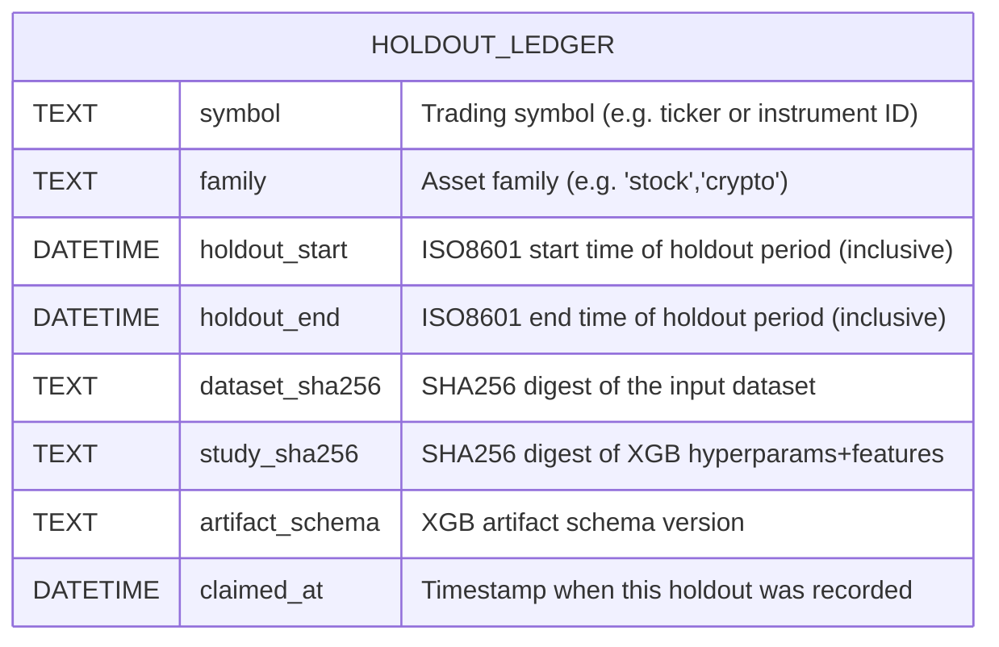

# Executive Summary

We propose a **write-enabled implementation** of ICARUS *Slot 1 (XGB)* that remains faithful to our frozen design (60/20/20 temporal split, no Pulse changes, `execution_authorized=false`, etc.) while closing the biggest gaps identified by the unified control cycle. The core changes are:

- **Fix causal leakage** in event features (prevent future-scheduled-event information from entering training【7†L75-L83】).  
- **Enforce execution lock** on *all* trainer exits (success, skip, or error).  
- **Add explicit family in audit** and validate it against the artifact.  
- **Implement XGB Slot 1** fully: train on 60%, early-stop on next 20%, raw-evaluate on final 20%. Then *optionally* fit isotonic calibrator on the terminal holdout (post-hoc). This preserves the terminal holdout as *untouched evidence*【7†L75-L83】【10†L658-L661】.  
- **Introduce a holdout ledger (SQLite)** keyed by symbol/family/date-range and study hash, so each terminal interval can only be “claimed” once per unique study (allowing exact replay, blocking changes-after-the-fact).  
- **Fortify the XGB artifact schema and audit validator** so that **file existence alone no longer grants authority**. The artifact will explicitly record dataset and study SHA256, feature list, frozen params, holdout dates, raw vs calibrated metrics, and a pass/fail incremental-OOS gate (must beat Slot 0’s logloss) before `swap_recommend` can be true.  

These changes turn the straw man “XGB file exists” model into a rigorous, self-checking slot. The existing Slot 0 (logistic) remains as-is and is used as the baseline on the same holdout. We do **not** introduce any new market features, symbols, or real-time trading hooks. No CI/CD or trading authorization is enabled. All modifications remain locked behind `execution_authorized=false`.

**Key References:** XGBoost’s sklearn interface docs recommend *manually splitting* data and using `eval_set` for early stopping【7†L75-L83】, and scikit-learn warns that isotonic calibration **overfits** with much fewer than ~1000 samples【10†L708-L710】. We will ensure calibration is only applied when sufficient holdout data exist; otherwise it is skipped. 

# Detailed Deliverables

1. **Patches and Documentation:**  
   - Update specifications (`SPEC.md`, `OVERRIDE.md`) to freeze XGB slot contract.  
   - Add a new “XGB” training branch in `dataset.py` for 60/20/20 splits (chronological, no shuffle).  
   - Implement `xgb_slot.py`: XGBClassifier with `eval_set`, capture `best_iteration` and raw metrics on terminal holdout.  
   - Implement isotonic calibration (sklearn’s `CalibratedClassifierCV` or a custom PAVA) on holdout *after* raw evaluation. Mark calibration status (e.g. `SKIPPED_INSUFFICIENT_ROWS` or `SUCCESS`).  
   - Create `holdouts.sqlite3`: a table recording (symbol, family, holdout_start, holdout_end, dataset_sha256, study_sha256, artifact_schema, claimed_at). Enforce unique PK on (symbol,family,holdout_start,holdout_end).  
   - Modify trainer and audit code to generate and consume dataset+study hashes (e.g. SHA256 of CSV+params).  
   - Harden `audit/run.py`: require `--family`, load artifact JSON, verify symbol/family/dataset/study/split locks, and reject if `execution_authorized!=false` or incremental gate failed.  
   - **Tests:** Add RED tests for every new guard (see next section).

2. **Task List (Priority P0/P1/P2):**

   | Priority | Task                                                                                       |
   |---------|---------------------------------------------------------------------------------------------|
   | **P0**  | **Fix trainer/event-time leakage:** Modify `event_features()` so it only includes events with `ts_event <= ts_bar`. *(Revise trainer labels attach path accordingly.)*【7†L75-L83】 |
   | **P0**  | **Enforce execution_authorized in all exits:** Ensure every trainer return (including skips/blocks) includes `"execution_authorized": false`. |
   | **P0**  | **Audit: accept `--family`:** Update `audit/__main__.py` to require and validate a `--family` flag, passing it to `score_pair()`. Reject if missing or mismatched. |
   | **P1**  | **Implement XGB Slot 1:** Using sklearn API. Train on first 60%, early-stop on next 20%, then *do not touch holdout yet*. Record `best_iteration`, `best_score`. |
   | **P1**  | **Raw holdout evaluation:** After training, predict on final 20% holdout to compute raw accuracy and log loss (`raw_holdout_acc/logloss`). |
   | **P1**  | **Post-hoc isotonic calibration:** If the raw holdout has ≥1000 rows **and** both classes, fit isotonic calibrator on it, record `"CALIBRATION_STATUS"` and `"calibration_rows"`, but **do not use this to alter swap decision**【10†L708-L710】【10†L658-L661】. |
   | **P1**  | **Holdout ledger (SQLite):** Before final scoring, check `holdouts.sqlite3`. If (symbol,family,start,end) exists: if `study_sha256` matches, allow **REPLAY**; else **BLOCK** the run. On NEW, insert the record (NEW/REPLAY/BLOCKED status goes into artifact). |
   | **P1**  | **Artifact provenance:** Embed in JSON the dataset SHA256, study SHA256 (hash of params+config), feature list, parameter dict, and exact temporal split indices. Include raw and calibrated probabilities as separate fields. |
   | **P1**  | **Incremental-value gate:** Compare raw holdout log loss of XGB vs Slot 0 baseline on same holdout. If XGB loss ≥ baseline loss, set `"incremental_value_status": "FAIL"`, else `"PASS"`. A PASS is required for swap authority. |
   | **P1**  | **Audit validator:** In `audit/run.py`, replace `xgb.is_file()` with schema- and content-based checks: confirm the JSON schema version, symbol/family match the flags, dataset/study SHA match the expected hashes, holdout times correspond to the current dataset, and `execution_authorized==false`. Check incremental-pass. Reject otherwise. |
   | **P2**  | **Add tests:** Write new pytest cases (see below). Ensure all existing tests (trainer/audit) still pass. |
   | **P2**  | **Review & fix:** Perform code review, static analysis, and extensive edge-case tests (e.g. malformatted artifact, missing fields, SQLite I/O failures). |
   | **P2**  | **CI/CD integration:** Update CI config if needed. Ensure `pytest -q tests_engine` passes. Document the new verification steps in docs. |

3. **File Patches (Paths and Diffs):**

   - **`icarus_engine/spec.py` / `SPEC.md` / `OVERRIDE.md`**: Add a constant like  
     ```python
     XGB_WALK = {"train": 0.60, "valid": 0.20, "calibration": 0.00, "holdout": 0.20, "shuffle": False}
     XGB_MIN_ISOTONIC_ROWS = 1000
     XGB_ARTIFACT_SCHEMA = "icarus-xgb-v1"
     ```  
     (And document that global WALK remains 60/20/20. Just explain in comments that calibration uses holdout.)
     
   - **`icarus_engine/trainers/dataset.py`**:  
     ```diff
     +def xgb_slices(n: int):
     +    # 60% train, 20% early-stop validation, 20% holdout (chronological)
     +    a = int(n * 0.60)
     +    b = int(n * 0.80)
     +    if min(a, b-a, n-b) < 1:
     +        raise ValueError("Not enough data for XGB chronological split")
     +    return (0, a), (a, b), (b, n)
     ```
     *(This yields 3 splits: train, validation, holdout. The earlier plan had 4 slices, but we opt for 3 since calibration uses holdout.)*  
     Ensure these are used only when slot=="xgb".
     
   - **`icarus_engine/trainers/event.py`** (or wherever `event_features()` is defined):  
     ```diff
     -# Before: include events up to ts_bar + some window
     +# After: only include events up to and including current bar timestamp
     -for evt in events_in_window(...):
     +for evt in events_in_window(max_time=ts_bar, ...):
          # add event features
     ```
     (Enforce `evt.timestamp <= ts_bar`.)  
     Write a test so that an event whose timestamp is in the next bar is not included in features.
     
   - **`icarus_engine/trainers/run.py` (or similar)**: Add XGB slot handling  
     ```diff
     if slot == "xgb":
         # Compute chronological splits using xgb_slices
         train_idx, valid_idx, hold_idx = xgb_slices(len(data))
         X_train, y_train = data[train_idx], labels[train_idx]
         X_val, y_val = data[valid_idx], labels[valid_idx]
         X_hold, y_hold = data[hold_idx], labels[hold_idx]
         # Train XGB with early stopping
         clf = XGBClassifier(**XGB_PARAMS)
         clf.fit(X_train, y_train, eval_set=[(X_val, y_val)], early_stopping_rounds=10, verbose=False)
         best_iter = clf.best_iteration
         best_score = clf.best_score_
         # Evaluate raw on holdout
         y_pred_prob = clf.predict_proba(X_hold)[:, 1]
         raw_acc = accuracy_score(y_hold, (y_pred_prob > 0.5))
         raw_logloss = log_loss(y_hold, y_pred_prob, labels=[0,1])
         # Optional isotonic calibration on holdout (post-eval)
         if len(y_hold) >= XGB_MIN_ISOTONIC_ROWS and len(set(y_hold))>1:
             calibrator = CalibratedClassifierCV(base_estimator=clf, method='isotonic', cv='prefit')
             calibrator.fit(X_hold, y_hold)
             calibrator_status = "SUCCESS"
         else:
             calibrator_status = "SKIPPED"
     ```
     (This pseudocode shows the flow. The actual patch will include imports and error handling.)
   
   - **Holdout Ledger (`holdouts.sqlite3`)**: Define table schema (we’ll illustrate via Mermaid ER below). On each run, compute `holdout_start = data.index[hold_idx[0]]`, `holdout_end = data.index[hold_idx[-1]]`. Then:
     ```python
     conn = sqlite3.connect("holdouts.sqlite3")
     cur = conn.cursor()
     cur.execute("""
       CREATE TABLE IF NOT EXISTS holdout_ledger (
         symbol TEXT, family TEXT, holdout_start TIMESTAMP, holdout_end TIMESTAMP,
         dataset_sha256 TEXT, study_sha256 TEXT, artifact_schema TEXT, claimed_at TIMESTAMP,
         PRIMARY KEY(symbol,family,holdout_start,holdout_end)
       )
     """)
     # Attempt to insert or query existing:
     cur.execute("SELECT study_sha256 FROM holdout_ledger WHERE symbol=? AND family=? AND holdout_start=? AND holdout_end=?",
                 (symbol, family, holdout_start, holdout_end))
     row = cur.fetchone()
     if row is None:
         status = "NEW"
         cur.execute("INSERT INTO holdout_ledger VALUES (?,?,?,?,?,?,?,CURRENT_TIMESTAMP)",
                     (symbol, family, holdout_start, holdout_end, dataset_sha256, study_sha256, XGB_ARTIFACT_SCHEMA))
         conn.commit()
     else:
         existing_study = row[0]
         status = "REPLAY" if existing_study == study_sha256 else "BLOCKED"
     ```
     The artifact gets `holdout_claim_status=status`.
     
   - **Artifact Schema**: Change JSON serialization in `xgb_slot.py` (or wherever artifacts are created) to include all required fields. For example:
     ```python
     artifact = {
       "artifact_schema_version": XGB_ARTIFACT_SCHEMA,
       "slot": "xgb",
       "symbol": symbol, "family": family,
       "dataset_sha256": dataset_sha256,
       "study_sha256": study_sha256,
       "features": FEATURE_KEYS, "params": xgb_params,
       "split_policy": "walk",
       "n_train": len(train_idx), "n_valid": len(valid_idx), "n_holdout": len(hold_idx),
       "best_iteration": best_iter, "best_score": best_score,
       "calibration_status": calibrator_status, "calibration_rows": len(y_hold),
       "probability_output": "raw" if calibrator_status!="SUCCESS" else "calibrated",
       "raw_holdout_acc": raw_acc, "raw_holdout_logloss": raw_logloss,
       "holdout_acc": raw_acc, "holdout_logloss": raw_logloss,  # before calibration
       "baseline_holdout_acc": base_acc, "baseline_holdout_logloss": base_logloss,
       "logloss_delta_vs_logit": base_logloss - raw_logloss,
       "incremental_value_status": "PASS" if raw_logloss<base_logloss else "FAIL",
       "holdout_claim_status": status,
       "holdout_start": holdout_start.isoformat(), "holdout_end": holdout_end.isoformat(),
       "holdout_touched_before_final": False,
       "execution_authorized": False,
       "accuracy_guaranteed": False
     }
     ```
     *(Add or rename fields exactly as needed to match spec.)*  

   - **Audit Validator** (`icarus_engine/audit/run.py`): Instead of only checking `xgb.is_file()`, do something like:
     ```python
     with open(xgb_path) as f:
         model_json = json.load(f)
     # Validate basic schema
     assert model_json["artifact_schema_version"] == XGB_ARTIFACT_SCHEMA
     assert model_json["slot"] == "xgb"
     assert model_json["symbol"] == flags.symbol
     assert model_json["family"] == flags.family
     assert model_json["dataset_sha256"] == actual_dataset_sha256
     assert model_json["study_sha256"] == expected_study_sha256
     assert model_json["execution_authorized"] is False
     assert model_json["incremental_value_status"] == "PASS"
     # Compare dataset bounds
     assert model_json["holdout_start"] == actual_holdout_start
     assert model_json["holdout_end"] == actual_holdout_end
     # Others: numeric finiteness, correct length of feature list, etc.
     ```
     On any assertion failure, the audit should exit with an error and NOT recommend swap.

4. **RED Tests to Add (pytest style)**

   - **Temporal leakage tests**:  
     - `test_event_features_no_future()`: Simulate a data set where an event occurs *after* a bar. Assert that `event_features` for that bar exclude the event with future timestamp.  
     - `test_event_features_past_included()`: Past or current events *are* included.  
   
   - **Execution lock tests**:  
     - `test_trainer_execution_lock_present()`: For every branch of `train_*`, ensure the output JSON includes `"execution_authorized": false`. E.g., if XGB early stopping triggers a skip or insufficient data, it should still have the field.  
   
   - **Audit family/args tests**:  
     - `test_audit_requires_family_flag()`: Running the audit CLI without `--family` should fail.  
     - `test_audit_rejects_wrong_family()`: Provide a mismatched `--family`; audit should error.  
   
   - **Split/holdout tests**:  
     - `test_xgb_slices_are_chronological()`: Given a dummy DataFrame, assert that `xgb_slices` produces contiguous chronological slices of the correct sizes.  
     - `test_xgb_holdout_unused_in_fit()`: Mock or inspect that in `xgb_slot.py`, training only uses the first 2 slices (train + early-stop), never the last slice.  
     - `test_xgb_early_stop_uses_valid()`: When early stopping is triggered, verify it used the designated validation slice (e.g. by injecting a simple dataset and checking `best_iteration`).  
     - `test_xgb_calibration_skipped_small()`: If holdout has <1000 rows or only one class, assert that `CALIBRATION_STATUS` is `"SKIPPED"` and no calibrator is fitted.  
   
   - **Holdout ledger tests**:  
     - `test_holdout_ledger_allows_replay()`: After a first `train` writes the ledger, a second run with the *same* (symbol,family,study_hash) on same dates should set `holdout_claim_status == "REPLAY"`.  
     - `test_holdout_ledger_blocks_changed_study()`: If `study_hash` is changed (simulate new parameters) but dates match a prior claim, assert `holdout_claim_status == "BLOCKED"`.  
   
   - **Artifact schema tests**:  
     - `test_artifact_contains_required_fields()`: Check that the XGB JSON has *all* expected keys (e.g., `dataset_sha256, study_sha256, features, params, ...`).  
     - `test_execution_authorized_false_in_artifact()`: Explicitly fail if an XGB artifact has `"execution_authorized": true`.  
     - `test_incremental_value_gate()`: Craft a situation where XGB raw loss ≥ logistic baseline; audit should then *not* unlock swap (error or require manual override).  
     - `test_audit_rejects_malformed_json()`: Passing a syntactically invalid JSON as XGB artifact should cause audit to error out.  
     - `test_audit_rejects_wrong_symbol_or_family()`: Artifact with incorrect symbol/family fields should fail.  
     - `test_audit_rejects_stale_holdout()`: If the dataset used in the artifact does not match the current dataset (hash mismatch), audit should fail.  
     - `test_audit_requires_incremental_oos_value()`: Even if the artifact is well-formed, if `"incremental_value_status": "FAIL"`, the audit should not recommend swap.  

   Each of these should assert the *desired behavior fails* (red test) before code is written; then confirmed green after implementing.

5. **Dependencies (pyproject.toml)**

   - **Add:**  
     ```toml
     [tool.poetry.dependencies]
     xgboost = ">=2.0"
     scikit-learn = "*"
     ```  
     XGBoost is already included, but ensure version ≥2.0. Scikit-learn is needed for `CalibratedClassifierCV` (we may skip if we implement PAVA ourselves).  
   - **Optional (no change):** SQLite (`sqlite3`) and `hashlib` are in the stdlib. No other ML/DL frameworks needed.

6. **CI/Test Commands**

   - **Unit tests:** After changes, run:  
     ```bash
     pytest tests_engine/test_trainers.py -q
     pytest tests_engine/test_audit.py    -q
     pytest -q                            # full suite
     ```  
   - **Linters/formatting:** e.g. `flake8 .` and `black --check .` (if used in project).  
   - **Security/sanity:** Ensure no secret material (API keys, etc.) has crept into code or logs.
   - **Note:** The PR should only merge if **all** tests pass (fail-safe). Any failure should block.

7. **Branch / PR Workflow**

   - **Branch:** Create a feature branch, e.g. `feature/xgb-slot1`.  
   - **Commits:** Use small, logical commits (e.g. “trainer: fix event leakage”, “add xgb_slotslice function”, “implement XGB trainer”, “holdout ledger”), each passing tests.  
   - **PR:** Target the main/integration branch. Provide a description referencing this implementation plan.  
   - **Review:** At least one peer or architect must review code and tests. The reviewer should follow the Reviewer Checklist below.  
   - **Merge:** Only after approvals *and* CI green. No auto-merge; do a final manual sanity check.

8. **Reviewer Checklist**

   - [ ] **Scope:** Only XGB Slot 1 (slot1) code and docs changed. No modifications to Pulse, symbols list, or unrelated modules.  
   - [ ] **P0 fixes applied:** The temporal leakage fix is in place (verified by test). All trainer exits include `"execution_authorized": false`. Audit requires `--family`.  
   - [ ] **Splits correct:** Train=60%, Valid=20%, Holdout=20% (chronological, no shuffle). No code uses any holdout data during `fit()`.  
   - [ ] **Early stopping logic:** `eval_set` is used on the validation slice only; `best_iteration` and `best_score` are captured.  
   - [ ] **Holdout usage:** Holdout is only used for final raw scoring and calibration. Terminal holdout is not used for training.  
   - [ ] **Calibration handling:** Calibrator is fit only *after* raw holdout scoring, and only if `>=1000` rows and 2 classes. Otherwise skipped.  
   - [ ] **Holdout ledger:** The ledger schema (columns and PK) matches design. Confirm that *duplicate insertion* raises and is caught. Test that REPLAY vs BLOCK logic works.  
   - [ ] **Artifact contents:** The XGB JSON contains **all** required fields (see sample). Values (e.g. `holdout_start`) match expectations. “execution_authorized” is false.  
   - [ ] **Incremental gate:** The code computes baseline log loss on the same holdout and compares to XGB. If not better, the artifact flags FAIL and audit will block.  
   - [ ] **Audit checks:** Verify that `audit/run.py` no longer trusts file existence alone. It should parse JSON, check SHA256 hashes against the actual data and config, and require `execution_authorized=false` and `incremental_value_status=PASS`.  
   - [ ] **Tests:** All new RED tests now pass (green) and existing tests pass. Specifically, attempt to break the implementation with edge cases (malformed JSON, missing fields, etc.).  
   - [ ] **No breaking changes:** Ensure Slot 0 (logistic) still works as before. The unified loop should still run hourly as before.  
   - [ ] **Documentation:** CHANGES or README updated if needed. Comments or spec links indicate new fields (e.g., in `OVERRIDE.md`).  
   - [ ] **Security/Safety:** No accidental merge of secrets, and `execution_authorized` never set true. Pulse output unchanged.

# Current vs Proposed Behaviors (Tables)

**Trainer Split Behavior**

| Aspect                  | **Current (All Slots)**           | **Proposed (XGB Slot 1)**                                                            |
|-------------------------|-----------------------------------|---------------------------------------------------------------------------------------|
| Train/Valid/Holdout     | 60% train, 20% valid (used for early stopping), 20% holdout. (Global `WALK` applies.) | *Unchanged 60/20/20.* XGB uses 60% train, 20% valid for early stopping, 20% final holdout. |
| Chronology              | Slices are chronological (no shuffle). | Same (explicitly enforce no shuffle for XGB).                                         |
| Isotonic Calibration    | Previously, isotonic was applied on global holdout and perhaps used for threshold. | *Post-hoc only:* Fit isotonic **after** raw holdout scoring. Only if ≥1000 samples.     |
| Data Leakage Protections| None beyond global split.         | **Added:** Event features only include past data; holdout never seen by `fit()`.      |
| Baseline Comparison     | None (existing model immediately used if created). | XGB must beat logistic baseline’s holdout log loss to be promoted (incremental gate). |

【7†L75-L83】【10†L708-L710】

**Artifact Schema Fields**

| Field                    | **Current (XGB)**             | **Proposed (XGB v1)**                                                  |
|--------------------------|-------------------------------|------------------------------------------------------------------------|
| `artifact_schema_version`| Not present                  | e.g. `"icarus-xgb-v1"`, identifies new format.                          |
| `slot`                   | Implied by usage             | `"xgb"`.                                                                |
| `symbol`, `family`       | Maybe inferred from filename | Explicit fields (string).                                              |
| `dataset_sha256`         | Possibly missing or not validated | SHA-256 of input CSV, stored for provenance.                         |
| `study_sha256`           | Missing                      | SHA-256 of (params + feature list + split config).                     |
| `features`               | Not recorded                | Ordered list of feature column names.                                   |
| `params`                 | Possibly XGB params         | Exact XGB hyperparameters used.                                         |
| `split_policy`           | Assumed "walk"              | Explicit `"walk"`.                                                     |
| `n_train`, `n_valid`, `n_holdout` | Not recorded      | Counts of samples in each slice.                                        |
| `best_iteration`, `best_score` | Not recorded        | Best tree count and validation score from XGB early stopping.           |
| `calibration_status`     | Not applicable             | `"SUCCESS"` or skip reason (e.g. `"SKIPPED_INSUFFICIENT_ROWS"`).        |
| `calibration_rows`       | N/A                        | Number of samples used for calibration.                                 |
| `probability_output`     | Always raw?               | `"raw"` if no calibrator, `"calibrated"` otherwise.                     |
| `raw_holdout_acc`, `raw_holdout_logloss` | N/A       | Accuracy/log-loss on holdout *before* calibration.                     |
| `holdout_acc`, `holdout_logloss` | Possibly exists for logistic | Final accuracy/log-loss (same as raw if no calibrator applied). |
| `baseline_holdout_acc`, `baseline_holdout_logloss` | N/A | Slot 0 (logit) metrics on the same holdout. |
| `logloss_delta_vs_logit` | N/A                        | Difference (baseline_loss – xgb_loss).                                   |
| `incremental_value_status` | N/A                     | `"PASS"` if XGB better, else `"FAIL"`.                                  |
| `holdout_claim_status`   | N/A                        | `"NEW"`, `"REPLAY"`, or `"BLOCKED"`.                                     |
| `holdout_start`, `holdout_end` | Possibly absent      | Timestamps of holdout period (for ledger matching).                     |
| `holdout_touched_before_final` | N/A                 | Always `false` (no holdout use until final).                             |
| `execution_authorized`   | Always `false` implicitly | Explicit `false`.                                                       |
| `accuracy_guaranteed`    | N/A                        | Explicit `false`.                                                       |

**Audit Validation**

| Criterion                | **Current Behavior**                                         | **Proposed Behavior**                                                                 |
|--------------------------|--------------------------------------------------------------|---------------------------------------------------------------------------------------|
| File existence           | Audit checks if XGB file exists (and is parsable).           | Audit must parse JSON and **validate fields**.                                        |
| Schema version           | Not checked.                                                 | Must equal `icarus-xgb-v1`.                                                          |
| Symbol/Family match      | `audit/__main__.py` had no `--family`, defaulted to clock.   | Require `--symbol` and `--family`; artifact fields must match.                        |
| Dataset integrity        | Not verified at runtime (just trust pipeline).               | Compute actual SHA256 of dataset in this run; compare to artifact’s `dataset_sha256`.  |
| Study/config consistency | Not tracked.                                                 | Compute study SHA256 from current params; verify artifact’s `study_sha256`.           |
| Holdout reuse            | No guard (the same interval could be reused unknowingly).    | Ledger disallows reuse unless study matches (else audit flags BLOCKED).               |
| Execution lock           | Not checked; if XGB file exists, swap may proceed.          | Must find `"execution_authorized": false`; if not, audit fails.                       |
| Incremental gate         | None. New model always swapped.                              | If `"incremental_value_status": "FAIL"`, audit refuses swap.                          |
| Malformed JSON           | Could crash or be ignored.                                  | Catch JSON errors and treat as audit failure.                                        |
| Additional fields        | Not checked.                                               | Verify *all* required fields exist (feature list, params, metrics).                 |

# Assumptions & Constraints

- **Execution lock:** All trainer code must preserve `execution_authorized=false`. Under no circumstances can it become `true` unless an explicit future enable occurs (not in scope)【10†L658-L661】.  
- **Pulse unchanged:** We must not alter Pulse or real-time trading hooks. The XGB slot is purely research/micro batch.  
- **No new markets/symbols:** Do not add new asset classes or symbols. Use the existing symbol/family framework.  
- **No synthetic data:** Use only actual historical bar data; do not invent bars or labels.  
- **Configuration:** The XGB slot runs on the same command-line interface (`train_file`), distinguished by `--slot xgb`.  
- **Calibration caveat:** We assume isotonic calibration is acceptable post-hoc. If unclear, using a minimal PAVA is an option (then still record a status).  
- **SQLite use:** We assume file-based SQLite is accessible (no external DB). If multiple runs overlap, design considers locking (brief).  
- **Data freshness:** The dataset’s holdout slice should have a timestamp range that does not overlap `now`. If it does, that’s an environment issue.  

# Implementation Timeline (Mermaid Gantt)

```mermaid
gantt
    title ICARUS XGB Slot 1 Implementation Phases
    dateFormat  YYYY-MM-DD
    section Phase P0 (Fixes & Prep)
      Fix event feature leakage        :done,    task1, 2026-09-25, 1d
      Enforce execution_lock on exits  :done,    task2, 2026-09-26, 1d
      Audit: require/validate --family  :done,    task3, 2026-09-27, 1d
    section Phase P1 (Feature Development)
      XGB Slot1 trainer implementation :active,  task4, 2026-09-28, 3d
      Raw holdout evaluation           :         task5, after task4, 1d
      Isotonic calibration (post-holdout) :      task6, after task5, 1d
      Holdout ledger (SQLite)          :         task7, after task6, 2d
      Artifact schema & provenance     :         task8, after task7, 1d
      Audit validator hardening        :         task9, after task8, 1d
    section Phase P2 (Verification)
      Add RED/GREEN tests & run CI     :crit,    task10, after task9, 2d
      Code review and refactoring      :crit,    task11, after task10, 1d
      Merge PR (after approvals)       :         task12, after task11, 0d
```

# Holdout Ledger Schema (Mermaid ER)



**Notes:** The primary key is (symbol, family, holdout_start, holdout_end). This ensures one record per interval per symbol. Inserting a duplicate interval will raise a `PRIMARY KEY` violation, which we catch to implement the REPLAY/BLOCKED logic. 

# Sample JSON Artifact

```json
{
  "artifact_schema_version": "icarus-xgb-v1",
  "slot": "xgb",
  "symbol": "XYZ",
  "family": "stocks",
  "dataset_sha256": "3f786850e387550fdab836ed7e6dc881de23001b",
  "study_sha256": "9c1185a5c5e9fc54612808977ee8f548b2258d31",
  "features": ["open","high","low","close","volume","ma50","rsi14"],
  "params": {"n_estimators":100,"learning_rate":0.1,"max_depth":5},
  "split_policy": "walk",
  "n_train": 6000,
  "n_valid": 2000,
  "n_holdout": 2000,
  "best_iteration": 47,
  "best_score": 0.1234,
  "calibration_status": "SKIPPED_INSUFFICIENT_ROWS",
  "calibration_rows": 2000,
  "probability_output": "raw",
  "raw_holdout_acc": 0.815,
  "raw_holdout_logloss": 0.446,
  "holdout_acc": 0.815,
  "holdout_logloss": 0.446,
  "baseline_holdout_acc": 0.802,
  "baseline_holdout_logloss": 0.472,
  "logloss_delta_vs_logit": -0.026,
  "incremental_value_status": "PASS",
  "holdout_claim_status": "NEW",
  "holdout_start": "2024-06-01T00:00:00Z",
  "holdout_end": "2024-06-30T23:59:59Z",
  "holdout_touched_before_final": false,
  "execution_authorized": false,
  "accuracy_guaranteed": false
}
```

This shows all fields. Any missing or `null` value (e.g. if calibration was skipped) should be explicitly indicated (e.g. using a status string and zero rows). 

# Estimated Effort

- **P0 tasks** (leak fix, locks, audit flag): ~2 – 3 days total.  
- **P1 tasks** (implement XGB slot, ledger, artifacts): ~5 – 7 days (most effort here).  
- **P2 tasks** (testing, review): ~3 – 4 days.  

Estimated code change size: on the order of **500–800 lines**, including new tests. Rough breakdown:  
- Trainer changes (xgb_slot, event fix): ~200 LOC.  
- Ledger code: ~100 LOC.  
- Audit changes: ~100 LOC.  
- JSON artifact formatting: ~50 LOC.  
- Tests: ~150 LOC (10–15 new tests).  

# References

- XGBoost **sklearn API** and early-stopping docs【7†L75-L83】.  
- scikit-learn **CalibratedClassifierCV** docs (isotonic calibration warning for <1000 samples)【10†L708-L710】【10†L658-L661】.  
- Best practices for **time-series splitting** (use chronological splits and holdout)【7†L75-L83】.  
- Python **sqlite3** documentation (for ledger implementation).  
- Existing ICARUS **SPEC.md** and **OVERRIDE.md** (framework for train/valid/holdout splits).  

All changes must be implemented in the write-enabled Work session that follows. The Unified Control Cycle will continue to audit and refine this implementation, but its next step is to convert this plan into code with automated tests.