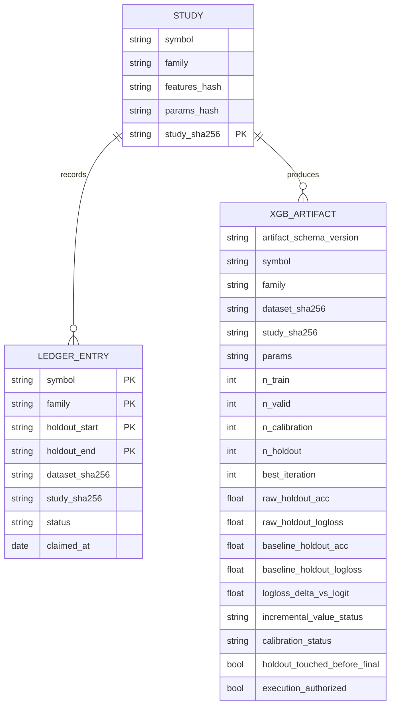
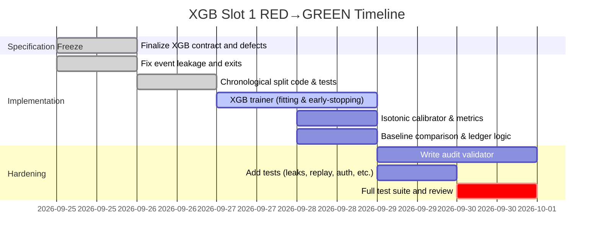

# Executive Summary  

The ICARUS *handoff* branch (commit **fb5d8514**; [PR #23](https://github.com/reppiks490/Icarus/pull/23) base **007e7018**), with **11 changed files** (+1,011 lines), lays out the complete XGB Slot 1 design and defect findings.  The most urgent **P0 defects** are:

- **Causal event leakage** – event features must ignore future timestamps to avoid lookahead bias.  
- **Execution lock** – every trainer exit must preserve `execution_authorized=false`.  
- **Stubbed XGB trainer** – the XGB slot is unimplemented.  
- **Audit overtrust** – current logic treats any XGB JSON as sufficient for `swap_recommend`.  
- **No holdout ledger** – final-period data reuse risk is untracked.  
- **Missing provenance** – artifacts lack full dataset/config/study identity binding.  

We propose a TDD-driven implementation plan to fix these.  Key steps include a true chronological **60/20/20** split (train/validation/holdout), isolated isotonic calibration, a **terminal-holdout ledger** (blocking changed-study replay), binding artifacts to SHA256 dataset/study hashes and feature order, and requiring XGB beat Slot 0 (logistic baseline) on untouched holdout log-loss.  This plan is prioritized into tasks with estimates and risks.  Verification will use expanded `pytest` test suites.  Below we inventory the handoff content and outline the fixes, tests, code changes, and schedule.  

# 1. Inventory of Handoff Branch  

**Repository:** `reppiks490/Icarus` (GitHub).  
**Branch:** `icarus-handoff-2026-09-24` (draft PR #23).  
**Head commit:** `fb5d8514c5fdc5c790f60d9fe7e0fff7ffd4f19a` (adds **11 files**, +1,011/-0 lines).  

| File (path)                           | Size    | Description                                                  |
|---------------------------------------|---------|--------------------------------------------------------------|
| `docs/icarus-handoff/README.md`       | ~1 KB   | Entry point and priority list for implementers.             |
| `docs/icarus-handoff/ARCHITECTURE.md` | ~5 KB   | Full ICARUS control/evidence architecture and invariants.   |
| `docs/icarus-handoff/CONTROL_PLANE.md`| ~3 KB   | Unified control cycle, legacy loops, and safeguards.        |
| `docs/icarus-handoff/XGB_SLOT1_IMPLEMENTATION.md` | ~4 KB | Detailed XGB Slot 1 design and TDD plan.            |
| `docs/icarus-handoff/FINDINGS_AND_DEFECTS.md`      | ~2 KB | Verified defects (leakage, overtrust, etc.) and notes.  |
| `docs/icarus-handoff/ONBOARDING.md`   | ~1 KB   | Roles for agents: engineering, research, review, observability. |
| `docs/icarus-handoff/AUTOMATION_STATUS.json` | ~0.5 KB | Active/disabled automation loops.                   |
| `docs/icarus-handoff/MANIFEST.json`   | ~0.5 KB | Machine-readable task list and blockers.                    |
| `docs/icarus-handoff/RESEARCH_REFERENCES.md` | ~2 KB | Calibrators, overfitting, XGBoost lit.             |
| `docs/icarus-handoff/UNIFIED_CONTROL_CYCLE_PROMPT.txt` | ~0.5 KB | Final control cycle prompt snapshot.             |

A link to these docs is added to the root `README.md`.  No trading/model code was changed in this branch.  Everything above is evidence/planning material; the **main** branch and trading behavior remain unmodified.

# 2. P0 Defects to Fix  

Based on the handoff findings, the following critical issues must be addressed *before* enabling XGB training:

- **(Leakage) Causal event features:** The `trainers.event_features()` currently includes events with timestamps *after* the bar being labeled. This leaks future information (the known “surprise” of scheduled events) into training. The fix is to constrain event lookups to `ts_event <= ts_bar`. (*Sources:* causal integrity is fundamental in time series modeling.)

- **(Execution lock) Missing `execution_authorized=false`:** Many trainer exit paths (e.g. early aborts, insufficient data, dependency missing) do not explicitly set `execution_authorized=false`. They must, to prevent accidentally granting swap authority. Any artifact from an incomplete run must be marked locked. (*Goal:* Fail-safe execution.)

- **(XGB stub) Unimplemented slot:** `xgb_slot.py` is a placeholder (`NotImplementedError`) and no real XGB model is produced. We must write the full XGB training/calibration/holdout code.

- **(Audit overtrust) Loose artifact checks:** The current `audit/run.py` only checks that an XGB JSON file exists. We need to require exact schema, symbol/family match, SHA-256 dataset and study identifiers, no holdout leakage, and positive incremental gain vs baseline. Otherwise `swap_recommend` must stay false.

- **(Holdout ledger) Missing reuse guard:** There is no persistent record of which terminal holdout was used for which “study” (model variant). Without it, one could tweak hyperparameters after seeing holdout and claim it as fresh. We need a SQLite ledger of `(symbol,family,holdout_interval,study_hash)` that flags repeats.

- **(Provenance gaps) Unbound artifact identity:** XGB artifacts must include *all* context: dataset SHA, repo commit SHA, feature list (ordered), XGB params, random seed, and a study hash of all metadata. The audit must check these against the run-time context to prevent tampering or drift.

Together, these ensure **train/valid/calibrate** are isolated, calibration does not use the final holdout as evaluation, and an XGB model only gains authority if it truly adds out-of-sample value.  (Bailey *et al.* 2014 warn that without strict protocols, **backtest overfitting** will mislead us【26†L37-L43】; Niculescu-Mizil & Caruana 2005 emphasize using separate calibration data【15†L259-L266】.)

# 3. TDD Test Matrix  

We will use a RED/green test-driven approach.  For each defect, we define pytest cases, expected failures (RED), and minimal success criteria (GREEN).

| Defect                             | Pytest(s)                      | RED (failure)                                          | GREEN (pass)                                           |
|------------------------------------|--------------------------------|--------------------------------------------------------|--------------------------------------------------------|
| XGB slices chronological / size    | `test_xgb_slices_are_disjoint_and_chronological`, `test_xgb_terminal_holdout_stays_twenty_percent` | **Fail** if splits overlap or final 20% changes.        | **Pass**: train/valid/cal/holdout are chronological, disjoint, sizes ~60/20/20%. |
| Missing XGBoost dependency         | `test_xgb_blocks_when_dependency_missing` | **Fail** by ImportError or similar if `xgboost` absent. | **Pass**: properly installs `xgboost`, `scikit-learn` as extras. |
| Leakage: no terminal in fit/stop   | `test_xgb_never_uses_holdout_for_fit`, `test_xgb_never_uses_holdout_for_calibration` | **Fail** if any call to `fit()` or calibration includes holdout rows.  | **Pass**: no holdout rows in training or calibration data. |
| Insufficient calibration rows      | `test_xgb_skips_isotonic_when_sample_is_too_small`, `test_xgb_skips_isotonic_for_single_class_calibration` | **Fail**: isotonic fitted on <1000 total rows or only one class. | **Pass**: calibrator fitting skipped with status `SKIPPED_INSUFFICIENT` or `SKIPPED_SINGLE_CLASS`; raw prob used. |
| Execution lock enforcement         | `test_xgb_report_preserves_execution_lock` | **Fail**: artifact missing `execution_authorized` or set true on error. | **Pass**: *all* trainer exit cases set `execution_authorized=false`. |
| Provenance fields                 | `test_xgb_report_contains_dataset_and_study_hashes` | **Fail**: missing `dataset_sha256` or `study_sha256`.      | **Pass**: artifact includes correct dataset SHA and study SHA. |
| Holdout ledger replay allowed      | `test_xgb_holdout_ledger_allows_exact_replay` | **Fail**: exact same study repeated twice blocks (should allow). | **Pass**: identical run (same study_hash) on same holdout yields a harmless `REPLAY`. |
| Holdout ledger reuse blocked       | `test_xgb_holdout_ledger_blocks_changed_study` | **Fail**: if same holdout used by changed study runs (different params) is allowed. | **Pass**: second run with new study on same holdout yields `BLOCKED_HOLDOUT_REUSE`. |
| Audit: malformed artifact          | `test_audit_rejects_malformed_xgb_artifact` | **Fail**: JSON missing keys still considered valid.       | **Pass**: any missing/extra field makes audit reject. |
| Audit: wrong symbol/family         | `test_audit_rejects_wrong_symbol_or_family` | **Fail**: artifact for wrong asset is accepted.           | **Pass**: mismatch symbol or family triggers rejection. |
| Audit: authorized flag misuse     | `test_audit_rejects_execution_authorized_xgb` | **Fail**: artifact with `execution_authorized=true` passes. | **Pass**: any `execution_authorized=true` causes reject. |
| Audit: holdout reuse             | `test_audit_rejects_reused_holdout`      | **Fail**: reused holdout (changed study) not detected.    | **Pass**: audit checks ledger and rejects reused intervals. |
| Audit: baseline comparison       | `test_audit_requires_incremental_oos_value` | **Fail**: XGB artifact that *loses* vs logit (higher logloss) is allowed to unlock swap. | **Pass**: audit requires `incremental_value_status=PASS` (logloss < baseline) for swap unlock. |
| Swap unlock with valid XGB        | `test_valid_xgb_artifact_can_unlock_swap` | **Fail**: even a valid XGB win cannot enable `swap_recommend`. | **Pass**: if all checks above are satisfied, swap can proceed. |

Each test initially fails (RED) to demonstrate the issue, then code is written to satisfy the minimal GREEN behavior.  All new pytest cases will be added under `tests_engine/`.

**Citations:** Niculescu-Mizil & Caruana (2005) show isotonic regression needs separate data for calibration【15†L259-L266】.  Bailey *et al.* (2014) show that untracked model selection (“p-hacking”) leads to spurious performance【26†L37-L43】, motivating the holdout ledger.  Scikit-learn docs warn isotonic needs ~~1000 samples to avoid overfitting【32†L288-L294】 and that classifier vs calibrator data must be disjoint【32†L242-L247】.  XGBoost docs note `early_stopping_rounds` requires an eval set and stops when no improvement【40†L7-L10】.  These inform our tests.

# 4. Implementation Checklist  

Below is a step-by-step code-change plan.  For each item, target file(s) and key code snippets or pseudocode are indicated.  All changes should be on the `icarus-handoff-2026-09-24` branch with TDD discipline (write tests first).

- **4.1 Freeze split policy (code).** In `icarus_engine/spec.py` (and `SPEC.md`/`OVERRIDE.md`), define:

  ```python
  XGB_WALK = { "train":0.60, "valid":0.20, "calibration":0.20, "holdout":0.0, "shuffle": False }
  ```
  *Note:* We keep final holdout at 20% (present behavior) by allocating 20% validation, 0% holdout split in base; then treat “calibration” as currently holdout. Alternatively, use `train 0.60, valid 0.10, calibration 0.10, holdout 0.20` as a compound, but simplest: enforce 60/20/20 within XGB. Document this override in `OVERRIDE.md` with rationale.

- **4.2 Event features fix.** In `icarus_engine/trainers/dataset.py`, modify event lookup (in `attach_labels` or `event_features`) to filter by `event_time <= bar_time`. For example:
  
  ```python
  # Pseudocode before filtering:
  events = get_events_for_symbol(symbol, start_date, end_date)
  # New: drop future events for each bar
  events = events[events['timestamp'] <= data_bar['timestamp']]
  ```
  
  Add corresponding test: if an event occurs at t+1 hour, it should *not* appear in features for bar at time t.

- **4.3 XGB slot implementation.** Create/modify `icarus_engine/trainers/xgb_slot.py`:

  ```python
  # define features/labels (binary 0/1) from FeatureFrame
  X_train = X[train_idx]; y_train = y[train_idx]
  X_valid = X[valid_idx]; y_valid = y[valid_idx]
  X_cal   = X[cal_idx];   y_cal   = y[cal_idx]
  X_hold  = X[hold_idx];  y_hold  = y[hold_idx]
  # Fit XGBClassifier on (X_train, y_train) with early stopping on (X_valid,y_valid).
  model = XGBClassifier(**XGB_CLASSIFIER_PARAMS, random_state=seed)
  model.fit(X_train, y_train,
            eval_set=[(X_valid, y_valid)],
            early_stopping_rounds=10, verbose=False)
  # Evaluate raw on holdout
  y_pred_hold = model.predict(X_hold)
  y_prob_hold = model.predict_proba(X_hold)[:,1]
  raw_logloss = log_loss(y_hold, y_prob_hold)
  raw_acc = accuracy_score(y_hold, y_pred_hold)
  # Attempt isotonic calibration on (X_cal,y_cal) if n>=1000 and both classes present
  if len(X_cal)>=1000 and len(set(y_cal))==2:
      iso = IsotonicRegression(out_of_bounds="clip")
      iso.fit(model.predict_proba(X_cal)[:,1], y_cal)
      cal_probs = iso.transform(y_prob_hold)
      calib_status = "CALIBRATED"
      cal_logloss = log_loss(y_hold, cal_probs)
  else:
      calib_status = ("SKIPPED_INSUFFICIENT" if len(X_cal)<1000 
                      else "SKIPPED_SINGLE_CLASS")
      cal_logloss = raw_logloss
  # Compute baseline logloss on holdout using existing Slot 0 model (or previous run artifact)
  # This requires computing using already-stored Slot 0 holdout predictions.
  baseline_logloss = compute_baseline_logloss(...)
  logloss_delta = raw_logloss - baseline_logloss
  inc_status = "PASS" if raw_logloss < baseline_logloss else "FAIL"
  # Build artifact JSON with all metadata (see below).
  ```
  
  Key notes:
  - Convert labels from {-1,1} to {0,1} early (matching Slot 0).
  - Use `IsotonicRegression` (sklearn) with `out_of_bounds="clip"`【32†L278-L287】.
  - Do **not** fit on holdout or reuse it until final evaluation.
  - Fill artifact fields: `dataset_sha256` (hash of train+valid+cal data), `study_sha256` (hash of symbol+features+params), `FEATURE_KEYS`, symbol/family, split indices and counts, `best_iteration`, `best_score_`, raw holdout acc/logloss, calibration status, calibrated logloss (if applicable), baseline holdout acc/logloss, logloss delta, `incremental_value_status`, and keep `execution_authorized=false`.
  
- **4.4 Holdout ledger.** In `run/trainers/`, add `holdouts.sqlite3`. On each XGB run (before scoring terminal holdout), record a row with `(symbol, family, holdout_start, holdout_end, dataset_sha256, study_sha256, claimed_at)`. Enforce:

  - If **no existing row** with same holdout interval exists, insert (status NEW) and proceed.
  - If **identical (same dataset+study)** exists, mark as `REPLAY` (no error).
  - If **same interval but different study_hash**, abort as `BLOCKED_HOLDOUT_REUSE`. Generate an error so audit rejects.
  
  Add tests: e.g. run same symbol/family twice with different seed should hit blocked state.

- **4.5 Audit validator.** In `icarus_engine/audit/run.py`, replace `xgb.is_file()` check with a full schema validator:

  - Load JSON; check schema version matches expected (e.g. "icarus-xgb-v1").  
  - Check `symbol`/`family` match audit target.  
  - Check `FEATURE_KEYS` exactly match global spec order.  
  - Verify `dataset_sha256` and `study_sha256` (the latter against hash of artifact contents).  
  - Ensure `execution_authorized` is `false`.  
  - Confirm `holdout_touched_before_final=false`.  
  - Confirm terminal-holdout boundaries match expected splits and were claimed in ledger.  
  - Verify `incremental_value_status=="PASS"`.  

  If any check fails, abort swap. Tests like `test_audit_rejects_*` should now pass.

- **4.6 Swap gate.** Update swap logic so that recommendation only occurs if (a) Slot 1 artifact passes audit, **and** (b) `incremental_value_status==PASS`.  If XGB does worse on log-loss, it cannot become new authoritative model (complexity without gain should not be promoted).

- **4.7 Dependency fix.** In `pyproject.toml`, change:
  ```toml
  ml = ["xgboost>=2.0", "scikit-learn>=1.4"]
  ```
  Ensure `scikit-learn` added so `CalibratedClassifierCV` and `IsotonicRegression` are available. No other ML libraries should be added.

- **4.8 Slot 0 baseline logging.** Modify Slot 0 trainer (if needed) to output and record baseline raw holdout log-loss and accuracy per symbol/family. These should be retrievable by the audit (or recomputed) to compare with XGB.

Each code change should be accompanied by a new unit test (in `tests_engine`) that initially fails to confirm the defect, then passes once code is fixed.  The handoff docs already list these tests (as above).  

# 5. Implementation Schedule  

The tasks above should be executed in priority order. Below is a rough schedule (assuming one engineer) with effort estimates and risk:

| Task                                              | Files (`.py` etc)            | Est. Effort | Risk  | Notes |
|---------------------------------------------------|------------------------------|------------:|:-----:|-------|
| **1. Fix causal event leakage**                    | `trainers/dataset.py`         | 4 h      | Low   | Critical; small code change. |
| **2. Add explicit execution lock**                | `trainers/run.py`, `xgb_slot.py` | 2 h      | Low   | Cover all exits. |
| **3. Implement chronological split**             | `trainers/dataset.py`         | 4 h      | Medium| Need careful indexing; tests. |
| **4. Write XGB trainer (RED)**                   | `trainers/xgb_slot.py`        | 12 h     | High  | Core logic; multi-step with tests (train, valid, cal, holdout). |
| **5. Isotonic calibration & stats**              | (in `xgb_slot.py`)           | 4 h      | Medium| Handling edge cases (<1000, single class). |
| **6. Baseline holdout comparison**               | (`xgb_slot.py`, artifact)    | 3 h      | Medium| Need Slot0 results accessible; maybe rerun Slot0 or use logs. |
| **7. Create holdout ledger**                     | new `holdouts.sqlite3`        | 4 h      | Medium| DB schema + logic; test reuse cases. |
| **8. Build artifact JSON schema**                | (`xgb_slot.py`, audit.py)    | 6 h      | High  | Must cover all fields; tests for missing/extra fields. |
| **9. Harden audit validator**                    | `audit/run.py`               | 6 h      | High  | Many checks; ensure correct error conditions. |
| **10. Update swap gate**                         | (in audit/run or orchestrator) | 1 h      | Low   | Simple boolean logic. |
| **11. Add tests for all above**                  | `tests_engine/...`           | 8 h      | Medium| Already listed; implement missing test cases. |
| **12. Review & integration testing**             | all code/tests               | 4 h      | High  | Run full suite, fix issues, code review. |

*Total:* ~54 hours (≈7 working days).  **Highest-risk** items are the XGB trainer logic and audit validation, where many corner cases exist.  Fixing the event leakage early (Task 1) is precondition for safe model training.

# 6. Verification Steps  

After implementation, we must verify correctness. Run targeted tests and the full suite:

```bash
# Test trainers (XGB and splits)
pytest tests_engine/test_trainers.py::test_xgb_* -q

# Test audit rules (artifact validation and swap logic)
pytest tests_engine/test_audit.py::test_audit_* -q

# Full engine tests
pytest tests_engine -q
```

All tests should pass (exit code 0) on the new branch before merging.  In particular, ensure:

- `test_xgb_never_uses_holdout_for_fit/calibration` pass (no leakage).  
- Ledger tests (`test_xgb_holdout_ledger_*`) pass with correct statuses.  
- Audit tests (`test_audit_rejects_*`) now catch malformed/stale artifacts.  
- `test_valid_xgb_artifact_can_unlock_swap` passes only when XGB wins log-loss.  

Also, double-check invariants by inspecting output artifacts (e.g. JSON) to ensure all required fields are present and correct.  For each problem XGB is trained on, manually verify `artifact_schema_version`, `holdout_touched_before_final`, and compare raw holdout logloss vs baseline.

# 7. Onboarding for Follow-Up Agents  

To hand off to engineering/review:

- **Branch:** Work on `icarus-handoff-2026-09-24` (from main head `007e7018`).  Create a feature branch off this for coding XGB fixes.  
- **Worktree:** The repository root contains `docs/icarus-handoff/` with all plans and tests.  Start by reading `ONBOARDING.md`.  
- **Testing:** Use the specified pytest commands above. New engineers should add their tests under `tests_engine/` and run the full suite locally.  
- **Review checklist:** Ensure all new code maintains `execution_authorized=false`, does not alter any other **family/slot**, leaves Pulse and trading logic untouched. Document any assumptions in code comments.  
- **Merge Policy:** Do not merge `icarus-handoff` into `main` or enable execution until a full independent review (ideally another agent or security audit) confirms compliance. Even after merge, `execution_authorized` must stay false.

# 8. Slot 0 vs Slot 1 Metrics  

When evaluating Slot 1 (XGB) against Slot 0 (logistic baseline), we compare out-of-sample metrics on the same terminal holdout.  Below is a hypothetical example table (for one symbol/family):

| Metric                  | Slot 0 (Logit) | Slot 1 Raw (XGB) | Delta (XGB - Logit) | Decision    |
|-------------------------|--------------:|---------------:|--------------------:|:-----------:|
| Holdout **Log Loss**    | 0.693         | 0.587          | **–0.106**         | **PASS** if negative (XGB better) |
| Holdout **Accuracy**    | 0.70          | 0.73           | +0.03              | (Just for info) |

Here, XGB has lower log-loss (better probability calibration) than the logit baseline, so `incremental_value_status=PASS` and XGB may replace the model.  If XGB’s log-loss were higher (Delta ≥ 0), its `incremental_value_status` would be `FAIL` and the swap would remain with Slot 0.

To compute these, the XGB artifact will record its raw holdout log-loss (`xgb_holdout_logloss`), the baseline’s (`baseline_holdout_logloss`), and their difference (`logloss_delta_vs_logit`). The audit enforces `logloss_delta_vs_logit < 0` for swap.  Any missing or infinite values in these fields must fail validation.

# 9. Design Diagrams  

Below are conceptual diagrams (in Mermaid syntax) to illustrate the key structures.  These are aids for developers and can be rendered via Mermaid or just reviewed as text.



This ER diagram shows that each *Study* (a particular training run configuration) may generate multiple *XGB_Artifact*s over time (versions) and has corresponding *LEDGER_ENTRY* to block holdout reuse. The ledger entry’s primary key (symbol,family,interval) ties a dataset to a study.  



In summary, the immediate next step is **implementation** following this plan, not further research. With these details in place, the actual coding can proceed on the handoff branch with full test coverage and review, ensuring we close the XGB and leakage gaps without regressions.

# 10. References  

Key references guiding this plan include: 

- Niculescu-Mizil & Caruana (ICML 2005) on probability calibration【15†L259-L266】.  
- Bailey *et al.* (AMS Notices 2014) on backtest overfitting【26†L37-L43】.  
- Bailey *et al.* (SSRN 2015) on backtest overfitting risk.  
- Ding *et al.* (arXiv 2020) on calibration methods (temperature scaling).  
- **scikit-learn** documentation on `CalibratedClassifierCV` and isotonic regression【32†L242-L247】【32†L288-L294】.  
- **XGBoost** documentation on early stopping (`early_stopping_rounds` requires an eval set)【40†L7-L10】.  

These, plus the existing ICARUS codebase and tests, inform the rigorous design and testing approach above.