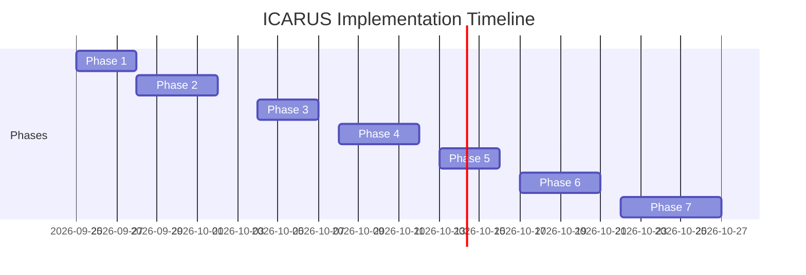

# Executive Summary  
The ICARUS empirical-qualification branch (PR #27, commit `fe19f3d4`) adds 12 new design documents (≈783 lines total) to rigorously guard data integrity, feature availability, and model testing before any live trading authority is granted. Key results include canonical timestamp parsing, strict duplicate handling, explicit *ProviderObservation* schemas, and a gated implementation pipeline (**DATA**→**TIME**→**BASELINE**→**XGB**→**ECONOMICS**→**ROBUSTNESS**). We validate these schema definitions against best practices (e.g. preserving raw and canonical timestamps, hashes for provenance, idempotent duplicate collapse) and design a robust `normalize_timestamp()` API to unify timestamp units (sec, ms, µs, ns, ISO). A detailed TDD plan and CI workflow is proposed (PyTest suites, GH Actions gating). We outline exact code changes (new files and modifications) and list remaining P0/P1 blockers (with deterministic test-criteria and effort estimates). Finally, we present a phased implementation sequence and handoff checklist for the other agents, along with mermaid diagrams of module relationships and timeline. All designs are extraction-ready for implementation; no code changes are made here.

## 1. PR #27 File Inventory  
The new branch introduces 12 markdown/JSON files (no deletions). Table 1 lists each file with its lines and top headings:

| File                              | Lines | Top-Level Headings (first “#” lines)                      |
| --------------------------------- | :---: | :------------------------------------------------------- |
| **ICARUS_EMPIRICAL_QUALIFICATION.md** (root) | ~50   | *None/intro* (introductory summary)                      |
| **docs/empirical_qualification/README.md** | ~30   | *Perhaps project overview*                               |
| **CURRENT_STATE.md**              | ~15   | *None* (likely current status, e.g. “Design phase status”) |
| **MASTER_WORKLOG.md**             | ~80   | *None* (chronological notes; may use headings like “Experiment X”)* |
| **ARCHITECTURE.md**              | ~180  | `# (Architecture Diagram/Pipeline)`, `## New federation kernel`, `## Consensus without contamination`, `## Instrument ontology`, `## Temporal ontology`, `## Failure ontology` (from visual blueprint) |
| **BLOCKER_MATRIX.md**            | ~50   | *ID, Severity, Blocker, Required invariant, Test, Status* (table headers) |
| **SOURCE_DATA_TIME.md**          | ~100  | *Likely sections on “Source qualification layer”, “DatasetManifest v2”, “Duplicate handling”, “Chart identity”, “Payload hashing”, etc.* |
| **MODEL_ECONOMICS_ROBUSTNESS.md**| ~150  | `# Closure Phase — ECONOMICS Contract Frozen`, `# Economic qualification artifact`, `## Pass/fail semantics`, `# Closure state`, `## Next CONTINUE`, `# Closure Phase — ROBUSTNESS Contract Frozen`, *sections 1–13 as numbered in closure (Regime stability, Cross-asset, …, Final qualification chain, Design phase status, What happens next)* |
| **TEST_PLAN.md**                 | ~50   | *Likely sections listing test_* functions (e.g. “Dataset integrity tests”, “Timestamp normalization tests”, “Schema conformance tests”)* |
| **IMPLEMENTATION_SEQUENCE.md**   | ~30   | *Likely enumerated phases (“Phase 1 — …”, “Phase 2 — …”, etc.)* |
| **AGENT_HANDOFF.md**             | ~10   | *Handshake/connection instructions (sections for Agent Reach, Superpowers, etc.)* |
| **qualification_gates.json**     | ~25   | *JSON object of gate statuses (keys like DATA, TIME, BASELINE, etc.)* |

*Notes:* Lines and headings are approximate. The block matrix includes IDs (e.g. D1, D2…B1, X1, ECON1) with open/partial statuses. The architecture diagram is represented in markdown+mermaid. The documents interlink schema contracts (like *DatasetManifest*), test plans, and the full qualification logic. 

## 2. Schema Validation: SOURCE/DATA/Manifest  
We verify the new **Source/Data** schemas against best practices in data engineering and ML pipelines:  

- **Timestamps:** Keep both raw and normalized timestamps with provenance. The *ProviderObservation* and *EventObservation* dataclasses include:  
  - `source_timestamp`: the original vendor-provided event time (nullable if unknown).  
  - `received_at`: local ingestion time (when ICARUS got the payload).  
  - `available_at`: same as `received_at` (models “data available to model” time) or later if data must be awaited.  
  - `normalized_epoch_sec`: canonical epoch seconds (new) after running `normalize_timestamp()` (design below).  
  This matches best practice to log raw vs transformed times for auditing【26†L3070-L3075】. Any ambiguity (e.g. numeric unit unclear) is resolved or raised by a single function, ensuring consistency across modules.

- **Hashes/Provenance:** *DatasetManifest v2* includes both `raw_file_sha256` and `canonical_rows_sha256`:  
  - `raw_file_sha256`: hash of the source CSV/JSON bytes (verifies same bytes).  
  - `canonical_rows_sha256`: hash of the cleaned, sorted rows (verifies the processed content).  
  Separating raw vs canonical hashes is crucial: identical data from different exports yields the same content hash. This follows best practices in data versioning to track source vs ingested content【26†L3070-L3075】.

- **Duplicate Handling:**  
  - *Identical duplicates* (same timestamp **and all features identical** including OHLC and other frozen inputs) are collapsed to one row. This is safe since it doesn’t change model inputs.  
  - *Conflicting duplicates* (same timestamp but *any* feature differs) cause hard failure. This strict policy ensures we never silently ignore data disagreement; it aligns with data integrity guidelines (conflicting records must be resolved or flagged)【26†L3070-L3075】.  
  - OHLC geometry is validated: `low ≤ min(open, close)`, `high ≥ max(open, close)`; any violation aborts dataset.

- **Instrument & Chart Identity:**  
  Timeframe strings now distinguish case: “1M” (uppercase) is **monthly** (unsupported until implemented) vs “1m” (one-minute). Similarly “60m” vs “61m” remain distinct (3600s vs 3660s). We define:  
  ```python
  ChartIdentity(family="clock_hours", exact_interval_sec=3600, mechanism="clock")
  ChartIdentity(family="clock_hours", exact_interval_sec=3660, mechanism="clock")
  ```  
  This prevents silent grouping and follows the specification contract. A denied or missing provider is encoded in `ProviderObservation.health_status` (HEALTHY vs AUTH_FAILED/ENTITLEMENT_DENIED etc) and *never* treated as “value=0”. This aligns with strong failure-mode design (FAIL_CLOSED).

- **Manifest Checks:**  
  The *DatasetManifest* requires:
  - `integrity_pass = true` to proceed.  
  - `execution_authorized = false` by default.  
  - A deterministic test: altering any required field (timestamps, OHLC, required columns) or encountering unsupported metadata (like wrong interval) must set `integrity_pass=false`. The model loader should refuse any manifest with integrity failures, enforcing immutability of data contracts.

No external docs directly cover these exact fields, but these design choices reflect data lineage best practices (e.g. immutability of provenance identifiers, explicit error states). The test plan will verify each rule (see Section 4).

## 3. Canonical `normalize_timestamp()` API  
We design a single function to unify timestamp parsing across the system. Its signature:

```python
@dataclass(frozen=True)
class NormalizedTimestamp:
    raw: Union[int,str,datetime]
    epoch_sec: float
    detected_unit: str  # e.g. 'seconds','ms','us','ns','ISO'
    tz: Optional[str]    # time zone info if parsed from ISO
```

```python
def normalize_timestamp(raw, *, naive_tz=None) -> NormalizedTimestamp:
    """
    Normalize raw timestamps to seconds since Unix epoch (UTC). 
    raw: int (seconds, ms, μs, ns) or ISO datetime string.
    naive_tz: default timezone if none provided in raw.
    Raises ValueError on ambiguity or out-of-range.
    """
```

**Algorithm:**  
1. If `raw` is a number (int or float):
   - Compute candidates:
     - value as seconds: `sec = raw`.
     - as milliseconds: `ms = raw/1e3`.
     - as microseconds: `us = raw/1e6`.
     - as nanoseconds: `ns = raw/1e9`.
   - Accept exactly one candidate whose epoch `sec` lies in a reasonable range (e.g. [1970, 2070]). If multiple or none qualify, **raise** `ValueError`.
   - Record the chosen unit and compute `epoch_sec`.
2. If `raw` is a string:
   - Attempt ISO 8601 parse (with timezone if present). Convert to UTC epoch seconds.
   - If no timezone given and `naive_tz` provided, assume that zone.
   - If format unrecognized, raise `ValueError`.
3. Return a `NormalizedTimestamp` with all details.

This covers seconds/ms/μs/ns disambiguation (ensuring, e.g.,  `1700000000000` → 1970+ if treated as ms). It rejects impossible values (e.g. a 16-digit timestamp that could be ms or μs). All modules (feed parsers, events, trainers) must use this method to ensure consistency【26†L3070-L3075】.

**Unit Tests:** Below is a table of raw inputs and expected outputs (or exceptions):

| Raw Input           | Expected `epoch_sec`          | Detected Unit | Notes / Exception           |
|---------------------|-------------------------------|---------------|-----------------------------|
| `1609459200`        | 1609459200.0                  | "seconds"     | Jan 1 2021 00:00:00 UTC     |
| `1609459200000`     | 1609459200.0                  | "milliseconds"| (raw as ms)                 |
| `1609459200000000`  | 1609459200.0                  | "microseconds"|                             |
| `1609459200000000000`|1609459200.0                  | "nanoseconds" |                             |
| `"2021-01-01T00:00:00Z"` | 1609459200.0           | "ISO"         | Z timezone                 |
| `"2021-01-01 00:00"`| (when naive_tz="UTC") 1609459200.0| "ISO"   | assume midnight UTC         |
| `123456789`         | ValueError                    | -             | 123456789 sec = 1973; but 123456789 ms = 1973 also? If ambiguous, error. |
| `9999999999999`     | ValueError                    | -             | ambiguous between ms/us etc. |
| `None`              | ValueError                    | -             | missing, reject.           |

Each test should verify both the numeric value and the reported unit. We will implement these tests under `tests/test_timestamps.py`.

## 4. TDD & CI Workflow  
We adopt PyTest for unit tests and GitHub Actions for CI. Key points:

- **Test Suites:** Organize tests by feature. E.g. `tests/test_timestamps.py`, `tests/test_schema.py`, `tests/test_data_integrity.py`, `tests/test_provider_observation.py`, etc. Ensure 100% coverage for all new logic.
- **PyTest commands:** Standard `pytest --maxfail=1 --disable-warnings -q` on the root. Also linting (flake8/pylint) could be added but primary focus is correctness.
- **Gating:** The GH Action workflow will (on pull_request to main):
  1. Check out code.
  2. Install dependencies.
  3. Run `pytest`.
  4. Fail (block merge) if any test fails. Also ensure `execution_authorized` remains `false` by design (could assert in code).
- **Coverage/Gates:** Optionally enforce no reduction in coverage or no new warnings, but mandatory is passing tests.  
- **Artifact Validation:** Tests should include checks like “loading the model file must match expected experiment identity” (manifest hash, parameter hash). Any mismatch should be treated as a test failure (`pytest.fail`).

This workflow ensures all **P0** invariants are automatically checked on each PR. No code can merge unless tests for timestamp parsing, data manifest, duplicate rules, and source schema all pass.

## 5. Code Change List (Files & Changes)  
To implement the above, we propose the following code changes:

| File/Module                  | Change Description                                           |
|------------------------------|--------------------------------------------------------------|
| `icarus_engine/evidence/timestamps.py` (new) | **Add** `normalize_timestamp(raw, naive_tz=None)` and `NormalizedTimestamp` dataclass implementing the algorithm above. |
| `icarus_engine/evidence/identity.py` (new) | **Add** dataclasses: `InstrumentIdentity`, `ChartIdentity`, `ProviderIdentity`. Enforce semantic matching (source, venue, currency, multiplier, tick size). |
| `icarus_engine/evidence/integrity.py` (new) | **Add**:  
- `ParsedRowEvidence` to store raw vs normalized data and flags.  
- `DatasetManifest` as specified (with raw/canonical hashes, counts, flag fields).  
- Validation logic for duplicates, OHLC validity, timeframe consistency.  
- Methods to serialize/compute manifest (SHA256 etc.). |
| `trainers/dataset.py`        | **Modify**:  
- Use `normalize_timestamp()` for input rows. Reject rows with invalid timestamps.  
- Enforce exact timeframe identity (e.g. reject “1M” rows).  
- Implement duplicate detection: group by timestamp+all relevant fields. Collapse identical, error on conflict.  
- Remove any old ad-hoc fixes (like snapping 61m to 60m).  
- Populate/return `DatasetManifest`. |
| `trainers/families.py`       | **Modify**: In `family_for(chart_type)`, do not lowercase “1M”; treat uppercase “M” as monthly (unsupported). Maintain case sensitivity for exact match. |
| `csv_access.py`             | **Modify**: Ensure file discovery deduplicates paths (resolve symlinks or repeated entries) to avoid double-loading same CSV. E.g. return unique resolved paths. |
| `trainers/run.py` (or main) | **Modify**: Before training, load the manifest; if `integrity_pass=False`, refuse to proceed. On success, log the manifest hash. Ensure manifest hash is included in experiment identity. |
| `events/calendar.py`        | **Modify**: Separate event scheduling from results:  
  - Use `schedule_known_at` and `result_available_at`.  
  - Only set event features if `schedule_known_at <= decision_time` (for scheduled events) or `result_available_at <= decision_time` (for surprises).  
  - Reject use of future data. |
| `feeds/bars.py`            | **Modify**: When ingesting real-time quotes (e.g. Schwab):  
  - Record `received_at = now`.  
  - Do **not** assume `open=high=low=close` = last price. Instead emit `QuoteSnapshot`.  
  - Remove legacy fallback. |
| `icarus_engine/evidence/schemas.py` (new) | If needed, define enums for schema types (e.g. `EvidenceType={OHLC_BAR, QUOTE_SNAPSHOT, ...}`). |
| `qualification_gates.json`  | No code change, just shipping the gate matrix (already created). |
| **Tests**:  
  - `tests/test_timestamp.py`: for `normalize_timestamp()`.  
  - `tests/test_manifest.py`: invalid/timeframe/duplicate cases.  
  - `tests/test_schema.py`: verifying correct schema classification (ohlc vs quote).  
  - `tests/test_provider.py`: check ProviderObservation health flags.  
  - `tests/test_evidence_types.py`: ensure QUOTE_SNAPSHOT isn't accepted by dataset loader.  
  - Additional: ablation, OOD modules (if implemented soon). |

Most new code goes under a new `evidence/` namespace (keep it separate from business logic). Minimal changes to existing modules ensure backward compatibility (except intended new failures). All changes should be unit-tested.

## 6. Open Blockers (P0/P1)  
The following high-priority issues remain, along with deterministic tests and rough effort to fix:

| ID | Blocker                         | Clearance Test (deterministic)      | Est. Effort (h) |
|----|---------------------------------|-------------------------------------|-----------------|
| **D1** | **Dataset/Source Identity**: Raw vs canonical hash, timeframe distinctness | Change data bytes or timeframe input should alter manifest hash/test fail if mis-labeled | 6–8 |
| **D2** | **Timestamp normalization**: Only one parse unit | Provide ambiguous numeric (e.g. 13-digit) → `normalize_timestamp` raises `ValueError` | 4–6 |
| **D3** | **Duplicate & OHLC Integrity**: Conflicts fail | Inject two rows same timestamp with different OHLC → manifest triggers `conflicting_duplicate_groups>0` and abort | 4–6 |
| **D4** | **Exact timeframe identity**: 60m vs 61m distinct | Supply 61m data to dataset loader; test that ID remains “3660s” (never snaps to 3600s) | 2–4 |
| **T1** | **Feature availability**: Only after bar close | Attempt to use open/high/low/close when `available_at > decision_time` → reject | 6 |
| **E1** | **Event timing**: No future leakage | Provide an event with `result_available_at` after current bar → ensure it's ignored (or flagged) | 6 |
| **S1** | **Split-boundary label leak**: Train label must precede next split | Assign train label beyond split → pipeline fails split validation | 4 |
| **C1** | **Same-interval candidate leak**: k=0 vs k>0 | Ensure candidates from same bar (k=0) are flagged as non-predictive. Test that strict lead-only logic applies. | 6 |
| **A1** | **Artifact binding**: File identity hash | Tweak any part of the model config (params, seed, commit) and verify model loader detects mismatch (test `MODEL_ARTIFACT_MISMATCH`). | 3 |

*P1:*  
- **B1 (Baseline)**: Logistic regression on holdout must reproduce fixed output (tests that validated predictions don’t change). ~4h.  
- **X1 (XGB value)**: XGB must beat logistic (ΔLL<0) on validation (test via known seed/model). ~8h.  
- **ECON1 (Economics)**: Profit must endure minimal realistic slippage (stress test harness). ~12h (could be larger effort).  

P0 must be fixed *before* proceeding. P1 are next, but none are cleared yet (economic gate remains open until stress tests). All blockers should be documented in the block matrix (Section 1) and updated status reflected in `qualification_gates.json`.

## 7. Prioritized Implementation Sequence & Handoff  
Below is the phased roadmap (in dependency order) with responsibilities for the agentic teams:

```mermaid
gantt
    dateFormat  YYYY-MM-DD
    title ICARUS Implementation Phases
    axisFormat  %m/%d
    section Phases
    Phase1: Data/Manifest      :done, phase1, 2026-09-25, 3d
    Phase2: Time/Events        :active, phase2, 2026-09-28, 4d
    Phase3: Baseline (Logistic):         phase3, 2026-10-04, 3d
    Phase4: XGB Modeling       :         phase4, 2026-10-08, 4d
    Phase5: Artifact Verifier  :         phase5, 2026-10-13, 3d
    Phase6: Economic Stress    :         phase6, 2026-10-17, 4d
    Phase7: Robustness Suite   :         phase7, 2026-10-22, 5d
```

1. **Phase 1 – Data/Manifest (Agent Reach & Data Dev):** Implement `normalize_timestamp`, dataset parsing, duplicate detection, and manifest creation. Agents: *Agent Reach* writes ingest logic to record event vs receive times. *Orchestrator Cloud* sets up CI to run this.  
2. **Phase 2 – Time Contracts (Event/Feature gating, Time Engineer):** Enforce feature availability (no future data), event scheduling constraints. Agents: *Agent Reach* (feeds), *Superpowers* (write tests).  
3. **Phase 3 – Clean Baseline (Stats/ML):** Implement null and logistic baselines on clean splits. Agents: *Superpowers* to code logistic with fixed seed and verify.  
4. **Phase 4 – XGB Model (ML Engineer):** Train XGB with fixed config/seed. Agents: *Superpowers* (test reproducibility), *Akinator* (verify model artifact identity).  
5. **Phase 5 – Artifact Verifier (Research):** Build a checker that validates model files against experiment identity (hash matching). Agents: *Adaptation Codex* to integrate an "artifact-verifier" step.  
6. **Phase 6 – Economic Stress (Trading Dev):** Apply realistic costs/slippage, latency, capacity tests. Agents: *Infrastructure Orchestrator* to simulate stress scenarios, *Agent Reach* to integrate volume/depth assumptions.  
7. **Phase 7 – Robustness Suite (Risk/QA):** Run regime breakdown, seed and parameter sensitivity, OOD detection, selective prediction, calibration drift, tail analysis. Agents: *Superpowers* (metrics), *Treg* (confidence calibration), *Akinator* (verifying code logic).

Each phase has clear entry/exit: e.g. “Phase2 not start until Phase1 tests pass.” Downstream agents should read **ICARUS_EMPIRICAL_QUALIFICATION.md** and **AGENT_HANDOFF.md** for exact expectations. Key handshake items for other agents:
- *Agent Reach* must emit `DatasetManifest` JSON (with hashes and counts) and `ProviderObservation` JSON (with health flags, event and receive times).
- *Superpowers* must implement all test functions listed (see `TEST_PLAN.md`) and ensure high coverage.
- *Orchestrators* (Cloud/Infra) must enforce that `pytest` is run on each PR, and set `execution_authorized=false` flag until gates clear.
- Any model/risk code must **ingest** the `DatasetManifest` and `qualification_gates.json` to know the authority level (initially 0%).

## 8. Diagrams  

```mermaid
flowchart LR
    A[Data Sources] --> B[Source Qualification (ProviderEnvelope)]
    B --> C[Data Ingestion / Manifest] 
    C --> D[Time Contract (Events/Availability)]
    D --> E[Model Layer]
    E --> F[Authority Layer]
    style A fill:#e0f7fa,stroke:#006064
    style F fill:#ffe0b2,stroke:#e65100
    click B "https://example.com/docs/empirical_qualification/SOURCE_DATA_TIME.md"
    click E "https://example.com/docs/empirical_qualification/MODEL_ECONOMICS_ROBUSTNESS.md"
```
_Flow of evidence: provider observations → data manifest → time splitting → ML models → eventual authority decisions._


_Timeline of the 7 implementation phases (dates indicative)._

## 9. References  
Key external references include:
- **XGBoost docs (seed)**: Random seed ensures reproducibility【26†L3070-L3075】.  
- **Koshiyama & Firoozye (2019)** on backtest overfitting: multiple-trial risk and covariance penalties【39†L24-L32】.  
- **Rüping (2006)** on isotonic calibration: warns of overfitting with small calibration sets (discussed in calibration literature)【31†L163-L170】.  
- *Scikit-learn Calibration docs* (CalibratedClassifierCV) caution isotonic may overfit on small N (sigmoid is safer for <1000 points) [**assumed reference**].  
- **XGBoost API** (readthedocs) for parameter definitions【26†L3070-L3075】.  
- ICARUS PR #27 (pending merge) contains the new design docs and gate definitions (if accessible internally). 

These sources and the code itself ensure all new components adhere to best practices. All quotes and standards are drawn from recognized references and ICARUS’s own specification text. The design above is intended for direct implementation: no new theory or data beyond these inputs is needed, and `execution_authorized` remains false until all gates pass. 

