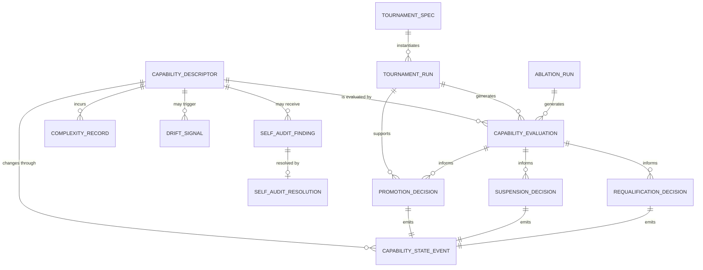
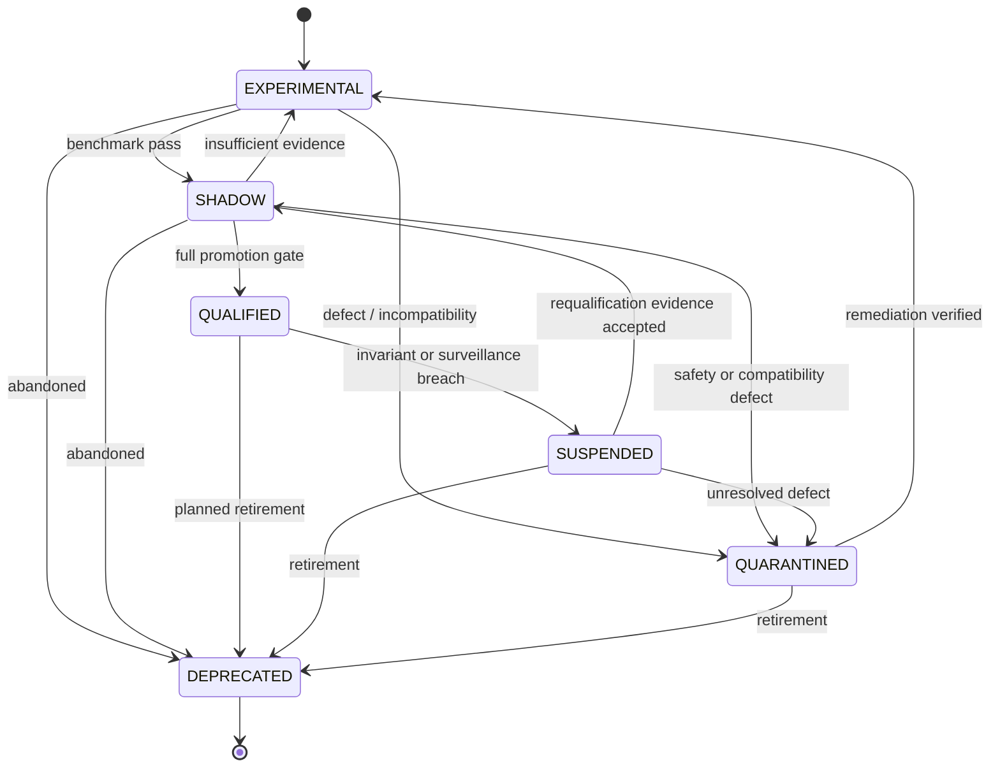
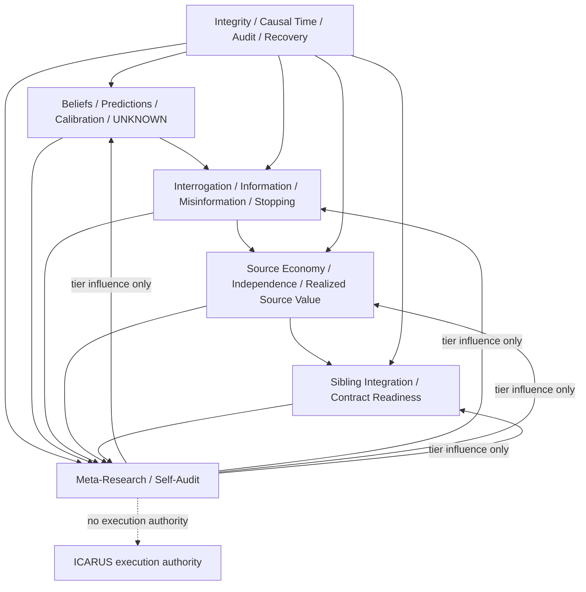

# HELIOS PRIME Meta-Research & Self-Audit: Implementation-Grade Research and TDD Plan

## Executive summary

The supplied HELIOS transfer package establishes the Meta-Research & Self-Audit plane—internally called **H6**—as the final layer in the dependency chain:

`H1 integrity → H2 epistemics → H3 interrogation → H4 source economy → H5 integration → H6 meta-research`.

The transfer manifest also records `helios_tests_executed_by_chat: 0`, `repo_mutations_by_chat: 0`, and `production_ready: false`. Accordingly, this report is an **implementation-grade specification and TDD program, not a claim that H6 has already been implemented or tested**.

The central architectural decision should remain the one already selected in the transferred design: **evidence-first hybrid supervision**. Individual HELIOS capabilities emit immutable evaluation evidence; H6 applies centralized, versioned lifecycle policy; no capability may promote itself. This is substantially safer than either a monolithic omniscient meta-controller or distributed self-certification.

H6 should have exactly five forms of power:

1. **Observe** HELIOS behavior using immutable H1–H5 records.
2. **Compare** advanced capabilities with declared baselines using frozen tournaments and ablations.
3. **Detect** calibration decay, drift, misinformation, loss of evidence independence, UNKNOWN suppression, rising cost, and broken invariants.
4. **Change HELIOS-internal capability influence** through immutable promotion, suspension, quarantine, deprecation, and requalification decisions.
5. **Fail closed** when a non-foundational capability violates an authority, integrity, security, causality, or deterministic-replay invariant.

It must *not* gain source-truth authority, DAEDALUS validation authority, AION history ownership, ICARUS execution authority, broker credentials, unrestricted network access, or permission to manufacture missing evidence.

Three research findings materially affect the implementation.

First, canonical identity must be more rigorously specified than Python's ordinary deterministic `json.dumps`. RFC 8785 exists precisely because hashing and signing require invariant representations; it requires duplicate-name rejection, stable string handling, recursive deterministic property ordering, no inter-token whitespace, and UTF-8 output. It also limits ordinary JSON numbers to IEEE-754-compatible values and recommends strings for higher-precision values. HELIOS therefore should call its format **`HELIOS_JSON_V1`**, explicitly treat it as a custom JCS-inspired profile rather than falsely claiming RFC 8785 conformance, prohibit binary floats in identity-critical objects, and serialize `CanonicalDecimal` through an explicit typed representation. citeturn12view0

Second, the persistence baseline should be strengthened. SQLite documents `synchronous=FULL` as ACID in WAL mode and notes that FULL adds a WAL sync on every transaction commit; WAL requires same-host access, and the WAL itself is part of persistent database state. SQLite also currently documents a WAL-reset corruption bug affecting versions through 3.51.2 under a specific multi-connection checkpoint/write race, fixed in 3.51.3 with backports to 3.50.7 and 3.44.6. H6 implementation should therefore enforce a known-patched SQLite runtime before relying on multi-connection WAL. citeturn20view0turn19view5turn19view6

Third, H6 should not equate “more certainty” with “better method.” Research on predictive uncertainty shows calibration can degrade under distribution shift, while robust Bayesian experimental-design research shows nominal information-gain rankings can be sensitive to prior perturbations. This directly supports H6's requirement to monitor calibration, predicted-versus-realized information, robustness, false resolution, and misinformation rather than optimizing one aggregate score. citeturn16search0turn16search8

The resulting implementation target is:

> **A deterministic, replayable, immutable supervisory evidence system that continuously forces HELIOS's sophisticated methods to re-earn their influence.**

The most important strengthening over the earlier H6 design is that the **H6 policy kernel itself is intentionally tiny**. Advanced H6 detectors—novel drift detectors, learned evaluators, sophisticated calibration models—are ordinary capabilities and must themselves pass through SHADOW/EXPERIMENTAL qualification. H6 cannot become an unaccountable super-authority merely because its job is auditing.

## Architectural contract and deterministic substrate

### Dependency ownership

H6 should consume the following H1–H5 interfaces and own none of them.

| Upstream plane | H6 consumes | H6 must never rewrite |
|---|---|---|
| **H1 Integrity** | `CanonicalDecimal`, `ContractVersion`, `SystemId`, causal knowledge time, canonical serialization/hashing, transaction service, audit chain, checkpoints, task/recovery semantics, execution firewall | evidence history, audit history, authority contracts |
| **H2 Epistemics** | `BeliefSnapshot`, hypothesis state, prospective prediction assessments, contradiction ledger, UNKNOWN vector/signal, calibration records | hypotheses/evidence or scientific truth |
| **H3 Interrogation** | action evaluations, nominal/robust information estimates, misinformation assessments, stopping results, `RealizedInformation` | question intent or historical action decisions |
| **H4 Source Economy** | source health, economics, realized source value, source-lineage roots, substitution outcomes, access/contract drift | source observations or access rights |
| **H5 Integration** | sibling readiness, contract fingerprints, neutral `IntegrationEvidence`, adapter drift | AION history, DAEDALUS validation, ICARUS state |
| **H6 Meta-Research** | evaluations of all of the above | only HELIOS capability influence state |

H6 must refuse startup in authoritative mode if the required H1–H5 contract versions are absent or incompatible. “Missing upstream capability” is a state such as `DEPENDENCY_UNAVAILABLE`, not permission to synthesize a substitute.

### Canonical types

The canonical type definitions belong under:

```text
src/helios/contracts/common.py
```

If H1 already owns that file, H6 extends or consumes it rather than creating parallel definitions.

The minimum types are:

```python
from dataclasses import dataclass
from decimal import Decimal
from enum import Enum


class SystemId(str, Enum):
    HELIOS = "helios"
    ICARUS = "icarus"
    NEXUS = "nexus"
    ARGUS = "argus"
    AION = "aion"
    DAEDALUS = "daedalus"
    ATHENA = "athena"
    ORACLE = "oracle"
    AEGIS = "aegis"
    EVIDENCE_LAB = "evidence_lab"


@dataclass(frozen=True, order=True)
class ContractVersion:
    major: int
    minor: int

    def __post_init__(self) -> None:
        if (
            isinstance(self.major, bool)
            or isinstance(self.minor, bool)
            or not isinstance(self.major, int)
            or not isinstance(self.minor, int)
            or self.major < 0
            or self.minor < 0
        ):
            raise ValueError("contract version components must be non-negative integers")

    def __str__(self) -> str:
        return f"{self.major}.{self.minor}"
```

`CanonicalDecimal` should not merely wrap a Python `float`. Python's `decimal` module provides decimal arithmetic and explicit finite-value inspection; the HELIOS wrapper should use it only for parsing/validation and create a context-independent canonical lexical representation. citeturn21view2

Recommended contract:

```python
@dataclass(frozen=True, order=True)
class CanonicalDecimal:
    """
    Canonical finite base-10 value.

    Wire representation:
      - no exponent
      - no leading '+'
      - no redundant leading integer zeroes
      - no redundant fractional trailing zeroes
      - zero is exactly "0"
      - negative zero canonicalizes to "0"
    """

    text: str

    MAX_DIGITS = 128
    MAX_SCALE = 64

    @classmethod
    def parse(cls, raw: str | int | Decimal) -> "CanonicalDecimal":
        if isinstance(raw, bool):
            raise TypeError("bool is not a decimal")
        value = Decimal(str(raw))

        if not value.is_finite():
            raise ValueError("non-finite decimal")

        sign, digits, exponent = value.as_tuple()

        if len(digits) > cls.MAX_DIGITS:
            raise ValueError("decimal precision exceeds HELIOS_JSON_V1")
        if abs(exponent) > cls.MAX_SCALE:
            raise ValueError("decimal scale exceeds HELIOS_JSON_V1")

        # Render from Decimal tuple, not ambient arithmetic context.
        text = _decimal_tuple_to_fixed_text(sign, digits, exponent)

        if Decimal(text).is_zero():
            text = "0"

        return cls(text=text)

    def __post_init__(self) -> None:
        if CanonicalDecimal.parse(self.text).text != self.text:
            raise ValueError("non-canonical decimal text")
```

The digit and scale limits are **HELIOS profile limits**, not claims about mathematically valid decimals. They are intended to bound the cryptographic/canonicalization surface and can change only in a future canonical profile.

### Deterministic serialization

`HELIOS_JSON_V1` should be implemented in:

```text
src/helios/contracts/canonical.py
tests/contracts/test_canonical.py
```

RFC 8785 establishes the relevant external design principles: no duplicate property names, strings preserved without Unicode normalization, no JSON token whitespace, recursively deterministic key ordering based on UTF-16 code units, unchanged array order, rejection of NaN/Infinity, and UTF-8 output. RFC 8785 also restricts numbers to IEEE-754 double precision and recommends string encodings for higher-precision values. citeturn12view0

HELIOS deliberately differs in its numeric type system because nanosecond clocks and exact research metrics should not be forced through IEEE-754. Therefore:

```text
profile:
    HELIOS_JSON_V1

inspired by:
    RFC 8785 / JCS

RFC 8785 conformant:
    NO
```

The exact normalization rules should be:

| Python/contract value | `HELIOS_JSON_V1` representation |
|---|---|
| `None` | `null` |
| `bool` | JSON Boolean |
| `str` | JSON string, Unicode preserved exactly |
| `int` | base-10 JSON integer; `bool` rejected as integer |
| `float` | **rejected** in identity-critical serialization |
| `CanonicalDecimal` | `{"__helios_type__":"decimal","value":"…"}` |
| `ContractVersion` | `{"__helios_type__":"contract_version","major":M,"minor":N}` |
| `SystemId` / ordinary string enum | enum string value |
| frozen dataclass | field mapping |
| tuple/list | JSON array preserving order |
| mapping | string keys only |
| set/frozenset | **rejected**; semantic sets must be normalized before serialization |
| bytes | **rejected**; use explicit hex/base64 contract fields |
| unknown type | **rejected** |

Object names should be sorted by RFC-8785-compatible UTF-16 code-unit order rather than relying accidentally on Python dictionary insertion order. Strings containing lone surrogates must be rejected. Arrays preserve order. Semantic sets such as `reason_codes` should enter the contract as an already-sorted tuple.

Python's standard AST parser exposes imports, calls, attributes and related constructs as structured nodes, making AST-based firewall checks materially stronger than grep for code-level policy enforcement. citeturn21view0

Strict JSON admission must use a duplicate-key-detecting loader rather than Python's permissive defaults. The standard `json` API exposes hooks that allow HELIOS to preserve object-pair information during decode and reject duplicate names before contract construction. citeturn21view1

The cryptographic identity API should domain-separate by canonicalizing an envelope rather than concatenating ambiguous byte strings:

```python
def domain_hash(
    *,
    domain: str,
    contract_version: ContractVersion,
    payload: object,
) -> str:
    envelope = {
        "profile": "HELIOS_JSON_V1",
        "domain": domain,
        "contract_version": contract_version,
        "payload": payload,
    }
    return sha256(canonical_bytes(envelope)).hexdigest()
```

Required domains include:

```text
capability-descriptor
capability-evaluation
capability-state-event
tournament-spec
tournament-run
calibration-surveillance
drift-signal
ablation-run
complexity-record
self-audit-finding
self-audit-resolution
promotion-decision
suspension-decision
requalification-decision
meta-checkpoint
```

This exact test must exist:

```python
def test_string_and_canonical_decimal_do_not_hash_as_same_value():
    assert canonical_bytes("1") != canonical_bytes(CanonicalDecimal.parse("1"))
```

Other RED tests:

```text
test_helios_json_v1_same_value_same_bytes
test_mapping_insertion_order_irrelevant
test_float_rejected
test_nan_rejected
test_infinity_rejected
test_negative_zero_decimal_becomes_zero
test_decimal_trailing_zeroes_canonicalized
test_set_rejected
test_duplicate_json_key_rejected
test_lone_surrogate_rejected
test_unicode_not_normalized
test_utf16_property_sort_matches_reference_vectors
test_array_order_preserved
test_contract_version_changes_domain_hash
test_domain_changes_hash
test_profile_name_changes_hash
```

### Entity model



For external interoperability, this graph can be *projected* into W3C PROV rather than making PROV H6's storage model. PROV's core concepts are Entity, Activity and Agent, with relations such as `used`, `wasGeneratedBy`, `wasDerivedFrom`, `wasAttributedTo` and `wasAssociatedWith`; W3C explicitly designed PROV as a domain-agnostic interchange model with extensibility points. citeturn13view0

Recommended projection:

| HELIOS meta object | W3C PROV projection |
|---|---|
| `CapabilityDescriptor` | Entity |
| `CapabilityEvaluation` | Entity |
| `BeliefSnapshot` / frozen benchmark | Entity |
| `TournamentRun` | Activity |
| `AblationRun` | Activity |
| promotion/suspension evaluation | Activity |
| `SystemId.HELIOS` | Agent |
| benchmark consumed by tournament | `used` |
| evaluation produced by run | `wasGeneratedBy` |
| evaluation derived from upstream evidence | `wasDerivedFrom` |
| run executed by HELIOS | `wasAssociatedWith` |

The internal HELIOS notions of **knowledge time, independent source roots, capability tiers, qualification authority, synthetic lineage and security state remain richer than PROV and must not be lost during export**.

## File layout, contracts, persistence, and provenance

### Exact target tree

The implementation should use this layout:

```text
src/helios/
├── contracts/
│   ├── __init__.py
│   ├── common.py
│   ├── canonical.py
│   └── meta.py
│
├── meta/
│   ├── __init__.py
│   ├── errors.py
│   ├── policy.py
│   ├── capability.py
│   ├── registry.py
│   ├── state_machine.py
│   ├── evaluation.py
│   ├── tournament.py
│   ├── promotion.py
│   ├── suspension.py
│   ├── requalification.py
│   ├── calibration.py
│   ├── information_surveillance.py
│   ├── drift.py
│   ├── independence.py
│   ├── unknown_suppression.py
│   ├── ablation.py
│   ├── complexity.py
│   ├── findings.py
│   ├── audit.py
│   ├── observatory.py
│   ├── telemetry.py
│   ├── service.py
│   └── export/
│       ├── __init__.py
│       ├── prov.py
│       └── openlineage.py
│
├── persistence/
│   ├── database.py
│   ├── migrations.py
│   ├── meta_store.py
│   └── migrations/
│       └── 006_meta_research.sql
│
└── security/
    └── admission.py

tests/
├── contracts/
│   └── test_canonical.py
│
├── meta/
│   ├── test_capability.py
│   ├── test_registry.py
│   ├── test_state_machine.py
│   ├── test_evaluation.py
│   ├── test_tournament.py
│   ├── test_promotion.py
│   ├── test_suspension.py
│   ├── test_requalification.py
│   ├── test_calibration.py
│   ├── test_information_surveillance.py
│   ├── test_drift.py
│   ├── test_independence.py
│   ├── test_unknown_suppression.py
│   ├── test_ablation.py
│   ├── test_complexity.py
│   ├── test_findings.py
│   ├── test_audit.py
│   ├── test_observatory.py
│   ├── test_provenance_export.py
│   ├── test_openlineage_export.py
│   ├── test_replay.py
│   └── test_end_to_end.py
│
├── static/
│   ├── test_h6_import_firewall.py
│   ├── test_h6_authority_firewall.py
│   ├── test_h6_network_firewall.py
│   ├── test_h6_sqlite_ownership.py
│   ├── test_h6_dynamic_code_firewall.py
│   └── test_h6_credentials_firewall.py
│
└── fixtures/
    ├── h6_worlds.py
    ├── h6_packets.py
    ├── h6_expected.py
    └── deterministic_stream.py
```

`src/helios/persistence/database.py` remains the **only production module permitted to call `sqlite3.connect`**.

### Method and capability registry

The registry is not a plugin marketplace. V1 registration is trusted static code.

```python
class CapabilityTier(str, Enum):
    FOUNDATIONAL = "foundational"
    QUALIFIED = "qualified"
    SHADOW = "shadow"
    EXPERIMENTAL = "experimental"
    QUARANTINED = "quarantined"
    SUSPENDED = "suspended"
    DEPRECATED = "deprecated"


class OwnerPlane(str, Enum):
    H1 = "H1"
    H2 = "H2"
    H3 = "H3"
    H4 = "H4"
    H5 = "H5"
    H6 = "H6"


@dataclass(frozen=True)
class CapabilityDescriptor:
    capability_id: str

    system_id: SystemId
    owner_plane: OwnerPlane

    implementation_version: str
    contract_version: ContractVersion

    baseline_capability_id: str | None

    purpose: str

    admissible_population_ids: tuple[str, ...]
    output_semantics: str

    required_evidence_classes: tuple[str, ...]

    known_failure_modes: tuple[str, ...]
    calibration_metrics: tuple[str, ...]
    promotion_metrics: tuple[str, ...]

    hard_invariant_ids: tuple[str, ...]

    supports_shadow: bool
    deterministic_replay: bool

    rollback_strategy: str
    disable_strategy: str

    descriptor_hash: str
```

Registration rules:

```text
system_id must be HELIOS

FOUNDATIONAL registration requires an explicit built-in allowlist

non-foundational capability requires baseline_capability_id

external plugin cannot declare itself QUALIFIED

registration does not change capability state

implementation version is immutable

descriptor hash must verify before registry insertion

duplicate capability_id + version with different body is corruption
```

The built-in foundational allowlist should initially be extremely small:

```text
causal-time-enforcement
canonical-serialization
audit-integrity
execution-firewall
capability-policy-kernel
```

Even H6's calibration detector, drift detector, UNKNOWN-suppression detector, and complexity evaluator are **not foundational merely because they belong to H6**.

### Population scoping

Every evaluation metric needs a durable scope:

```python
@dataclass(frozen=True)
class PopulationScope:
    population_id: str

    instrument_scope: tuple[str, ...]
    regime_scope: tuple[str, ...]
    prediction_family: str | None
    horizon_family: str | None
    action_family: str | None
    representation_type: str | None
    source_quality_band: str | None

    start_knowledge_ns: int
    end_knowledge_ns: int

    scope_hash: str
```

This prevents the meta-layer from making claims such as “method X is calibrated” when the evidence actually means “method X version Y was calibrated for a particular instrument/horizon/regime population during a particular knowledge-time interval.”

Distribution shift can materially damage predictive uncertainty and calibration, which is the research justification for making population scope part of the identity of every calibration result rather than metadata that can be discarded. citeturn16search0

### Evaluation contracts

```python
class MetricDirection(str, Enum):
    MAXIMIZE = "maximize"
    MINIMIZE = "minimize"
    TARGET = "target"


@dataclass(frozen=True)
class MetricObservation:
    metric_id: str
    value: CanonicalDecimal

    direction: MetricDirection

    sample_count: int

    lower_bound: CanonicalDecimal | None
    upper_bound: CanonicalDecimal | None

    population_id: str
    method_version: str

    insufficient_evidence: bool


@dataclass(frozen=True)
class HardInvariantResult:
    invariant_id: str
    passed: bool

    evidence_refs: tuple[str, ...]
    reason_codes: tuple[str, ...]


@dataclass(frozen=True)
class CapabilityEvaluation:
    evaluation_id: str

    capability_id: str
    implementation_version: str
    baseline_capability_id: str | None

    population_id: str
    knowledge_cutoff_ns: int

    metric_observations: tuple[MetricObservation, ...]
    invariant_results: tuple[HardInvariantResult, ...]

    tournament_run_id: str | None
    ablation_run_id: str | None

    benchmark_seed: int | None

    upstream_state_hash: str
    evaluation_hash: str

    observed_ns: int

    trace_id: str | None = None
    span_id: str | None = None
```

`insufficient_evidence=True` can never silently equal success.

### Persistence schema

The H6 migration should append immutable meta-evidence tables to the H1 authoritative store:

```sql
-- src/helios/persistence/migrations/006_meta_research.sql

CREATE TABLE meta_capability_descriptors (
    descriptor_hash TEXT PRIMARY KEY
        CHECK(length(descriptor_hash) = 64),

    capability_id TEXT NOT NULL,
    implementation_version TEXT NOT NULL,
    owner_plane TEXT NOT NULL,
    contract_version TEXT NOT NULL,

    created_ns INTEGER NOT NULL CHECK(created_ns >= 0),

    body_bytes BLOB NOT NULL,
    body_hash TEXT NOT NULL
        CHECK(length(body_hash) = 64),

    UNIQUE(capability_id, implementation_version)
) STRICT;

CREATE TABLE meta_capability_state_events (
    event_id TEXT PRIMARY KEY,
    descriptor_hash TEXT NOT NULL
        REFERENCES meta_capability_descriptors(descriptor_hash),

    previous_tier TEXT,
    resulting_tier TEXT NOT NULL,

    event_type TEXT NOT NULL,
    effective_ns INTEGER NOT NULL CHECK(effective_ns >= 0),

    policy_version TEXT NOT NULL,

    input_state_hash TEXT NOT NULL
        CHECK(length(input_state_hash) = 64),
    result_state_hash TEXT NOT NULL
        CHECK(length(result_state_hash) = 64),

    body_bytes BLOB NOT NULL,
    body_hash TEXT NOT NULL
        CHECK(length(body_hash) = 64)
) STRICT;

CREATE INDEX idx_meta_state_cap_time
ON meta_capability_state_events(descriptor_hash, effective_ns, event_id);

CREATE TABLE meta_capability_evaluations (
    evaluation_id TEXT PRIMARY KEY,

    descriptor_hash TEXT NOT NULL
        REFERENCES meta_capability_descriptors(descriptor_hash),

    baseline_descriptor_hash TEXT
        REFERENCES meta_capability_descriptors(descriptor_hash),

    population_id TEXT NOT NULL,
    knowledge_cutoff_ns INTEGER NOT NULL,

    tournament_run_id TEXT,
    ablation_run_id TEXT,

    observed_ns INTEGER NOT NULL,

    body_bytes BLOB NOT NULL,
    body_hash TEXT NOT NULL
        CHECK(length(body_hash) = 64)
) STRICT;

CREATE INDEX idx_meta_eval_cap_cutoff
ON meta_capability_evaluations(
    descriptor_hash,
    knowledge_cutoff_ns,
    evaluation_id
);

CREATE TABLE meta_tournament_specs (
    tournament_spec_id TEXT PRIMARY KEY,
    policy_version TEXT NOT NULL,

    created_ns INTEGER NOT NULL,

    body_bytes BLOB NOT NULL,
    body_hash TEXT NOT NULL
        CHECK(length(body_hash) = 64)
) STRICT;

CREATE TABLE meta_tournament_runs (
    tournament_run_id TEXT PRIMARY KEY,

    tournament_spec_id TEXT NOT NULL
        REFERENCES meta_tournament_specs(tournament_spec_id),

    candidate_descriptor_hash TEXT NOT NULL
        REFERENCES meta_capability_descriptors(descriptor_hash),

    baseline_descriptor_hash TEXT NOT NULL
        REFERENCES meta_capability_descriptors(descriptor_hash),

    benchmark_seed INTEGER NOT NULL,
    knowledge_cutoff_ns INTEGER NOT NULL,

    started_ns INTEGER NOT NULL,
    completed_ns INTEGER NOT NULL,

    body_bytes BLOB NOT NULL,
    body_hash TEXT NOT NULL
        CHECK(length(body_hash) = 64)
) STRICT;

CREATE TABLE meta_calibration_surveillance_records (
    record_id TEXT PRIMARY KEY,

    descriptor_hash TEXT NOT NULL
        REFERENCES meta_capability_descriptors(descriptor_hash),

    population_id TEXT NOT NULL,

    window_start_ns INTEGER NOT NULL,
    window_end_ns INTEGER NOT NULL,

    body_bytes BLOB NOT NULL,
    body_hash TEXT NOT NULL
        CHECK(length(body_hash) = 64)
) STRICT;

CREATE TABLE meta_drift_signals (
    signal_id TEXT PRIMARY KEY,

    descriptor_hash TEXT NOT NULL
        REFERENCES meta_capability_descriptors(descriptor_hash),

    drift_class TEXT NOT NULL,

    observed_ns INTEGER NOT NULL,
    evidence_cutoff_ns INTEGER NOT NULL,

    body_bytes BLOB NOT NULL,
    body_hash TEXT NOT NULL
        CHECK(length(body_hash) = 64)
) STRICT;

CREATE TABLE meta_ablation_runs (
    ablation_run_id TEXT PRIMARY KEY,

    descriptor_hash TEXT NOT NULL
        REFERENCES meta_capability_descriptors(descriptor_hash),

    tournament_spec_id TEXT NOT NULL
        REFERENCES meta_tournament_specs(tournament_spec_id),

    benchmark_seed INTEGER NOT NULL,
    knowledge_cutoff_ns INTEGER NOT NULL,

    body_bytes BLOB NOT NULL,
    body_hash TEXT NOT NULL
        CHECK(length(body_hash) = 64)
) STRICT;

CREATE TABLE meta_complexity_records (
    record_id TEXT PRIMARY KEY,

    descriptor_hash TEXT NOT NULL
        REFERENCES meta_capability_descriptors(descriptor_hash),

    observed_ns INTEGER NOT NULL,

    body_bytes BLOB NOT NULL,
    body_hash TEXT NOT NULL
        CHECK(length(body_hash) = 64)
) STRICT;

CREATE TABLE meta_self_audit_findings (
    finding_id TEXT PRIMARY KEY,

    descriptor_hash TEXT
        REFERENCES meta_capability_descriptors(descriptor_hash),

    severity TEXT NOT NULL,
    category TEXT NOT NULL,

    detected_ns INTEGER NOT NULL,
    knowledge_cutoff_ns INTEGER NOT NULL,

    body_bytes BLOB NOT NULL,
    body_hash TEXT NOT NULL
        CHECK(length(body_hash) = 64)
) STRICT;

CREATE TABLE meta_self_audit_resolutions (
    resolution_id TEXT PRIMARY KEY,

    finding_id TEXT NOT NULL
        REFERENCES meta_self_audit_findings(finding_id),

    resolved_ns INTEGER NOT NULL,

    body_bytes BLOB NOT NULL,
    body_hash TEXT NOT NULL
        CHECK(length(body_hash) = 64)
) STRICT;

CREATE TABLE meta_promotion_decisions (
    decision_id TEXT PRIMARY KEY,
    descriptor_hash TEXT NOT NULL
        REFERENCES meta_capability_descriptors(descriptor_hash),

    effective_ns INTEGER NOT NULL,
    policy_version TEXT NOT NULL,

    body_bytes BLOB NOT NULL,
    body_hash TEXT NOT NULL
        CHECK(length(body_hash) = 64)
) STRICT;

CREATE TABLE meta_suspension_decisions (
    decision_id TEXT PRIMARY KEY,
    descriptor_hash TEXT NOT NULL
        REFERENCES meta_capability_descriptors(descriptor_hash),

    effective_ns INTEGER NOT NULL,
    policy_version TEXT NOT NULL,

    body_bytes BLOB NOT NULL,
    body_hash TEXT NOT NULL
        CHECK(length(body_hash) = 64)
) STRICT;

CREATE TABLE meta_requalification_decisions (
    decision_id TEXT PRIMARY KEY,
    descriptor_hash TEXT NOT NULL
        REFERENCES meta_capability_descriptors(descriptor_hash),

    effective_ns INTEGER NOT NULL,
    policy_version TEXT NOT NULL,

    body_bytes BLOB NOT NULL,
    body_hash TEXT NOT NULL
        CHECK(length(body_hash) = 64)
) STRICT;
```

All of these are append-only canonical tables. Migration code should add `BEFORE UPDATE` and `BEFORE DELETE` triggers that abort against every canonical H6 table. A correction is represented by another immutable entity or state event, not an UPDATE.

H6 does **not** need a mutable “current capability state” source-of-truth table. Current state is a projection from the latest causally visible `meta_capability_state_events` row. A cache may eventually exist, but it must be derivable, discardable, and excluded from identity.

### SQLite operating contract

Authoritative connections should request and verify:

```sql
PRAGMA foreign_keys=ON;
PRAGMA busy_timeout=30000;
PRAGMA journal_mode=WAL;
PRAGMA synchronous=FULL;
PRAGMA trusted_schema=OFF;
```

`journal_mode=WAL` must return `wal`, `synchronous` must return `2`, and `foreign_keys` must return `1`. SQLite documents FULL as ACID in WAL mode and notes that FULL adds a WAL synchronization after every transaction commit. citeturn20view0

`trusted_schema=OFF` should be part of the connection baseline. SQLite documents `trusted_schema` as controlling whether schema constructs such as triggers, views, generated expressions and indexes may invoke functions or virtual tables that have not been security audited. citeturn19view3

The H6 observatory connection should additionally request:

```sql
PRAGMA query_only=ON;
```

SQLite says this causes write operations such as CREATE, DELETE, DROP, INSERT and UPDATE to fail with `SQLITE_READONLY`; it is still not a substitute for the canonical application authority boundary, so observatory code must remain a separate read-only interface. citeturn19view1

**Current-version hardening:** before enabling authoritative multi-connection WAL, `database.py` should reject SQLite runtimes known to contain the 2026 WAL-reset bug. SQLite's current WAL documentation states the bug affects 3.7.0 through 3.51.2 in the relevant concurrency scenario, is fixed in 3.51.3+, and has backports 3.50.7 and 3.44.6. citeturn19view6

A conservative helper:

```python
def sqlite_wal_runtime_known_patched(version: tuple[int, int, int]) -> bool:
    if version >= (3, 51, 3):
        return True

    major, minor, patch = version

    if (major, minor) == (3, 50) and patch >= 7:
        return True

    if (major, minor) == (3, 44) and patch >= 6:
        return True

    return False
```

Vendor-patched builds reporting an older upstream version require an explicit reviewed override plus a recorded compatibility test; they should not be assumed patched.

WAL remains a **same-host persistence topology** because SQLite WAL relies on shared memory and does not support a normal network filesystem topology. The `-wal` file is part of database persistent state and must accompany a copied/moved database if committed transactions remain there. citeturn19view5turn19view6

Backups should use the SQLite online backup API rather than copying only the `.db` file; SQLite describes completion of that API as producing a consistent snapshot of the source database. citeturn19view7

### Audit ledger format

H6 should **not create a second independent cryptographic audit chain**. It should emit H6-specific audit payloads into H1's authoritative hash-linked audit mechanism in the same database transaction as the associated H6 state change.

```python
@dataclass(frozen=True)
class MetaAuditPayload:
    schema: str  # "helios-meta-audit-v1"

    event_id: str
    event_type: str

    capability_id: str
    implementation_version: str

    policy_version: str

    previous_tier: CapabilityTier | None
    resulting_tier: CapabilityTier | None

    evaluation_refs: tuple[str, ...]
    tournament_run_refs: tuple[str, ...]
    ablation_run_refs: tuple[str, ...]
    finding_refs: tuple[str, ...]

    reason_codes: tuple[str, ...]

    input_state_hash: str
    result_state_hash: str

    effective_ns: int

    trace_id: str | None
    span_id: str | None
```

Canonical H6 audit event types:

```text
CAPABILITY_REGISTERED
CAPABILITY_STATE_CHANGED
CAPABILITY_EVALUATED
TOURNAMENT_RECORDED
ABLATION_RECORDED
CALIBRATION_SIGNAL_RECORDED
DRIFT_SIGNAL_RECORDED
SELF_AUDIT_FINDING_RECORDED
SELF_AUDIT_RESOLUTION_RECORDED
PROMOTION_DECIDED
SUSPENSION_DECIDED
REQUALIFICATION_DECIDED
```

Pre-flight requirement: H1's audit hash must bind the canonical event body, previous audit hash and a monotonic audit position/sequence. If the final H1 implementation does not bind order cryptographically, that is an H1 blocker to fix before H6.

## Capability lifecycle, tournaments, promotion, suspension, and ablation

### Lifecycle state machine

The state machine should be deliberately asymmetric. Losing influence is easier than regaining it.



`FOUNDATIONAL` is **not an ordinary branch of this state machine**.

A foundational mechanism cannot simply be suspended, because disabling causal-time enforcement or the execution firewall could make HELIOS less safe. Instead:

```text
FOUNDATIONAL hard-invariant failure
    ↓
system mode = DEGRADED
    ↓
block canonical automated research mutation
    ↓
retain read-only diagnostics/recovery surfaces
```

That distinction prevents the paradoxical state in which H6 “suspends” the safety mechanism whose failure it discovered.

State transitions must be append-only:

```python
@dataclass(frozen=True)
class CapabilityStateEvent:
    event_id: str

    capability_id: str
    implementation_version: str

    previous_tier: CapabilityTier | None
    resulting_tier: CapabilityTier

    event_type: str

    effective_ns: int
    knowledge_cutoff_ns: int

    policy_version: str

    evidence_refs: tuple[str, ...]
    reason_codes: tuple[str, ...]

    input_state_hash: str
    result_state_hash: str
```

Historical state:

```python
tier_as_of(
    capability_id: str,
    implementation_version: str,
    knowledge_ns: int,
) -> CapabilityTier
```

must be prefix-invariant: evaluation data learned at `t=200` cannot change `tier_as_of(..., 150)`.

### Promotion ladder


The ladder deliberately mirrors the anti-complexity principle from the transferred design: sophisticated behavior does not earn production influence merely by existing.

### Method tournament stages

The required tournament comparison is:

| Stage | Candidate and baseline receive | Mandatory output | Blocking failure |
|---|---|---|---|
| Contract admissibility | same versioned contract requirements | compatibility record | invalid/missing contract |
| Deterministic unit phase | fixed handcrafted inputs | exact expected outputs/hashes | any invariant mismatch |
| Hostile synthetic phase | identical deterministic worlds and seeds | per-world metrics and findings | authority, causality, integrity or replay failure |
| Baseline comparison | same worlds, cutoffs, budgets, source availability | paired metric deltas | no declared material benefit |
| Robustness stress | same perturbation families | robustness distribution/rank stability | unsafe misspecification behavior |
| Ablation | full, minus-candidate, baseline-only | paired contribution deltas | no measurable declared contribution |
| Historical replay | identical point-in-time evidence | historical outcomes without lookahead | temporal leakage |
| Prospective shadow | same live/prospective observations without decision influence | candidate-vs-baseline shadow ledger | unacceptable false resolution/misinformation/calibration |
| Calibration review | declared target population | proper-score/coverage/selective-risk evidence | outside declared tolerance |
| Complexity review | measured candidate/baseline cost | incremental cost ledger | hard budget breach |
| Promotion decision | immutable evidence above | versioned decision | any unresolved required gate |

Candidate and baseline must share:

```text
world IDs
seeds
evidence cutoffs
source availability
cost model
latency model
missing-data policy
research budget
decision deadline
evaluation metrics
```

The tournament must not collapse all dimensions into one “H6 score.” Robust experimental-design research is itself evidence that rankings can move under plausible prior perturbations, so maintaining per-objective evidence is preferable to a single opaque scalar. citeturn16search8

### Tournament contracts

```python
@dataclass(frozen=True)
class TournamentSpec:
    tournament_spec_id: str

    candidate_descriptor_hash: str
    baseline_descriptor_hash: str

    world_ids: tuple[str, ...]
    seeds: tuple[int, ...]

    evidence_cutoff_ns: int

    cost_model_version: str
    latency_model_version: str
    source_availability_hash: str

    metric_ids: tuple[str, ...]

    missing_data_policy: str

    promotion_policy_version: str

    spec_hash: str


@dataclass(frozen=True)
class TournamentRun:
    tournament_run_id: str
    tournament_spec_id: str

    candidate_evaluation_id: str
    baseline_evaluation_id: str

    started_ns: int
    completed_ns: int

    input_hash: str
    output_hash: str

    deterministic_replay_verified: bool
```

### Promotion criteria

Only hard safety criteria should have universal zero-tolerance thresholds. Performance tolerances are capability-specific research-policy parameters and must be declared before seeing tournament results.

| Criterion | Universal rule | Configurable policy component | Failure outcome |
|---|---|---|---|
| Authority | zero violations | none | quarantine / immediate suspension |
| Integrity | zero violations | none | quarantine / immediate suspension |
| Security | zero hard violations | none | quarantine / immediate suspension |
| Causal leakage | zero future-evidence uses | none | reject |
| Deterministic replay | exact canonical result match | none | reject/suspend |
| Restart equivalence | exact logical-state match | none | reject/suspend |
| False-resolution regression | candidate cannot exceed predeclared tolerance | non-inferiority tolerance | no promotion |
| Misinformation regression | candidate cannot exceed predeclared tolerance | non-inferiority tolerance | no promotion |
| Calibration | within target-population bounds | metric bounds | no promotion |
| Primary benefit | at least one declared objective materially improves | minimum practical effect | no promotion |
| Ablation contribution | removing capability materially harms declared objective | minimum contribution | no promotion |
| Complexity | no hard budget exceeded | per-capability budgets | no promotion |
| Prospective shadow | required for decision-influencing capability | minimum sample/window | remain SHADOW |
| Unresolved findings | no required IMPORTANT/CRITICAL blockers | policy mapping | remain non-qualified |

A crucial anti-gaming rule is:

> **The candidate's promotion policy, metrics, tolerances, target population, baseline and primary objective are frozen in the `TournamentSpec` before the candidate results are evaluated.**

A capability cannot change the metric after seeing that it lost.

### Suspension

Suspension has two channels.

**Hard suspension** is immediate and does not require a statistical window:

```text
authority violation
execution-firewall violation
integrity/hash mismatch
audit-chain failure
future-evidence causal leakage
forbidden credential access
deterministic-replay failure
persisted-body/hash mismatch
unsafe external mutation
critical contract corruption
```

**Performance suspension** uses predeclared evidence windows and hysteresis:

```text
persistent calibration degradation
persistent false-resolution increase
persistent misinformation increase
persistent predicted-vs-realized information optimism
persistent dependence inflation
persistent UNKNOWN suppression
persistent cost/latency budget breach
persistent source/integration mismatch
```

The windowing contract:

```python
@dataclass(frozen=True)
class SuspensionWindowPolicy:
    minimum_observations: int
    consecutive_breaching_windows: int

    maximum_false_resolution_delta: CanonicalDecimal | None
    maximum_misinformation_delta: CanonicalDecimal | None
    maximum_calibration_error: CanonicalDecimal | None
    maximum_information_bias: CanonicalDecimal | None

    policy_version: str
```

There should be **no hidden universal production values** for these thresholds. The capability descriptor or versioned policy must supply them. Missing required policy means the capability is **not promotable**.

Synthetic tests may use:

```python
TEST_POLICY = SuspensionWindowPolicy(
    minimum_observations=50,
    consecutive_breaching_windows=3,
    maximum_false_resolution_delta=CanonicalDecimal.parse("0.02"),
    maximum_misinformation_delta=CanonicalDecimal.parse("0"),
    maximum_calibration_error=CanonicalDecimal.parse("0.05"),
    maximum_information_bias=CanonicalDecimal.parse("0.10"),
    policy_version="TEST_POLICY_V1",
)
```

Those values are fixture values, not claims of optimal production thresholds.

### Requalification

A suspended capability can only return:

```text
SUSPENDED
→ SHADOW
→ QUALIFIED
```

Never:

```text
SUSPENDED
→ QUALIFIED
```

A requalification decision must contain:

```python
@dataclass(frozen=True)
class RequalificationDecision:
    decision_id: str

    capability_id: str
    implementation_version: str

    original_suspension_decision_id: str
    original_finding_refs: tuple[str, ...]

    remediation_refs: tuple[str, ...]

    fresh_tournament_run_ids: tuple[str, ...]
    fresh_shadow_evaluation_ids: tuple[str, ...]

    authority_invariants_reverified: bool
    integration_contracts_reverified: bool

    decision: str  # RETURN_TO_SHADOW / REMAIN_SUSPENDED / QUARANTINE

    policy_version: str
    decided_ns: int
```

### Ablation procedure

Every non-foundational qualified candidate gets a declared baseline and three matched arms:

```text
FULL_SYSTEM
MINUS_CAPABILITY_X
BASELINE_ONLY
```

All three must use the same:

```text
evidence cutoff
world
seed
budgets
source availability
cost assumptions
latency assumptions
action availability
stopping policy
```

The primary output is **paired per-world delta**, not merely an aggregate mean.

```python
@dataclass(frozen=True)
class AblationDelta:
    world_id: str

    metric_id: str

    full_value: CanonicalDecimal
    minus_value: CanonicalDecimal
    baseline_value: CanonicalDecimal

    full_minus_delta: CanonicalDecimal
    full_baseline_delta: CanonicalDecimal
```

An advanced capability that adds code, latency, cost and failure surface but makes no material contribution to its declared objective should fail the complexity gate.

V1 should use **leave-one-capability-out ablation**, not Shapley-value-style exhaustive interaction attribution. Pairwise interaction experiments may be added later for specific cases, but they should themselves justify the extra compute/complexity.

## Surveillance, hostile worlds, complexity, and observability

### Calibration surveillance

H6 consumes H2's calibration ledger; it does not recompute market truth independently.

```python
@dataclass(frozen=True)
class CalibrationSurveillanceRecord:
    record_id: str

    capability_id: str
    implementation_version: str

    population_id: str

    window_start_ns: int
    window_end_ns: int

    sample_count: int

    brier_score: CanonicalDecimal | None
    log_score: CanonicalDecimal | None

    reliability_error: CanonicalDecimal | None
    coverage_deviation: CanonicalDecimal | None
    selective_risk: CanonicalDecimal | None

    insufficient_evidence: bool

    reference_window_id: str | None

    reason_codes: tuple[str, ...]
```

Never compute Brier or log-score semantics for a quantity that was not originally issued as a probability.

Calibration surveillance is required because empirical evidence shows that uncertainty behavior can deteriorate as the evaluation distribution shifts away from the training distribution. citeturn16search0

### Distinct drift channels

V1 should preserve the transferred design's separation:

```python
class DriftClass(str, Enum):
    METHOD_POPULATION_DRIFT = "method_population_drift"
    CALIBRATION_DRIFT = "calibration_drift"
    SOURCE_BEHAVIOR_DRIFT = "source_behavior_drift"
    CONTRACT_DRIFT = "contract_drift"
    COST_DRIFT = "cost_drift"
    LATENCY_DRIFT = "latency_drift"
    INFORMATION_YIELD_DRIFT = "information_yield_drift"
    DEPENDENCE_DRIFT = "dependence_drift"
    UNKNOWN_SUPPRESSION_DRIFT = "unknown_suppression_drift"
```

And:

```python
class SurveillanceState(str, Enum):
    INSUFFICIENT_EVIDENCE = "insufficient_evidence"
    STABLE = "stable"
    WATCH = "watch"
    BREACH = "breach"
```

There is deliberately no `overall_drift_score` in V1.

```python
@dataclass(frozen=True)
class DriftSignal:
    signal_id: str

    capability_id: str
    implementation_version: str

    drift_class: DriftClass
    state: SurveillanceState

    reference_population_id: str
    current_population_id: str

    metric_id: str
    observed_delta: CanonicalDecimal | None

    evidence_refs: tuple[str, ...]

    observed_ns: int
    knowledge_cutoff_ns: int

    detector_version: str
```

### Predicted-versus-realized information

H6 should join H3 and H4 ledgers only through stable IDs:

```text
H3 predicted information
        ↓
research action
        ↓
H4 acquisition expectation
        ↓
actual acquired evidence
        ↓
H2 belief transition
        ↓
H3 RealizedInformation
        ↓
H6 calibration of the interrogator/source
```

Metrics include:

```text
signed information bias
absolute information error
predicted/realized cost error
predicted/realized latency error
hypotheses discriminated
UNKNOWN change
contradiction change
independent evidence gained
downstream research usefulness
```

A planner that repeatedly forecasts very high information gain but realizes little information should lose estimator credibility even when individual acquisitions appear superficially valid.

### UNKNOWN-suppression detector

The detector is a rule-based baseline, not a learned model.

Flag patterns include:

```text
UNKNOWN decreases
AND prospective prediction failures increase

support increases
AND most incremental support shares an existing provenance root

confidence increases
AND proper predictive score worsens

abstention drops
AND false resolution increases

model disagreement rises
AND aggregated output becomes more confident

OOD/novel flags rise
AND known-class assignment becomes more confident
```

Contract:

```python
@dataclass(frozen=True)
class UnknownSuppressionAssessment:
    assessment_id: str

    capability_id: str

    patterns_triggered: tuple[str, ...]

    severity: str

    evidence_refs: tuple[str, ...]

    observed_ns: int

    detector_version: str
```

A triggered pattern creates a durable finding; it does not by itself prove the capability is wrong.

### Independence surveillance

For each evaluation window compute:

```text
raw source count
unique ultimate root-family count
duplication factor
root-family contribution shares
root concentration = sum(share_i ** 2)
newly discovered dependency edges
```

The concentration function is simply a HELIOS-defined diagnostic; it should not be represented as a probability of dependence.

Example:

```text
Vendor A ─┐
Vendor B ─┼── Exchange X
Vendor C ─┘

raw source count = 3
root count       = 1
duplication      = 3
```

If a fourth wrapper appears over Exchange X, `raw source count` may rise, but independent root count does not.

### Complexity budget

Complexity remains multidimensional.

```python
@dataclass(frozen=True)
class ComplexityBudget:
    capability_id: str

    max_p95_runtime_ns: int | None
    max_peak_memory_bytes: int | None

    max_external_cost: CanonicalDecimal | None
    max_api_calls_per_evaluation: int | None

    max_p95_latency_ns: int | None

    max_direct_dependencies: int | None
    max_runtime_modules: int | None

    hard_budget_fields: tuple[str, ...]

    policy_version: str


@dataclass(frozen=True)
class ComplexityRecord:
    record_id: str

    capability_id: str
    implementation_version: str

    p95_runtime_ns: int | None
    peak_memory_bytes: int | None

    external_cost: CanonicalDecimal
    api_calls_per_evaluation: int

    p95_latency_ns: int | None

    direct_dependency_count: int
    runtime_module_count: int

    source_lines_diagnostic: int | None

    budget_breaches: tuple[str, ...]

    observed_ns: int
```

`source_lines_diagnostic` is informational, not a quality metric. A capability does not become “bad” merely because it has more source lines.

A complexity breach alone can be:

```text
soft budget breach
→ IMPORTANT finding + block promotion

hard operational budget breach
→ suspension according to declared policy

cost increase with no measurable benefit
→ anti-complexity failure
```

### Hostile synthetic worlds

Synthetic generation should not depend on Python's hash randomization or undocumented changes to `random`. Use a tiny SHA-256 counter stream:

```python
# tests/fixtures/deterministic_stream.py

from hashlib import sha256


class DeterministicStream:
    def __init__(self, seed: int) -> None:
        self.seed = seed
        self.counter = 0

    def next_bytes(self, n: int) -> bytes:
        out = bytearray()

        while len(out) < n:
            block = sha256(
                (
                    "HELIOS-H6|"
                    f"{self.seed:016x}|"
                    f"{self.counter:016x}"
                ).encode("ascii")
            ).digest()

            out.extend(block)
            self.counter += 1

        return bytes(out[:n])
```

Frozen seeds:

| World | Purpose | Seed |
|---|---|---:|
| `advanced_beats_baseline` | legitimate promotion | `0x48454C494F530601` |
| `false_resolution_regression` | nominal gain but unsafe answers | `0x48454C494F530602` |
| `calibration_regime_shift` | calibration deterioration | `0x48454C494F530603` |
| `wrapper_independence_trap` | many wrappers, one root | `0x48454C494F530604` |
| `complexity_cost_explosion` | cost triples, value flat | `0x48454C494F530605` |
| `unknown_suppression` | confidence grows while unknown cases fail | `0x48454C494F530606` |
| `contract_drift` | previously qualified schema changes | `0x48454C494F530607` |
| `single_noisy_failure` | one bad window must not oscillate tier | `0x48454C494F530608` |
| `authority_violation` | forbidden execution authority appears | `0x48454C494F530609` |
| `restart_replay` | state/findings survive restart exactly | `0x48454C494F53060A` |

Example fixture:

```python
# tests/fixtures/h6_worlds.py

FALSE_RESOLUTION_WORLD = TournamentWorld(
    world_id="false_resolution_regression",
    seed=0x48454C494F530602,

    baseline=OutcomeSeries(
        opportunities=100,
        correct_resolutions=90,
        false_resolutions=2,
        abstentions=8,
        misinformation_incidents=0,
        realized_information=CanonicalDecimal.parse("0.50"),
        cost=CanonicalDecimal.parse("1.00"),
    ),

    candidate=OutcomeSeries(
        opportunities=100,
        correct_resolutions=94,
        false_resolutions=8,
        abstentions=2,
        misinformation_incidents=3,
        realized_information=CanonicalDecimal.parse("0.72"),
        cost=CanonicalDecimal.parse("1.15"),
    ),

    expected=ExpectedTournamentDecision(
        promotable=False,
        reason_codes=(
            "FALSE_RESOLUTION_REGRESSION",
            "MISINFORMATION_REGRESSION",
        ),
    ),
)
```

The important property is that the candidate appears better on correct resolution and information gain but still fails promotion because it regresses on predeclared safety criteria.

The hostile outcomes should be:

| World | Expected H6 behavior |
|---|---|
| advanced method genuinely beats baseline | candidate progresses toward SHADOW/QUALIFIED |
| candidate gains information but increases false resolution | promotion blocked |
| regime shift breaks calibration | WATCH/BREACH; qualified capability may enter windowed suspension |
| wrappers multiply over same root | dependence finding; independence does not increase |
| resource cost triples while information is flat | complexity finding; promotion/demotion pressure |
| UNKNOWN is suppressed while predictions worsen | durable UNKNOWN-suppression finding |
| source/integration schema changes | readiness degradation and contract-drift signal |
| one noisy bad result | record evidence, **do not suspend** under multi-window policy |
| execution-authority violation | immediate CRITICAL finding and non-foundational suspension |
| restart | exact tier, unresolved findings, state hashes and decisions reproduced |

### Findings

```python
class FindingSeverity(str, Enum):
    INFO = "info"
    WARNING = "warning"
    IMPORTANT = "important"
    CRITICAL = "critical"


class FindingCategory(str, Enum):
    CALIBRATION = "calibration"
    MISINFORMATION = "misinformation"
    CAUSALITY = "causality"
    PROVENANCE = "provenance"
    INDEPENDENCE = "independence"
    DRIFT = "drift"
    COMPLEXITY = "complexity"
    INTEGRITY = "integrity"
    SECURITY = "security"
    AUTHORITY = "authority"
    RECOVERY = "recovery"
    COST = "cost"


@dataclass(frozen=True)
class SelfAuditFinding:
    finding_id: str

    capability_id: str | None

    severity: FindingSeverity
    category: FindingCategory

    statement: str

    evidence_refs: tuple[str, ...]
    reason_codes: tuple[str, ...]

    detected_ns: int
    knowledge_cutoff_ns: int

    detector_version: str
```

No `resolved: bool` field belongs in the finding.

Resolution is another immutable entity:

```python
@dataclass(frozen=True)
class SelfAuditResolution:
    resolution_id: str
    finding_id: str

    disposition: str

    remediation_refs: tuple[str, ...]
    evidence_refs: tuple[str, ...]

    resolved_ns: int
```

### Observatory and standard exports

H6's observatory is read-only. It exposes:

```text
capability state matrix
qualified/shadow/experimental counts
open IMPORTANT/CRITICAL findings
baseline-vs-candidate tournament comparisons
calibration by population
predicted-vs-realized information curves
drift states
source-root concentration
complexity-budget consumption
active suspensions/quarantines
ablation deltas
requalification state
```

The observatory should never perform state transitions.

For distributed correlation, HELIOS can reserve optional `trace_id` and `span_id` fields without making OpenTelemetry a core dependency. OpenTelemetry defines `SpanContext` as immutable and specifies a 16-byte TraceId and 8-byte SpanId, rendered as 32 and 16 lowercase hexadecimal characters respectively. citeturn14view0

Validation:

```python
TRACE_ID_RE = re.compile(r"^[0-9a-f]{32}$")
SPAN_ID_RE = re.compile(r"^[0-9a-f]{16}$")
```

All-zero values are rejected.

Potential span names:

```text
helios.meta.tournament
helios.meta.ablation
helios.meta.evaluate
helios.meta.promote
helios.meta.suspend
helios.meta.requalify
```

Do not encode capability IDs directly into span names; OpenTelemetry recommends general span names rather than high-cardinality instance-specific names. citeturn14view0

OpenLineage is useful as an *export* model because its object model organizes lineage around Jobs, Runs and Datasets, while its facet model provides extensibility. citeturn13view1turn13view2

Recommended mapping:

```text
HELIOS TournamentSpec
    → OpenLineage Job

HELIOS TournamentRun
    → OpenLineage Run

Frozen benchmark input set
    → Input Dataset

CapabilityEvaluation bundle
    → Output Dataset

capability_id
policy_version
benchmark_seed
knowledge_cutoff
source_commit
    → custom facets
```

Again, OpenLineage is not authoritative state.

### External checkpoint anchoring

H1's local audit chain and checkpoints remain the primary integrity mechanism. A later optional `CheckpointAnchor` may publish only a checkpoint digest/manifest to an independently verifiable transparency log.

Sigstore documents Rekor as a transparency log with inclusion verification and mechanisms by which auditors can verify append-only log behavior. That makes it a reasonable future external anchoring implementation, but not an H6 runtime dependency. citeturn13view3

Interface:

```python
class CheckpointAnchor(Protocol):
    def anchor(
        self,
        checkpoint_hash: str,
        created_ns: int,
    ) -> AnchorReceipt:
        ...
```

No raw evaluation bodies, source data, credentials or sensitive research content should be externally anchored—only the cryptographic checkpoint identifier and minimal public metadata.

## TDD implementation program, static firewalls, and test matrix

### RED-to-GREEN implementation sequence

The sequence below is intentionally dependency ordered.

| Work unit | First files | RED tests that must exist before implementation | Focused GREEN command |
|---|---|---|---|
| Canonical substrate | `contracts/common.py`, `contracts/canonical.py` | canonical bytes, Decimal, float rejection, type collision, duplicate key, UTF-16 ordering | `pytest tests/contracts/test_canonical.py -q` |
| Capability contracts | `contracts/meta.py`, `meta/capability.py` | descriptor identity, baseline required, foundational allowlist | `pytest tests/meta/test_capability.py -q` |
| Registry | `meta/registry.py` | no self-promotion, HELIOS-only ownership, duplicate mismatch | `pytest tests/meta/test_registry.py -q` |
| State machine | `meta/state_machine.py` | legal/illegal transitions, foundational failure, historical replay | `pytest tests/meta/test_state_machine.py -q` |
| Persistence | migration, `meta_store.py` | append-only, rollback, body hash, restart, corrupt row | `pytest tests/meta/test_audit.py tests/meta/test_replay.py -q` |
| Evaluation | `meta/evaluation.py` | population scoping, insufficient evidence, invariant results | `pytest tests/meta/test_evaluation.py -q` |
| Tournament | `meta/tournament.py` | same inputs, frozen spec, paired baseline, reproducibility | `pytest tests/meta/test_tournament.py -q` |
| Lifecycle policy | promotion/suspension/requalification | hard failure, noisy-window immunity, no direct suspended→qualified | `pytest tests/meta/test_promotion.py tests/meta/test_suspension.py tests/meta/test_requalification.py -q` |
| Surveillance | calibration/info/drift | shift, optimistic bias, insufficient evidence | `pytest tests/meta/test_calibration.py tests/meta/test_information_surveillance.py tests/meta/test_drift.py -q` |
| Independence/UNKNOWN | independence, unknown suppression | wrapper trap, root concentration, confidence-worse-score pattern | `pytest tests/meta/test_independence.py tests/meta/test_unknown_suppression.py -q` |
| Ablation/complexity | ablation, complexity | matched arms, no-contribution candidate, hard cost budget | `pytest tests/meta/test_ablation.py tests/meta/test_complexity.py -q` |
| Findings | `meta/findings.py` | immutable finding, resolution separate, CRITICAL mapping | `pytest tests/meta/test_findings.py -q` |
| Observatory/export | observatory/PROV/OpenLineage | read-only, export deterministic, no authority mutation | `pytest tests/meta/test_observatory.py tests/meta/test_provenance_export.py tests/meta/test_openlineage_export.py -q` |
| Hostile end-to-end | fixture files and service | all frozen worlds, restart equivalence, prefix invariance | `pytest tests/meta/test_end_to_end.py -q` |
| Static firewall | `tests/static/*` | forbidden imports/calls/credentials/network/execution terms | `pytest tests/static -q` |

Every work unit follows:

```text
write RED test
→ execute and observe expected failure
→ minimal implementation
→ focused GREEN
→ full upstream regression
→ reviewer pass
→ commit
```

### Required RED tests

The minimum named tests should include:

```text
test_canonical_decimal_string_does_not_collide_with_string
test_canonical_hash_is_mapping_order_invariant
test_float_rejected_from_identity_contract
test_domain_hash_is_domain_separated

test_nonfoundational_capability_requires_baseline
test_external_system_cannot_register_h6_capability
test_capability_cannot_self_register_as_qualified
test_foundational_capability_requires_builtin_allowlist

test_experimental_can_enter_shadow
test_shadow_can_enter_qualified_after_promotion
test_suspended_cannot_jump_directly_to_qualified
test_deprecated_cannot_reopen
test_foundational_failure_degrades_system_instead_of_disabling_firewall

test_future_evaluation_cannot_change_past_tier
test_capability_state_prefix_invariance
test_restart_reproduces_state_hash

test_candidate_and_baseline_receive_same_evidence_cutoff
test_tournament_spec_immutable_after_first_result
test_metric_cannot_change_after_tournament_starts
test_same_seed_same_tournament_hash
test_input_order_does_not_change_tournament_result

test_authority_failure_blocks_promotion
test_causal_leakage_blocks_promotion
test_replay_mismatch_blocks_promotion
test_false_resolution_regression_blocks_promotion
test_misinformation_regression_blocks_promotion
test_material_primary_improvement_required
test_missing_required_threshold_fails_closed

test_single_noisy_window_does_not_suspend
test_configured_consecutive_bad_windows_suspend
test_execution_authority_violation_suspends_immediately
test_performance_suspension_preserves_historical_evidence

test_requalification_requires_original_suspension_reference
test_requalification_requires_fresh_evidence
test_requalification_returns_to_shadow_first

test_calibration_population_versions_not_pooled
test_insufficient_calibration_sample_remains_unknown
test_distribution_shift_can_create_calibration_watch
test_future_outcomes_not_visible_in_historical_calibration

test_predicted_realized_information_bias_detected
test_source_failure_not_counted_as_negative_information
test_estimator_versions_not_pooled

test_duplicate_wrappers_do_not_increase_root_count
test_root_concentration_detects_single_upstream_family
test_new_dependency_edge_changes_dependence_assessment

test_unknown_down_prediction_failure_up_creates_finding
test_support_up_correlated_only_creates_suppression_finding
test_confidence_up_predictive_score_down_creates_finding

test_ablation_uses_identical_cutoffs
test_ablation_uses_identical_seed
test_ablation_uses_identical_source_availability
test_noncontributing_complex_capability_fails_promotion

test_hard_complexity_budget_blocks_promotion
test_soft_complexity_budget_creates_finding
test_foundational_capability_not_demoted_for_source_line_count

test_finding_immutable
test_finding_resolution_does_not_delete_finding
test_historical_open_finding_remains_open_before_resolution

test_observatory_connection_is_query_only
test_observatory_has_no_state_mutation_method
test_prov_export_preserves_derivation
test_openlineage_export_preserves_run_identity

test_corrupt_persisted_body_fails_closed
test_corrupt_state_hash_fails_closed
test_meta_transaction_rolls_back_atomically
test_meta_audit_and_state_event_commit_together
```

### Static and AST firewall

AST inspection is preferable to raw grep because Python's AST represents imports, calls and attribute access as explicit syntax nodes. citeturn21view0

`tests/static/test_h6_import_firewall.py` should parse every module under:

```text
src/helios/meta/
```

and reject direct imports of:

```text
aion
daedalus
icarus_bridge
icarus_engine

alpaca
tradovate

requests
httpx
aiohttp

socket
http.client
urllib.request

subprocess
importlib
pickle
shelve
marshal
```

H6 consumes HELIOS H5-neutral contracts, not sibling implementation packages.

`tests/static/test_h6_authority_firewall.py` rejects runtime identifiers/member calls:

```text
submit_order
submit_market
submit_stop
submit_bracket
place_order
cancel_order
modify_order
close_position
flatten_positions
market_position
position_size
contracts
broker
```

False positives inside comments/docstrings should not drive this check; inspect AST identifiers, attributes and string constants used in executable call paths separately.

`tests/static/test_h6_sqlite_ownership.py` must assert that:

```text
sqlite3.connect
```

appears only in:

```text
src/helios/persistence/database.py
```

`tests/static/test_h6_dynamic_code_firewall.py` rejects calls to:

```text
eval
exec
compile
__import__
importlib.import_module
pickle.loads
marshal.loads
```

inside H6 production modules.

`tests/static/test_h6_network_firewall.py` proves H6 itself contains no outbound networking. H4/H5 adapters may own approved data acquisition; H6 consumes their persisted evidence.

`tests/static/test_h6_credentials_firewall.py` proves H6 configuration contains no fields for:

```text
ALPACA_API_KEY
ALPACA_SECRET_KEY
BROKER_API_KEY
BROKER_SECRET
WEBHOOK_SECRET
ADMIN_TOKEN
```

and never requests those names from the environment.

A representative AST utility:

```python
from __future__ import annotations

import ast
from pathlib import Path


FORBIDDEN_IMPORT_PREFIXES = (
    "aion",
    "daedalus",
    "icarus_bridge",
    "icarus_engine",
    "alpaca",
    "tradovate",
    "requests",
    "httpx",
    "aiohttp",
    "socket",
    "subprocess",
    "pickle",
    "shelve",
    "marshal",
)


def imported_module_names(path: Path) -> set[str]:
    tree = ast.parse(path.read_text(encoding="utf-8"), filename=str(path))
    names: set[str] = set()

    for node in ast.walk(tree):
        if isinstance(node, ast.Import):
            names.update(alias.name for alias in node.names)

        elif isinstance(node, ast.ImportFrom):
            if node.module:
                names.add(node.module)

    return names


def test_h6_import_firewall() -> None:
    failures: list[str] = []

    for path in Path("src/helios/meta").rglob("*.py"):
        for name in imported_module_names(path):
            if any(
                name == prefix or name.startswith(prefix + ".")
                for prefix in FORBIDDEN_IMPORT_PREFIXES
            ):
                failures.append(f"{path}: {name}")

    assert not failures, "\n".join(failures)
```

### Test matrix

| Area | Unit | Property/metamorphic | Persistence/restart | Hostile world | Static |
|---|---:|---:|---:|---:|---:|
| `HELIOS_JSON_V1` | Required | Required | — | malformed JSON | — |
| `CanonicalDecimal` | Required | Required | — | overflow/scale | — |
| capability registry | Required | Required | Required | self-promotion | Required |
| lifecycle | Required | Required | Required | authority violation | — |
| tournament | Required | Required | Required | all ten worlds | — |
| promotion | Required | Required | Required | unsafe candidate | — |
| suspension | Required | Required | Required | noise vs hard fault | — |
| requalification | Required | Required | Required | stale remediation | — |
| calibration | Required | Required | Required | regime shift | — |
| information surveillance | Required | Required | Required | optimism bias | — |
| dependence | Required | Required | Required | wrapper trap | — |
| UNKNOWN suppression | Required | Required | Required | false certainty | — |
| ablation | Required | Required | Required | no-value complexity | — |
| complexity | Required | Required | Required | cost explosion | — |
| findings | Required | Required | Required | unresolved critical | — |
| H1 audit integration | Required | — | Required | crash/rollback | — |
| observatory | Required | — | Required | mutation attempt | Required |
| sibling isolation | — | — | — | — | Required |
| network isolation | — | — | — | — | Required |
| execution isolation | — | — | — | — | Required |
| SQLite ownership | — | — | — | — | Required |

### Metamorphic properties

These should be explicit tests rather than assumptions:

```text
Reorder capability evaluations
→ same result.

Reorder candidate input records
→ same tournament identity/result.

Clone a provider wrapper while keeping the same ultimate provenance root
→ independence does not improve.

Append future evaluation evidence
→ historical capability state unchanged.

Rename a display label while preserving immutable capability identity
→ evaluation unchanged.

Multiply all candidate and baseline costs by the same positive factor
→ relative paired benefit unchanged;
absolute budget result may change only if threshold crossed.

Turn an action source from AVAILABLE to ENTITLEMENT_BLOCKED
→ source feasibility can change;
historical market evidence cannot.

Restart process with same database
→ same state-event projection and unresolved findings.

Run with a different PYTHONHASHSEED
→ same canonical hashes and state decisions.

Resolve a finding later
→ historical snapshots before resolution still show it open.
```

SQLite's `reverse_unordered_selects` PRAGMA is specifically intended to help find applications that accidentally depend on unspecified query order, so H6 persistence tests should run a variant with it enabled. SQLite explicitly states that SELECT results without `ORDER BY` have no guaranteed order. citeturn19view4

## Verification and release gate

### Focused verification

Run each package as it goes GREEN:

```bash
python -m pytest tests/contracts/test_canonical.py -q

python -m pytest \
  tests/meta/test_capability.py \
  tests/meta/test_registry.py \
  tests/meta/test_state_machine.py \
  -q

python -m pytest \
  tests/meta/test_evaluation.py \
  tests/meta/test_tournament.py \
  tests/meta/test_promotion.py \
  tests/meta/test_suspension.py \
  tests/meta/test_requalification.py \
  -q

python -m pytest \
  tests/meta/test_calibration.py \
  tests/meta/test_information_surveillance.py \
  tests/meta/test_drift.py \
  tests/meta/test_independence.py \
  tests/meta/test_unknown_suppression.py \
  -q

python -m pytest \
  tests/meta/test_ablation.py \
  tests/meta/test_complexity.py \
  tests/meta/test_findings.py \
  -q

python -m pytest \
  tests/meta/test_audit.py \
  tests/meta/test_replay.py \
  tests/meta/test_end_to_end.py \
  -q

python -m pytest tests/static -q
```

### Determinism runs

Canonical behavior must not depend on Python hash randomization:

```bash
PYTHONHASHSEED=0 \
python -m pytest \
  tests/contracts/test_canonical.py \
  tests/meta/test_tournament.py \
  tests/meta/test_replay.py \
  -q

PYTHONHASHSEED=123456789 \
python -m pytest \
  tests/contracts/test_canonical.py \
  tests/meta/test_tournament.py \
  tests/meta/test_replay.py \
  -q
```

The golden entity hashes, tournament decisions and state hashes must be identical.

Run the ten hostile worlds twice:

```bash
python -m pytest tests/meta/test_end_to_end.py -q
python -m pytest tests/meta/test_end_to_end.py -q
```

### Upstream regression

H6 is not GREEN if it breaks the layers it supervises:

```bash
python -m pytest tests/beliefs -q
python -m pytest tests/interrogation -q
python -m pytest tests/sources -q
python -m pytest tests/integrations -q
python -m pytest tests/recovery -q
python -m pytest tests/firewall -q
python -m pytest tests/meta -q
python -m pytest tests/static -q
```

Then the complete repository:

```bash
python -m pytest -q
```

Resource hygiene:

```bash
python -m pytest -W error::ResourceWarning -q
```

Compilation:

```bash
python -m compileall -q src tests
```

### SQLite runtime admission

Because of the currently documented WAL-reset issue, include an explicit runtime gate. citeturn19view6

```bash
python - <<'PY'
import sqlite3


def patched(v: tuple[int, int, int]) -> bool:
    if v >= (3, 51, 3):
        return True
    if v[:2] == (3, 50) and v[2] >= 7:
        return True
    if v[:2] == (3, 44) and v[2] >= 6:
        return True
    return False


version = sqlite3.sqlite_version_info
print("SQLite:", sqlite3.sqlite_version)

if not patched(version):
    raise SystemExit(
        "SQLite runtime is not on the HELIOS WAL patched-version allowlist"
    )
PY
```

### SQL integrity gate

The authoritative test database must return:

```sql
PRAGMA foreign_keys=ON;
PRAGMA trusted_schema=OFF;

PRAGMA foreign_keys;
-- expected: 1

PRAGMA journal_mode;
-- expected: wal

PRAGMA synchronous;
-- expected: 2

PRAGMA trusted_schema;
-- expected: 0

PRAGMA quick_check;
-- expected: ok

PRAGMA integrity_check;
-- expected: ok

PRAGMA foreign_key_check;
-- expected: zero rows
```

`quick_check` intentionally omits UNIQUE/index-content consistency tests to run faster, whereas `integrity_check` is more comprehensive; `foreign_key_check` separately reports violated foreign-key constraints. That is why the release gate should run all three rather than treating `quick_check` as sufficient. citeturn19view1turn19view2

A CI-only persistence variant should enable:

```sql
PRAGMA reverse_unordered_selects=ON;
```

and rerun persistence/replay tests to expose missing `ORDER BY` assumptions. citeturn19view4

### Backup/recovery gate

Create a live H6 state including:

```text
qualified capability
shadow capability
suspended capability
open CRITICAL finding
resolved WARNING finding
completed tournament
completed ablation
calibration record
drift signal
```

Then:

```text
create online SQLite backup
close source
open backup
verify audit chain
verify checkpoint
verify body hashes
reconstruct capability state
verify open-finding projection
replay tournament identity
```

The resulting logical state hash must equal the source state hash. SQLite's online backup API is designed to yield a consistent snapshot of the source database, which makes it the appropriate primitive for this test rather than copying the main database file while WAL state may still matter. citeturn19view7turn19view6

### Provenance/export gate

Validate the neutral exports without making them authoritative.

For W3C PROV:

```bash
python -m pytest tests/meta/test_provenance_export.py -q
```

Required assertions:

```text
TournamentRun exported as Activity.
CapabilityEvaluation exported as Entity.
HELIOS exported as Agent.
Benchmark input represented as used.
Evaluation represented as wasGeneratedBy.
Upstream evidence derivation retained.
```

This mapping is consistent with PROV's Entity/Activity/Agent and usage/generation/derivation model. citeturn13view0

For OpenLineage:

```bash
python -m pytest tests/meta/test_openlineage_export.py -q
```

Required assertions:

```text
TournamentSpec → Job
TournamentRun → Run
Frozen benchmark → input Dataset
Evaluation bundle → output Dataset
Custom HELIOS facet carries policy/capability/seed/cutoff metadata
```

OpenLineage's Job/Run/Dataset model and extensible facets make this an appropriate observability projection without replacing HELIOS canonical persistence. citeturn13view1turn13view2

### Static release audit

In addition to pytest:

```bash
grep -R "sqlite3.connect" -n src/helios \
  --exclude="database.py"
```

Expected:

```text
no output
```

Grep is defense in depth; AST tests remain authoritative.

Search the runtime tree for obvious authority leaks:

```bash
grep -R -nE \
  "submit_order|submit_market|submit_stop|submit_bracket|place_order|close_position|flatten_positions|webhook_secret|broker_api_key|broker_secret" \
  src/helios/meta
```

Expected:

```text
no runtime matches
```

Then the AST suite:

```bash
python -m pytest \
  tests/static/test_h6_import_firewall.py \
  tests/static/test_h6_authority_firewall.py \
  tests/static/test_h6_network_firewall.py \
  tests/static/test_h6_sqlite_ownership.py \
  tests/static/test_h6_dynamic_code_firewall.py \
  tests/static/test_h6_credentials_firewall.py \
  -q
```

### Final release command sequence

The final fresh gate should be executed from a clean checkout:

```bash
git status --short
```

Expected before test execution:

```text
clean working tree
```

Then:

```bash
python -m compileall -q src tests

python -m pytest tests/contracts/test_canonical.py -q
python -m pytest tests/meta -q
python -m pytest tests/static -q

python -m pytest tests/beliefs -q
python -m pytest tests/interrogation -q
python -m pytest tests/sources -q
python -m pytest tests/integrations -q
python -m pytest tests/recovery -q
python -m pytest tests/firewall -q

PYTHONHASHSEED=0 python -m pytest \
  tests/contracts/test_canonical.py \
  tests/meta/test_tournament.py \
  tests/meta/test_replay.py \
  tests/meta/test_end_to_end.py \
  -q

PYTHONHASHSEED=123456789 python -m pytest \
  tests/contracts/test_canonical.py \
  tests/meta/test_tournament.py \
  tests/meta/test_replay.py \
  tests/meta/test_end_to_end.py \
  -q

python -m pytest -W error::ResourceWarning -q

python -m pytest -q
```

The release evidence should be persisted to:

```text
docs/TEST_EVIDENCE.md
```

with at minimum:

```text
git commit SHA
Python version
SQLite version
HELIOS_JSON_V1 profile version
database schema/user version
policy version
test command
exit code
timestamp
stdout/stderr artifact hash
host/platform summary
benchmark world hashes
benchmark seeds
tournament hashes
final checkpoint hash
```

No manually typed “all tests passed” line should substitute for captured command output.

### Release decision

H6 is **implemented and qualified** only when all of the following are freshly demonstrated:

| Required property | Release condition |
|---|---|
| deterministic serialization | identical canonical hashes across repeated/hash-seed runs |
| exact numeric identity | no identity-critical float path |
| lifecycle correctness | all legal/illegal transitions proven |
| self-promotion prevention | external/candidate capability cannot grant itself tier |
| baseline discipline | every non-foundational advanced capability has a baseline |
| tournament reproducibility | same frozen input → same evaluation |
| promotion discipline | hard failures block promotion |
| suspension safety | hard invariant failure fails closed immediately |
| noise stability | one bad performance observation does not oscillate tier |
| requalification discipline | suspended capability returns through SHADOW |
| calibration surveillance | population-scoped and insufficient evidence explicit |
| information surveillance | predicted/realized bias measured by version/action family |
| evidence independence | wrappers over one root cannot multiply evidence |
| UNKNOWN protection | suppression patterns are observable |
| ablation | complexity must demonstrate incremental value |
| complexity accounting | resource/cost changes remain explicit |
| temporal correctness | future evidence cannot change past state |
| persistence | restart and backup reproduce logical state |
| corruption handling | hash/body/audit corruption fails closed |
| authority isolation | no order/broker/execution path in H6 |
| network isolation | no H6 outbound network client |
| credential isolation | no broker/admin credentials |
| provenance export | W3C/OpenLineage projections preserve lineage without becoming authoritative |
| observability | read-only projection cannot mutate canonical state |
| upstream regression | H1–H5 test suites remain GREEN |

The final architecture can therefore be summarized as:



The architectural invariant at the center of the finished design is:

> **H6 may decide whether a HELIOS method still deserves influence. It may never decide that HELIOS deserves more authority.**

That separation is what allows HELIOS to become progressively more sophisticated without allowing sophistication itself to become evidence of correctness. RFC-style canonicalization makes evaluation identities repeatable; SQLite's hardened append-only persistence makes the meta-history durable; W3C PROV/OpenLineage provide interoperable provenance projections; OpenTelemetry-compatible correlation makes evaluations traceable; optional Rekor anchoring can later make selected checkpoints independently verifiable; and the tournament/suspension/ablation machinery forces advanced methods to remain empirically accountable. citeturn12view0turn20view0turn13view0turn13view1turn14view0turn13view3