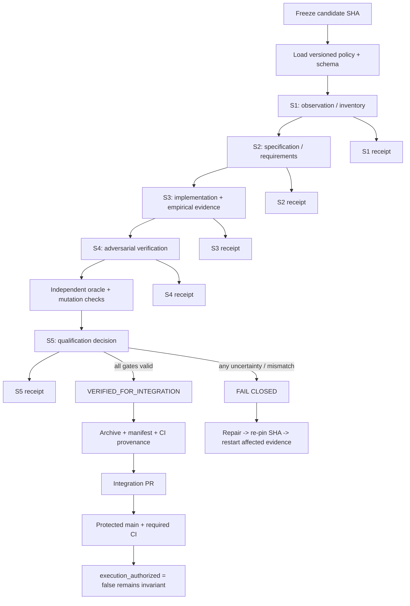
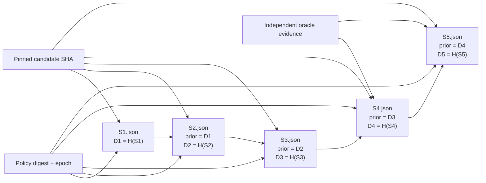

# ICARUS/AEGIS Executable Assurance Loop — Deep Research and Implementation Plan

## Executive summary

The ICARUS/AEGIS project has reached the point where **additional red-team discovery is no longer the highest-value activity**. The assurance corpus already contains the right transition instruction: freeze the discovery baseline and operate the next phase as **implement → attack → regress → qualify → map evidence → repeat**. The repository's own AEGIS implementation matrix identifies the same remaining priority sequence: training/serving skew, multi-timeframe causal leakage, research multiplicity, recovery equivalence, and finally independent-oracle/mutation testing. fileciteturn26file0L2-L10

The current repository state supports that transition. `main` remains pinned at `007e70189945b8e112904cf92b2b1a12e43792d6`. Importantly, GitHub currently reports `main` as **unprotected**, with required status-check enforcement off, so the final integration procedure should add branch protection before the work is treated as release-grade. fileciteturn30file0L2-L2 GitHub's own documentation supports requiring pull requests, successful status checks, linear history and—where appropriate—disabling bypasses on critical branches. citeturn4search0turn4search1

The active implementation lineage is not `main` itself. It is the stacked development chain:

| Component | Current state | Role |
|---|---|---|
| `main` | `007e70189945b8e112904cf92b2b1a12e43792d6` | Historical/canonical baseline |
| PR #18 | open draft, head `76569e1962e721b0f4dc973df21358f40c31ce81` | S1→S5 fail-closed control-plane runtime |
| PR #19 | open draft, stacked on #18, head `e05c122f7a8e5501d98251c7449cbe7ce3ec6dda` | AEGIS-027 point-in-time data vintage layer |
| PR #29 | open draft, stacked on #19, head `3a7da656b5e20a7b8aaa628b2b203d3e2ccaee51` | Verified CLI RED→GREEN repair; present implementation candidate head |
| PR #25 | open draft, branch `icarus/assurance-archive-20260924`, head `6f999dfae391382be6e9cb52d568b2dc3410ac1e` | Documentation/evidence archive, separate from code stack |

PR #18 explicitly implements deterministic receipt canonicalization, SHA-256 predecessor chaining, policy/schema binding, pinned-snapshot validation, evidence-origin de-duplication, S4 oracle fields, promotion gating, a read-only verifier and a separate `control-evidence` storage model, while retaining `execution_authorized=false` and making no Pulse, broker, trainer/model-feature or automatic-promotion changes. fileciteturn31file0L2-L2 PR #19 adds the AEGIS-027 provenance layer without altering the same authority boundary. fileciteturn32file0L2-L2 PR #29 then demonstrates the desired development pattern particularly well: a test-only RED commit failed on Linux and Windows, followed by the implementation commit and a successful full Linux/targeted Windows GREEN run, again without trading, Pulse, model, feature or execution-authority changes. fileciteturn34file0L2-L2

The underlying CI evidence is real rather than merely stated in PR prose. PR #18's head passed the Linux full `tests_engine` job and Windows focused engine tests, along with `icarus-control --help`, plant setup and doctor smoke checks. fileciteturn27file0L2-L2 PR #19's head subsequently passed the same Linux full suite and Windows focused suite on the stacked data-vintage implementation. fileciteturn28file0L2-L2 PR #29's head then passed the full Linux suite and Windows plant/bars/doctor path at `3a7da656...`. fileciteturn21file0L2-L2

The major architectural conclusion of this research is therefore:

> **Do not build another control plane. Finish the existing one, use PR #29's stacked head as the implementation substrate, and turn each remaining AEGIS finding into an independently testable acceptance gate feeding the S1→S5 receipt chain.**

That decision avoids three dangerous failure modes: duplicating policy authority, rewriting already-tested code, and allowing assurance specifications to drift away from executable tests.

The requested working artifacts have also been created in this session:

**[Download the new ICARUS Assurance Loop Research + Implementation Artifact Pack](sandbox:/mnt/data/ICARUS_ASSURANCE_LOOP_RESEARCH_ARTIFACTS_2026-09-26.zip)**  
SHA-256: `bea668985e053b5df3d444fb6e92b2cda82b6e650b2d99512cd7bef260d2df0b`

It contains the proposed policy manifest, a thin `pipeline_control.py` façade, S1–S5 receipt templates, test matrix, reproduction script, milestone archive-generation script, progress chart and integrity manifest. These are **research artifacts, not claims of repository commits**.

The previously delivered corpus remains separately downloadable:

**[Download ICARUS_EVERYTHING_RECOVERABLE_2026-09-24.zip](sandbox:/mnt/data/ICARUS_EVERYTHING_RECOVERABLE_2026-09-24.zip)**  
Verified SHA-256: `30ac57e08b1924221073894c3fecacd058d33a46a5c7bdefe81b4d0d1d3f554e`

I verified that archive locally in this session: it contains 18 files and approximately 790 KB of uncompressed corpus material, including the AEGIS baseline, prior work history, built/tested repository-work record, Stage-5 receipt, HELIOS/ICARUS transfer material, dossier, masterbuild handoff, S3 handoff and unified-control-cycle material.

## Verified baseline and target architecture

### What already exists and should be retained

The control plane in PR #18 is substantially closer to the desired architecture than an empty starting point. Its read-only CLI already supports canonical document digests, individual receipt validation and whole-cycle validation of `S1.json` through `S5.json`; it defaults to the versioned `icarus-control-v1.json` and `icarus-pipeline-v1.json` contracts. fileciteturn29file0L2-L10

Its test suite already exercises deterministic canonical JSON, nonfinite-number rejection, duplicate-key rejection, receipt hashing, complete S1→S5 validation, mixed policy epochs, mixed revisions, broken predecessor links, post-creation tampering, forbidden `execution_authorized=true`, mandatory S4 oracle provenance, partially independent oracle rejection, semantic promotion blockers, authority ceilings, duplicate-evidence inflation and unknown oracle values. fileciteturn25file0L2-L2

That is an important distinction: **AEGIS-023 is not starting from zero**. What remains missing is a genuinely separate implementation of the oracle. The present control-plane tests call the production canonicalization/validation modules themselves and construct an S4 fixture that labels an oracle as `INDEPENDENT`; that is appropriate for structural testing but does not by itself establish implementation independence. fileciteturn25file0L2-L2 This is exactly why AEGIS-023 remains `PARTIAL` in the project's own implementation matrix. fileciteturn26file0L2-L10

The receipt system should also continue to use deterministic canonicalization before hashing. RFC 8785 exists because cryptographic hashing and signing need invariant data representations; it also explicitly forbids duplicate object-property names in compliant input. citeturn3search1 ICARUS does not need to silently migrate its current hash semantics to RFC 8785—that could itself create a compatibility break—but the external specification strongly supports the design principle behind the existing deterministic canonicalizer.

Similarly, the receipt/provenance system is conceptually aligned with SLSA's provenance model: verifiable information should connect an artifact to **where, when and how it was produced**. citeturn2search0turn2search8 The practical ICARUS analogue is: every qualification claim must ultimately bind the candidate source SHA, policy/schema digests, evidence origins, test artifacts and predecessor receipts.

### The final control flow



The decisive rule is that **source evidence and control evidence are separate**. Code lives on the candidate branch. Durable qualification receipts live on the dedicated `control-evidence` branch described by PR #18. This prevents writing a receipt from changing the source SHA that the receipt is supposed to certify. fileciteturn31file0L2-L2

### Receipt-chain structure



The chain should never be interpreted as a blockchain or as proof that the scientific claim is true. It is a tamper-evident structural provenance chain. PR #18's own description makes that limitation explicit: a clean chain proves structural handoff coherence, not scientific validity or permission to merge/deploy/trade. fileciteturn31file0L2-L2

### Policy authority

The requested `PIPELINE_POLICY.json` should be committed, but **not as a second independent copy of the policy**. PR #18 already has:

```text
docs/icarus-control-plane/contracts/icarus-control-v1.json
docs/icarus-control-plane/contracts/icarus-pipeline-v1.json
```

The safer design is:

```text
PIPELINE_POLICY.json
    ├── policy_contract_path
    ├── policy_contract_digest
    ├── schema_contract_path
    ├── schema_contract_digest
    ├── execution_authorized: false
    ├── receipt_storage_branch: control-evidence
    ├── required_stages: [S1,S2,S3,S4,S5]
    └── active_assurance_findings
```

This makes the new root file a **policy manifest**, not a second policy implementation. CI should recompute both referenced contract digests and reject a mismatch.

The artifact pack contains a proposed version:

`PIPELINE_POLICY.proposed.json`

It deliberately labels itself `PROPOSED_NOT_COMMITTED`.

Likewise, the requested `pipeline_control.py` should be a **thin integration façade** over `icarus_control.validation`, not a copy of that validator. A second Python validator sharing the same conceptual implementation would increase maintenance and create apparent independence without actual oracle diversity. The artifact pack therefore contains `pipeline_control.proposed.py` whose verification functions delegate to the existing production validator and separately enforce that the returned authority remains false.

## Implementation workstream mapped to code

The repository's own matrix currently describes AEGIS-029 as `PARTIAL`, AEGIS-026 and AEGIS-030 as `STRONG PARTIAL`, AEGIS-020 as `STRONG PARTIAL`, and AEGIS-023 as `PARTIAL`. fileciteturn26file0L2-L10 Those classifications are reasonable after direct source inspection.

### Priority implementation map

| Finding | Existing repository evidence | Precise next implementation | Target files/modules | Explicit non-changes |
|---|---|---|---|---|
| **AEGIS-029 — Training/serving skew** | Frozen ordered `FEATURE_KEYS`, deterministic trainer dataset path and current trainer reports | Introduce a **read-only feature/preprocessing contract sidecar** that fingerprints ordered feature names, numeric coercion, missing-value behavior, time normalization, event-feature semantics, label horizon, walk-forward configuration, source/vintage identity and subject implementation digest. Bind that contract into S3/S4 assurance receipts rather than modifying model behavior. | New `icarus_engine/assurance/feature_contract.py`; new `tests_engine/test_feature_contract.py`; receipt payload/schema additions; optional assurance sidecar artifact under `run/assurance/` | No changes to `FEATURE_KEYS`; no trainer slot changes; no model coefficients/math; no Pulse changes |
| **AEGIS-026 — MTF causal leakage** | `Aggregator` distinguishes live `forming` state from closed bars and drops already-closed late buckets | Formalize an assurance-layer aggregate envelope with `PARTIAL/FINAL`, `decision_cutoff_ts`, `observed_through_ts`, bucket boundaries and source digest. Add future-tail mutation and incremental-vs-historical tests. | New `icarus_engine/assurance/timeframe_contract.py`; `tests_engine/test_timeframe_causality.py`; possible test fixtures around `icarus_engine/pine/timeframe.py` | No strategy/Pulse logic change |
| **AEGIS-030 — Research multiplicity** | Search is bounded by `max_trials`, duplicate values inside one grid are rejected, selection uses train/validation, persistent holdout ledger prevents reuse | Add a persistent **research-exposure ledger** spanning studies, assets, timeframes, agents and metrics. Record all proposed/evaluated/rejected candidate families before winner selection. Prevent renaming/duplication from resetting exposure. Record lockbox/holdout touches. | New `icarus_engine/assurance/research_exposure.py`; bounded integration points in `icarus_engine/research.py`; `tests_engine/test_research_multiplicity.py` | No model/trainer/Pulse changes; no weakened holdout rule |
| **AEGIS-020 — Recovery equivalence** | WAL-backed `WorkflowJournal`, atomic stage claims, input hashes, no automatic uncertain retry, persistent terminal state | Add canonical checkpoint envelopes and an uninterrupted-vs-restarted differential harness. Safe deterministic work may resume; any provider stage already attempted but without verified result remains `outcome_unknown` and cannot retry automatically. | New `icarus_engine/assurance/checkpoint.py`; targeted integration with `icarus_engine/orchestration.py`; `tests_engine/test_recovery_equivalence.py`; existing frozen replay fixtures | No execution path changes; never convert unknown provider outcome into successful evidence |
| **AEGIS-023 — Validator monoculture** | Extensive production-validator negative tests and mandatory S4/S5 oracle fields | Add a **genuinely separate oracle implementation**, preferably a small Node/JS verifier or other implementation that imports no Python production validator code; add seeded mutation/fault-injection campaign and oracle-disagreement gate. | New `tools/oracles/icarus_receipt_oracle.mjs`; `tests_engine/test_assurance_oracle.py`; `tests_engine/test_control_plane_mutation.py`; CI assurance-oracle job | No self-certification; no claiming duplicated Python validator is independent |

The current trainer implementation explains why AEGIS-029 needs to come first. `FEATURE_KEYS` is an ordered frozen tuple in `spec.py`. fileciteturn15file0L2-L10 `dataset.py` performs numeric coercion, drops nonfinite values, normalizes large timestamps, substitutes certain missing OHLC values, sorts bars, constructs event-based features and finally emits features using `FEATURE_KEYS` ordering. fileciteturn14file0L2-L10 `train_file()` binds the source dataset SHA-256 and emits descriptive training/validation/holdout statistics, but its current returned report does not contain a versioned digest representing that full feature/preprocessing contract. fileciteturn16file0L2-L10

That last point is an inference from the current returned report fields, but it is precisely the gap AEGIS-029 describes: a dataset hash alone does not prove that a future serving path uses identical feature order, units, missingness rules and preprocessing semantics. The no-trainer/model-change constraint means the first implementation should therefore be **external binding, not trainer modification**.

The AEGIS-026 work can similarly avoid touching Pulse. `Aggregator` already has distinct `forming` and closed representations, exposes a `forming_bar()` snapshot, drops late data for already-closed buckets, and has explicit close behavior. fileciteturn17file0L1-L10 That gives us the right primitive. What remains is to prove that a decision made at cutoff \(t\) cannot change when bars after \(t\) are later appended.

Formally, for any feature extraction function \(F\):

\[
F(D_{\le t}, t) = F(D_{\le t}\cup D_{>t}', t)
\]

for every permissible mutation \(D_{>t}'\) occurring strictly after the decision cutoff. A single future-tail mutation that changes an earlier qualification feature is sufficient to fail AEGIS-026.

AEGIS-030 also has a strong base rather than a blank slate. Current `research.py` explicitly says selection occurs on train/validation and uses a persistent ledger to prevent holdout reuse. It bounds `max_trials`, rejects duplicate candidate values inside a grid and later chooses among eligible candidates using validation/train metrics. fileciteturn24file0L2-L2 fileciteturn24file2 fileciteturn24file3 The unresolved risk is **search exposure across separate studies**: an adaptive researcher can effectively run many bounded 32-trial searches and only present the successful one. The exposure ledger must make the full search process, not merely the surviving winner, the qualification subject.

For AEGIS-020, the repository already has durability semantics worth preserving. `WorkflowJournal` uses SQLite WAL transactions, canonical request identities, atomic claims, stage-level input hashes and explicit `outcome_unknown` handling; an already-attempted uncertain stage is not automatically retried. fileciteturn22file0L1-L10 Existing tests already exercise idempotence, atomic duplicate suppression, budget handling and uncertain-call no-retry behavior. fileciteturn23file0L2-L10 Recovery equivalence should extend—not replace—this behavior.

### Proposed branch sequence

Do **not** merge the current stacked drafts individually into `main` while simultaneously changing the assurance substrate. Instead, use the verified PR #29 head as the present working substrate and stack tightly bounded finding PRs:

```text
main @ 007e7018...
   |
   +-- historical/document archive: PR #25
   |
   +-- PR #18 control plane
        |
        +-- PR #19 data vintage
             |
             +-- PR #29 CLI regression @ 3a7da656...
                  |
                  +-- chatgpt/icarus-assurance-029-contract-20260926
                       |
                       +-- chatgpt/icarus-assurance-026-causal-mtf-20260926
                            |
                            +-- chatgpt/icarus-assurance-030-exposure-20260926
                                 |
                                 +-- chatgpt/icarus-assurance-020-recovery-20260926
                                      |
                                      +-- chatgpt/icarus-assurance-023-oracle-20260926
                                           |
                                           +-- assurance/integration-candidate
```

After that stack is fully qualified, produce **one integration comparison against `main`**. That is the moment to decide whether to preserve the historical individual PRs or supersede them with a clean integration PR.

PR #25 should remain evidence/documentation only. Its own scope says it contains the AEGIS 001–030 baseline and associated handoff/verification material but does not change engine, strategy, execution, Pine, trainer or test code. fileciteturn33file0L2-L2 That separation is useful and should be retained.

## Verification matrix and progress gates

The following matrix is the executable definition of “done.” A finding does not close because code exists; it closes when **all specified negative controls pass at one pinned revision and the corresponding evidence is represented in the receipt chain**.

| Finding | Required verification tests | Acceptance criterion | Failure criterion | Responsible branch / PR |
|---|---|---|---|---|
| **029** | Golden feature-contract vector; feature-order mutation; numeric/missingness mutation; time-unit mutation; event-feature provenance mutation; data-vintage mismatch; same-event-stream parity | Exact parity for all declared fields; every behavior-relevant mutation changes contract identity or causes qualification rejection | Any altered preprocessing remains identity-equivalent; any serving subject lacks bound contract; unknown serving path treated as qualified | `chatgpt/icarus-assurance-029-contract-20260926`; based on PR #29 |
| **026** | Future-tail mutation; PARTIAL-vs-FINAL identity; incremental-vs-batch causal replay; missing sub-bars; late bar after close; daily/weekly/session boundary; DST boundary | Earlier result invariant to all future mutations; PARTIAL never promoted as FINAL; cutoff/knowledge time explicit | Future information changes earlier result; status missing; finality inferred from wall-clock ambiguity | `chatgpt/icarus-assurance-026-causal-mtf-20260926` |
| **030** | Same candidate renamed; redundant candidate duplicated; failed candidates retained; adaptive second study; multi-asset/timeframe exposure; repeated metric selection; null-search benchmark; holdout-touch accounting | Exposure count cannot decrease/reset; equivalent candidates do not create fresh statistical authority; all search history precedes final qualification | Winner can be detached from failed search history; new study ID resets exposure; reused holdout appears unseen | `chatgpt/icarus-assurance-030-exposure-20260926` |
| **020** | Uninterrupted vs restart trace; restart before provider call; restart after stage commit; crash during checkpoint write; corrupt digest; wrong candidate SHA; wrong policy epoch; pending joins; `outcome_unknown` attempted provider stage | Either exact observational equivalence or explicit fail-closed state; no automatic retry of unknown external calls | Restart silently drops relevant state, duplicates external action, changes qualification population or increases authority | `chatgpt/icarus-assurance-020-recovery-20260926` |
| **023** | Independent oracle golden vectors; independent digest computation; malformed receipt corpus; single-field mutation matrix; predecessor mutation; policy/snapshot mutation; evidence-lineage mutation; authority mutation; deliberate production-validator defect | Independent implementation catches seeded faults; disagreement blocks S5; production code is not imported by oracle | Same implementation validates itself; mutation survives; disagreement is ignored; oracle status promoted by declaration alone | `chatgpt/icarus-assurance-023-oracle-20260926` |
| **Cross-cutting** | Linux full suite; Windows target suite; `icarus-control` verification; doctor; archive manifest; exact candidate SHA comparison | All required checks green at exact candidate SHA; receipt chain valid; `execution_authorized=false` | Missing CI, mixed SHA, mixed policy, receipt gap or archive mismatch | final assurance integration candidate |

PR #29 is a useful precedent because it already executed the intended RED→GREEN discipline rather than writing a test after the fix: the initial test commit failed in both OS jobs, while the implementation commit subsequently passed. fileciteturn34file0L2-L2 That should become mandatory for every remaining finding where a deterministic failing regression can be constructed.

### Test-coverage progress

The chart below intentionally shows **projected finding-level acceptance coverage**, not Python line coverage. The baseline is zero of the five priority findings *formally closed at the complete acceptance gate*, even though several have strong partial controls today. A milestone increments only after its RED→GREEN suite, full regression and receipt evidence are all green.


This conservative interpretation matches the project's own matrix, which warns that `STRONG PARTIAL` is not equivalent to `VERIFIED_FOR_INTEGRATION`. fileciteturn26file0L2-L10

### Stage evidence expected from each finding

The finding PRs should feed the control cycle rather than create their own independent maturity language:

| Stage | Required evidence |
|---|---|
| **S1** | Candidate SHA; repository snapshot set; existing implementation inventory; immutable constraints |
| **S2** | Exact finding invariant; acceptance tests; explicit forbidden changes; dependency/conflict graph |
| **S3** | RED test evidence; implementation diff; GREEN focused tests; full regression result |
| **S4** | Mutation/fault-injection results; independent vectors; oracle provenance; adversarial failures that were detected |
| **S5** | Exact CI run IDs; final candidate SHA; complete receipt chain; unresolved-risk disposition; integration decision |

No stage can retroactively reclassify missing evidence as successful evidence.

## Hourly loop cadence and commit artifacts

The hourly cadence should be treated as **work sequencing**, not as an asynchronous promise. Each working slot begins by re-reading the branch head and ends with a durable artifact. A slot does not advance merely because an hour has elapsed.

| Loop slot | Primary work | Exit artifact | Gate |
|---|---|---|---|
| **Baseline slot** | Freeze PR #29 head ancestry; snapshot current contracts, branch state and full CI baseline | S1 baseline receipt + candidate manifest | Exact SHA and policy digests recorded |
| **A029 RED slot** | Add contract/parity tests only | Failing tests proving current unbound feature contract | Failure must be for intended reason |
| **A029 GREEN slot** | Implement sidecar feature contract; no trainer/model change | Passing focused tests + S3 evidence | Full suite green |
| **A026 RED slot** | Future-tail and PARTIAL/FINAL tests | Deterministic leakage/finality regression suite | Test demonstrates the missing guarantee |
| **A026 GREEN slot** | Add causal aggregate contract/wrapper | Passing cutoff invariance suite | No Pulse change |
| **A030 RED slot** | Cross-study exposure/reset tests | Failing multiplicity tests | Existing single-study controls remain green |
| **A030 GREEN slot** | Add persistent exposure ledger and qualification binding | Research exposure artifact | Renames/duplicates cannot reset history |
| **A020 RED slot** | Differential uninterrupted/restart harness | Reproducible divergence/fail-closed test corpus | External uncertain calls never retried |
| **A020 GREEN slot** | Add canonical checkpoint envelope/recovery gate | Recovery equivalence evidence | Equal trace or explicit block |
| **A023 oracle slot** | Implement separate oracle | Independent verifier + golden vectors | No import of `icarus_control` |
| **A023 mutation slot** | Seed defects across policy, receipt, MTF, research and recovery logic | Mutation kill report | Every mandatory mutation detected |
| **Qualification slot** | Run full Linux/Windows CI against frozen final SHA | S4 evidence + S5 receipt | No mixed revision/policy |
| **Packaging slot** | Build immutable downloadable archive | ZIP + manifest + SHA-256 + optional attestation | Archive verifies byte-for-byte |
| **Integration slot** | Compare candidate against `main`; enable required protections/checks | final integration PR | No merge while mandatory check is absent |

At every slot, the loop is:

```text
PIN
  ↓
WRITE THE FAILURE
  ↓
RUN RED
  ↓
IMPLEMENT MINIMUM CONTROL
  ↓
RUN GREEN
  ↓
RUN RELATED REGRESSION
  ↓
RUN FULL REGRESSION
  ↓
ATTACK THE CONTROL
  ↓
WRITE RECEIPT
  ↓
REFRESH ARCHIVE
  ↓
PIN NEXT SHA
```

This cadence embodies NIST SSDF's broader principle that secure development practices need to be integrated into the normal development lifecycle rather than treated as a final inspection step. citeturn3search0

### Required repository artifacts

The target committed set should be:

```text
PIPELINE_POLICY.json

icarus_control/
    canonical.py
    validation.py
    cli.py
    ... existing PR #18 code ...

icarus_engine/
    pipeline_control.py
    assurance/
        __init__.py
        feature_contract.py
        timeframe_contract.py
        research_exposure.py
        checkpoint.py

tools/
    oracles/
        icarus_receipt_oracle.mjs
    refresh_assurance_archive.py

tests_engine/
    test_control_plane.py
    test_pipeline_control.py
    test_feature_contract.py
    test_timeframe_causality.py
    test_research_multiplicity.py
    test_recovery_equivalence.py
    test_assurance_oracle.py
    test_control_plane_mutation.py
    fixtures/
        assurance/
            canonical_vectors/
            mtf_vectors/
            recovery_vectors/
            null_search_vectors/

docs/
    icarus-control-plane/
        contracts/
            icarus-control-v1.json
            icarus-pipeline-v1.json
        AEGIS_IMPLEMENTATION_MATRIX.md
        REQUIREMENT_TRACEABILITY.md

.github/
    workflows/
        test.yml

# separate control-evidence branch
receipts/
    <cycle-id>/
        S1.json
        S2.json
        S3.json
        S4.json
        S5.json
        verification-summary.json
        MANIFEST.sha256
```

`pipeline_control.py` must remain an adapter, while `icarus_control.validation` remains the production validation authority. **The independent oracle must be elsewhere and must not call that production code.**

### Receipt payload additions

The findings require a small set of typed fields beyond generic claims/evidence:

```json
{
  "assurance_findings": {
    "AEGIS-029": {
      "feature_contract_digest": "sha256:...",
      "feature_subject_digest": "sha256:...",
      "data_vintage_identity": "sha256:...",
      "parity_status": "PASS"
    },
    "AEGIS-026": {
      "causal_contract_digest": "sha256:...",
      "future_tail_mutation_status": "PASS",
      "partial_final_status": "PASS"
    },
    "AEGIS-030": {
      "research_exposure_head": "sha256:...",
      "candidate_family_count": 0,
      "holdout_touch_count": 0,
      "null_search_status": "PASS"
    },
    "AEGIS-020": {
      "checkpoint_contract_digest": "sha256:...",
      "restart_equivalence_status": "PASS_OR_FAIL_CLOSED"
    },
    "AEGIS-023": {
      "oracle_implementation_digest": "sha256:...",
      "oracle_language": "javascript",
      "mutation_manifest_digest": "sha256:...",
      "mutation_status": "PASS"
    }
  }
}
```

Values such as counts above are schema examples, not present empirical measurements.

## Risk controls and fail-closed rules

The project's immutable constraints remain the governing boundary: `execution_authorized=false`, no synthetic bars promoted as empirical evidence, no invented trainer slots/features, no Pulse rewrite, fail-closed qualification, deterministic provenance/replay where declared, strict temporal integrity, and no increase in authority from increased uncertainty. Those constraints are explicitly preserved in the AEGIS matrix and in the archive PR. fileciteturn26file0L2-L10 fileciteturn33file0L2-L2

The implementation should operationalize them with the following gate table:

| Condition | Machine response | Promotion permitted? |
|---|---|---:|
| Any receipt has `execution_authorized != false` | `AUTHORITY_VIOLATION` | **No** |
| Missing S1–S5 stage | `INCOMPLETE_PIPELINE` | **No** |
| Different policy version/epoch/digest | `MIXED_POLICY` | **No** |
| Different candidate revision/snapshot | `MIXED_REVISION` | **No** |
| Broken predecessor digest | `INVALID_HANDOFF_CHAIN` | **No** |
| Competing receipt for same cycle/stage with different digest | `COMPETING_AUTHORITY` | **No** |
| Byte-identical duplicate receipt | suppress duplicate; retain one origin | No new authority |
| Unknown schema/version/enum | `UNSUPPORTED_CONTRACT` | **No** |
| Feature-contract mismatch | `TRAINING_SERVING_SKEW` | **No** |
| Serving feature path cannot be identified | `SERVING_PATH_UNVERIFIED` | **No model-serving claim** |
| Future-tail changes earlier feature/output | `CAUSALITY_VIOLATION` | **No** |
| Aggregate finality unavailable | `PARTIAL` | Cannot claim `FINAL` |
| Research history incomplete | `SEARCH_EXPOSURE_UNKNOWN` | **No** |
| Holdout previously exposed | `HOLDOUT_CONSUMED` | **No** |
| Checkpoint corrupt or bound to wrong SHA/policy | `RECOVERY_UNVERIFIABLE` | **No** |
| Provider outcome uncertain | `OUTCOME_UNKNOWN`; never automatic retry | **No** |
| Production validator and independent oracle disagree | `ORACLE_DISAGREEMENT` | **No** |
| Mutation expected to be caught survives | `ASSURANCE_TEST_FAILURE` | **No** |
| CI absent/pending/failed | `BUILD_UNVERIFIED` | **No** |
| Archive manifest mismatch | `ARTIFACT_INTEGRITY_FAILURE` | **No distribution as qualified artifact** |

The recovery rule deserves special emphasis. Existing orchestration intentionally records an uncertain provider stage as `outcome_unknown` and refuses automatic repetition of an already-attempted stage. fileciteturn22file0L1-L10 That is the correct default for a system where retrying an external side effect could create duplicate or untraceable evidence. AEGIS-020 should not weaken it in pursuit of convenience.

The research rule deserves the same emphasis. Existing code already prevents reuse of overlapping holdout history and refuses to treat dataset revision as a fresh authorization key. fileciteturn24file0L2-L2 AEGIS-030 must extend that conservatism across the *search process*, not replace the holdout ledger.

### Independent oracle requirement

For AEGIS-023, a valid oracle architecture is:

```text
Production validator:
    Python
    icarus_control.validation
    icarus_control.canonical

Independent oracle:
    JavaScript / Node
    tools/oracles/icarus_receipt_oracle.mjs
    NO imports from production Python
    independently parses documented contract
    independently canonicalizes declared supported subset
    independently walks S1→S5 links
```

Then test both implementations against the same frozen vectors and against deliberately corrupted vectors.

This is materially stronger than creating `validation_v2.py` next to `validation.py`.

Still, even two implementations in one repository are not absolute independence: they share requirements, fixtures, source control and CI infrastructure. S4 should record those remaining common causes explicitly. That is more honest than using the word `INDEPENDENT` as a blanket property.

### Source-control hardening

`main` is currently reported by GitHub as unprotected with status-check enforcement disabled. fileciteturn30file0L2-L2 Before final integration, the repository should require at minimum:

```text
Pull request required
Full Linux engine check required
Windows compatibility check required
Independent assurance-oracle check required
Mutation gate required
Branch up-to-date before merge
No force pushes
No deletions
Conversation resolution
Prefer linear history
Do not allow bypass for the final assurance gate where repository plan permits
```

GitHub supports these controls natively through branch-protection rules and required checks. citeturn4search0turn4search1

## Reproduction, CI and packaging commands

The current PR #18 CLI provides `digest`, `validate-receipt` and `validate-cycle`, so the following command set is grounded in the repository's actual interface rather than hypothetical syntax. fileciteturn29file0L2-L10

### Reproduce the current stacked implementation baseline

```bash
git clone https://github.com/reppiks490/Icarus.git
cd Icarus

git fetch --all --prune

# Current inspected stacked implementation head:
git checkout --detach 3a7da656b5e20a7b8aaa628b2b203d3e2ccaee51

test "$(git rev-parse HEAD)" = \
  "3a7da656b5e20a7b8aaa628b2b203d3e2ccaee51"

python -m venv .venv
source .venv/bin/activate

python -m pip install --upgrade pip
python -m pip install -e ".[dev]"

# Repository-wide suite
python -m pytest tests_engine -q

# High-value bounded suites
python -m pytest tests_engine/test_control_plane.py -q
python -m pytest tests_engine/test_data_vintage.py -q
python -m pytest tests_engine/test_orchestration.py -q
python -m pytest tests_engine/test_research.py -q
python -m pytest tests_engine/test_trainers.py -q
python -m pytest \
  tests_engine/test_plant.py \
  tests_engine/test_bars.py \
  tests_engine/test_doctor.py -q

icarus-control --help
python -m icarus_engine.cli doctor --json
```

That reproduces the test categories run by the current GitHub workflow; the current PR #29 head has already passed the full Linux suite and Windows focused plant/bars/doctor suite in Actions. fileciteturn21file0L2-L2

Windows equivalent:

```powershell
py -m venv .venv
.\.venv\Scripts\python.exe -m pip install --upgrade pip
.\.venv\Scripts\python.exe -m pip install -e ".[dev]"

.\.venv\Scripts\python.exe -m pytest `
  tests_engine/test_plant.py `
  tests_engine/test_bars.py `
  tests_engine/test_doctor.py -q
```

### Verify control artifacts

```bash
# Policy/schema digest
icarus-control digest \
  docs/icarus-control-plane/contracts/icarus-control-v1.json

icarus-control digest \
  docs/icarus-control-plane/contracts/icarus-pipeline-v1.json

# One receipt
icarus-control validate-receipt \
  control-evidence/receipts/20260926-A029/S3.json

# Complete cycle
icarus-control validate-cycle \
  control-evidence/receipts/20260926-FINAL
```

A nonzero result from a receipt/cycle validation is a qualification failure, not something the packaging step should suppress.

### Recommended new finding suites

After each implementation lands:

```bash
python -m pytest tests_engine/test_feature_contract.py -q
python -m pytest tests_engine/test_timeframe_causality.py -q
python -m pytest tests_engine/test_research_multiplicity.py -q
python -m pytest tests_engine/test_recovery_equivalence.py -q
python -m pytest tests_engine/test_assurance_oracle.py -q
python -m pytest tests_engine/test_control_plane_mutation.py -q

# Then, always:
python -m pytest tests_engine -q
```

### Build repository snapshots and complete Git transfer objects

For every qualified candidate:

```bash
SHA="$(git rev-parse HEAD)"
mkdir -p dist

git archive \
  --format=zip \
  --output="dist/Icarus-source-${SHA}.zip" \
  "${SHA}"

git bundle create \
  "dist/Icarus-history-${SHA}.bundle" \
  --all

sha256sum \
  "dist/Icarus-source-${SHA}.zip" \
  "dist/Icarus-history-${SHA}.bundle"
```

The `git archive` file captures the exact tracked tree at the candidate SHA; the Git bundle captures repository history/refs needed for a more complete transfer.

### Refresh the everything archive

The new artifact pack includes a working script:

**[Download the complete research artifact pack containing `scripts/refresh_archive.py`](sandbox:/mnt/data/ICARUS_ASSURANCE_LOOP_RESEARCH_ARTIFACTS_2026-09-26.zip)**

Its planned usage is:

```bash
python scripts/refresh_archive.py \
  --repo . \
  --cycle 20260926-A029 \
  --out-dir dist \
  --source-archive \
    /path/to/ICARUS_EVERYTHING_RECOVERABLE_2026-09-24.zip
```

The script is deliberately conservative. It:

```text
requires a clean Git worktree
captures the exact HEAD SHA
creates git archive source snapshot
creates a complete Git bundle
records the prior archive's SHA-256
includes receipts only if they actually exist
writes ARCHIVE_METADATA.json
writes MANIFEST.sha256
builds a new versioned ZIP
prints the final ZIP SHA-256
```

It does **not** fabricate missing receipts.

### Add build provenance for distributable milestone archives

Once an archive is produced in GitHub Actions, it should become eligible for GitHub artifact attestation:

```yaml
permissions:
  contents: read
  id-token: write
  attestations: write

steps:
  - name: Generate milestone archive
    run: >
      python tools/refresh_assurance_archive.py
      --repo .
      --cycle "${{ github.sha }}"
      --out-dir dist

  - name: Attest archive
    uses: actions/attest@v4
    with:
      subject-path: "dist/ICARUS_EVERYTHING_*.zip"
```

GitHub's current official documentation specifies `id-token: write`, `contents: read` and `attestations: write` for build attestations using `actions/attest@v4`. citeturn2search1 The resulting artifact can then be checked with `gh attestation verify`. citeturn2search1

An attestation still must **not** be equated with software safety. GitHub explicitly warns that attestation establishes provenance/integrity context, not that the artifact itself is secure. citeturn2search4 That fits ICARUS perfectly: provenance tells us what was tested; the AEGIS gates determine whether the evidence is sufficient.

## Archive refresh, milestone policy and completion definition

The existing `ICARUS_EVERYTHING_RECOVERABLE_2026-09-24.zip` should now become **immutable historical input**. Never overwrite it. Its verified SHA-256 remains:

```text
30ac57e08b1924221073894c3fecacd058d33a46a5c7bdefe81b4d0d1d3f554e
```

Each milestone creates a new archive:

```text
ICARUS_EVERYTHING_<cycle>_<sha12>.zip
```

For example:

```text
ICARUS_EVERYTHING_20260926-A029_abc123def456.zip
ICARUS_EVERYTHING_20260926-A026_def789abc012.zip
ICARUS_EVERYTHING_20260926-A030_...
ICARUS_EVERYTHING_20260926-A020_...
ICARUS_EVERYTHING_20260926-A023_...
ICARUS_EVERYTHING_20260926-FINAL_...
```

Each archive should contain, at minimum:

| Archive component | Purpose |
|---|---|
| Original `ICARUS_EVERYTHING_RECOVERABLE_2026-09-24.zip` or its preserved hash/reference | Chain back to prior work |
| Exact source `git archive` | Reconstruct candidate tree |
| Git bundle | Preserve source history |
| `ARCHIVE_METADATA.json` | Candidate SHA, cycle, policy and authority metadata |
| `MANIFEST.sha256` | Byte-level contents integrity |
| `PIPELINE_POLICY.json` | Policy manifest |
| Policy/schema contracts | Interpret receipts |
| S1–S5 receipts | Qualification provenance |
| Test matrix | Requirement-to-test mapping |
| RED evidence | Proof test existed before fix where applicable |
| GREEN evidence | Focused implementation pass |
| Full CI metadata | Linux/Windows status and exact SHA |
| Mutation report | AEGIS-023 evidence |
| Independent-oracle report | AEGIS-023 evidence |
| Feature contract | AEGIS-029 evidence |
| MTF causal vectors | AEGIS-026 evidence |
| Research exposure ledger snapshot/head | AEGIS-030 evidence |
| Recovery differential result | AEGIS-020 evidence |
| Archive attestation bundle, when generated | Build provenance |

The archive should be refreshed **after every accepted milestone**, not every intermediate edit. A failing RED state should be retained as CI/commit evidence, but it does not need to become the user's primary “everything” ZIP unless it identifies a historically important defect.

### Milestone promotion logic

A milestone becomes archive-worthy only when:

\[
M =
C \land F \land R \land P \land A
\]

where:

- \(C\) = focused change-specific tests pass,
- \(F\) = full repository regression passes,
- \(R\) = receipt/evidence for the milestone is complete,
- \(P\) = one exact policy/snapshot identity is preserved,
- \(A\) = authority constraints remain unchanged.

Any false term means:

\[
M = \text{NOT\_QUALIFIED}
\]

There should be no weighted scoring that allows four strong results to compensate for one broken provenance condition.

### Final completion criteria

The remaining implementation phase is complete only when all of the following statements are simultaneously true:

| Completion statement | Required status |
|---|---:|
| AEGIS-029 feature/preprocessing contract is executable and mismatch-tested | PASS |
| AEGIS-026 future-tail causal invariance is verified | PASS |
| AEGIS-030 cross-study research exposure is durably accounted for | PASS |
| AEGIS-020 recovery is equivalent or explicitly fail-closed across tested cut points | PASS |
| AEGIS-023 genuinely separate oracle detects the mandatory mutation set | PASS |
| PR #18 control-plane semantics survive complete regression | PASS |
| PR #19 PIT/vintage controls survive complete regression | PASS |
| PR #29 CLI behavior survives complete regression | PASS |
| Linux mandatory CI | PASS |
| Windows mandatory CI | PASS |
| S1→S5 receipt chain | VALID |
| Policy chain | CONSISTENT |
| Snapshot chain | CONSISTENT |
| Evidence lineage | VALID |
| Material conflicts | NONE OPEN |
| Independent-oracle status | SUFFICIENT FOR DECLARED CLAIM |
| Candidate archive manifest | VALID |
| `execution_authorized` | **FALSE** |
| Pulse rewrite | **NONE** |
| Trainer/model behavior change | **NONE** |
| Candidate merged into protected `main` without mandatory checks | **FORBIDDEN** |

At that point, “done” means **verified for integration**, not “authorized to trade.” The latter remains outside this loop because every current contract and PR preserves `execution_authorized=false`. fileciteturn31file0L2-L2 fileciteturn32file0L2-L2 fileciteturn34file0L2-L2

The immediate continuation target is therefore unambiguous: **freeze PR #29 head as the present substrate, create the AEGIS-029 contract/parity RED tests without touching trainer/model/Pulse behavior, implement the sidecar contract to GREEN, run the full regression, emit the first new receipt-backed milestone, refresh the downloadable archive, then advance in order through 026 → 030 → 020 → 023.** This is the shortest path from a sophisticated assurance corpus to a reproducible, attackable and eventually independently verifiable build.