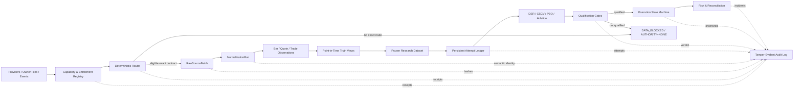
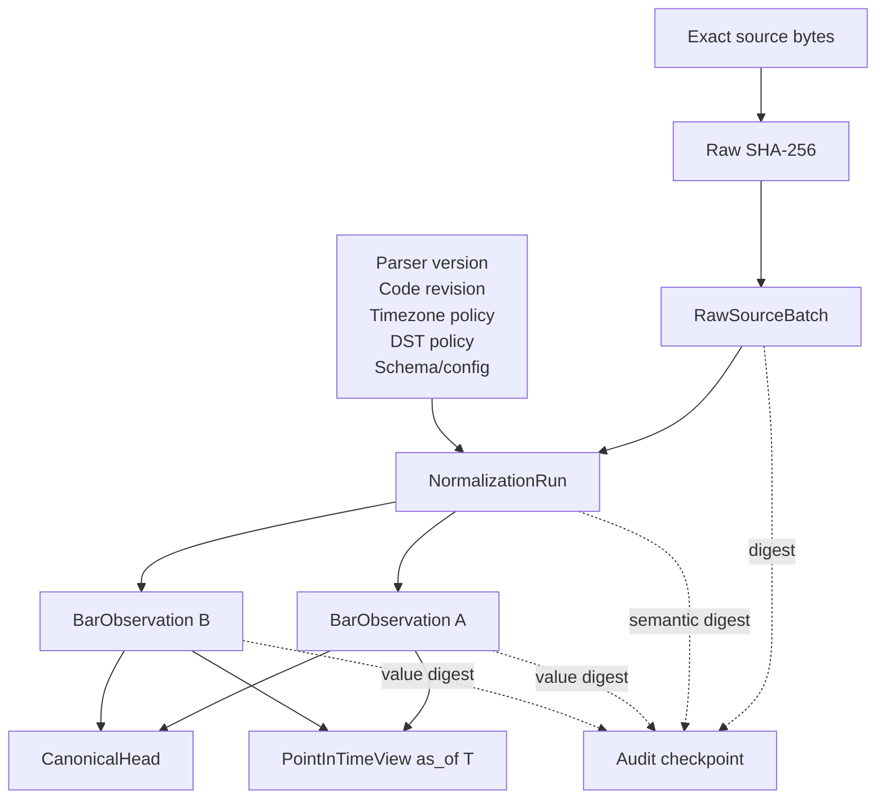
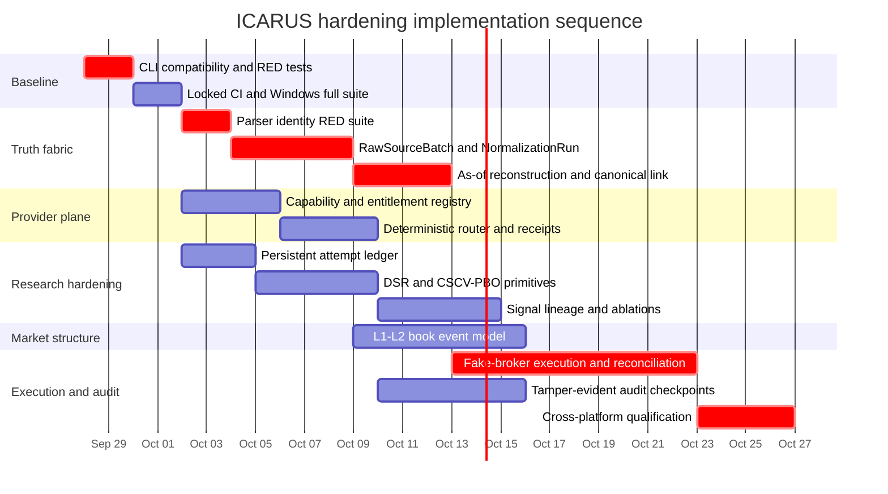

# ICARUS Masterbuild Continuation and Research-Hardening Audit

## Executive summary

This audit was performed on **September 26, 2026** against the two packaged ICARUS archives available in this session, the live `reppiks490/Icarus` repository and its draft pull requests, GitHub Actions evidence, official provider documentation where available, and primary research underlying the proposed statistical and microstructure hardening.

The most important finding is that **`ICARUS_EVERYTHING_SUPERSET_2026-09-24_UPDATED.zip` and `ICARUS_FULL_PACKAGE.zip` are byte-for-byte identical**. Each is exactly **120,149 bytes**, contains **19 top-level ZIP members**, expands to **223,676 bytes**, and has SHA-256:

`a14bb9437d389a512de0d1b74d1647e3c7ca215e16004bd99f1e3c8d27416e7e`

That is good for integrity, but the package name should not be interpreted as a complete Git repository snapshot. The archives contain **handoff documentation, evidence ledgers, historical artifacts, PR/run references, findings, and one nested earlier work package**. They contain **no runnable repository source files, no test source files, no `.git` object database, and no PR patch/diff bundle**. Code and tests are instead pinned by repository SHAs, PR heads, and CI run IDs. This distinction is already acknowledged by the package's own `ARCHIVE_LIMITATIONS.md`.

The strongest repository-level conclusion is that the previously observed CI failure has been correctly narrowed. Historical Actions run `35955725879` showed that the **Linux full test suite and Windows focused suite passed before both jobs failed on `icarus_plant setup --root ...`**. The parser defines `--root` globally, while the CLI documentation advertises it after the subcommand. The stacked PR workflow now uses `python -m icarus_plant --root DIR setup`, and PR #19's current pinned workflow run succeeds on both operating systems. Thus, **current CI has a verified workaround, but the documented CLI contract remains defective**. fileciteturn2file0L8-L13 fileciteturn25file0L2-L2 fileciteturn26file0L2-L2 fileciteturn27file0L2-L2

The highest-severity new data-integrity issue remains **`DATA-VINTAGE-PARSER-IDENTITY-001`**. PR #19's vintage implementation computes `batch_id` from raw-file SHA-256, source kind, symbol, and timeframe; parser/normalization semantics are not part of the identity. An exact duplicate `batch_id` returns immediately with zero new observations. Therefore, identical raw bytes parsed under different timezone or parser semantics can produce different canonical bars while the vintage ledger treats the second normalization as a duplicate. The existing regression test uses timezone-aware timestamps and does not cover this condition. fileciteturn29file0L2-L2 fileciteturn30file0L2-L2

The correct repair is architectural rather than a one-field patch:

```text
RawSourceBatch
      ↓
NormalizationRun
      ↓
BarObservation
      ↓
CanonicalHead / PointInTimeView
```

The raw source identity must answer **“what bytes did we receive?”** while the normalization identity separately answers **“under exactly what parser, timezone, DST, schema, and code semantics were those bytes interpreted?”**. This design makes historical `as_of` reconstruction and later parser upgrades reproducible without conflating raw-source duplication with semantic normalization duplication.

Research governance is already better than a typical backtest harness: ICARUS separates train/validation/holdout intervals, persists holdout consumption, uses frozen replay provenance, and applies stressed execution costs; its own research code correctly warns that selection over many variants can overfit and that one holdout is not a profitability certificate. fileciteturn20file0 fileciteturn20file2 fileciteturn20file3 fileciteturn20file4 The missing next layer is a **persistent attempt ledger that counts winners, losers, failures, cancellations, and dependent parameter variants**, plus Deflated Sharpe Ratio and CSCV/PBO diagnostics. DSR was specifically proposed to correct Sharpe inflation caused by selection under multiple testing and non-normal returns, while PBO/CSCV addresses the probability that the backtest-selection process itself is overfit. citeturn20search0turn20search4turn20search6

The execution program should remain deliberately downstream. The current `golive.py` explicitly distinguishes the paper engine from a futures broker and keeps `broker_armed=False`; that is a safety property, not a missing feature to bypass. fileciteturn23file0L2-L2 The appropriate progression is **fake-broker state machine → persisted idempotency → fill/reject/cancel/replace races → restart/reconnect reconciliation → fault injection → qualification**, only then considering a live adapter.

At the provider layer, ICARUS should never equate **plugin installed**, **service reachable**, **authentication valid**, **endpoint entitled**, **data fresh**, **semantics equivalent**, or **source independent**. Provider access is demonstrably capability- and plan-specific: Massive documents materially different futures capabilities by tier; Twelve Data exposes plan-level access metadata and plan-specific fields; FMP documents different quote and intraday commodity endpoints; StackerScan documents a public read-only metal-price API; Bigdata.com describes itself as a finance-grounding/retrieval layer. citeturn21search10turn22search2turn21search1turn21search2turn23search0turn23search7 Those published capabilities do **not** prove the user's current account entitlement, so account-specific entitlement remains `UNKNOWN` unless probed and recorded.

The estimated implementation program below totals **41–57 person-days of engineering effort**, with substantial parallelism possible. The first four priorities are unequivocal: **repair the CLI contract, close parser-identity provenance, establish deterministic provider capability routing, and make the research trial universe persistent before expanding hypothesis search**.

## Package and provenance inventory

The two requested archives are exact byte duplicates in this session.

| Archive | Size | SHA-256 | Members | Uncompressed | Session filesystem mtime |
|---|---:|---|---:|---:|---|
| `ICARUS_EVERYTHING_SUPERSET_2026-09-24_UPDATED.zip` | 120,149 B | `a14bb9437d389a512de0d1b74d1647e3c7ca215e16004bd99f1e3c8d27416e7e` | 19 | 223,676 B | 2026-09-26 00:41:25.906 UTC |
| `ICARUS_FULL_PACKAGE.zip` | 120,149 B | `a14bb9437d389a512de0d1b74d1647e3c7ca215e16004bd99f1e3c8d27416e7e` | 19 | 223,676 B | 2026-09-26 00:41:25.778 UTC |

The filesystem mtimes above are properties of this session's copies and are **not** reliable archival creation timestamps. The member timestamps below are the timestamps encoded in the ZIP central directory; ZIP's traditional timestamp format carries no timezone, so they should be treated as **timezone-naive archive metadata**, not converted to UTC without separate evidence.

Because the archives are identical, this single inventory applies to **both**.

| Category | Member under `ICARUS_EVERYTHING_SUPERSET_2026-09-24/` | Bytes | ZIP timestamp | SHA-256 |
|---|---|---:|---|---|
| Docs | `ARCHIVE_LIMITATIONS.md` | 908 | 2026-09-25 01:18:30 | `067dc47b483141eedba0b340b6db65e0505630572a6135500b5e00f4a07edb33` |
| Evidence | `CONTINUATION_DATA_VINTAGE_AUDIT.md` | 6,756 | 2026-09-25 01:20:40 | `f8582aa278c1c51f30bdfc431c25ef51e963eebdce5866f121cfe763eb0eeef4` |
| Docs | `CONTINUATION_TARGET.md` | 1,462 | 2026-09-25 01:18:30 | `74f38c94096d4b16f9f42457ca4329584da3afd098100debe96be8c4350d9c60` |
| Evidence | `EXECUTION_RECEIPT_THIS_TURN.md` | 1,442 | 2026-09-25 01:20:40 | `6c38d6d45112035d03dcc504b99e66714e8fa723afd8a6ca1e3198dceb7544f5` |
| Artifact | `ICARUS_ALL_WORK_2026-09-24.zip` | 15,116 | 2026-09-25 01:18:30 | `90a496545f7e99698a5e58c0d8d228ec4b3a0af28997cdc83273e0f58b5c4d4d` |
| Docs/index | `MASTER_INDEX.md` | 14,155 | 2026-09-25 01:18:30 | `0c69daeb37a9476639db891fe25400bf21ff0960e24cb9d96bae47975e49ff15` |
| Evidence | `PROVIDER_CAPABILITY_SNAPSHOT.md` | 2,315 | 2026-09-25 01:18:30 | `372faf975a375cb4664515da7b7e1361e88ff6282c310fb9994a3f37d027c244` |
| PRs/evidence | `REPOSITORY_AND_RUN_REFERENCES.json` | 1,065 | 2026-09-25 01:18:30 | `b66b2febf58bd585338ff93eca6109a66daf80e05340e3ea5dd2e4d63202b8af` |
| Evidence | `SHA256SUMS.csv` | 2,007 | 2026-09-25 01:20:40 | `2d44764bb65ab1dd6bd2bb5303dc2732bc838f7c4a145e8f9b9884eb91de4662` |
| Evidence | `VERIFICATION_LEDGER.csv` | 1,841 | 2026-09-25 01:18:30 | `468f4c3f39b0c6a9fb9168c22923dcaaa9afe2c433a29bcc9ef506f1df7ce9f4` |
| Docs | `previous_work_package_expanded/CURRENT_AUTOMATION.md` | 2,847 | 2026-09-25 01:18:28 | `1a612beef70ac98c9c8f7bd2ed8dd020b298d3b8e975f96fa205799f8034e034` |
| Evidence | `previous_work_package_expanded/FINDINGS.csv` | 1,689 | 2026-09-25 01:18:30 | `fe2022f8d981e338877e1c5b0567f48927c26b681341f6b358e4e54223edf53a` |
| Docs | `previous_work_package_expanded/NEXT_ACTIONS.md` | 1,524 | 2026-09-25 01:18:30 | `d97a0d34c465c73cc3697cf865363e43639d7ce8665d9fc93ee250180a20d57b` |
| Docs | `previous_work_package_expanded/README.md` | 18,476 | 2026-09-25 01:18:28 | `f1b5425bc698f4636e6524e083cda12603dd538da8e5f7abc37689df5daa0351` |
| Evidence | `previous_work_package_expanded/REPO_EVIDENCE.md` | 4,198 | 2026-09-25 01:18:28 | `e4aeda4cfb5a1eb28f826873bfc1f6ae54666082ff75702408bbf16b57706a03` |
| Artifact/docs | `prior_durable_artifacts/HELIOS_PRIME_MASTER_TRANSFER.md` | 82,179 | 2026-09-25 01:18:30 | `f00adbb205e36899c78f58951afc45af5fa643294af35d60988e1b05a7d1738d` |
| Artifact/docs | `prior_durable_artifacts/ICARUS_AEGIS_FULL_DOSSIER.txt` | 17,620 | 2026-09-25 01:18:30 | `36122b7eaddb1bcb0eb3c376334220d7dab301151daf433f8e116a1244dec005` |
| Artifact/docs | `prior_durable_artifacts/ICARUS_Unified_Control_Cycle_Master_Handoff_20260924-07.docx` | 44,148 | 2026-09-25 01:18:30 | `e1ea0d9aa27c74aafa7c71fc385b9ecff3c6738dd22dd31f47762658a64b63c3` |
| Docs/evidence | `rate-limits-access.md` | 3,928 | 2026-09-25 01:18:28 | `3ceb4b81357096fd040819358b464267d644ab6d6532f86bac637f477216660c` |

The nested `ICARUS_ALL_WORK_2026-09-24.zip` contributes seven additional packaged artifacts, all timestamped **2026-09-24 11:46:32** in ZIP-local, timezone-naive form:

| Category | Nested member | Bytes | SHA-256 |
|---|---|---:|---|
| Docs | `CURRENT_AUTOMATION.md` | 2,847 | `1a612beef70ac98c9c8f7bd2ed8dd020b298d3b8e975f96fa205799f8034e034` |
| Evidence | `FINDINGS.csv` | 1,689 | `fe2022f8d981e338877e1c5b0567f48927c26b681341f6b358e4e54223edf53a` |
| Evidence/manifest | `MANIFEST.json` | 586 | `f08933a23c709c2d65238cef2da707df554fbdc98ea6cdb9a58ffdcf0c0aac02` |
| Docs | `NEXT_ACTIONS.md` | 1,524 | `d97a0d34c465c73cc3697cf865363e43639d7ce8665d9fc93ee250180a20d57b` |
| Docs | `README.md` | 18,476 | `f1b5425bc698f4636e6524e083cda12603dd538da8e5f7abc37689df5daa0351` |
| Evidence | `REPO_EVIDENCE.md` | 4,198 | `e4aeda4cfb5a1eb28f826873bfc1f6ae54666082ff75702408bbf16b57706a03` |
| Evidence | `SHA256SUMS.txt` | 488 | `a40d66d012afa1659e8ad4a0cf8eef71a274c1ca4ce5d87f1afa8155ef0c9e32` |

Five of those nested files are deliberately duplicated byte-for-byte in `previous_work_package_expanded/`; that is why their SHA-256 values match. The expanded copy omits only the nested `MANIFEST.json` and `SHA256SUMS.txt`.

**Artifact-type conclusion:** there are **zero repository code files and zero repository test files physically embedded in the two outer ZIPs**. The code/test evidence exists indirectly via immutable references to repository commits, PRs, and Actions runs. Consequently, a disaster-recovery package claiming to preserve *all executable work* would still need either a `git bundle`, bare mirror, commit-pinned source tarball, or PR patch series. The current ZIPs are best described as **control-plane/research handoff archives with evidence references**, not source-distribution archives.

The package pins the repository baseline and stacked draft work. PR #18 describes the receipt verifier and explicitly records the CLI workaround/open contract defect; PR #19 describes the implemented point-in-time vintage ledger and its remaining integrity obligations. Both remain draft/open in the connected GitHub state inspected for this audit. fileciteturn2file0L2-L16 fileciteturn3file0L2-L16

For machine-readable verification, I generated a complete inventory containing all **19 outer + 7 nested entries**:

[Download the package inventory CSV](sandbox:/mnt/data/ICARUS_PACKAGE_INVENTORY_2026-09-26.csv)

## Reproducibility and CI defect verification

The current PR #19 workflow checks out code, installs Python 3.11, runs `pip install -e ".[dev]"`, runs the full Linux `tests_engine` suite under `TZ=UTC`, checks the control CLI, executes the global-root plant setup form, and runs the engine doctor. Windows uses Python 3.11, installs the same development extra, runs `test_plant.py`, `test_bars.py`, and `test_doctor.py`, then runs the global-root setup form. fileciteturn25file0L2-L2

`pyproject.toml` declares Python `>=3.10`, runtime dependency `tzdata`, `pytest` as the development extra, optional `fastapi`/`uvicorn`/`httpx` for the bridge, and optional `xgboost>=2.0` for ML. These dependencies are **not fully pinned**, so the commands below reproduce the code path but do not guarantee a byte-identical Python environment unless a constraints/lock file is introduced. fileciteturn28file0L2-L2

**Pinned repository revision for the point-in-time vintage implementation:**

```bash
e05c122f7a8e5501d98251c7449cbe7ce3ec6dda
```

PR #19 identifies that SHA as its head and records successful Linux and Windows CI on the implemented vintage layer. fileciteturn3file0L8-L16

**Linux reproduction:**

```bash
git fetch --all --prune
git checkout e05c122f7a8e5501d98251c7449cbe7ce3ec6dda

python3.11 -m venv .venv
source .venv/bin/activate

python -m pip install --upgrade pip
python -m pip install -e ".[dev]"

TZ=UTC python -m pytest tests_engine -q
icarus-control --help

rm -rf /tmp/icarus-plant-ci
python -m icarus_plant --root /tmp/icarus-plant-ci setup

TZ=UTC python -m icarus_engine.cli doctor --json
```

**Windows PowerShell reproduction:**

```powershell
git fetch --all --prune
git checkout e05c122f7a8e5501d98251c7449cbe7ce3ec6dda

py -3.11 -m venv .venv
.\.venv\Scripts\python.exe -m pip install --upgrade pip
.\.venv\Scripts\python.exe -m pip install -e ".[dev]"

$env:TZ = "UTC"

.\.venv\Scripts\python.exe -m pytest `
  tests_engine/test_plant.py `
  tests_engine/test_bars.py `
  tests_engine/test_doctor.py -q

$PlantRoot = Join-Path $env:TEMP "icarus-plant-ci"
Remove-Item -Recurse -Force $PlantRoot -ErrorAction SilentlyContinue

.\.venv\Scripts\python.exe -m icarus_plant `
  --root $PlantRoot setup
```

To reproduce the **historical defect**, invert the position of `--root`:

```bash
python -m icarus_plant setup --root /tmp/icarus-plant-ci
```

```powershell
.\.venv\Scripts\python.exe -m icarus_plant setup --root $PlantRoot
```

The reason is visible directly in the parser. `main()` adds `--root` to the top-level `ArgumentParser`, then creates the subparsers; the `setup` parser itself adds `--open` but not `--root`. fileciteturn27file0L2-L2 At the same time, the module-level command documentation advertises forms such as `icarus-plant setup [--open] [--root DIR]`, which means the **documented public command and actual parser grammar disagree**. fileciteturn26file0L2-L2

The historical Actions run confirms this was not a hypothetical parser reading: the test steps succeeded and the smoke command failed at argument parsing on both operating systems. Current PR #19 CI succeeds because the workflow was changed to the parser-supported global form. fileciteturn2file0L8-L13 fileciteturn25file0L2-L2

**Failure-mode matrix**

| Failure mode | Current behavior | Severity | Minimal corrective action | Required regression |
|---|---|---:|---|---|
| `icarus-plant setup --root DIR` | Rejected by parser | Medium | Add subcommand-local compatibility option | Post-subcommand form returns `0` |
| `icarus-plant --root DIR setup` | Works | Preserve | Do not remove global option | Existing form remains green |
| CI workflow-only repair | CI green, documented command still broken | Medium | Treat workflow move as workaround, not closure | Test public form directly |
| Add `--root` naively to subparser with `default=None` | Can overwrite valid global value | High | Use separate destination or `argparse.SUPPRESS` | Global-only form retains path |
| Both root positions, same value | Currently impossible | Low | Accept deterministically | Both-same succeeds |
| Both root positions, different values | Ambiguous | Medium | Reject explicitly | Exit code `2`, clear message |
| Windows path contains spaces | Shell/quoting exposure | Medium | Test argv and console invocation | Temp path containing spaces |
| `python -m` vs installed `icarus-plant` | Potential entrypoint drift | Medium | Exercise both in CI | Same exit/result semantics |
| Plant smoke is first parser detector | Doctor is skipped after failure | Low | Add parser unit test earlier | Failure localized to CLI test |

The recommended minimal parser repair preserves both syntaxes instead of breaking existing users:

```python
p.add_argument("--root", dest="root", default=None)

def add_compat_root(sp: argparse.ArgumentParser) -> None:
    sp.add_argument(
        "--root",
        dest="_subcommand_root",
        default=argparse.SUPPRESS,
        help=argparse.SUPPRESS,
    )

# Add to subcommands that document/support --root.

args = p.parse_args(argv)

if hasattr(args, "_subcommand_root"):
    local_root = args._subcommand_root
    if args.root is not None:
        if os.path.abspath(args.root) != os.path.abspath(local_root):
            p.error("--root was specified twice with different values")
    args.root = local_root
```

This is lower risk than moving `--root` exclusively to each subparser because it preserves the already-working global syntax and establishes one deterministic conflict rule.

**Environment hardening recommendation.** The current build metadata intentionally keeps dependencies simple, but because `pytest` and `tzdata` are unconstrained, reproducing the same commit months later may resolve to different dependency versions. fileciteturn28file0L2-L2 Create a checked-in `requirements-ci.lock` or equivalent resolved lock and run two tracks: a **gating locked-dependency build** and a **non-gating latest-compatible dependency canary**. Record `python --version`, `pip freeze`, runner image identifier, commit SHA, fixture hashes, and timezone database version as CI artifacts.

## Masterbuild architecture and implementation contracts

The design principle for the next ICARUS stage should be **authority monotonicity**: missing provenance, unknown entitlement, insufficient data resolution, uncontrolled multiple testing, sequence gaps, reconciliation discrepancies, or audit failure may reduce authority but must never increase it.



The eight implementation tracks are below. Person-day estimates are engineering effort, not elapsed-time promises.

| Module | Priority / effort / risk | Required inputs → outputs | Data schema and API contract | Mandatory tests |
|---|---|---|---|---|
| **CLI parser compatibility** | P0 / 1–2 pd / Low | `argv` → parsed command/root | Preserve global `root`; add `_subcommand_root`; reject conflicts | Both root forms; duplicate-equal; duplicate-conflict; spaces; Linux/Windows; module/console entrypoint |
| **Provider Capability Registry** | P0 / 3–4 pd / Medium | Provider observations, endpoint docs, account probes, freshness/health → immutable capability snapshots and route eligibility | `ProviderIdentity`, `CapabilityKey`, `EntitlementSnapshot`, `HealthSnapshot`, `DataContract`, `RouteReceipt`; `resolve(request, as_of)` must be deterministic | Unknown entitlement fails closed; expired snapshots; quota exhaustion; semantic mismatch; stable tie-break; upstream-source de-duplication |
| **Point-in-Time Truth Fabric** | P0 / 7–9 pd / High | Raw bytes + source metadata + normalization semantics → versioned observations and deterministic `as_of` views | `RawSourceBatch → NormalizationRun → BarObservation`; canonical head is derived, not provenance | Parser identity RED suite; revisions; transaction failure; as-of reconstruction; migrations; tamper checks |
| **Research Attempt Ledger + DSR/PBO/CSCV** | P0 / 6–8 pd / High | Study manifest + every attempted candidate/result/failure → persistent trial universe and multiple-testing status | `ResearchStudy`, `ResearchAttempt`, `AttemptDependency`, `MultipleTestingSummary`; attempt written before execution | Crash/failure still counted; dataset change cannot reset history; DSR paper golden values; CSCV deterministic partitions; PBO edge cases |
| **Microstructure L1/L2 separation** | P1 / 5–7 pd / High | True quote/book events separately from trade events → deterministic `BookState` and qualified book features | `BookEvent` actions + `BookState`; no coercion of trade footprint into OFI | Gap halt, duplicate sequence, cancel underflow, snapshot replay, crossed book, no guessed events, OFI unavailable without required semantics |
| **Execution state machine + reconciliation** | P2 / 7–10 pd / Critical | Qualified `OrderIntent`, broker events/snapshots → persisted order projection, fills, positions, incidents | `OrderIntent`, `BrokerOrder`, `OrderEvent`, `Fill`, `PositionSnapshot`, `ReconciliationIncident`; persisted idempotency/outbox/inbox | Partial fill, duplicate event, cancel/fill race, replace race, submit timeout, restart, reconnect, orphan broker order, position mismatch |
| **Signal Redundancy Graph / ablation** | P1 / 4–5 pd / Medium | Per-bar signal lineage + training data + masks → dependence graph and OOS incremental-value report | `SignalVoteTrace`, `SignalFamily`, `AblationMask`, `DependencyEdge`; masks strictly research-only | Default instrumentation bit-identical; one-vote and one-family ablation; no holdout leakage; block permutations; composite lineage |
| **Tamper-evident observability** | P1 / 4–6 pd / High | Decision/data/order/research events → verifiable append-only audit history and externally anchored checkpoints | `AuditEvent(seq, prev_hash, record_hash, type, revisions, digests, payload_digest)` + Merkle/checkpoint records | Mutation, deletion, reorder, insertion, restart continuity, checkpoint mismatch, secret redaction, offline verification |

**Point-in-time truth schema.** PR #19 already has an append-only SQLite layer with immutable triggers, source SHA-256, observation hashes, revision linkage, and provenance-before-canonical-write behavior. fileciteturn29file0L2-L2 The issue is that `RawSourceBatch` and `NormalizationRun` are presently collapsed into the same identity.

The target tables should be approximately:

```sql
CREATE TABLE raw_source_batches (
    raw_batch_id             TEXT PRIMARY KEY,
    provider_id              TEXT NOT NULL,
    source_kind              TEXT NOT NULL,
    source_locator           TEXT,
    source_sha256            TEXT NOT NULL,
    raw_size_bytes           INTEGER NOT NULL,
    captured_at_ns           INTEGER,
    received_at_ns           INTEGER NOT NULL,
    entitlement_snapshot_id  TEXT,
    upstream_source_id       TEXT,
    raw_schema_hint          TEXT
);

CREATE TABLE normalization_runs (
    normalization_run_id     TEXT PRIMARY KEY,
    raw_batch_id             TEXT NOT NULL REFERENCES raw_source_batches(raw_batch_id),
    normalizer_name          TEXT NOT NULL,
    normalizer_version       TEXT NOT NULL,
    code_revision            TEXT NOT NULL,
    config_json              TEXT NOT NULL,
    config_sha256            TEXT NOT NULL,
    timezone_policy          TEXT NOT NULL,
    dst_policy               TEXT NOT NULL,
    input_schema_version     TEXT NOT NULL,
    output_schema_version    TEXT NOT NULL,
    started_ns               INTEGER NOT NULL,
    completed_ns             INTEGER,
    status                   TEXT NOT NULL
);

CREATE TABLE bar_observations (
    observation_id           TEXT PRIMARY KEY,
    normalization_run_id     TEXT NOT NULL REFERENCES normalization_runs(normalization_run_id),
    source_row_key           TEXT,
    symbol                   TEXT NOT NULL,
    timeframe_sec            INTEGER NOT NULL,
    event_ts                 INTEGER NOT NULL,
    available_at_ns          INTEGER,
    observed_ns              INTEGER NOT NULL,
    open                     REAL NOT NULL,
    high                     REAL NOT NULL,
    low                      REAL NOT NULL,
    close                    REAL NOT NULL,
    volume                   REAL NOT NULL,
    value_sha256             TEXT NOT NULL,
    disposition              TEXT NOT NULL,
    supersedes_observation_id TEXT
);
```

The deterministic identities should follow:

```text
raw_batch_id =
    SHA256(provider/source-kind identity + exact raw bytes identity)

normalization_run_id =
    SHA256(
        raw_batch_id
        + normalizer_name/version
        + code_revision
        + canonical_normalization_config_hash
        + timezone_policy
        + DST_policy
        + input_schema_version
        + output_schema_version
    )

observation_id =
    SHA256(normalization_run_id + stable_source_row_key + normalized_value_hash)
```

A canonical latest-history CSV or database head should become a **materialization of provenanced observations**, not a separate source of truth. A canonical-history write must be in the same transactional boundary, or must use a recoverable two-phase process, such that a provenance failure cannot leave canonical state ahead of provenance.



**Research governance contract.** The current research layer should be retained rather than rewritten: it already requires persistent holdout state, refuses overlapping consumed history, and distinguishes research qualification from execution authority. fileciteturn20file2 fileciteturn20file4 Add:

```text
research_studies
  study_id, mechanism_id, dataset_snapshot_id, asset_universe,
  code_revision, policy_digest, parent_study_id, created_at

research_attempts
  attempt_id, study_id, candidate_family_id, parameter_digest,
  split_digest, execution_model_digest, started_at, ended_at,
  status, failure_class, selected, metrics_digest

attempt_dependencies
  attempt_id, parent_attempt_id, relation

multiple_testing_summaries
  study_id, trial_family_id, N_total, N_effective,
  dsr_status/result, cscv_config, pbo_result,
  bootstrap_result, multiple_testing_status
```

`research_attempts` must be inserted **before candidate evaluation starts**. A crash, invalid result, timeout, cancellation, or negative result remains part of the experiment history. The trial universe must not silently reset because the dataset was extended, the agent opened a new conversation, or a parameter grid was renamed.

DSR and PBO/CSCV should be implemented as **pure statistical functions**, with versioned formulas and golden references. DSR is appropriate precisely because repeated strategy selection inflates observed Sharpe, especially with non-normal returns. citeturn20search0turn20search4 Bailey, Borwein, López de Prado, and Zhu's PBO framework proposes CSCV as a model-free/non-parametric way to estimate backtest-overfitting probability from strategy-selection exercises. citeturn20search6turn20search18 Neither statistic should become a binary “profitability certificate”; they are additional evidence about selection risk.

**Microstructure contract.** The existing `TradeEvent` aggregator correctly represents authentic trade events, sequence ordering, provider watermarks, volume-at-price footprints, and unknown aggressor states rather than fabricating them. fileciteturn21file0L2-L2 Do not extend that object until it ambiguously means both trades and quotes. Instead create:

```python
BookEvent(
    venue,
    instrument,
    stream_id,
    sequence,
    event_ns,
    received_ns,
    side,              # bid | ask
    action,            # snapshot | add | modify | cancel | execute | clear
    price_ticks,
    quantity_after,    # when provider semantics define it
    quantity_delta,    # alternatively, when provider semantics define it
    order_count=None,
    snapshot_id=None,
)
```

Only a provider contract that supplies the required quote-event semantics may authorize quote-derived OFI. This matches the empirical distinction in Cont, Kukanov, and Stoikov, whose OFI construction concerns limit orders, market orders and cancellations at the best bid/ask; their results show short-horizon price changes are more robustly related to order-flow imbalance than to simple trade volume. citeturn20search2 A trade footprint with inferred or unknown aggressors must therefore never be silently labeled “true OFI.”

**Execution contract.** Start with an intentionally hostile fake broker. The persisted objects should include:

```text
OrderIntent
  intent_id, idempotency_key, decision_id, account_id, instrument,
  side, qty, order_type, limit_price, stop_price, tif, reduce_only,
  created_at, config_digest, provenance_digest

BrokerOrder
  broker_order_id, intent_id, broker_status, submitted_at, acknowledged_at

OrderEvent
  event_id, broker_order_id, broker_sequence,
  type=[ACK,PARTIAL_FILL,FILL,CANCEL_REQUEST,CANCELED,
        REPLACE_REQUEST,REPLACED,REJECT,EXPIRE,SNAPSHOT],
  qty, price, event_ns, received_ns

Fill
  fill_id, broker_order_id, qty, price, commission, event_ns

PositionSnapshot
  source=[BROKER,ENGINE], instrument, qty, avg_price, observed_ns

ReconciliationIncident
  incident_id, class, expected_digest, actual_digest, action, created_ns
```

The broker's externally reported order/fill/position state should be treated as a reconciliation input, while ICARUS maintains its own deterministic projection. Duplicate events must be idempotent; ambiguous submit outcomes must query before retry; reconnect must snapshot/replay before new trading authority resumes. Current ICARUS explicitly does not arm a futures broker, which makes this subsystem safe to build and qualify independently. fileciteturn23file0L2-L2

**Signal redundancy contract.** Add tracing before adding more signals:

```text
SignalVoteTrace(
  bar_ts,
  signal_id,
  family_id,
  raw_observable_ids,
  transform_id,
  derived_from_ids,
  raw_value,
  vote,
  weighted_contribution,
  config_digest
)

AblationMask(
  experiment_id,
  disabled_signal_ids,
  disabled_family_ids,
  baseline_config_digest
)
```

The normal production path with instrumentation enabled but no mask must be **decision-hash identical** to the pre-instrumentation path. Dependence estimation should use training data only; leave-one-signal-out and leave-one-family-out tests then measure the *incremental* OOS effect on net-after-costs, drawdown, turnover, calibration, and regime stability. A derived composite does not count as independent confirmation merely because it has a separate name.

**Tamper-evident observability contract.** SQLite immutability triggers are useful operational controls but cannot prove that an attacker or administrator with sufficient database access has not replaced the entire database. A stronger audit layer needs ordered hashes plus periodically published/signed checkpoints outside the mutable store. RFC 9162's Certificate Transparency construction is a useful design reference because Merkle consistency proofs are specifically designed to prove append-only evolution between tree heads, while inclusion proofs bind individual leaves to signed tree heads. citeturn19search0turn19search1

A minimal ICARUS record should contain:

```text
audit_seq
event_id
prev_hash
record_hash
event_type
component
event_time
observed_time
code_revision
config_digest
input_data_links
payload_digest
redacted_payload
```

Periodic Merkle roots or equivalent chain heads should be signed and copied to an administratively separate location. A local hash chain by itself is not sufficient against wholesale history replacement.

## Provider entitlement and deterministic fallback plane

The provider system should distinguish **documented capability** from **observed account entitlement**. The requested default is therefore conservative: where no current account-specific probe exists, `runtime_entitlement = UNKNOWN`, even when a provider publicly documents that a product or free endpoint exists.

That conservatism is necessary because providers make capability distinctions that are semantically significant. Massive, for example, publicly separates minute aggregates, delayed snapshots, trades/top-of-book, and real-time futures by plan tier. citeturn21search10 Twelve Data publishes plan-level access metadata and plan-specific availability on individual fields/endpoints. citeturn22search2 FMP documents global commodity quotes and intraday commodity charts while also requiring API authorization. citeturn21search1turn21search2 StackerScan's official documentation says its public read-only HTTP API exposes metal spot/history capabilities without an API key, but runtime health and the exact semantic suitability of a returned snapshot must still be checked per request. citeturn23search0turn23search4

**Registry schema**

```json
{
  "provider_id": "massive",
  "display_name": "Massive",
  "provider_class": "MARKET_DATA",
  "adapter": {
    "name": "icarus.providers.massive",
    "version": "1"
  },
  "capability": {
    "domain": "market_data",
    "operation": "top_of_book",
    "asset_class": "futures",
    "venue_scope": ["CME"],
    "granularity": "event",
    "depth_level": 1
  },
  "entitlement": {
    "state": "UNKNOWN",
    "observed_at_ns": null,
    "valid_until_ns": null,
    "account_plan_fingerprint": null,
    "quota_remaining": null,
    "quota_reset_at_ns": null,
    "evidence_ref": null
  },
  "health": {
    "state": "UNKNOWN",
    "last_success_ns": null,
    "latency_ms": null,
    "freshness_ms": null
  },
  "semantics": {
    "event_time_field": null,
    "publication_time_field": null,
    "receive_time_recorded": true,
    "revision_policy": "UNKNOWN",
    "point_in_time_supported": "UNKNOWN",
    "sequence_model": "UNKNOWN",
    "upstream_source_id": null
  }
}
```

Recommended entitlement states:

```text
UNKNOWN
ENTITLED
NOT_ENTITLED
PUBLIC_UNAUTHENTICATED
AUTH_REQUIRED
AUTHENTICATED_UNVERIFIED
QUOTA_EXHAUSTED
IP_BLOCKED
UNAVAILABLE
DISABLED
```

`UNKNOWN` is not a soft yes. It is ineligible for authority-bearing data requests.

**Requested provider matrix**

| Provider | Functional class | Historical package/chat observation | Current account entitlement for ICARUS | Deterministic role / fallback rule |
|---|---|---|---|---|
| Trendata Market Intelligence | Market intelligence | No durable endpoint-level entitlement established | **UNKNOWN** | Advisory/research only until exact field, timing, provenance and license contract is registered |
| Runway | Media generation | Previously authenticated; historical package noted unavailable video capacity | **UNKNOWN** | No market-truth or trading fallback role |
| DayTrading.Monster | Trading/research skill | No durable data entitlement contract | **UNKNOWN** | Advisory only; cannot substitute for exchange/provider observations |
| Figma | Design | Historical connection/View-seat observation | **UNKNOWN** | UI/design only; no market-data role |
| U.S. Gold Bureau | Precious-metals information | Historical package recorded IP-policy blocking | **UNKNOWN** | Candidate precious-spot source only after runtime access and quote semantics are established |
| StackerScan | Precious-metals data | Historical calls usable; official public API documented | **UNKNOWN account state**; public API documented | Candidate metal-spot route; must record snapshot timestamp, currency/unit and upstream semantics citeturn23search0turn23search4 |
| Scite | Scientific literature | Historical package recorded MCP quota exhaustion | **UNKNOWN** | Literature evidence only; quota failure may degrade research retrieval, never market data |
| Bybit | Venue market data / exchange | Historical public-data access usable | **UNKNOWN** | Bybit-specific crypto data may be authoritative for Bybit venue requests; no silent substitution with consolidated prices. Official APIs expose instrument-specific identities/statuses. citeturn22search0 |
| FMP | Financial/market data | Historical package observed mixed endpoint entitlement | **UNKNOWN per endpoint** | Field/endpoint-specific only; commodity quote/intraday capability is documented, but runtime plan entitlement must be probed. citeturn21search1turn21search2 |
| Massive | Multi-asset market data | Historical package recorded futures plan restriction | **UNKNOWN per capability** | Route only when requested capability matches entitled tier; minute aggregate is not equivalent to trades/top-of-book/realtime. citeturn21search10 |
| Bigdata.com | Financial research/grounding | Historical connector usable | **UNKNOWN** | Research/evidence retrieval; record upstream source IDs so FMP-via-Bigdata and direct FMP are not counted as independent sources. Official service describes source-grounded financial retrieval. citeturn23search7turn23search8 |
| Twelve Data | Multi-asset market data | No durable account-specific entitlement proven here | **UNKNOWN per endpoint/market** | Possible market-data fallback only when exchange, timing and plan semantics match; plan metadata is explicit in official docs. citeturn22search2 |
| Zacks Financial Data | Fundamentals/estimates/ranks | No current account probe preserved | **UNKNOWN** | Fundamentals/estimate fields only; never a tick/order-book fallback |
| Blockscout Blockchain Data | On-chain/EVM data | No account entitlement established in this audit | **UNKNOWN** | On-chain provenance domain only; not exchange-market-data equivalent |
| DataBlue | Web data/search/extraction | No provider-specific entitlement established | **UNKNOWN** | Web evidence only unless a field-level PIT source contract is proven |
| Stock Market Summary | Market summarization/advisory | No durable raw-data contract | **UNKNOWN** | Summary/advisory channel; not canonical primary market observation |
| Agent Reach | Research/orchestration | Used conceptually in the prior research loop | **UNKNOWN** | Research orchestration only; cannot promote a claim without ICARUS evidence gates |
| Superpowers | Engineering workflow | Invoked as engineering/process capability in prior thread | **UNKNOWN** | Engineering-control role only; no execution/data entitlement inheritance |
| Enterprise Infra Orchestrator | Control plane | No exact entitlement/runtime contract preserved | **UNKNOWN** | Infrastructure operations only; no implicit trading authority |
| Orchestrator Lite Cloud | Control plane | No exact entitlement/runtime contract preserved | **UNKNOWN** | Same |
| Astral Orchestrator | Control plane | No exact entitlement/runtime contract preserved | **UNKNOWN** | Same |
| Capability Orchestrator | Control plane | No exact entitlement/runtime contract preserved | **UNKNOWN** | Same |
| Adaptive Codex Orchestrator | Engineering/control plane | No exact entitlement/runtime contract preserved | **UNKNOWN** | Same |

A provider's own description is not sufficient to infer account-level permission. For example, the Massive public futures page documents materially different capabilities by subscription tier, and Twelve Data's docs explicitly return access-plan information for exchanges and reserve some fields/features for higher plans. citeturn21search10turn22search2 This is precisely why entitlement belongs in a time-stamped runtime snapshot rather than a static provider enum.

**Deterministic router**

```python
def resolve(request, snapshots, policy, now_ns):
    candidates = []

    for provider in sorted(snapshots, key=lambda p: p.provider_id):
        cap = provider.capability_for(request)

        if cap is None:
            continue

        ent = provider.entitlement_for(cap)
        if ent is None or ent.state not in {"ENTITLED", "PUBLIC_UNAUTHENTICATED"}:
            continue

        if ent.valid_until_ns is not None and ent.valid_until_ns < now_ns:
            continue

        health = provider.health_for(cap)
        if not policy.health_satisfies(health, request):
            continue

        if not semantic_contract_satisfies(cap.data_contract, request):
            continue

        if not license_allows(cap.data_contract, request.use_case):
            continue

        candidates.append(provider)

    candidates = collapse_non_independent_origins(candidates)

    candidates.sort(key=lambda p: (
        -semantic_fit_score(p, request),
        -authority_rank(p, request),
        -freshness_margin(p, request),
        expected_cost(p, request),
        expected_latency(p, request),
        p.provider_id,                 # final deterministic tie-break
    ))

    if not candidates:
        return RouteReceipt(
            status="DATA_BLOCKED",
            selected=None,
            reasons=all_rejection_reasons(),
        )

    return RouteReceipt(
        status="ROUTED",
        selected=candidates[0].provider_id,
        fallback=[p.provider_id for p in candidates[1:]],
        policy_digest=policy.digest(),
        evaluated_snapshot_ids=[p.snapshot_id for p in candidates],
    )
```

Fallback is permitted **only to a provider satisfying the same or a stronger semantic contract**. Examples:

- A request for **Bybit venue-specific BTC order-book data** cannot fail over to a generic crypto close price.
- A request for **CME top-of-book futures quotes** cannot degrade to a one-minute aggregate.
- A precious-metals request may consider StackerScan and U.S. Gold Bureau only after proving matching metal, currency, unit, timestamp meaning and quote basis; StackerScan itself warns that its stored snapshot time is not an exchange quote time. citeturn23search4
- A literature request can degrade from Scite to another scholarly-search source, but the route receipt must change evidence class; it cannot pretend the two services have identical citation-graph semantics.
- Bigdata-derived FMP information and FMP-direct information must share an `upstream_source_id` when they represent the same underlying observation, preventing false “two-source confirmation.”
- Failure of every exact route yields `DATA_BLOCKED`; it must never trigger synthetic interpolation or an unrelated “close enough” indicator.

## Regression qualification and acceptance framework

The regression program should separate **hermetic correctness**, **cross-platform compatibility**, **provider contract tests**, and **optional live-provider smoke tests**. Third-party availability should not make core correctness CI nondeterministic.

Recommended gating matrix:

| Job | OS/Python | Scope | Network | Gate |
|---|---|---|---|---|
| `unit-linux-310` | Ubuntu / 3.10 | Core unit + parser + PIT + research stats | Off | Yes |
| `unit-linux-311` | Ubuntu / 3.11 | Full `tests_engine` | Off | Yes |
| `unit-linux-312` | Ubuntu / 3.12 | Core/full depending runtime | Off | Yes |
| `unit-linux-313` | Ubuntu / 3.13 | Core/full depending runtime | Off | Yes |
| `windows-full-311` | Windows Server / 3.11 | **Full `tests_engine`**, not only focused files | Off | Yes |
| `cli-entrypoints` | Linux + Windows | `python -m` and installed console scripts | Off | Yes |
| `data-vintage-integrity` | Linux + Windows | Parser identity, as-of, revision, migration, tamper | Off | Yes |
| `research-governance` | Linux | DSR/CSCV/PBO golden/property tests | Off | Yes |
| `microstructure-replay` | Linux + Windows | Deterministic event replay/gap semantics | Off | Yes |
| `execution-chaos` | Linux | Fake-broker races/restarts/reconciliation | Off | Yes before execution promotion |
| `provider-contract-mocks` | Linux | All adapter schemas/error mappings | Mocked | Yes |
| `provider-live-smoke` | Scheduled | Account capabilities/freshness only | On | Monitoring, not core correctness gate |
| `latest-deps-canary` | Linux | Latest allowed dependencies | On during install | Non-gating alert |

The present repository only pins broad Python/dependency ranges in `pyproject.toml`, so a locked CI constraints file is necessary for exact environment reproduction. fileciteturn28file0L2-L2 Run the locked suite with at least:

```text
TZ=UTC
PYTHONHASHSEED=0
```

Freeze clocks in tests. Use checked-in micro-fixtures with explicit SHA-256 values. Timezone tests must supply the timezone explicitly and must not depend on the runner's local timezone.

**Mandatory RED suite for `DATA-VINTAGE-PARSER-IDENTITY-001`**

The defect follows directly from the current batch identity and duplicate-return implementation. fileciteturn29file0L2-L2 These tests should fail before the schema repair:

```python
def test_same_raw_bytes_different_timezone_are_distinct_normalization_runs():
    # exact same file bytes
    csv = "time,open,high,low,close,Volume\n" \
          "2026-09-14 09:30,100,101,99,100.5,10\n"

    # ingest once with America/New_York
    # ingest same bytes with UTC
    #
    # EXPECT:
    # same RawSourceBatch.raw_batch_id
    # different NormalizationRun.normalization_run_id
    # both observation sets preserved
    # different event_ts values
```

For that specific timestamp, the semantic difference is concrete:

```text
2026-09-14 09:30 America/New_York -> 1789392600
2026-09-14 09:30 UTC              -> 1789378200
difference                           14,400 seconds
```

Additional RED/GREEN cases:

| Test | Required outcome |
|---|---|
| Same bytes + same parser/version/config | Same normalization identity; idempotent |
| Same bytes + different timezone | Same raw batch, different normalization runs |
| Same bytes + parser `v1` vs `v2` | Distinct normalization runs even if outputs happen to match |
| Aware `...Z` timestamp + different default timezone | Same event timestamp |
| Naive timestamp + explicit NY vs UTC | Different event timestamp and run identity |
| DST fall-back ambiguous local time | Explicit `fold` policy or reject; never platform-dependent |
| DST spring-forward nonexistent local time | Reject/fail closed unless explicit policy exists |
| Seconds vs milliseconds input | Correct canonical epoch; identity records parser semantic version |
| Failed provenance commit | Canonical-history mutation does not occur |
| First capture, then revised value | `as_of(before_revision)` returns first; later `as_of` returns revision |
| Trigger-bypassing/offline DB mutation | Cryptographic verifier fails |
| Exact duplicate batch/run | Does not create spurious revision |
| Migration from PR #19 schema | Old rows preserved, migration deterministic and reversible/backup-safe |

The current vintage test only verifies that a normal ingest creates one batch and two `FIRST_CAPTURED` observations with SHA-256 values; it does not exercise normalization-semantic identity. fileciteturn30file0L2-L2

**Current-state versus target-state qualification**

| Module | Current state | Target state | Success metric | Acceptance criterion |
|---|---|---|---|---|
| CLI parser | CI workaround green; documented subcommand-local form broken | Both root positions supported deterministically | 100% CLI compatibility matrix | Linux + Windows both forms pass; conflicts fail explicitly |
| Provider routing | Capability observations exist, but no unified runtime entitlement authority | Versioned endpoint/capability registry and deterministic router | 100% route decisions emit receipts | `UNKNOWN` never routes; equivalent replay produces identical route |
| PIT truth | Raw hash + append-only observations; normalization semantics absent from batch identity | Three-layer raw/normalization/observation provenance | Zero canonical rows without observation lineage | Parser/tz/version RED suite green; deterministic `as_of` |
| Research governance | Persistent holdout + stress + frozen provenance | Full attempt universe + DSR/PBO/CSCV | 100% attempted variants accounted for | Failures/cancellations cannot disappear; trial count cannot silently reset |
| Microstructure | Authentic trades/footprints; no quote-state model | Separate L1/L2 quote/book reducer | Zero fabricated quote actions | Sequence gaps stop state; OFI available only with qualifying events |
| Execution | Intentionally paper-only/no futures broker | Persisted fake-broker-qualified state machine/reconciliation | Zero double-applied fills in adversarial tests | All race/restart/reconcile scenarios deterministic before any live adapter |
| Signal redundancy | Multiple votes; incomplete core-vote isolation | Traceable lineage + ablations + dependence graph | Every vote maps to raw observable lineage | Default behavior bit-identical; OOS incremental metrics reported per family |
| Observability | Append-only triggers and evidence records | Cryptographically verifiable log + external checkpoints | 100% intentional tamper fixtures detected | Mutation/deletion/reorder/rollback all fail verification |

The statistical acceptance rule should be deliberately asymmetric: a DSR/PBO failure can block promotion, but a favorable DSR/PBO result must **not** by itself promote a strategy. The original DSR literature explicitly treats the statistic as a correction for selection bias/non-normality, not a proof of future performance. citeturn20search0turn20search4 Likewise, PBO is an estimate of overfitting risk arising from strategy-selection behavior. citeturn20search6

For tamper qualification, use both a simple per-event hash chain and independent periodic checkpoints. RFC 9162's consistency-proof model demonstrates why append-only verification depends on comparing authenticated tree heads rather than merely trusting mutable local rows. citeturn19search0

## Delivery roadmap, diagrams, and reproducible archives

The next twelve implementation tasks should proceed in this order. The ordering deliberately puts provenance and research validity ahead of more market sophistication.

| Priority | Task | Estimate | Primary roles | Exit condition |
|---:|---|---:|---|---|
| 1 | Repair CLI `--root` compatibility and add RED/GREEN parser tests | 1–2 pd | Python engineer, CI/QA | Both public syntaxes pass Linux/Windows |
| 2 | Lock reproducible CI environment; expand Windows to full suite; capture manifests | 1–2 pd | CI/QA, Python engineer | Locked-deps gate + environment receipt |
| 3 | Implement `RawSourceBatch → NormalizationRun` migration and parser-identity RED tests | 4–5 pd | Data engineer, Python engineer | Same raw/different semantics preserved distinctly |
| 4 | Implement `as_of` reconstruction, canonical observation linkage, fail-closed transaction | 3–4 pd | Data engineer, QA | Deterministic historical reconstruction |
| 5 | Build Provider Capability/Entitlement Registry | 3–4 pd | Platform/data engineer | Versioned endpoint-level capability snapshots |
| 6 | Implement deterministic routing, exact-semantic fallbacks, source-independence tracking | 3–4 pd | Platform engineer, QA | Replayable `RouteReceipt`; unknowns fail closed |
| 7 | Add persistent Research Attempt Ledger including failed/cancelled variants | 2–3 pd | Quant engineer, Python engineer | Every attempt durably counted before execution |
| 8 | Implement DSR + CSCV/PBO primitives and golden/reference tests | 4–5 pd | Quant/statistician, QA | Paper/reference cases reproducible; edge cases explicit |
| 9 | Add separate `BookEvent` / `BookState` L1/L2 model | 5–7 pd | Market-microstructure engineer, data engineer | No quote features without complete quote semantics |
| 10 | Add signal lineage, research-only masks and family ablation harness | 4–5 pd | Quant engineer, Python engineer | Default decisions bit-identical; family deltas measurable |
| 11 | Build execution state machine, persisted idempotency and fake-broker reconciliation/chaos harness | 7–10 pd | Trading-systems engineer, QA/SRE | Race/restart/reconnect suite passes; still no automatic live authority |
| 12 | Add tamper-evident audit checkpoints and full cross-platform release qualification | 4–6 pd | Security/SRE, CI/QA | Tamper suite + Linux/Windows qualification green |

**Total estimated engineering effort: 41–57 person-days.** This estimate assumes existing code is retained and extended rather than rewritten. The execution state machine and data-lineage migration carry the highest implementation risk; the CLI repair is intentionally first because it is small, verified, and creates a clean baseline.

An illustrative dependency-aware schedule is:



The schedule is a sequencing model, not an asynchronous commitment. Provider-plane, research-governance and data-truth work can proceed partly in parallel, while execution qualification should wait for the truth and audit contracts it will depend upon.

**Downloadable artifacts**

The two original requested packages:

[Download `ICARUS_EVERYTHING_SUPERSET_2026-09-24_UPDATED.zip`](sandbox:/mnt/data/ICARUS_EVERYTHING_SUPERSET_2026-09-24_UPDATED.zip)

[Download `ICARUS_FULL_PACKAGE.zip`](sandbox:/mnt/data/ICARUS_FULL_PACKAGE.zip)

The audit-created machine-readable inventory:

[Download `ICARUS_PACKAGE_INVENTORY_2026-09-26.csv`](sandbox:/mnt/data/ICARUS_PACKAGE_INVENTORY_2026-09-26.csv)

The verified deterministic recreation utility:

[Download `recreate_icarus_superset.py`](sandbox:/mnt/data/recreate_icarus_superset.py)

I tested the recreation utility against the extracted package tree in this session. It reproduced the canonical archive byte-for-byte and returned the expected SHA-256:

```text
a14bb9437d389a512de0d1b74d1647e3c7ca215e16004bd99f1e3c8d27416e7e
```

**Recreate the ZIPs**

First extract one canonical package into a directory that leaves this top-level tree:

```text
/path/to/extracted/
└── ICARUS_EVERYTHING_SUPERSET_2026-09-24/
    ├── ARCHIVE_LIMITATIONS.md
    ├── CONTINUATION_DATA_VINTAGE_AUDIT.md
    ├── ...
    └── rate-limits-access.md
```

Then execute:

```bash
python recreate_icarus_superset.py \
  --source-dir /path/to/extracted \
  --output ICARUS_EVERYTHING_SUPERSET_2026-09-24_UPDATED.zip
```

The recreation script preserves the original member ordering and ZIP metadata and uses the DEFLATE settings that reproduced the canonical bytes during this audit. It verifies the output SHA-256 itself and exits nonzero if the result is not identical.

Because the two requested archives are byte-identical, recreate the second one by copying the verified first archive rather than recompressing it:

```bash
cp ICARUS_EVERYTHING_SUPERSET_2026-09-24_UPDATED.zip \
   ICARUS_FULL_PACKAGE.zip

sha256sum \
  ICARUS_EVERYTHING_SUPERSET_2026-09-24_UPDATED.zip \
  ICARUS_FULL_PACKAGE.zip
```

Expected for both:

```text
a14bb9437d389a512de0d1b74d1647e3c7ca215e16004bd99f1e3c8d27416e7e
```

PowerShell equivalent:

```powershell
Copy-Item `
  ICARUS_EVERYTHING_SUPERSET_2026-09-24_UPDATED.zip `
  ICARUS_FULL_PACKAGE.zip

Get-FileHash `
  ICARUS_EVERYTHING_SUPERSET_2026-09-24_UPDATED.zip `
  -Algorithm SHA256

Get-FileHash `
  ICARUS_FULL_PACKAGE.zip `
  -Algorithm SHA256
```

For future handoffs, the archive format itself should be hardened further. In addition to these evidence packages, produce a **commit-pinned source archive or `git bundle`**, a **PR patch series**, a **locked dependency/environment manifest**, and **CI result artifacts**. That would close the current distinction between “all durable research/handoff material” and “all executable repository state.”

The source hierarchy used for this audit was intentionally conservative: **direct archive-byte inspection first; connected repository files, PRs and CI evidence second; official provider documentation third; and primary research papers for methodological claims**. The resulting implementation order preserves the strongest qualities already present in ICARUS—fail-closed provenance, holdout discipline, paper/live identity separation, and refusal to fabricate unavailable data—while addressing the two most immediate falsity risks: **normalization semantics that are not yet part of vintage identity, and an expanding research trial universe that is not yet fully accounted for under multiple testing**.