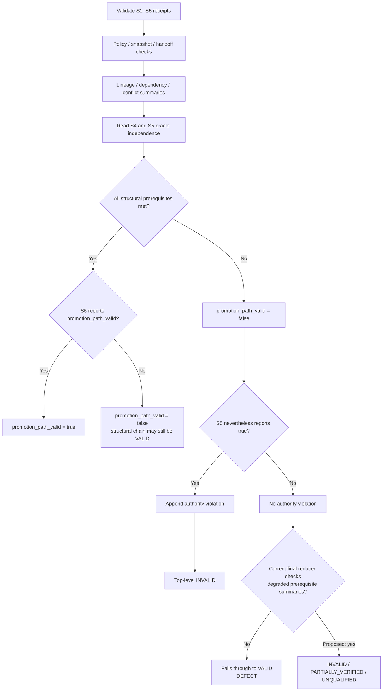
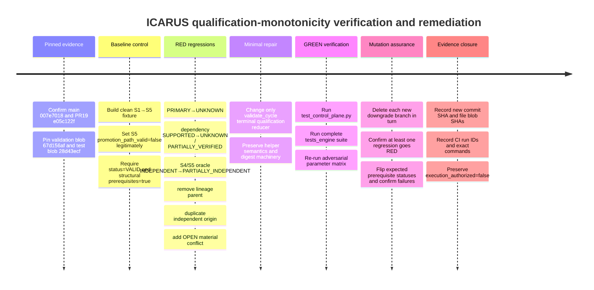

# ICARUS Qualification/Authority-Monotonicity Verification Report

## Executive summary

Read-only verification at pinned PR #19 revision `e05c122f7a8e5501d98251c7449cbe7ce3ec6dda` confirms that the qualification/authority-monotonicity defect remains present in `icarus_control/validation.py`. GitHub still reports `main` at `007e70189945b8e112904cf92b2b1a12e43792d6`; PR #19 is open and draft at the requested head, stacked on control-plane PR #18. The `validation.py` blob is byte-identical at PR #18 head `76569e…` and PR #19 head `e05c122f…`, with Git blob SHA `67d156af5451bedb126c4f54125cb999bffc430c`. PR #19 itself changes only the market-data-vintage implementation and test files, so the defect is inherited from the S1–S5 control-plane stack rather than introduced by the vintage-data changes. fileciteturn2file0L1-L13 fileciteturn1file0L2-L16 fileciteturn6file0L3-L6 fileciteturn23file0L3-L6 fileciteturn22file0L1-L2

The decisive defect is narrower—and more rigorously reproducible—than simply saying that "`validate_cycle()` ignores degraded summaries." The current implementation *does* convert many degradations into `INVALID` when S5 simultaneously reports `promotion_path_valid=True`, because that combination appends an `authority_violations` entry. The hidden failure occurs when S5 already reports `promotion_path_valid=False`: lineage, dependency, conflict, or oracle degradation makes `structural_prerequisites_met=False`, but does **not** create the S5 overclaim violation; the final top-level status reducer then ignores those degraded prerequisite states and falls through to `"VALID"`. Thus a cycle can truthfully decline promotion while still being labeled fully `VALID` despite `PARTIALLY_VERIFIED`, `UNKNOWN`, `DUPLICATE_INFLATED`, `INVALID` lineage, broken dependency closure, an open material conflict, or non-independent oracle state. That violates the policy's explicit invariants that qualification is fail-closed and uncertainty cannot increase authority. fileciteturn7file0L1-L7 fileciteturn13file0L1-L6

This explains why the current green CI does not disprove the defect. GitHub Actions run `36065966446` completed successfully at PR #19 head `e05c122f…`; the Linux job ran the entire `tests_engine` suite, while the Windows job ran a narrower plant/bars/doctor subset. Existing control-plane tests generally exercise degraded prerequisites with the default fixture's S5 `promotion_path_valid=True`; that causes the secondary authority-overclaim path to turn the result `INVALID`, masking the missing top-level qualification propagation. There are no downloadable artifacts attached to that workflow run. fileciteturn19file0L1-L7 fileciteturn20file0L1-L13 fileciteturn24file0L1-L12 fileciteturn8file0L1-L2

The highest-value remediation is therefore small and local: preserve all existing policy, snapshot, handoff, canonicalization, digest, and execution-authority logic; change only the terminal qualification reducer in `validate_cycle()` so that a failed structural prerequisite cannot produce top-level `VALID`, and add regression tests built from a **structurally valid, deliberately non-promoting control chain**. Hard structural breaks should resolve to `INVALID`; genuine partial/uncertain evidence should resolve to `PARTIALLY_VERIFIED`; known non-qualifying but schema-valid conditions should resolve to `UNQUALIFIED`. In every case `promotion_path_valid` must remain false and `execution_authorized` must remain false. fileciteturn7file0L1-L7

**NET_NEW_DELTA:** the critical new implementation-level refinement is that the defect is specifically masked by the existing test fixture's `promotion_path_valid=True`. Setting S5 to a legitimate non-promoting state **before** introducing a single uncertainty mutation isolates the erroneous `VALID` fall-through without changing any other control-plane mechanism. This provides a minimal red test and explains the green CI result without positing any new theoretical red-team finding. fileciteturn8file0L1-L2 fileciteturn7file0L1-L7

## Repository state and evidence base

The relevant stack is repository-addressable and stable enough to make the defect reproducible by exact revision.

| Evidence subject | Verified state | Significance |
|---|---|---|
| Canonical `main` | `007e70189945b8e112904cf92b2b1a12e43792d6` | Requested AEGIS baseline anchor; GitHub's live `main` branch response still points here. fileciteturn2file0L1-L13 |
| PR #19 head | `e05c122f7a8e5501d98251c7449cbe7ce3ec6dda` | Exact requested verification target; PR remains open/draft. fileciteturn1file0L2-L16 |
| PR #19 base | `76569e1962e721b0f4dc973df21358f40c31ce81` | PR #18 control-plane-runtime head. fileciteturn1file0L9-L16 fileciteturn16file0L9-L16 |
| `validation.py` blob at PR #19 | `67d156af5451bedb126c4f54125cb999bffc430c` | Exact implementation under analysis. fileciteturn6file0L3-L6 |
| `validation.py` blob at PR #18 | same `67d156af…` | Confirms PR #19 did not alter this control-plane implementation. fileciteturn23file0L3-L6 |
| `test_control_plane.py` blob | `28d43ecf1e7a40842bb7955c73a5a362d46820a8` | Exact current test surface for remediation. fileciteturn9file0L3-L6 |
| Linux CI | successful, full `python -m pytest tests_engine -q` | Confirms current committed suite is green, not that the missing isolated regression exists. fileciteturn20file0L1-L13 |
| Windows CI | successful, focused plant/bars/doctor suite | Does not execute `test_control_plane.py` on Windows in this workflow. fileciteturn20file0L1-L13 |
| Workflow artifacts | zero | No downloadable CI artifact adds evidence beyond run/job metadata and repository contents. fileciteturn24file0L1-L12 |

PR #18's stated purpose is precisely the durable S1→S5 control-plane substrate: deterministic JSON, SHA-256 receipt chaining, exact policy/schema binding, same-cycle policy epochs and pinned snapshots, maturity ceilings, evidence-origin de-duplication, mandatory S4 oracle provenance, promotion gating, and a read-only verifier. Its safety statement explicitly retains `execution_authorized=false`, no Pulse rewrite, no broker/execution change, no trainer/model feature changes, no synthetic bars, and no automatic claim promotion. fileciteturn16file0L2-L15

The policy contract makes the intended semantics non-ambiguous. Its immutable invariants include `execution_authorized=false`, no synthetic bars as empirical evidence, no invented trainer slots/features, no Pulse rewrite, fail-closed qualification, deterministic canonical serialization/replay, immutable/tamper-evident audit, strict temporal integrity, and “uncertainty cannot increase authority.” It also says unknown or ambiguous semantics must `FAIL_CLOSED`. fileciteturn13file0L1-L6

The handoff schema deliberately treats uncertainty states as **validly representable inputs**, not malformed JSON: evidence independence includes `UNKNOWN`; claims can be `PARTIALLY_VERIFIED` or `UNKNOWN`; and S4/S5 oracle enums include `PARTIALLY_INDEPENDENT`, `TAUTOLOGICAL`, `UNVERIFIED`, and `INVALID`. Consequently, a receipt containing one of those values can legitimately pass `validate_receipt()` and must be downgraded at cycle-level qualification rather than relying on per-receipt schema failure. fileciteturn14file0L1-L6

The deterministic substrate should remain untouched by this repair. `canonical.py` recursively validates values, rejects unsupported types and non-finite numbers, sorts object keys, preserves array order, uses compact UTF-8 JSON, computes SHA-256 over canonical bytes, excludes only `receipt_digest` when hashing a receipt, and rejects duplicate JSON object keys. The existing tests cover deterministic serialization, non-finite rejection, duplicate-key rejection, digest stability, and post-creation digest tampering. fileciteturn15file0L1-L6 fileciteturn8file0L1-L2

## Defect mechanics and decision logic

Three helper summaries correctly identify most prerequisite degradation. `_lineage_summary()` returns `INVALID` for broken/reused/cyclic lineage, `DUPLICATE_INFLATED` when multiple independently labeled evidence IDs collapse to the same origin, `PARTIALLY_VERIFIED` when any evidence independence is `UNKNOWN`, and `VALID` only otherwise. `_dependency_summary()` returns `CYCLE`, `BROKEN`, `PARTIALLY_VERIFIED`, or `VALID`, with `UNKNOWN` and `PARTIALLY_VERIFIED` prerequisite claims producing the partial state. `_conflict_summary()` reports `OPEN` for unresolved material conflicts. fileciteturn6file0L1-L7 fileciteturn7file0L1-L7

`validate_cycle()` then constructs `structural_prerequisites_met` conservatively: all contracts/stages must be present; policy, snapshot and handoff chains must be consistent; there may be no authority violation; lineage and dependency status must each be exactly `VALID`; no material conflict may remain open; and both S4 and S5 oracle statuses must be exactly `INDEPENDENT`. This part already embodies the correct fail-closed predicate. fileciteturn7file0L1-L7

The error occurs in the next layer. `promotion_path_valid` is computed as the conjunction of that strict predicate and S5's reported `promotion_path_valid=True`. If S5 reports `True` despite a failed prerequisite, an authority violation is appended and the final reducer produces `INVALID`. But when S5 already reports `False`, no authority violation is generated. The final reducer checks contract errors, invalid individual receipts, invalid handoff, authority violations, mixed policy, mixed revision, and missing stages—but **does not inspect `structural_prerequisites_met`, `lineage_status`, `dependency_status`, `conflict_status`, or the oracle statuses** before falling through to `status="VALID"`. fileciteturn7file0L1-L7

That yields the minimal counterexample:

> Begin from the repository's structurally clean `_chain()` fixture. Change only S5's self-reported promotion state to `False` with non-advanced/non-integrated outcome values—the repository already has a test proving this remains structurally `VALID`. Then degrade exactly one prerequisite such as evidence `PRIMARY→UNKNOWN`. `_lineage_summary()` becomes `PARTIALLY_VERIFIED`; `structural_prerequisites_met` becomes false; `promotion_path_valid` remains false; no authority overclaim exists; and the current terminal reducer nevertheless returns `VALID`. fileciteturn8file0L1-L2 fileciteturn7file0L1-L7

The existing `test_s5_semantic_blocker_is_never_overridden_by_structural_cleanliness` is important and should remain: a fully trustworthy structural chain is allowed to be `VALID` while S5 deliberately declines promotion. The remediation therefore must **not** equate "`promotion_path_valid=False`" with invalidity. It must distinguish “S5 voluntarily did not promote an otherwise clean chain” from “promotion is impossible because structural certainty degraded.” fileciteturn8file0L1-L2



A read-only branch-condition trace against the exact reducer shows the isolated problem uniformly: assuming contracts, per-stage receipt validation, policy, snapshots, and handoff remain clean and S5 already reports no promotion, each requested mutation makes `structural_prerequisites_met=False` while leaving the current final reducer's checked conditions false. The reducer therefore reaches its `else: status = "VALID"` branch. That conclusion follows directly from the pinned implementation and does not require inventing a new theoretical finding. fileciteturn6file0L1-L7 fileciteturn7file0L1-L7

## Mutation and regression matrix

The correct test control is a **clean non-promoting chain**: begin with `_chain(policy, schema)`, set S5 `promotion_path_valid=False`, use non-authoritative `release_status`/`cycle_outcome`, redigest S5, and verify the control still has `status=="VALID"`, `structural_promotion_prerequisites_met is True`, `promotion_path_valid is False`, and `execution_authorized is False`. This is already compatible with the semantic-blocker test in `test_control_plane.py`. Each row below then applies exactly one degradation. fileciteturn8file0L1-L2

| Mutation | Exact fixture-level change | Summary expected from existing helper | Current isolated top-level behavior | Required monotonic outcome |
|---|---|---|---|---|
| `PRIMARY → UNKNOWN` | `S1.evidence_lineage[0].independence = "UNKNOWN"`; relink/redigest | `evidence_lineage_status="PARTIALLY_VERIFIED"`; independent-origin authority cannot improve | Erroneously eligible to fall through as `VALID` when S5 already reports no promotion | `status="PARTIALLY_VERIFIED"`; `structural_promotion_prerequisites_met=False`; `promotion_path_valid=False` |
| `SUPPORTED → UNKNOWN` | Add valid A→B claim dependency, then mutate prerequisite A's status to `"UNKNOWN"` | `dependency_closure_status="PARTIALLY_VERIFIED"` | Erroneously eligible to remain `VALID` | `PARTIALLY_VERIFIED`; never promotion-valid |
| `SUPPORTED → PARTIALLY_VERIFIED` | Same A→B dependency, mutate A to `"PARTIALLY_VERIFIED"` | `dependency_closure_status="PARTIALLY_VERIFIED"` | Erroneously eligible to remain `VALID` | `PARTIALLY_VERIFIED`; never promotion-valid |
| S4 `INDEPENDENT → PARTIALLY_INDEPENDENT` | `S4.stage_payload.oracle_independence_status = "PARTIALLY_INDEPENDENT"` | S4 oracle no longer satisfies exact-independent prerequisite | With S5 already false, no overclaim violation is generated, so top-level can remain `VALID` | `PARTIALLY_VERIFIED`; never promotion-valid |
| S5 oracle `INDEPENDENT → PARTIALLY_INDEPENDENT` | `S5.stage_payload.verification_oracle_status = "PARTIALLY_INDEPENDENT"` | S5 oracle no longer satisfies exact-independent prerequisite | Same fall-through possibility | `PARTIALLY_VERIFIED`; never promotion-valid |
| Remove a lineage parent | Keep S3 evidence `independence="DERIVED"` but set `derived_from=[]` | `_lineage_summary()` returns `INVALID` because derived evidence requires parents | Receipt schema itself remains well-formed; top-level can fall through as `VALID` with S5 already false | `INVALID`; promotion false |
| Duplicate independent origin | Change S2's independence to `INDEPENDENT_REPLICATION` while retaining the same canonical origin as S1 | `DUPLICATE_INFLATED`, origin count remains one | Can fall through as `VALID` when no S5 overclaim occurs | `UNQUALIFIED`; promotion false |
| Unresolved material conflict | Add material `OPEN` conflict to a stage and relink | `conflict_status="OPEN"` | Can fall through as `VALID` when S5 already reports false | `UNQUALIFIED`; promotion false |

The helper behavior in the table is directly supported by the pinned code: unknown evidence sets the lineage `unknown` flag; duplicated independent origins are counted by canonical origin and return `DUPLICATE_INFLATED`; derived/duplicate evidence without parents is a lineage break; dependency targets in `UNKNOWN` or `PARTIALLY_VERIFIED` set the partial flag; and an open material conflict returns `OPEN`. fileciteturn6file0L1-L7 fileciteturn7file0L1-L7

The oracle mutations are schema-valid rather than malformed: both S4 and S5 explicitly permit `PARTIALLY_INDEPENDENT`. Therefore the proper response is a qualification downgrade, not dependence on `validate_receipt()` rejecting the receipt. `structural_prerequisites_met` already requires both values to be exactly `INDEPENDENT`; only top-level status propagation is missing. fileciteturn14file0L1-L6 fileciteturn7file0L1-L7

Existing tests are close but do not close this gap. The suite already checks duplicate origin inflation, empty evidence, missing lineage parents, dependency cycles, missing prerequisites, material open conflicts, and partially independent S4 oracles. However, `_chain()` starts S5 with `promotion_path_valid=True`; several tests therefore either observe or implicitly induce the secondary authority-violation path, while some do not assert cycle `status` at all. The new regressions must remove that confounder by using the clean non-promoting control first. fileciteturn8file0L1-L2 fileciteturn9file0L1-L6

Concrete tests should be added to `tests_engine/test_control_plane.py` as follows:

| Proposed test | Red condition at `e05c122f…` | Post-fix assertion |
|---|---|---|
| `test_unknown_evidence_downgrades_nonpromoting_valid_cycle` | S1 `PRIMARY→UNKNOWN` | lineage `PARTIALLY_VERIFIED`; top-level `PARTIALLY_VERIFIED`; promotion false |
| `test_uncertain_prerequisite_downgrades_cycle[UNKNOWN]` | prerequisite claim `SUPPORTED→UNKNOWN` | dependency `PARTIALLY_VERIFIED`; top-level not `VALID`; promotion false |
| `test_uncertain_prerequisite_downgrades_cycle[PARTIALLY_VERIFIED]` | prerequisite claim becomes partial | same |
| `test_partial_oracle_downgrades_nonpromoting_cycle[S4]` | S4 oracle partial | top-level `PARTIALLY_VERIFIED`; promotion false |
| `test_partial_oracle_downgrades_nonpromoting_cycle[S5]` | S5 verification oracle partial | same |
| `test_removed_lineage_parent_invalidates_nonpromoting_cycle` | `DERIVED` evidence loses all parents | lineage and top-level `INVALID`; promotion false |
| `test_duplicate_origin_is_unqualified_even_when_s5_already_blocks` | second “independent” evidence has same origin | `DUPLICATE_INFLATED`; top-level `UNQUALIFIED`; promotion false |
| `test_open_material_conflict_is_unqualified_even_when_s5_already_blocks` | material conflict becomes `OPEN` | conflict `OPEN`; `UNQUALIFIED`; promotion false |
| `test_prerequisite_degradation_never_increases_authority` | parameterized over all mutations above | every mutation changes prerequisites `True→False`, never leaves `status=="VALID"`, never sets promotion true, never changes `execution_authorized` from false |

The last test is the property-style invariant: start from one known-good non-promoting structural control and apply a finite adversarial mutation set. No mutation that weakens evidence certainty, dependency certainty, oracle independence, lineage completeness, origin independence, or conflict resolution may preserve the fully qualified top-level state. It does not require Hypothesis or a new dependency; ordinary `pytest.mark.parametrize` is sufficient and consistent with the existing test infrastructure. The current CI installs the package's development dependencies and executes `tests_engine` under pytest on Linux. fileciteturn20file0L1-L13

## Minimal remediation

The repair should remain confined to `icarus_control/validation.py::validate_cycle` plus regression coverage in `tests_engine/test_control_plane.py`. `_lineage_summary()` and `_dependency_summary()` already expose enough state for the required fix; they need no semantic expansion for this defect unless maintainers prefer to centralize classification in a helper. This minimizes change risk to canonical serialization, receipt hashing, snapshots, handoff chaining, temporal handling, the vintage layer, Pulse, trainer features, and execution pathways. fileciteturn6file0L1-L7 fileciteturn7file0L1-L7

A minimal status taxonomy can preserve existing strong failures while distinguishing uncertainty from known disqualification:

- `INVALID`: malformed or internally broken structure—existing contract/receipt/handoff/authority failures, plus lineage `INVALID` and dependency `BROKEN`/`CYCLE`.
- `PARTIALLY_VERIFIED`: the representation is structurally coherent but assurance is explicitly partial—lineage `PARTIALLY_VERIFIED`, dependency `PARTIALLY_VERIFIED`, or an oracle `PARTIALLY_INDEPENDENT`.
- `UNQUALIFIED`: evidence is not merely partial but fails a qualification predicate without making the receipt syntactically invalid—for example `UNKNOWN`/empty lineage, `DUPLICATE_INFLATED`, an open material conflict, or oracle `UNVERIFIED`/`TAUTOLOGICAL`/`INVALID`.
- `VALID`: reserved for chains whose structural prerequisite state remains fully trustworthy, regardless of whether S5 chooses to exercise the promotion path.

That distinction preserves the existing valid-but-nonpromoting semantic-blocker case while preventing uncertainty from retaining `VALID`. The contract's explicit fail-closed and uncertainty-monotonicity requirements support such a reducer. fileciteturn13file0L1-L6 fileciteturn8file0L1-L2

Proposed diff-style pseudocode for `icarus_control/validation.py`:

```diff
 def validate_cycle(receipts, policy, schema):
     ...
     structural_prerequisites_met = (
         not contract_errors
         and not missing
         and policy_chain_status == "CONSISTENT"
         and snapshot_chain_status == "CONSISTENT"
         and handoff_chain_status == "CONSISTENT"
         and not authority_violations
         and lineage_status == "VALID"
         and dependency_status == "VALID"
         and conflict_status != "OPEN"
         and s4_oracle == "INDEPENDENT"
         and s5_oracle == "INDEPENDENT"
     )

     reported_promotion = s5_payload.get("promotion_path_valid")
     promotion_path_valid = (
         structural_prerequisites_met
         and reported_promotion is True
     )

     if reported_promotion is True and not structural_prerequisites_met:
         authority_violations.append(
             "S5 reports promotion_path_valid=true while "
             "structural prerequisites are not met"
         )

     ...

+    hard_structural_failure = (
+        lineage_status == "INVALID"
+        or dependency_status in {"BROKEN", "CYCLE"}
+    )
+
+    partial_assurance = (
+        lineage_status == "PARTIALLY_VERIFIED"
+        or dependency_status == "PARTIALLY_VERIFIED"
+        or s4_oracle == "PARTIALLY_INDEPENDENT"
+        or s5_oracle == "PARTIALLY_INDEPENDENT"
+    )
+
     if contract_errors or any(
         result["status"] == "INVALID"
         for result in per_stage.values()
     ) or handoff_chain_status == "INVALID" or authority_violations:
         status = "INVALID"
     elif policy_chain_status == "MIXED_POLICY":
         status = "MIXED_POLICY"
     elif snapshot_chain_status == "MIXED_REVISION":
         status = "MIXED_REVISION"
     elif missing:
         status = "INCOMPLETE"
+    elif hard_structural_failure:
+        status = "INVALID"
+    elif partial_assurance:
+        status = "PARTIALLY_VERIFIED"
+    elif not structural_prerequisites_met:
+        # Structurally representable, but cannot carry full qualification.
+        # Covers UNKNOWN/DUPLICATE_INFLATED lineage, OPEN material
+        # conflicts, and non-independent/unverified oracle states.
+        status = "UNQUALIFIED"
     else:
         status = "VALID"
```

This is preferable to simply changing the last `else` to `UNQUALIFIED`, because a truly clean chain with S5's own `promotion_path_valid=False` must retain its existing structural `VALID` result. The discriminant must therefore be `structural_prerequisites_met`, not the final promotion boolean. fileciteturn7file0L1-L7 fileciteturn8file0L1-L2

A minimal regression scaffold for `tests_engine/test_control_plane.py` should make the hidden precondition explicit:

```diff
+def _nonpromoting_chain(policy, schema):
+    receipts = _chain(policy, schema)
+    s5 = receipts["S5"]["stage_payload"]
+    s5["promotion_path_valid"] = False
+    s5["release_status"] = "NOT_QUALIFIED"
+    s5["cycle_outcome"] = "INCOMPLETE_PIPELINE"
+    _redigest(receipts["S5"])
+
+    control = validate_cycle(receipts, policy, schema)
+    assert control["status"] == "VALID"
+    assert control["structural_promotion_prerequisites_met"] is True
+    assert control["promotion_path_valid"] is False
+    assert control["execution_authorized"] is False
+    return receipts
+
+
+def _assert_downgraded(result):
+    assert result["structural_promotion_prerequisites_met"] is False
+    assert result["status"] != "VALID"
+    assert result["promotion_path_valid"] is False
+    assert result["execution_authorized"] is False
+
+
+def test_unknown_evidence_downgrades_nonpromoting_valid_cycle(contracts):
+    policy, schema = contracts
+    receipts = _nonpromoting_chain(policy, schema)
+    receipts["S1"]["evidence_lineage"][0]["independence"] = "UNKNOWN"
+    _relink(receipts)
+
+    result = validate_cycle(receipts, policy, schema)
+
+    assert result["evidence_lineage_status"] == "PARTIALLY_VERIFIED"
+    assert result["status"] == "PARTIALLY_VERIFIED"
+    _assert_downgraded(result)
+
+
+@pytest.mark.parametrize("uncertain_status", [
+    "UNKNOWN",
+    "PARTIALLY_VERIFIED",
+])
+def test_uncertain_prerequisite_downgrades_cycle(
+    contracts, uncertain_status
+):
+    policy, schema = contracts
+    receipts = _nonpromoting_chain(policy, schema)
+
+    receipts["S1"]["claims"] = [{
+        "claim_id": "A",
+        "maturity": "OBSERVED",
+        "status": uncertain_status,
+        "dependencies": [],
+        "evidence_ids": ["E-S1"],
+    }]
+    receipts["S2"]["claims"] = [{
+        "claim_id": "B",
+        "maturity": "SPECIFIED",
+        "status": "SUPPORTED",
+        "dependencies": ["A"],
+        "evidence_ids": ["E-S2"],
+    }]
+    _relink(receipts)
+
+    result = validate_cycle(receipts, policy, schema)
+
+    assert result["dependency_closure_status"] == "PARTIALLY_VERIFIED"
+    assert result["status"] == "PARTIALLY_VERIFIED"
+    _assert_downgraded(result)
```

The remaining cases should use the same control and invariant helper rather than duplicating setup. In particular, the S4 and S5 oracle tests should mutate only the relevant oracle field; the lineage-parent test should keep `independence="DERIVED"` and clear `derived_from`; the duplicate-origin case should reuse the existing canonical origin; and the conflict case should add one material `OPEN` conflict. Every mutation must be followed by `_relink()` or the minimum required redigest/relink operations so the test cannot “pass” merely because a stale receipt digest or handoff link became invalid. The repository's existing `_redigest()` and `_relink()` helpers were designed for exactly this isolation. fileciteturn8file0L1-L2

No change should be made to `canonical.py`. Its canonical serialization and digest behavior is part of the durable evidence substrate, and the repair does not require modifying serialization order, number treatment, duplicate-key handling, receipt-digest inputs, or SHA-256 chaining. Likewise, there is no basis in this defect to modify Pulse, bar generation, trainer/model slots, or market-data contents. fileciteturn15file0L1-L6

The CLI also needs no code change: `cmd_validate_cycle()` already exits zero only for `result["status"] == "VALID"` and exits one for every other status. Therefore introducing `PARTIALLY_VERIFIED` and `UNQUALIFIED` automatically makes these newly downgraded states fail closed at the command boundary. fileciteturn18file0L1-L6

## Verification sequence and control-state ledger

The remediation loop should remain deterministic and narrow. The following sequence produces a red test against the pinned defect, patches only the qualification reducer, then exercises regression and mutation coverage without changing authority or trading behavior.



The present control-state ledger is:

| Control dimension | Pinned-state assessment | Remediation constraint |
|---|---|---|
| Policy | `icarus-control-v1`; exact S1→S5 order, maturity ceilings, fail-closed and uncertainty-monotonic invariants are explicit. fileciteturn13file0L1-L6 | Do not relax contract validation or maturity ceilings. |
| Snapshot | `validate_cycle()` canonicalizes each `repo_snapshot_set`, compares stage baselines/snapshots, and distinguishes consistent, mixed, unverified and invalid snapshot states. fileciteturn7file0L1-L7 | Keep revision pinning and deterministic canonical comparison unchanged. |
| Handoff | Each stage is independently validated and subsequent `prior_stage_digest` must equal the predecessor's computed receipt digest. fileciteturn7file0L1-L7 | Every mutation test must redigest/relink so status changes are attributable to the intended mutation. |
| Evidence lineage | DAG/missing-parent/reuse/duplicate-origin/unknown handling exists; cycle-level top-status propagation is incomplete. fileciteturn6file0L1-L7 | Map hard lineage failure to `INVALID`, uncertainty to partial/unqualified, never `VALID`. |
| Claims/dependencies | Missing, bad, cyclic and uncertain prerequisite states are summarized. `UNKNOWN` and `PARTIALLY_VERIFIED` are schema-valid claim states. fileciteturn7file0L1-L7 fileciteturn14file0L1-L6 | Propagate `PARTIALLY_VERIFIED`, `BROKEN`, and `CYCLE` to top-level qualification. |
| Conflicts | Material `OPEN` conflicts already block `structural_prerequisites_met`. fileciteturn7file0L1-L7 | They must also prevent top-level `VALID` even when S5 has already declined promotion. |
| Oracle independence | Structural promotion requires exact `INDEPENDENT` at S4 and S5; weaker oracle states remain schema-representable. fileciteturn14file0L1-L6 fileciteturn7file0L1-L7 | Partial/unverified oracle state can only preserve or reduce authority, never retain full qualification. |
| Deterministic serialization/replay | Canonical key ordering, array-order preservation, strict JSON parsing and canonical SHA-256 are implemented and tested. fileciteturn15file0L1-L6 fileciteturn8file0L1-L2 | No serializer/digest changes. |
| Tamper-evident audit | Existing tests demonstrate receipt mutation after creation breaks the receipt digest, and handoffs bind predecessor digests. fileciteturn8file0L1-L2 fileciteturn7file0L1-L7 | Do not weaken digest or handoff validation. |
| Temporal integrity | Repository baseline/snapshot pinning remains part of every receipt; PR #19 separately adds point-in-time data-vintage provenance while explicitly leaving stronger cryptographic/as-of hardening as residual work. fileciteturn1file0L2-L16 | This qualification repair must not alter timestamps, bars, data vintages, or canonical history. |
| Execution authority | Policy requires `execution_authorized=false`; `validate_receipt()` rejects any other value, cycle output is explicitly false, and tests cover attempted enablement. fileciteturn13file0L1-L6 fileciteturn8file0L1-L2 fileciteturn7file0L1-L7 | Remains false before, during and after remediation. |

The oracle-independence mutation deserves explicit mutation-testing treatment after the regression goes green. Removing the proposed `partial_assurance` branch—or mutating `== "PARTIALLY_INDEPENDENT"` to an unreachable value—must make the new S4/S5 tests fail. Similarly, removing the hard-lineage branch must make the cleared-parent test fail; deleting the final `elif not structural_prerequisites_met` guard must make duplicate-origin/open-conflict tests fail. This establishes that the new tests are not merely exercising unrelated receipt-digest or handoff checks.

The same principle should be applied to assertions: each adversarial case should first confirm that `handoff_chain_status=="CONSISTENT"` and the affected receipts remain individually `VALID` where appropriate. Otherwise, a stale digest can produce a false sense that the authority-monotonicity defect was fixed. The current test helpers permit clean relinking, and existing tests already use redigest/relink operations to isolate policy and structural checks. fileciteturn8file0L1-L2

## Run outcome, fingerprint, blocker, and precise remediation

This run produced a material implementation delta without repository mutation. The primary evidence establishes that PR #19 remains pinned at the requested revision, that the S1–S5 validator is unchanged from PR #18, that current CI is green, and that the defect survives specifically in the non-promoting-S5 branch. The green suite and the defect are therefore consistent: current adversarial tests frequently let `promotion_path_valid=True` turn the prerequisite failure into an authority violation before the deficient terminal reducer is exposed. fileciteturn1file0L2-L16 fileciteturn23file0L3-L6 fileciteturn20file0L1-L13 fileciteturn8file0L1-L2

**NET_NEW_DELTA**

`validate_cycle()`'s qualification defect is now reduced to a minimal executable condition:

```text
clean S1–S5 chain
+ legitimate S5 promotion_path_valid=false
+ exactly one degraded structural prerequisite
= structural_promotion_prerequisites_met=false
  promotion_path_valid=false
  authority_violations=[]
  status="VALID"          <-- defect
```

This is more precise than the earlier finding because it identifies why existing tests and green CI fail to expose the problem and provides the exact control state needed for a RED regression. The defect is in top-level qualification propagation, not in `_lineage_summary()` or `_dependency_summary()` detection themselves. fileciteturn7file0L1-L7

**PROGRESS_FINGERPRINT**

```text
baseline-main=007e70189945b8e112904cf92b2b1a12e43792d6
pr19-head=e05c122f7a8e5501d98251c7449cbe7ce3ec6dda
control-base=76569e1962e721b0f4dc973df21358f40c31ce81
validation-blob=67d156af5451bedb126c4f54125cb999bffc430c
test-control-plane-blob=28d43ecf1e7a40842bb7955c73a5a362d46820a8
ci-run=36065966446:success
gap=validate_cycle/qualification-monotonicity/s5-nonpromoting-isolation
execution_authorized=false
verification=read-only
```

The revision and blob components are directly repository-addressable; the CI run is tied to `e05c122f…` and reports success. fileciteturn2file0L1-L13 fileciteturn19file0L1-L7 fileciteturn6file0L3-L6 fileciteturn9file0L3-L6

**Blocker:** no repository-write authorization was granted for this run. Although the required patch and red/green regression surface are now precise, the requested operating boundary was evidence-backed read-only verification, so no branch, test file, commit, PR update, workflow dispatch, or other repository mutation was performed. A fresh local pytest execution was also not claimed; the executable evidence available here is the existing GitHub Actions run plus direct inspection of the exact pinned source and tests. The workflow publishes no downloadable artifacts. fileciteturn19file0L1-L7 fileciteturn24file0L1-L12

**Precise remediation sequence:** add `_nonpromoting_chain()` and the mutation matrix to `tests_engine/test_control_plane.py`; verify those cases are RED specifically because top-level `status` remains `VALID`; patch only the terminal `validate_cycle()` classification as shown; require hard lineage/dependency breaks to become `INVALID`, partial certainty to become `PARTIALLY_VERIFIED`, and remaining failed qualification predicates to become `UNQUALIFIED`; run the focused control-plane tests, then all `tests_engine`; perform branch-deletion/mutation checks against each new downgrade path; record the new commit SHA, `validation.py` and test blob SHAs, CI run ID, and exact test commands; and re-run the ICARUS loop against that new pin. Throughout that sequence, `execution_authorized=false`, deterministic canonical serialization/replay, receipt/handoff digesting, repository snapshots, immutable/tamper-evident evidence handling, temporal integrity, no synthetic bars, no invented trainer features/slots, no Pulse rewrite, and “uncertainty cannot increase authority” remain non-negotiable invariants. fileciteturn13file0L1-L6 fileciteturn15file0L1-L6