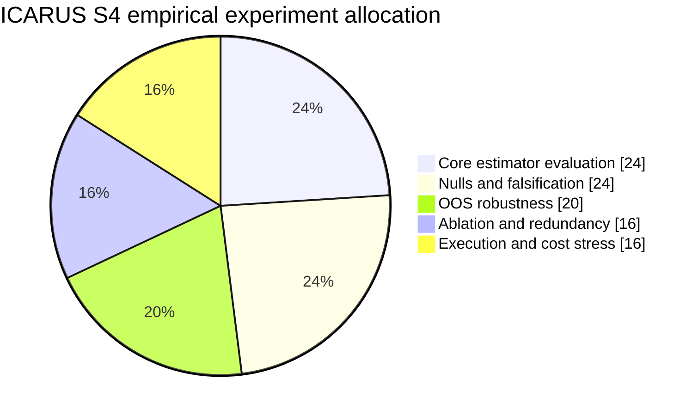
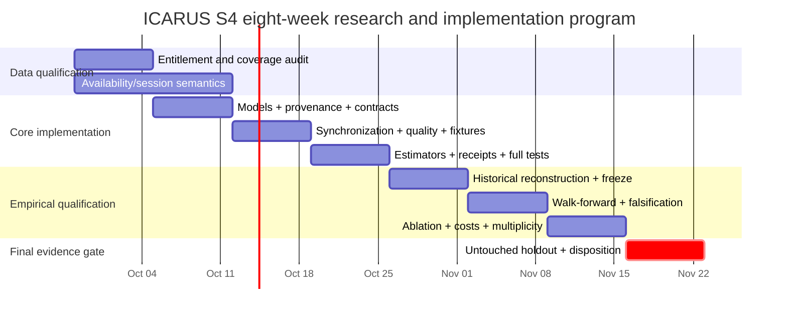

# ICARUS S4 Curve Research Plane: Implementation and Empirical Qualification Roadmap

## Executive summary

ICARUS is ready to move from architecture into implementation, but the correct next step is **not** to run a carry backtest immediately. The preserved S4 specification and implementation plan already impose the right separation:

\[
\text{market state}
\neq
\text{estimator}
\neq
\text{predictive relationship}
\neq
\text{incremental alpha}
\neq
\text{executable edge}.
\]

The repository specification requires immutable point-in-time snapshots, explicit futures maturities, semantic synchronization, deterministic provenance, an isolated research package, chronological evaluation, explicit multiple-testing accounting, and `execution_authorized=false`. The implementation plan further states that implementation has **not yet occurred** and prescribes the build sequence from immutable domain models through full-suite regression and runtime-isolation tests. fileciteturn4file0L2-L2 fileciteturn5file0L2-L2

The recommended program has two hard stages.

**Stage A — build and verify the research plane.** Implement the smallest behavior-neutral `icarus_engine/curve_research/` package, prove point-in-time causality, freeze deterministic fixtures, establish provider capability and entitlement facts, and run the complete regression suite. No profitability claim belongs in this gate. fileciteturn5file0L2-L2

**Stage B — empirically qualify the curve family.** Only after Stage A passes should ICARUS construct historical GC curves, preregister a deliberately small estimator family, run chronological OOS/falsification/ablation experiments, account for every selection attempt, stress transaction costs and data latency, and finally open an untouched holdout exactly once. This is consistent with the preserved experiment hierarchy in which the key question is not whether a carry model makes money by itself, but whether

\[
\Delta_{\text{OOS}}
=
M_6-M_5
\]

is positive after controlling for existing ICARUS information, costs, trial multiplicity, and execution realities. fileciteturn4file0L2-L2

The research performed for this roadmap identifies **four especially important blockers that should be resolved before historical qualification begins**:

1. **Massive's `type=single/combo` contract field is only populated from March 12, 2025 onward.** Its official contract API otherwise provides point-in-time definitions and records back to April 3, 2017 depending on plan. A reliable method for excluding historical combination contracts before March 12, 2025 must therefore be demonstrated rather than inferred from ticker appearance. citeturn16view0
2. **Point-in-time effective date is not the same thing as bitemporal availability.** Massive can reconstruct the contract definition applying on a historical date, but the API documentation does not provide a historical `available_at` timestamp for every record. Settlement bars likewise describe the market interval, not necessarily the exact moment a historical API consumer could first retrieve the finalized value. A conservative availability policy therefore needs to be explicit and versioned rather than fabricated. citeturn16view0turn16view2
3. **Synchronized historical spot basis should probably start no earlier than 2020 unless another source is qualified.** Twelve Data identifies XAU/USD as its trial gold-spot symbol, advertises daily commodity history from January 1, 1980, but intraday commodity history only from January 9, 2020. Because its commodity market uses its own time convention, daily XAU/USD cannot simply be combined with a COMEX settlement by calendar date and called contemporaneous spot basis. citeturn21search6turn21search9
4. **Historical session reconstruction needs an older-calendar solution.** Massive's futures schedule API provides UTC session opens, closes, breaks and holiday adjustments, but the current endpoint documents only two years of history, with records back to June 10, 2024. A GC study reaching into 2017 therefore needs either historically correct CME calendars or an explicitly conservative EOD policy that does not pretend unavailable schedule detail exists. citeturn16view1turn16view5

Those are not reasons to abandon S4. They are exactly the sort of problems S4 is supposed to expose before false alpha is created.

The recommended eight-week program runs from **Monday, September 28 through Sunday, November 22, 2026**. By its end, ICARUS should have either:

\[
\boxed{\text{a qualified, incremental, cost-surviving curve family}}
\]

or, just as legitimately,

\[
\boxed{\text{a rigorously documented rejection or DATA\_BLOCKED result}}.
\]

It should **not** have a live trading feature. `execution_authorized=false` remains invariant.

## Preserved state and research contract

The preserved design is sufficiently mature to serve as the implementation contract rather than being redesigned again. The authoritative documents are the [S4 Curve Research Plane specification](https://github.com/reppiks490/Icarus/blob/icarus-loop-integration-2026-09-24/docs/superpowers/specs/2026-09-24-icarus-curve-research-design.md) and the [implementation plan](https://github.com/reppiks490/Icarus/blob/icarus-loop-integration-2026-09-24/docs/superpowers/plans/2026-09-24-icarus-curve-research.md). The plan explicitly describes itself as an executable build contract and does not claim that implementation has occurred. fileciteturn5file0L2-L2

The first implementation should therefore preserve the proposed package boundary:

```text
icarus_engine/
    curve_research/
        __init__.py
        errors.py
        models.py
        provenance.py
        contracts.py
        synchronize.py
        quality.py
        estimators.py
        experiment.py
```

with offline tests and fixtures under:

```text
tests_engine/
    curve_test_support.py
    test_curve_models.py
    test_curve_provenance.py
    test_curve_contracts.py
    test_curve_synchronization.py
    test_curve_quality.py
    test_curve_estimators.py
    test_curve_experiment.py
    test_curve_isolation.py
    fixtures/
        curve_gc_2026_09_24.json
```

and with no initial modification to `runtime.py`, `emulator.py`, `contracts.py`, or `strategy/pulse.py`. fileciteturn5file0L2-L2

The practical system boundary should look like this:

```mermaid
flowchart LR
    A[Provider APIs / exchange data] --> B[Provider adapters]
    B --> C[Raw evidence + payload digests]
    C --> D[Canonical normalization]
    D --> E{Point-in-time gate}

    E -->|valid| F[Immutable CurveSnapshot]
    E -->|invalid| X[Typed rejection + metrics]

    F --> G[Estimator registry]
    G --> H[Research experiment runner]
    H --> I[Walk-forward / OOS engine]
    I --> J[Falsification + ablations]
    J --> K[Multiple-testing control]
    K --> L[Evidence registry / research receipt]

    F --> Q[Curve quality diagnostics]
    Q --> L

    L -. no direct authority .-> Z[Pulse / execution]
    Z:::blocked

    classDef blocked stroke-width:3px,stroke-dasharray: 6 4;
```



The most important architecture rule is that **valid data is still not alpha**. A perfectly reconstructed curve only establishes an observable historical state. It does not determine whether contango, backwardation, basis, or financing residual predicts anything useful. The preserved specification intentionally keeps `CurveSnapshot` free of BUY/SELL semantics. fileciteturn4file0L2-L2

The concrete objectives should be frozen as follows.

| Objective | Definition of success |
|---|---|
| Point-in-time truth | Every required observation has a defensible `available_at <= decision_asof`; unknown availability fails closed or uses a preregistered conservative policy. |
| Explicit curve | Every futures leg identifies an actual maturity. No continuous symbol can serve as a curve observation. |
| Reproducibility | Same raw inputs + policy + code revision produce the same canonical snapshot and result digests. |
| Provider honesty | Entitlement, source outage, semantic mismatch, and historical coverage are represented explicitly rather than silently substituted. |
| Research isolation | No import or state mutation path from curve research into Pulse, broker, activation, entry, exit or sizing logic. |
| Falsifiability | Nulls, lag tests, source removal, maturity perturbations, costs and ablations are designed before holdout access. |
| Incrementality | The final question is whether the curve family adds OOS value to the existing baseline, not whether a standalone curve strategy looks attractive. |
| False-discovery defense | Every selection attempt is retained and family-wise inference is adjusted for data snooping. |
| Execution realism | Predictive support and executable support remain separate promotion gates. |
| Safety | `execution_authorized=false` is not configurable from provider payloads, experimental output or receipts. |

This matches the current architectural invariant already preserved in the repository:

\[
\boxed{\text{uncertainty may reduce authority, but may never increase it}.}
\]

fileciteturn4file0L2-L2

## Data plane and provider qualification

The current provider matrix already records Massive, FMP, Twelve Data, StackerScan, Bybit and U.S. Gold Bureau as relevant but importantly **not equivalent** sources. Massive is the main futures reconstruction candidate; Twelve Data is a spot-history candidate; FMP is a financing proxy; StackerScan and Gold Bureau are chiefly independent live checks; and Bybit belongs to a separate crypto-funding mechanism rather than GC carry. fileciteturn8file0L2-L2

Fresh official documentation sharpens that picture.

### Provider capability matrix

| Provider | S4 role | Verified/documented coverage and fields | Availability / latency issue | Current blocker or discovery requirement |
|---|---|---|---|---|
| **Massive** | **Primary GC futures plane** | Point-in-time contract definitions; `ticker`, `product_code`, `active`, `first_trade_date`, `last_trade_date`, `settlement_date`, `days_to_maturity`, venue, tick sizes and `type`; historical session OHLC/volume/settlement; historical quotes/trades with exchange timestamps. Contracts and aggregate records go back to Apr. 3, 2017 subject to plan. Quotes/trades are 5 years on Developer and all history on Advanced/business plans. citeturn16view0turn16view2turn16view3turn16view4 | Contract metadata is updated daily. Aggregate recency ranges from eight-hour historical to ten-minute delayed to real-time by plan; quote/trade access similarly depends on plan. citeturn16view0turn16view2turn16view3 | Exact connected entitlement; pre-2025 combo identification; historical publication/availability semantics; quote/trade entitlement. |
| **Twelve Data** | Historical XAU/USD spot / synchronization candidate | Commodity page identifies `XAU/USD` as Gold Spot / USD. Daily commodity history is advertised from Jan. 1, 1980 and intraday from Jan. 9, 2020; `/time_series` exposes timestamped OHLC data and `/earliest_timestamp` is available. citeturn21search6turn21search9 | Commodity page describes the feed as real-time, but historical finalized-bar publication latency is not documented there. Daily bar timezone semantics require care when aligning to COMEX. citeturn21search9 | Reconfirm current connector authentication/entitlement; call `earliest_timestamp` for 1-minute and 1-day XAU/USD; verify returned timezone/meta and exact bar-final semantics. |
| **StackerScan** | Independent **live** metals quality check | Preserved provider audit established current precious-metal spot capability. It is useful for live source-disagreement monitoring rather than historical reconstruction. fileciteturn8file0L2-L2 | Current observations do not establish historical point-in-time availability. | Determine upstream spot methodology/source lineage; determine whether any historical endpoint exists outside the exposed connector. |
| **FMP** | Convenient Treasury-rate adapter | Existing provider qualification established historical U.S. Treasury tenors. Treasury itself publishes daily par-yield series, and its official XML/archive infrastructure reaches back to 1990 for par yield curves. fileciteturn8file0L2-L2 citeturn17search3turn17search8 | Daily, not an intraday funding rate. Treasury par yields are derived from the daily curve based on closing market bid prices, so they are a proxy rather than gold financing or lease rates. citeturn17search2 | Determine exact FMP historical start/entitlement and publication timestamp. Validate a sample of FMP values against the official Treasury feed. |
| **Bybit** | **Separate** BTC/perpetual-funding branch; not a GC funding proxy | Official API supports historical perpetual funding through `/v5/market/funding/history`; fields include `symbol`, `fundingRate`, `fundingRateTimestamp`, while instrument metadata provides `fundingInterval`, launch/delivery time, tick and quantity rules. citeturn19view0turn19view1 | Funding intervals differ by symbol; exact earliest history and dissemination latency still require discovery. citeturn19view0 | The exposed connector currently emphasizes current funding. Qualify historical access separately; do not block GC S4 on this. |
| **U.S. Gold Bureau** | Optional independent live XAU cross-check | Existing provider audit records a live metals connector. fileciteturn8file0L2-L2 | Not a demonstrated historical feed. | IP allowlist returned a 403 in the prior qualification cycle; treat as `NETWORK_RESTRICTED`, not as missing gold data. fileciteturn8file0L2-L2 |

Massive deserves particular priority because its API differentiates explicit contract reference data, aggregate bars, tick trades, quotes and schedules. Futures trade and quote timestamps are exchange-generated and documented at nanosecond precision, while the futures overview states that timestamp fields are UTC. citeturn16view3turn16view4turn16view5 The schedules endpoint supplies UTC session open/close/break events and holiday adjustments, but its documented history is currently only two years. citeturn16view1

Massive also documents an important session convention: a futures session begins on the preceding calendar day, and an aggregate's `window_start` therefore differs from its `session_end_date`. That distinction must be represented explicitly or an apparently innocuous date join can become a one-session error. citeturn16view2

### Canonical fields that must exist

The existing specification's observation schema is sound, but implementation should make bitemporal provenance even more explicit. fileciteturn4file0L2-L2

| Canonical field | Meaning | Required? | Important rule |
|---|---|---:|---|
| `source_id` | Adapter/provider identity | Yes | Stable controlled enum/string. |
| `source_record_id` | Provider record or deterministic local identity | Yes | Never synthesize from a changing array position. |
| `source_revision` | Provider revision ID, if one exists | Conditional | If none exists, record `revision_basis="payload_sha256"` rather than inventing one. |
| `raw_payload_sha256` | SHA-256 of exact retained provider payload | Yes for archived evidence | Allows revision drift to be detected. |
| `source_query_digest` | Digest of endpoint + sorted query parameters | Yes | Secrets excluded. |
| `instrument_id` | Canonical instrument | Yes | `GCZ6`, `XAU/USD`, Treasury tenor, etc. |
| `root` | Futures root | Futures | `GC`. |
| `contract_ticker` | Explicit maturity ticker | Futures | No `GC=F`, `GC1!`, or stitched alias. |
| `observation_type` | Futures price, spot, rate, metadata, etc. | Yes | Typed. |
| `price_semantic` | Settlement, trade, bid, ask, midpoint, spot, reference rate | Price/rate | No implicit conversion between semantics. |
| `observed_at_ns` | Economic event/bar timestamp | Intraday | Preserve provider precision; do not truncate nanoseconds just because Python `datetime` uses microseconds. |
| `observed_date` | Economic date for daily data | Daily | Separate from fabricated midnight timestamps. |
| `published_at_ns` | First official publication time, where known | Preferred | Nullable if source does not expose it. |
| `available_at_ns` | Earliest admissible knowledge time under policy | **Yes for usable research record** | Must satisfy `available_at <= snapshot_asof`. |
| `availability_basis` | How `available_at` was established | **Yes** | Proposed enum below. |
| `received_at_ns` | When ICARUS obtained the record | Yes for live ingestion | Never backdated. |
| `session_end_date` | Exchange trading/session date | Futures | Not interchangeable with calendar date. |
| `window_start_ns` | Bar interval start | Aggregates | Needed because futures sessions cross midnight. |
| `definition_asof` | Effective contract-definition date | Contract metadata | Historical economic definition. |
| `definition_available_at_ns` | Earliest admissible definition knowledge | Contract metadata | Distinct from effective date. |
| `value` | Price/rate/value | Yes | Recommend `Decimal`, not binary float, at the canonical boundary. |
| `units` | `USD_PER_TROY_OZ`, `DECIMAL_PER_YEAR`, contracts, etc. | Yes | No implicit percentage conversion. |
| `currency` | USD etc. | Applicable | Controlled format. |
| `exchange` / `trading_venue` | Origin/venue | Applicable | Preserve vendor field. |
| `session_id` | Deterministic session identity | Futures | Derived only from qualified schedule policy. |
| `quality_flags` | Structured data-quality state | Yes, possibly empty | Never free-text-only diagnostics. |
| `origin_class` | Exchange/vendor lineage | Yes where knowable | `ORIGINAL_EXCHANGE`, `DIRECT_VENDOR`, `DERIVED_VENDOR`, etc. |

I recommend adding this explicit `availability_basis` classification:

```text
PROVIDER_PUBLISHED_TIMESTAMP
EXCHANGE_PUBLISHED_TIMESTAMP
PROVIDER_POINT_IN_TIME_SEMANTICS
CONSERVATIVE_POLICY_LAG
RECEIVED_AT_ONLY
UNKNOWN
```

`UNKNOWN` must not be usable for any experiment whose validity depends on historical availability. `CONSERVATIVE_POLICY_LAG` is acceptable when the policy demonstrably moves availability later rather than earlier—for example, treating a daily settlement-derived feature as available only at the next qualified session rather than pretending to know the exact historical vendor dissemination millisecond.

That distinction is necessary because **effective-dated data are not automatically bitemporal data**. Massive says its `date` parameter reconstructs the contract definition applying on a historical day, which is highly useful, but this is not the same as the API returning the historical first-publication timestamp for each record. citeturn16view0

### Critical source-discovery tasks

The very first provider investigation should answer these questions before large downloads begin:

| Priority | Question | Why it is load-bearing |
|---|---|---|
| P0 | What Massive plan/entitlements are actually attached to this connection for Contracts, Aggregates, Quotes, Trades and Snapshot? | Determines 2-year vs 5-year vs all-history design and whether actual bid/ask execution studies are possible. |
| P0 | How should outright GC contracts be unambiguously identified before Massive's `type` field begins on March 12, 2025? | Without this, pre-2025 curves can accidentally contain spreads/combinations. Massive explicitly documents the field-history limitation. citeturn16view0 |
| P0 | Can Massive support establish publication/revision semantics for historical settlements and point-in-time contract definitions? | Decides whether exact `available_at` is known or must use conservative policy. |
| P0 | What are the earliest actually accessible `XAU/USD` timestamps under the connected Twelve Data entitlement for `1min` and `1day`? | Determines synchronized spot-basis sample. Official product coverage advertises intraday from Jan. 9, 2020, but account entitlements must still be verified. citeturn21search6 |
| P0 | How does Twelve Data timestamp XAU/USD commodity aggregate bars, and what timezone is encoded in responses? | Prevents daily COMEX/spot calendar mismatch. |
| P0 | Can older-than-2024 CME session calendars be reconstructed from a primary exchange source? | Massive schedule endpoint currently covers only two years. citeturn16view1 |
| P1 | Does StackerScan expose historical spot, or only live/previous-session data? | Determines whether it can do more than current-data QA. |
| P1 | Can the Gold Bureau IP allowlist be corrected, and what is its underlying spot methodology? | Optional independent live check only. |
| P1 | What is the historical coverage of FMP Treasury rates, and do values match official Treasury data on randomly selected dates? | Prevents treating a convenience vendor as independent source truth. |
| P2 | What is earliest historical Bybit funding coverage under direct/API access? | Useful for the separate BTC funding claim, not needed to unlock GC. |

Primary documentation to retain in the research manifest includes [Massive Contracts](https://massive.com/docs/rest/futures/contracts), [Massive Aggregates](https://massive.com/docs/rest/futures/aggregates), [Massive Quotes](https://massive.com/docs/rest/futures/trades-quotes/quotes), [Massive Trades](https://massive.com/docs/rest/futures/trades-quotes/trades), [Massive Schedules](https://massive.com/docs/rest/futures/schedules), [Twelve Data commodity coverage](https://twelvedata.com/exchanges/commodity?group=core), [Bybit funding history](https://bybit-exchange.github.io/docs/v5/market/history-fund-rate), and the [U.S. Treasury daily-rate archive/feed](https://home.treasury.gov/treasury-daily-interest-rate-xml-feed). citeturn16view0turn16view1turn16view2turn16view3turn16view4turn21search9turn19view0turn17search8

## Implementation architecture, provenance, and verification

The implementation plan's ten-task sequence should be retained, but I recommend several refinements before the first code commit. fileciteturn5file0L2-L2

**First, canonical financial values should use `decimal.Decimal` at the ingestion boundary.** Python's `decimal` module is in the standard library, so this does not violate the no-new-dependencies constraint. Preserve provider numeric strings exactly long enough to parse them into `Decimal`, normalize units deliberately, and only convert to binary float inside numerical routines where necessary. This reduces accidental hash drift and prevents a provider rate such as `5.18` from being ambiguously interpreted as `5.18` or `0.0518`.

**Second, do not claim RFC 8785 compliance merely because `json.dumps(sort_keys=True)` is deterministic.** RFC 8785 defines a specific JSON Canonicalization Scheme, including deterministic serialization behavior. ICARUS can use it as the design reference while implementing a deliberately narrower, versioned `icarus-canonical-json-v1` profile using only controlled types. citeturn24search2

**Third, provenance should model derivation explicitly.** W3C PROV distinguishes entities, activities and agents, and its concepts such as `wasGeneratedBy`, `used` and `wasDerivedFrom` map naturally to raw vendor response → normalized observation → snapshot → estimator output → experiment receipt. ICARUS does not need RDF or OWL to benefit from this model; it merely needs to preserve equivalent lineage. citeturn11search8

A recommended evidence chain is:

```text
Provider response bytes
  │
  ├── endpoint + canonical query
  ├── retrieved_at
  └── SHA-256(raw bytes)
  │
  ▼
Normalized Observation
  │
  ├── adapter_version
  ├── semantic mapping
  ├── availability policy
  └── canonical digest
  │
  ▼
CurveSnapshot
  │
  ├── source revision set
  ├── synchronization policy
  ├── quality report
  └── canonical digest
  │
  ▼
Estimator output
  │
  ├── estimator_id
  ├── parameter digest
  └── input snapshot digest
  │
  ▼
Experiment result
  │
  ├── git revision
  ├── split definition
  ├── cost model
  ├── attempt ledger
  └── result digest
```

### Canonicalization contract

I recommend freezing these rules before any research data are generated:

| Object | Canonical rule |
|---|---|
| Encoding | UTF-8, no platform-native encoding dependence. |
| Mapping order | Keys sorted lexicographically under a declared policy. |
| Contract legs | Sorted by `settlement_date`, then `ticker`; source API order is irrelevant. |
| Source sets | Sorted by stable `source_id`, then record identity. |
| Timestamps | UTC integer epoch nanoseconds when source precision supports it. Dates remain ISO `YYYY-MM-DD`, not arbitrary midnight timestamps. |
| Prices/rates | Canonical decimal strings derived from `Decimal`; no NaN or infinity. |
| Missing | JSON `null`, never empty string or magic numeric sentinel. |
| Enums | Canonical lower-case controlled values. |
| Currency/unit | Controlled uppercase identifiers such as `USD`, `USD_PER_TROY_OZ`, `DECIMAL_PER_YEAR`. |
| Raw payload | Hashed independently of normalized object. |
| Revision | Vendor revision if real; otherwise payload digest plus explicit revision basis. |
| Config | Full behavior-relevant configuration hashed; credentials excluded. |
| Canonicalization version | Included inside every object covered by the digest. |
| Hash | SHA-256 over exact canonical UTF-8 bytes. |

A digest proves that the bytes have not silently changed. It does **not** prove that the source was correct, independent, timely or economically meaningful. That distinction should appear in code comments and the design specification.

### Testing hierarchy

The existing plan is strong but should expand into four separate test classes.

| Suite | Must prove | Network? |
|---|---|---:|
| **Unit** | Model validation, immutability, type rules, estimator arithmetic, unit conversion, error taxonomy | Never |
| **Golden fixture** | Deterministic parsing, synchronization, canonical hashes, replay, revision sensitivity | Never |
| **Adversarial/regression** | Leakage denial, future contract denial, timezone/DST errors, malformed payloads, duplicate rows, source disagreement, isolation | Never |
| **Provider qualification** | Actual entitlement, earliest dates, schemas, latency fields, pagination, rate limiting | Yes; opt-in only |

The fixture corpus should contain at least the following cases:

| Fixture | Purpose |
|---|---|
| `gc_valid_three_leg_settlement.json` | Known-good explicit GC curve. |
| `gc_future_available_price.json` | `observed_at < asof` but `available_at > asof`; must fail. |
| `gc_future_contract_definition.json` | Historical contract definition unavailable at decision time; must fail. |
| `gc_continuous_aliases.json` | `GC=F`, `GC1!`; must fail. |
| `gc_duplicate_maturity.json` | Topology rejection. |
| `gc_combo_contract.json` | Explicit spread/combo rejection. |
| `gc_pre_2025_type_null.json` | Forces explicit decision on Massive's pre-March-2025 type limitation. |
| `gc_mixed_settlement_quote.json` | Semantic mismatch rejection. |
| `gc_spot_time_skew.json` | Spot/futures synchronization failure. |
| `gc_source_disagreement.json` | Quality diagnostic without averaging. |
| `treasury_rate_percent_normalization.json` | Confirms `5.18 → Decimal("0.0518")`, never `5.18` annual decimal. |
| `schedule_dst_holiday.json` | Cross-midnight/DST/holiday session logic. |
| `provider_403.json`, `provider_429.json`, `provider_not_entitled.json` | Typed provider failure. |
| `revision_a.json` / `revision_b.json` | Same economic date, changed source payload; digest must change. |
| `synthetic_flat_curve.json` | Exact estimator invariants. |

Real-market fixtures must retain source semantics and acquisition metadata. Pure arithmetic fixtures may use fabricated values only when explicitly marked `synthetic=true`; those values must never be presented as observed market history.

Several estimator properties deserve deterministic tests without adding a property-testing dependency:

\[
F_i=F_j \Rightarrow C^{slope}_{i,j}=0
\]

\[
F_i=F_j=S \Rightarrow B_{i}=0
\]

and multiplying every futures and spot price by the same positive constant should leave relative slope and basis unchanged.

The critical regression suite remains the one in the preserved plan:

```bash
pytest tests_engine/test_curve_*.py -v
pytest tests_engine/test_futures.py -v
pytest tests_engine/test_research.py -v
pytest tests_engine -q
python -m compileall -q icarus_engine
git diff --check
git grep -n "curve_research" -- \
  icarus_engine/runtime.py \
  icarus_engine/emulator.py \
  icarus_engine/strategy
```

A completion statement must be based on the fresh output of those commands, not on the existence of the test files. fileciteturn5file0L2-L2

### Security and isolation contract

Research data must be treated as untrusted input. No provider field may cause code execution, configuration mutation, source-priority changes or promotion-state changes. This directly continues the current S4 security requirement. fileciteturn4file0L2-L2

The implementation should additionally impose these constraints:

- Provider clients perform idempotent read-only requests only.
- Secrets come from environment/config boundaries and are never stored in snapshots, fixtures, query digests or Git history.
- Pagination `next_url` values are only followed after validating the expected provider host.
- JSON is parsed as data; no `eval`, dynamic imports or pickle-based remote artifacts.
- Raw response size and record-count limits are configured to prevent accidental memory exhaustion.
- Retry logic applies only to idempotent reads and respects explicit rate-limit/error states.
- Unit tests are network-free.
- Live provider tests are excluded from the normal deterministic CI path.
- The public `curve_research` API exposes no broker, TradersPost, order-routing or activation type.
- `CurveResearchReceipt.execution_authorized` remains hardcoded `False` and has no builder argument capable of changing it.
- Any filesystem artifacts go into an explicit research artifact area using atomic writes; market datasets should remain Git-ignored unless licensing and fixture policy explicitly permit them.

The simplest static safety invariant is still exceptionally valuable:

\[
\texttt{curve\_research} \not\to
\{\texttt{runtime},\texttt{broker},\texttt{pulse},\texttt{execution}\}.
\]

## Empirical qualification program

The empirical research should begin only after the implementation gate is green and after the provider capability audit establishes a defensible sample.

The economic motivation for examining explicit commodity term structure is legitimate: Gorton, Hayashi and Rouwenhorst's commodity-futures work explicitly studies relationships among inventories, basis and commodity futures returns. That is sufficient motivation to test a curve hypothesis, but not evidence that a particular GC estimator or ICARUS integration will work OOS. citeturn11search0

### Core estimator family

The first qualification round should deliberately remain small.

Let \(F_{t,T_i}\) denote an explicit GC futures price available at time \(t\), \(S_t\) synchronized spot, and

\[
\tau_i=\frac{T_i-t}{365.25}.
\]

**Raw pairwise slope**

\[
C^{raw}_{t,i,j}
=
\frac{F_{t,T_j}-F_{t,T_i}}
     {F_{t,T_i}}.
\]

**Annualized log slope**

\[
C^{ann}_{t,i,j}
=
\frac{
\ln F_{t,T_j}-\ln F_{t,T_i}
}{
\tau_j-\tau_i
}.
\]

**Spot basis**

\[
B_{t,i}
=
\frac{F_{t,T_i}}{S_t}-1.
\]

**Annualized log basis**

\[
B^{ann}_{t,i}
=
\frac{\ln(F_{t,T_i}/S_t)}{\tau_i}.
\]

**Financing-adjusted basis residual**

\[
R^{fin}_{t,i}
=
B^{ann}_{t,i}
-
r_{t,\tau_i}.
\]

This final quantity should be called exactly what it is—a financing-adjusted residual. A Treasury proxy does not transform it into measured convenience yield. The U.S. Treasury describes its par curve as an interpolated daily curve based on closing bid prices of recently auctioned Treasury securities; it is therefore useful as a benchmark financing input, not a gold lease/storage rate. citeturn17search2

Only after the pairwise families have been evaluated should ICARUS add a shape family such as:

\[
\ln F_{t,T_k}
=
a_t+b_t\tau_k+c_t\tau_k^2+\epsilon_{t,k},
\]

where \(b_t\) and \(c_t\) represent slope and curvature. Starting with this richer model immediately would unnecessarily expand the search space.

### Preregistered parameter grid

A compact initial model-selection universe is preferable to an astronomical grid.

| Dimension | Initial preregistered values |
|---|---|
| Forecast horizon | \(H\in\{1,5,20\}\) qualified trading sessions |
| Pairwise curve form | raw relative slope; annualized log slope |
| Pair rules | nearest/next; nearest/third; second/third, subject to DTM and quality rules |
| Basis form | raw spot basis; annualized log basis |
| Basis leg rules | nearest qualified leg; middle qualified leg; fixed-DTM candidate |
| Financing mapping | nearest valid Treasury tenor within frozen maximum gap; bracket interpolation when two tenors exist |
| Price semantics | settlement-only **primary**; quote-mid as a later separate replication family |
| Feature standardization | raw primary; training-only rolling z-score or percentile only as prespecified robustness |
| Markets | GC qualification only; SI/other commodities only after GC hypothesis is frozen |
| Direction | learned or prespecified from training; never reversed after viewing holdout |

This produces an initial core of roughly:

\[
6\ \text{slope configurations}
+
6\ \text{basis configurations}
+
6\ \text{financing residual configurations}
=
18
\]

selection candidates. Across three forecast horizons that is:

\[
18\times3=54
\]

primary hypothesis cells.

That finite number is important. Every additional maturity rule, lag, smoothing period or provider variant expands the effective trial universe.

### Target construction

The first target should avoid roll contamination as much as possible. For signal-level inference, I recommend **same-contract forward returns**, requiring the target contract to remain safely active beyond \(H\) plus a preregistered expiry buffer. Observations crossing a contract termination or forced roll are excluded from this clean inference layer.

Only after signal-level evidence exists should a second research harness evaluate a roll-aware tradable target.

That produces two distinct claims:

\[
\text{Does curve state predict subsequent same-contract returns?}
\]

and:

\[
\text{Can that relationship survive realistic contract selection and rolling?}
\]

They should not be merged.

### Chronological OOS design

The preserved specification correctly forbids random temporal splits, final-holdout tuning and post-holdout maturity selection. fileciteturn4file0L2-L2

A proposed preregistration is:

**Minimum promotion sample:** at least approximately five years / 1,000 qualified daily sessions for a strong daily-frequency claim. Less history may support exploratory evidence but should not qualify a robust production-facing signal.

**Untouched holdout:** newest 20% of qualified time, with a target of at least approximately 18 months. Seal its timestamps and digest before estimator selection. If available history cannot support both meaningful development windows and this holdout, downgrade the project to exploratory rather than shrinking the holdout after seeing results.

**Primary development evaluation:** expanding-window walk-forward.

Illustratively:

```text
Train ─────────────────────┐ Test
Train ───────────────────────────────┐ Test
Train ───────────────────────────────────────────┐ Test
```

Every fold must include an embargo/purge of at least the forward-return horizon where overlapping labels would otherwise contaminate adjacent partitions.

**Robustness evaluation:** rolling three-year and five-year training windows when sample length permits. These are robustness tests, not alternative models from which the most attractive result is selected.

All feature transformations—means, variances, ranks, winsorization thresholds, model coefficients—must be fitted from the training window only.

### Ablation ladder

The S4 specification's model hierarchy should become an actual experiment matrix:

\[
M_0=\text{historical/null forecast}
\]

\[
M_1=\text{simple own-price baseline}
\]

\[
M_2=M_1+\text{raw slope}
\]

\[
M_3=M_1+\text{annualized log slope}
\]

\[
M_4=M_1+\text{basis / financing family}
\]

\[
M_5=\text{current ICARUS research baseline}
\]

\[
M_6=M_5+\text{frozen qualified curve family}.
\]

The load-bearing result is:

\[
\boxed{\Delta_{\text{OOS}}=M_6-M_5}.
\]

A family that performs well standalone but adds nothing to \(M_5\) is redundant and should not receive new voting authority.

### Falsification matrix

| Attack | Experiment | Failure interpretation |
|---|---|---|
| Temporal | Lag curve by 1, 2, 5 sessions | Comparable or better lagged result suggests timing ambiguity or slow common-state proxy. |
| Availability | Add conservative information delay | Edge disappearing instantly may expose lookahead/latency dependence. |
| Maturity | Remove front leg; remove far leg; alternate eligible pair | Edge existing in only one arbitrary pair is fragile. |
| Flat-curve null | Replace curve slopes with zero | Must destroy curve-specific contribution. |
| Time permutation | Block-shuffle feature within train/OOS-safe procedure | Similar performance implies spurious relation. |
| Random maturity pairing | Pair unrelated valid maturities | Similar result weakens economic interpretation. |
| Sign inversion | Multiply feature by -1 | Should invert or materially degrade directional effect. |
| Semantic | Settlement vs quote-mid replication | Large disagreement may indicate price-semantic dependence rather than economic carry. |
| Source | Leave Twelve spot out / alternate spot source | Determines source dependence. |
| Financing | No rate; nearest tenor; bracket interpolation | Determines whether “adjustment” is actually driving signal. |
| Regime | High/low volatility, policy shocks, crisis, calm | Detects one-regime concentration. |
| Calendar | Roll/expiry weeks excluded vs included | Identifies mechanical expiry effects. |
| Target | Same-contract vs roll-aware return | Separates predictive term structure from roll artifacts. |
| Costs | Spread/slippage/latency multipliers | Determines economic survivability. |
| Family ablation | Remove all curve features from M6 | Quantifies true incremental family contribution. |

### Redundancy taxonomy

Every feature needs both `family_id` and raw-input lineage.

| Family | Examples | Channel class | Independent vote? |
|---|---|---|---:|
| `CURVE_SLOPE` | raw slope, annualized slope, standardized slope | `TRANSFORM` of same explicit maturities | **No** |
| `SPOT_BASIS` | raw basis, log basis, z-scored basis | `DERIVED_COMPOSITE` | One family |
| `FINANCING_RESIDUAL` | rate-adjusted basis variants | `DERIVED_COMPOSITE` of basis + rate | One family |
| `CURVE_SHAPE` | slope/curvature/kink | `DERIVED_COMPOSITE` | One family unless distinct increment proven |
| `CURVE_LIQUIDITY` | spreads, volume, OI | `PRIMARY_OBSERVABLE` / execution | Initially risk/execution only |
| `SOURCE_QUALITY` | disagreement, staleness, missingness | quality plane | **Never alpha by default** |
| `OWN_PRICE` | trend, volatility, existing ICARUS transforms | baseline lineage | Existing family |
| `BTC_FUNDING` | Bybit perpetual funding | `EXTERNAL_INDEPENDENT` market mechanism | Separate claim; excluded from GC core |

Correlation alone should not determine redundancy. The decisive test is whether adding the family improves untouched/chronological OOS performance conditional on the incumbent feature set.

### Multiple-testing accounting

Data snooping is not a theoretical edge case here. White's Reality Check was specifically developed for situations where the same data are reused in model search, and Hansen's Superior Predictive Ability framework and Romano–Wolf stepdown procedures provide methods for comparing multiple candidate models while accounting for the search. citeturn23search0turn23search5turn23search6

Every selection-capable attempt should preserve:

```text
attempt_id
claim_id
family_id
estimator_id
maturity_rule
forecast_horizon
transform_id
source_policy
financing_policy
target_definition
split_digest
cost_model_digest
git_revision
result
status
supersedes_attempt_id
```

The attempt count does **not** reset because a model failed, a source changed, a bug was fixed, a market changed or the research cycle restarted.

A genuine byte-identical rerun for reproducibility need not count as a new statistical hypothesis. A changed implementation, parameter, target, provider policy or economically meaningful assumption does.

Recommended inference hierarchy:

1. Report every raw result.
2. Report family-wise adjusted inference across the 54 initial selection cells.
3. Use a block-bootstrap procedure respecting temporal dependence.
4. Implement a validated Romano–Wolf stepdown or Hansen SPA/White Reality Check at the family-comparison layer; if that is not yet implemented correctly, use a simpler conservative multiplicity correction rather than pretending no multiplicity exists. citeturn23search8turn23search5turn23search6
5. Record the final untouched-holdout access as an audited event.
6. **No retuning after holdout.** Failure means reject/defer and wait for genuinely new future data rather than reusing the holdout as development data.

The planned research effort should be weighted toward attempts to kill the idea, not toward parameter search:



Those percentages are a research-resource budget, not statistical weights.

## Promotion, execution realism, and observability

Predictive support and execution support must remain separate.

COMEX Gold futures are physically settled, which makes expiry and delivery handling a real operational issue rather than a bookkeeping nuisance. CME's current Gold contract materials identify physical settlement, and older CME settlement procedures illustrate that settlement itself is calculated during specified market windows rather than being an abstract calendar-day close. Current-date procedures should be verified rather than hard-coding an old settlement time. citeturn24search1turn24search11

Massive's quotes endpoint supplies best bid/offer, sizes and exchange timestamps when the plan is entitled, which makes quote-based execution tests possible without inventing spreads. citeturn16view3

### Execution model

For a research trade:

\[
\text{Net P\&L}
=
s(F_{\text{exit}}-F_{\text{entry}})M
-
C_{\text{commissions}}
-
C_{\text{fees}}
-
C_{\text{spread}}
-
C_{\text{slippage}}
-
C_{\text{impact}}
-
C_{\text{roll}},
\]

where \(s\in\{-1,+1\}\) and \(M\) is the verified contract multiplier.

The rule should be:

\[
t_{\text{entry}}
>
t_{\text{feature available}}.
\]

A settlement price used to create the signal cannot also be used as an executable same-instant fill.

Recommended stress suite:

| Dimension | Primary treatment | Stress |
|---|---|---|
| Information availability | First permissible time after `available_at` | Additional conservative delay |
| Settlement-mode entry | Next eligible session/quote | +5 min, +30 min, next later bar |
| Quote-mode fill | Buy at ask / sell at bid | +1, +2, +4 adverse ticks |
| Spread | Historical BBO when entitled | 1.5× and 2× observed spread |
| Fees/commission | Actual documented configuration once known | 1.5× and 2× |
| Position size | Minimal reference size | Larger fixed sizes only when liquidity data support them |
| Top-of-book capacity | Never exceed a preregistered fraction of displayed size | Lower participation caps |
| Expiry | Exclude delivery-risk window | 5-/10-business-day DTE exclusions |
| Roll | Explicit price transition + cost | Earlier/later roll policy |
| Missing quote | No synthetic executable price | Fail/skip; do not midpoint-impute |
| Market impact | Unknown absent depth | No capacity claim until adequate data exist |

Top-of-book alone is not sufficient to claim institutional capacity. If historical depth is unavailable, ICARUS can qualify a one-contract or low-size research result but must leave `CAPACITY_STATUS=UNKNOWN`.

### Promotion gates

The following are **proposed preregistration thresholds**, not universal truths. They should be frozen before developmental results are viewed and should not be loosened because an attractive model narrowly misses them.

| Gate | PASS criterion | FAIL / DEFER criterion |
|---|---|---|
| **Implementation** | All curve tests, existing futures/research tests and full engine suite green; compile/diff checks green | Any regression or unverified test claim |
| **Isolation** | Zero runtime/Pulse/execution imports; receipt authorization permanently false | Any strategy-state or broker reachability |
| **Temporal integrity** | 100% required records satisfy admissible availability policy; zero accepted future-leak records | Any unresolved lookahead path |
| **Deterministic replay** | Frozen fixture reproduces identical digest across repeated runs | Any unexplained digest drift |
| **Contract identity** | All legs explicit, active, correctly ordered outright contracts | Any continuous alias/combo uncertainty |
| **Data sufficiency** | Proposed: ≥ ~1,000 qualified sessions and ≥95% usable coverage for required observations | Less history may remain exploratory; unknown availability blocks promotion |
| **Estimator validity** | Math tests pass; estimator semantics and maturity rules frozen | Post-result definition changes |
| **Multiple testing** | Complete attempt ledger; adjusted family inference reported | Uncounted selection attempts or raw p-values presented as final evidence |
| **Development OOS** | Positive incremental result in primary preregistered objective with uncertainty interval supporting improvement | In-sample-only benefit or unstable sign |
| **Fold stability** | Proposed: positive incremental direction in at least two-thirds of non-overlapping primary folds | Single-fold/regime result dominates |
| **Redundancy** | \(M_6-M_5\) materially positive; family-out ablation degrades frozen OOS objective | Standalone edge disappears conditional on baseline |
| **Null/falsification** | True feature materially beats temporal/permutation/flat-curve controls | Null behaves similarly |
| **Cost survival** | Positive under base realistic costs and survives prespecified adverse stress | Profitability requires zero spread/slippage or same-instant fill |
| **Holdout** | One-time untouched result passes frozen criteria | Any retuning after view invalidates the gate |
| **Execution readiness** | **Not attainable in this S4 program** | Remains blocked by design |
| **Live authorization** | **Always false here** | `execution_authorized=false` |

A candidate can therefore finish this eight-week program as:

```text
REJECTED
DATA_BLOCKED
EMPIRICALLY_UNSUPPORTED
EMPIRICALLY_SUPPORTED_RESEARCH_ONLY
```

but **not** as live-authorized.

### Observability

Data failures should be measurable rather than buried in log text. The preserved spec already calls for snapshot attempts, validity, rejection reasons, provider failures, disagreement, staleness, future-leak rejections, semantic mismatches and maturity coverage. fileciteturn4file0L2-L2

Expand that into these metric groups:

| Plane | Metrics |
|---|---|
| Ingestion | `provider_requests`, `provider_success`, `provider_403`, `provider_429`, `provider_latency_ms`, `records_received`, `pagination_pages` |
| Temporal integrity | `future_availability_rejections`, `future_definition_rejections`, `unknown_availability_count`, `conservative_lag_count` |
| Snapshot | `snapshots_attempted`, `snapshots_valid`, `snapshot_valid_ratio`, `reject_reason.*`, `maturity_count_p50/p95` |
| Synchronization | `spot_futures_skew_seconds_p50/p95/max`, `rate_age_seconds`, `stale_record_rate`, `session_mapping_failures` |
| Source quality | `source_disagreement_bps_p50/p95`, `material_disagreement_count`, `source_lineage_unknown_count` |
| Liquidity | `bid_ask_ticks_p50/p95`, `quote_age_ms`, `volume_missing_rate`, `oi_missing_rate` |
| Provenance | `payload_revision_changes`, `snapshot_digest_changes`, `replay_mismatches`, `canonicalization_version` |
| Research | `attempts_total`, `attempts_by_family`, `candidates_evaluated`, `null_tests`, `ablations`, `adjusted_pvalue_min` |
| OOS | `folds_total`, `folds_positive_delta`, `delta_oos_mean`, `delta_oos_ci_low/high`, regime-level deltas |
| Costs | `gross_edge`, `net_edge`, `cost_drag`, `delay_drag`, `slippage_break_even_ticks` |
| Holdout | `holdout_access_count`, `holdout_digest`, `holdout_gate_status` |
| Safety | `runtime_import_violations=0`, `execution_authorized=0`, `broker_object_reachability=0` |

Four metrics should function almost like invariants:

\[
\texttt{future\_leaks\_accepted}=0
\]

\[
\texttt{replay\_mismatches}=0
\]

\[
\texttt{runtime\_import\_violations}=0
\]

\[
\texttt{execution\_authorized}=0.
\]

Any nonzero value should fail the associated research run.

## Eight-week execution roadmap

The most efficient roadmap is **capability discovery first, infrastructure second, experiments third, holdout last**. Doing the data work and estimator search in parallel before temporal semantics are frozen would create exactly the leakage and multiple-testing ambiguity S4 is meant to eliminate.



| Week | Primary work | Deliverables | Acceptance criterion |
|---|---|---|---|
| **Sep 28–Oct 4** | Provider entitlement, history, schema, compute/storage and repository baseline audit | Updated capability matrix; raw sample manifests; Massive entitlement report; Twelve earliest timestamps; FMP/Treasury comparison; Stacker/Gold Bureau state; compute benchmark | No historical experiment begins with an unresolved core provider assumption |
| **Oct 5–11** | Domain models, errors, canonicalization, contract validity | `models.py`, `errors.py`, `provenance.py`, `contracts.py`; RED→GREEN tests | Immutability, Decimal/unit rules, contract lifecycle, metadata availability, continuous-alias and combo rejection proven |
| **Oct 12–18** | Synchronizer, quality, source-state handling, deterministic fixtures | `synchronize.py`, `quality.py`, fixture support, provider error cases | Future-availability and semantic-skew regressions fail closed; replay digest deterministic |
| **Oct 19–25** | Estimator registry, research receipts, isolation and full regression | `estimators.py`, `experiment.py`, isolation tests, test receipt | All planned S4 tests and existing `tests_engine` pass; zero runtime imports; `execution_authorized=false` |
| **Oct 26–Nov 1** | Historical GC reconstruction and dataset QA | Qualified snapshot corpus; coverage/missingness report; source revision manifest; sealed split definition | Dataset meets preregistered coverage/history gate or receives explicit `DATA_BLOCKED` status |
| **Nov 2–8** | Development-only OOS, nulls and falsification | Walk-forward results; lag/null/permutation/maturity/source tests; attempt ledger | No final holdout touched; every candidate/variant appears in ledger |
| **Nov 9–15** | Ablation, redundancy, multiple-testing and execution/cost stress | M0–M6 comparison; family-out ablations; adjusted inference; cost/delay stress report | One frozen candidate family or explicit rejection; no post-selection holdout peeking |
| **Nov 16–22** | One-time untouched holdout and final research disposition | Final research receipt; evidence registry update; reproduction bundle; promotion/reject/defer decision | Holdout opened once; no retuning; final status is research-only |

The **immediate task queue** should now be:

| Order | Immediate task | Output |
|---:|---|---|
| **P0** | Run repository baseline tests on the integration branch before creating `curve_research` | Baseline test receipt and git revision |
| **P0** | Query current Massive entitlement for Contracts, Aggregates, Quotes, Trades, Schedules and Snapshot | Capability matrix with actual HTTP success/failure per endpoint |
| **P0** | Probe GC contract definitions on representative dates in 2018, 2020, 2024, March 11/12/13 2025, and 2026 | Proof of historical metadata behavior and pre-2025 `type` handling |
| **P0** | Resolve pre-March-2025 outright-vs-combo identification | Written rule backed by provider/exchange semantics, or historical sample start restriction |
| **P0** | Determine conservative `available_at` rules for settlement, spot, rate and metadata records | `AvailabilityPolicy-v1` |
| **P0** | Reauthenticate/probe Twelve XAU/USD `earliest_timestamp` at 1-day and 1-minute resolution | Exact connected-account coverage report |
| **P0** | Verify Twelve timestamp/timezone semantics on several historical intraday bars near a COMEX settlement window | Synchronization evidence |
| **P0** | Determine historical CME schedule source before June 2024 | Session-policy decision |
| **P0** | Compare randomly sampled FMP Treasury curves to official U.S. Treasury records and normalize percentage points to decimal/year | Financing-adapter validation report |
| **P1** | Record StackerScan and Gold Bureau source methodology/access state | Independent-live-source quality report |
| **P1** | Verify Bybit historical funding API independently of GC | Separate `EDGE-BTC-FUNDING-001` data-sufficiency update |
| **P1** | Inventory CPU, RAM, disk and expected GC record counts; benchmark one year of EOD reconstruction and a small quote sample | Compute/storage budget |
| **P1** | Freeze canonicalization, availability, target and split-policy versions before backfill | Versioned research manifest |
| **P1** | Implement Tasks 1–4 of the preserved build plan using RED→GREEN TDD | First behavior-neutral S4 code slice |

One additional strategic recommendation is important: **do not begin with full tick history merely because it is available.** Massive documents exchange-level trades/quotes and historical aggregates, but EOD settlement-based curve reconstruction can establish the basic empirical question with dramatically less data and compute. Tick/BBO data should be introduced after the daily curve survives signal-level falsification, principally for latency, spread, liquidity and executable-price validation. citeturn16view2turn16view3turn16view4

Likewise, do not make access to StackerScan, Gold Bureau or Bybit a dependency of the GC implementation gate. They answer different questions. The primary S4 dependency chain is:

\[
\boxed{
\text{Massive explicit GC maturities}
+
\text{qualified synchronized XAU spot}
+
\text{daily financing proxy}
+
\text{point-in-time provenance}
}
\]

while:

\[
\text{StackerScan / Gold Bureau}
\]

are source-quality cross-checks and

\[
\text{Bybit funding}
\]

is a separate cross-asset research claim. This distinction is already reflected in the repository's provider capability registry. fileciteturn8file0L2-L2

The eight-week program should therefore end with one of two scientifically useful outcomes. Either the curve family survives timing controls, source perturbations, multiple-testing adjustment, conditional ablation, realistic costs and an untouched holdout—or ICARUS obtains a high-quality negative result explaining exactly why it should **not** add carry to Pulse.

Both outcomes improve ICARUS. Only the first justifies another architecture stage, and even then the next step would be **shadow research integration**, not trading authority.

\[
\boxed{\texttt{execution\_authorized=false}}
\]