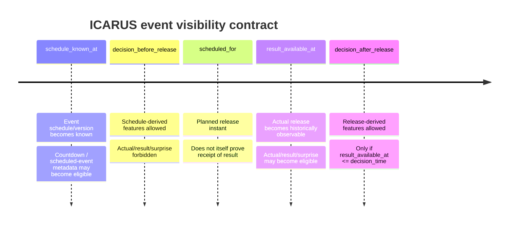

# ICARUS Scientific Integrity Report: TIME Kernel and Patch-Ready SOURCE + DATA + TIME Implementation

## Executive summary

The ICARUS integrity kernel is ready to move from conceptual design into a tightly ordered implementation program. The central engineering conclusion is that **SOURCE, DATA, and TIME should not be treated as three loosely connected utilities**. They form one evidentiary chain whose output is a qualified sample:

\[
\boxed{
\text{raw evidence}
\rightarrow
\text{semantic identity}
\rightarrow
\text{canonical time}
\rightarrow
\text{data integrity}
\rightarrow
\text{availability}
\rightarrow
\text{label resolution}
\rightarrow
\text{purged sample}
}
\]

A downstream model should receive a row only after every upstream link has been established. That design directly addresses the most dangerous failure modes in financial ML: silent timestamp reinterpretation, same-bar leakage, post-release macro information appearing before release, labels crossing partition boundaries, incompatible market instruments being merged, and model artifacts that cannot prove which evidence generated them.

The recommended kernel freezes ten decisions:

| Area | Frozen ICARUS decision |
|---|---|
| Canonical machine time | Store **integer UTC epoch nanoseconds**, not floating-point epoch seconds |
| Numeric timestamps | Prefer an explicit provider/schema unit; otherwise accept auto-detection only when exactly one of seconds/ms/µs/ns is valid inside a declared plausibility window |
| Naive local datetimes | Reject unless an explicit IANA timezone contract exists; ambiguous DST times require explicit `fold` |
| Chart tokens | Parse **case-sensitively before normalization**; `1m` and `1M` are fundamentally different |
| Chart family | Family is routing metadata only; it must never define experiment identity |
| Provider input | Preserve a raw `ProviderEnvelope`; derive one or more typed `ProviderObservation`s from it |
| Observation timing | Keep `source_event_time`, `received_at`, and `available_at` distinct |
| Dataset identity | Maintain both exact-byte `raw_file_sha256` and semantic `canonical_rows_sha256` |
| Duplicate timestamps | Collapse only completely identical empirical evidence; any same-time disagreement hard-fails qualification |
| Split purge | Purge using **actual `label_time` against time boundaries**, not merely a fixed number of rows |

Python's own documentation distinguishes timezone-aware datetimes, which can identify a specific moment, from naive datetimes, which cannot unambiguously locate themselves in time. Its `zoneinfo` implementation uses IANA timezone rules and explicitly represents repeated DST times through `fold`. Those semantics make silent “assume UTC” handling inappropriate for a scientific-integrity kernel. citeturn16view0turn18view3

The same principle applies to releases. The BLS 2026 calendar contains major releases such as Employment Situation and CPI at **08:30 Eastern**, not merely on whole hours; Federal Reserve FOMC statements provide an especially clear DST example, with the January 28, 2026 statement marked 2:00 p.m. **EST** and the September 16 statement marked 2:00 p.m. **EDT**. A fixed `18:00 UTC` or other season-invariant fallback therefore cannot faithfully represent both releases. citeturn17view1turn18view1turn18view2

For model evaluation, ordinary time-series cross-validation is not sufficient by itself. Current scikit-learn documentation defines `TimeSeriesSplit.gap` as a **number of samples**, and notes that comparable fold durations presume equally spaced samples. ICARUS supports or anticipates irregular bars, event-driven observations, and labels whose resolution horizons vary in wall-clock time, so the qualification layer should instead purge by the timestamp at which each label becomes knowable. citeturn15view0turn15view1

The implementation should be executed in dependency order:

\[
\boxed{
\text{timestamp errors}
\rightarrow
\text{timestamp normalization}
\rightarrow
\text{chart identity}
\rightarrow
\text{typed provider evidence}
\rightarrow
\text{row integrity}
\rightarrow
\text{manifest}
\rightarrow
\text{availability}
\rightarrow
\text{events}
\rightarrow
\text{labels}
\rightarrow
\text{purged splits}
\rightarrow
\text{trainer/artifact integration}
}
\]

The report below is **patch-ready but repository-agnostic**: paths and signatures are intended as the canonical target structure and may be mapped onto existing equivalent modules. No repository access is assumed, no repository mutation is claimed, and none of the RED/GREEN tests below is represented as already executed.

The ultimate invariant is:

\[
\boxed{
\max_i(feature\_available\_at_i)
\le
decision\_time
<
label\_time
}
\]

and, at a partition boundary \(B\),

\[
\boxed{
label\_time < B
}
\]

for every sample retained on the earlier side of that boundary.

That single formulation should become the heart of the ICARUS TIME kernel.

## Canonical evidence contracts

The SOURCE and DATA layers should converge on four immutable primitives: `NormalizedTimestamp`, `ChartIdentity`, `ProviderEnvelope`/`ProviderObservation`, and `DatasetManifest`. Everything else should be derived from them rather than independently reinterpreting raw strings or numbers.

**Canonical timestamp normalization.** ICARUS should use integer epoch nanoseconds internally:

```python
epoch_ns: int
```

rather than a `float` containing seconds. Integer nanoseconds provide a deterministic scalar for sorting, hashing, comparisons, and sub-microsecond vendor timestamps without introducing binary floating-point ambiguity.

Python's standard `datetime` type stores microseconds, and its documentation explicitly states that `timedelta` resolution is microseconds; therefore preserving a provider's nanosecond input requires ICARUS to retain the fractional remainder itself rather than round-tripping everything through a `datetime` object. Python's `datetime.fromisoformat` does natively understand common aware ISO forms, including `Z` and explicit UTC offsets, so it remains useful for the calendar/timezone component of parsing. citeturn16view0turn17view5

The recommended value object is:

```python
from dataclasses import dataclass
from enum import StrEnum


class TimestampUnit(StrEnum):
    SECONDS = "s"
    MILLISECONDS = "ms"
    MICROSECONDS = "us"
    NANOSECONDS = "ns"
    ISO8601 = "iso8601"


class TimestampResolutionMethod(StrEnum):
    EXPLICIT_UNIT = "explicit_unit"
    AUTO_UNIQUE = "auto_unique"
    ISO_AWARE = "iso_aware"
    ISO_CONTRACT_TIMEZONE = "iso_contract_timezone"


class TimezoneSource(StrEnum):
    EXPLICIT_OFFSET = "explicit_offset"
    IANA_IN_VALUE = "iana_in_value"
    CONTRACT_SUPPLIED = "contract_supplied"
    NOT_APPLICABLE = "not_applicable"


@dataclass(frozen=True, slots=True)
class NormalizedTimestamp:
    raw_repr: str
    epoch_ns: int
    utc_iso8601: str

    input_unit: TimestampUnit
    resolution_method: TimestampResolutionMethod

    timezone_basis: str | None
    timezone_source: TimezoneSource
    fold: int | None

    precision_ns: int
    parser_version: str

    @property
    def epoch_seconds(self) -> float:
        # Convenience only; never use this for hashing or exact identity.
        return self.epoch_ns / 1_000_000_000
```

`raw_repr` should be generated deterministically and retained for diagnostics. `utc_iso8601` should also be generated by ICARUS's formatter rather than being the hash authority; `epoch_ns` is the canonical instant.

The exception hierarchy should be explicit enough for tests, manifests, and provider health telemetry to distinguish failures:

```python
class TimestampError(ValueError): ...
class TimestampTypeError(TimestampError): ...
class TimestampParseError(TimestampError): ...
class TimestampUnitAmbiguityError(TimestampError): ...
class TimestampRangeError(TimestampError): ...
class NaiveTimestampError(TimestampError): ...
class AmbiguousLocalTimeError(TimestampError): ...
class NonexistentLocalTimeError(TimestampError): ...
class TimestampPrecisionError(TimestampError): ...
```

A critical refinement is that **numeric unit auto-detection cannot safely rely on one broad epoch range**. Consider a typical Unix-seconds value such as `1_700_000_000`. Read as seconds, it is modern history; read as milliseconds, microseconds, or nanoseconds, it yields dates near the Unix epoch. If the accepted range is merely “1970–2100,” several interpretations can be technically valid. The safe algorithm is therefore:

\[
\text{explicit unit}
\;>\;
\text{unique candidate in experiment-specific plausibility window}
\;>\;
\text{ambiguity error}
\]

A provider schema saying “milliseconds” should therefore outrank every magnitude heuristic.

The normalization signature should be:

```python
def normalize_timestamp(
    raw: object,
    *,
    unit_hint: TimestampUnit | None = None,
    naive_timezone: str | None = None,
    fold: int | None = None,
    plausible_start_ns: int,
    plausible_end_ns: int,
    parser_version: str = TIMESTAMP_PARSER_VERSION,
) -> NormalizedTimestamp:
    ...
```

Its contract is:

1. Reject booleans even though Python treats `bool` as an `int` subclass.
2. Reject NaN and infinity.
3. Apply an explicit `unit_hint` without trying alternative units.
4. Otherwise generate s/ms/µs/ns interpretations using exact decimal or integer arithmetic.
5. Filter candidates through the declared plausibility interval.
6. Accept exactly one.
7. Reject zero candidates as `TimestampRangeError`.
8. Reject multiple candidates as `TimestampUnitAmbiguityError`.
9. Parse ISO values while preserving up to nanosecond precision.
10. Reject fractional precision beyond nanoseconds unless a provider-specific contract explicitly defines its rounding policy.
11. Reject naive ISO datetimes unless `naive_timezone` is explicitly supplied.
12. Detect DST ambiguity/nonexistence rather than silently accepting an arbitrary offset.

Python documents `fold=0/1` specifically for repeated wall-clock times during DST offset transitions. It also recommends the `tzdata` package for cross-platform applications because some platforms, notably Windows installations, may not provide an IANA timezone database. ICARUS should therefore pin `tzdata` as a runtime/test dependency rather than depend on host configuration. citeturn17view0turn18view3

DST validation should use a UTC round trip. For a naive wall-clock time plus an IANA zone, construct possible fold interpretations, convert each to UTC and back, and compare the resulting wall time. Zero valid round trips means `NonexistentLocalTimeError`; two different valid offsets means an ambiguous time and requires a supplied `fold`.

**Chart identity must be separated from chart family.** Family should answer questions such as “which trainer implementation handles this mechanism?” Identity must answer “what exact series is this experiment about?”

The target object is:

```python
class ChartMechanism(StrEnum):
    CLOCK = "clock"
    CALENDAR = "calendar"
    TICK = "tick"
    RANGE = "range"
    RENKO = "renko"


class ChartUnit(StrEnum):
    SECOND = "second"
    MINUTE = "minute"
    HOUR = "hour"
    DAY = "day"
    MONTH = "month"
    TICK = "tick"
    PRICE = "price"


@dataclass(frozen=True, slots=True)
class ChartIdentity:
    raw_token: str
    canonical_key: str

    mechanism: ChartMechanism
    family: str

    quantity: str
    unit: ChartUnit
    exact_interval_ns: int | None

    supported: bool
    parser_version: str
```

`quantity` as a normalized string rather than float avoids identity instability for non-integer range sizes.

The comparison that matters is:

| Raw chart token | Semantic type | Suggested family | Exact duration | Canonical identity | Qualification |
|---|---|---|---:|---|---|
| `1m` | one clock minute | `clock_minutes` | 60 s | `clock:minute:1` | Supported |
| `1M` | one calendar month | `calendar_months` | Variable | `calendar:month:1` | Fail closed until monthly trainer exists |
| `60m` | sixty clock minutes | `clock_minutes` | 3,600 s | `clock:minute:60` | Supported |
| `61m` | sixty-one clock minutes | `clock_minutes` | 3,660 s | `clock:minute:61` | Supported |
| `1h` | one clock hour | `clock_hours` or unified `clock` | 3,600 s | `clock:hour:1` | Supported if alias policy permits |
| tick bar | event-count bar | `ticks` | None | e.g. `tick:1000` | Completion-time based |
| range bar | price-range bar | `range` | None | e.g. `range:4.0` | Completion-time based |
| Renko | price-movement construction | `renko` | None | configuration-specific | Completion-time based |

Parsing must be case-sensitive **before any transformation**. A suitable first-stage grammar is conceptually:

```text
^([1-9][0-9]*)(s|m|h|d|M)$
```

where lowercase `m` means minute and uppercase `M` means calendar month. Never call `.lower()` on the raw token before classification.

A calendar month has no constant number of nanoseconds and therefore must have:

```python
exact_interval_ns = None
```

Even where two representations have equal clock duration—such as `60m` and `1h`—they should be collapsed to one experiment identity only if ICARUS deliberately defines and versions an alias policy. Such equivalence must not emerge accidentally from duration rounding.

The key invariant is:

\[
family(A)=family(B)
\not\Rightarrow
identity(A)=identity(B)
\]

Consequently:

\[
family(60m)=family(61m)
\]

may be true, while:

\[
ChartIdentity(60m)\neq ChartIdentity(61m)
\]

must always be true.

**Provider envelopes and observations.** Transport provenance should be separated from semantic evidence. One network/file payload can contain multiple observations, so `ProviderEnvelope` is raw evidence and `ProviderObservation` is a parsed semantic unit.

```python
class EvidenceType(StrEnum):
    OHLC_BAR = "ohlc_bar"
    QUOTE_SNAPSHOT = "quote_snapshot"
    ORDERBOOK_SNAPSHOT = "orderbook_snapshot"
    EVENT_RELEASE = "event_release"
    MACRO_OBSERVATION = "macro_observation"
    BLOCKCHAIN_STATE = "blockchain_state"


class ObservationStatus(StrEnum):
    OK = "ok"
    STALE = "stale"
    SOURCE_TIME_UNKNOWN = "source_time_unknown"
    CLOCK_SKEW = "clock_skew"
    SEMANTIC_MISMATCH = "semantic_mismatch"
    MALFORMED = "malformed"


class AvailabilityBasis(StrEnum):
    LIVE_RECEIPT = "live_receipt"
    PROVIDER_PUBLICATION = "provider_publication"
    BAR_COMPLETION = "bar_completion"
    EXCHANGE_EVENT_PLUS_LATENCY = "exchange_event_plus_latency"
    HISTORICAL_PROVENANCE = "historical_provenance"
    UNKNOWN = "unknown"


@dataclass(frozen=True, slots=True)
class ProviderEnvelope:
    schema_version: int
    provider_id: str
    provider_role: str

    received_at_ns: int
    payload_sha256: str
    payload_size_bytes: int
    content_type: str | None

    request_id: str | None
    auth_status: str
    entitlement_status: str
    transport_status: str

    parser_version: str


@dataclass(frozen=True, slots=True)
class ProviderObservation:
    schema_version: int
    observation_id: str
    envelope_sha256: str

    evidence_type: EvidenceType
    instrument_identity_hash: str | None

    source_event_time_ns: int | None
    provider_published_at_ns: int | None
    received_at_ns: int
    available_at_ns: int | None
    availability_basis: AvailabilityBasis

    values: tuple[tuple[str, str | None], ...]
    units: tuple[tuple[str, str], ...]

    status: ObservationStatus
    semantic_identity_hash: str
    payload_sha256: str

    parser_version: str
    execution_authorized: bool = False
```

The three primary clocks mean different things:

\[
source\_event\_time
\]

is when the underlying event or market state occurred;

\[
received\_at
\]

is when this ICARUS collector actually received the payload;

\[
available\_at
\]

is the earliest simulated decision instant at which the observation is legally usable.

For **live evidence**, the conservative rule is:

\[
available\_at \ge received\_at
\]

and normally:

\[
available\_at = received\_at.
\]

For **historical backfills**, today's ingestion time must not be mistaken for historical availability. Historical `available_at` has to be reconstructed from defensible provenance such as an official release timestamp, exchange message timestamp plus a frozen latency assumption, or bar-completion semantics. If that cannot be proved, the state should be `UNKNOWN`, not an invented timestamp.

Recommended staleness measures are:

\[
transportLatency =
received\_at-source\_event\_time
\]

when both clocks are trustworthy,

\[
sourceAgeAtDecision =
decision\_time-source\_event\_time,
\]

and:

\[
availabilityAge =
decision\_time-available\_at.
\]

A negative transport latency should not be silently clamped to zero. It is evidence of clock skew, provider semantics, or parser error and should emit `CLOCK_SKEW`.

Each evidence type then has its own semantic payload. An `OHLC_BAR` should preserve at minimum bar open, nominal close where applicable, actual completion, OHLC, and true bar-volume semantics. A `QUOTE_SNAPSHOT` preserves bid/ask/last/mark separately. An `ORDERBOOK_SNAPSHOT` additionally requires sequence/depth semantics. An `EVENT_RELEASE` preserves publication/version availability. A `MACRO_OBSERVATION` preserves series/vintage/revision identity. A `BLOCKCHAIN_STATE` should preserve chain, block number/hash, block time, and finality assumptions.

A `QUOTE_SNAPSHOT` must never satisfy an `OHLC_BAR` requirement merely because its last price can be copied into four columns.

**DatasetManifest v2.** The manifest should prove both exact physical provenance and the exact semantic dataset produced from it:

```python
@dataclass(frozen=True, slots=True)
class DatasetManifest:
    schema_version: int
    manifest_version: str

    parser_version: str
    integrity_policy_version: str
    canonical_serialization_version: str

    source_name: str
    provider_id: str | None

    instrument_identity_hash: str
    chart_identity: ChartIdentity

    raw_file_sha256: str
    canonical_rows_sha256: str
    canonical_schema_sha256: str
    manifest_sha256: str

    source_rows: int
    accepted_rows: int
    canonical_rows: int
    rejected_rows: int

    identical_duplicate_rows: int
    conflicting_duplicate_groups: int

    source_order_inversions: int
    source_nonpositive_elapsed_pairs: int

    invalid_timestamp_rows: int
    invalid_ohlc_rows: int

    first_timestamp_ns: int | None
    last_timestamp_ns: int | None

    median_positive_delta_ns: int | None
    dominant_delta_ns: int | None

    integrity_pass: bool
    failure_codes: tuple[str, ...]

    created_at_ns: int
    execution_authorized: bool = False
```

The distinction between hashes is deliberate:

\[
raw\_file\_sha256 =
SHA256(\text{exact source bytes})
\]

No newline normalization, trimming, column reordering, decompression substitution, or whitespace rewriting is permitted before this hash.

By contrast:

\[
canonical\_rows\_sha256 =
SHA256(\text{versioned canonical semantic representation})
\]

is computed after parsing, semantic normalization, integrity checking, identical-duplicate collapse, and deterministic time ordering.

Two differently formatted files may therefore have:

\[
rawHash_A \neq rawHash_B
\]

but:

\[
canonicalHash_A = canonicalHash_B
\]

when their qualified empirical evidence is exactly the same. That is desirable.

For manifest JSON, ICARUS should either implement a tiny explicitly versioned canonical serializer or adopt a canonicalization standard. RFC 8785 exists specifically because repeatable hashing/signing requires invariant serialization and specifies deterministic JSON property sorting and UTF-8 output; it also disallows NaN and infinity. One important caveat is that JCS uses IEEE-754 JSON numbers, so high-precision integers/decimals outside that safe representation should be encoded as canonical strings, exactly as the RFC recommends for higher precision. citeturn21view0

For ICARUS canonical rows, a safe representation is therefore:

```json
{
  "timestamp_ns": "1790001234567890123",
  "open": "4210.25",
  "high": "4212.00",
  "low": "4208.75",
  "close": "4211.50",
  "volume": "1034"
}
```

rather than emitting large nanosecond integers or model-critical decimals through platform-dependent floating-point formatting.

`manifest_sha256` is calculated over the canonical manifest representation **excluding the `manifest_sha256` field itself**.

**Duplicate and row-integrity rules.** Source order must be audited **before sorting**. For raw timestamps \(t_i\):

\[
t_i<t_{i-1}
\]

increments `source_order_inversions`.

\[
t_i\le t_{i-1}
\]

increments `source_nonpositive_elapsed_pairs`.

Equality therefore records a nonpositive elapsed pair and also participates in duplicate analysis; it is not itself an inversion.

Duplicate collapse should group canonical parsed rows by `timestamp_ns`. Equivalence must include **all empirically relevant fields**, not merely OHLC:

\[
E(row)=
(timestamp, O,H,L,C,volume,
features,\ source\ semantics,\ldots)
\]

If every row in a same-timestamp group has the same normalized empirical projection:

\[
E(r_1)=E(r_2)=\cdots=E(r_n),
\]

retain one reconstructed canonical row and count \(n-1\) identical duplicates.

If any relevant field differs:

\[
\exists i,j: E(r_i)\neq E(r_j),
\]

the dataset fails with `CONFLICTING_DUPLICATE`.

There must be no “last row wins,” “first row wins,” or averaging policy for conflicting observations.

After collapse and sorting:

\[
t_{i+1}>t_i
\]

is mandatory.

For standard bar geometry:

\[
low\le open\le high
\]

\[
low\le close\le high
\]

and therefore:

\[
low\le \min(open,close)
\le
\max(open,close)
\le high.
\]

Required prices must also be finite. A generic kernel should not invent a universal positive-price rule; instrument-specific economics belong in an instrument policy layer rather than basic OHLC geometry.

The resulting system architecture is:

```mermaid
flowchart LR
    A[Raw source bytes / API payload] --> B[ProviderEnvelope]
    B --> C{Transport / auth / entitlement valid?}
    C -- No --> RX[Fail closed / provider state]
    C -- Yes --> D[Typed ProviderObservation]

    D --> E[Instrument identity]
    D --> F[Canonical timestamp]
    D --> G[Evidence type]

    E --> H{Semantic identity valid?}
    F --> H
    G --> H

    H -- No --> R1[Reject observation]
    H -- Yes --> I[DATA integrity]

    I --> J[OHLC / schema checks]
    J --> K[Source-order audit]
    K --> L[Duplicate grouping]
    L --> M{Conflicting duplicate?}
    M -- Yes --> R2[Dataset hard fail]
    M -- No --> N[Collapse identical duplicates]

    N --> O[Canonical row serialization]
    O --> P[DatasetManifest v2]

    P --> Q{Manifest passes?}
    Q -- No --> R3[Training blocked]
    Q -- Yes --> S[TIME qualification]

    S --> T[Resolve available_at]
    T --> U[Event/candidate as-of checks]
    U --> V[Resolve label_time]
    V --> W[Purge labels crossing boundaries]
    W --> X[Qualified train/validation/holdout samples]

    X --> Y[BASELINE / XGB / later qualification]
```



## Temporal qualification kernel

The TIME layer should not answer “what timestamp belongs to this row?” It should answer the stronger question:

> **At decision time \(d\), exactly what information could ICARUS legitimately know, and when does the eventual target become knowable?**

Every qualified modeling sample should therefore contain at minimum:

```python
@dataclass(frozen=True, slots=True)
class QualifiedSample:
    sample_id: str
    decision_time_ns: int
    feature_available_at_max_ns: int
    label_time_ns: int

    feature_vector_hash: str
    label_contract_hash: str
    time_contract_hash: str
```

with:

\[
featureAvailableMax
=
\max_j(availableAt_j).
\]

Admission requires:

\[
featureAvailableMax\le decisionTime.
\]

Any feature with:

\[
availableAt>decisionTime
\]

is leakage, irrespective of whether its source row has an earlier nominal timestamp.

That distinction is vital for bars. If a bar timestamp denotes its **open**, then high, low, close, and final volume are generally not fully known at bar open. The bar contract should separately represent:

```python
@dataclass(frozen=True, slots=True)
class BarTime:
    opened_at_ns: int
    nominal_close_at_ns: int | None
    completed_at_ns: int
```

For fixed clock bars, nominal close may be calculable. For tick, range, Renko, and other event-driven bars, there is no valid fixed-duration close inference; actual completion must be observed or reconstructed from source evidence.

Full-bar features therefore use:

\[
availableAt_{OHLC} = completedAt.
\]

A strategy making a decision at the opening of a 15-minute bar cannot lawfully consume that same bar's final high/low/close.

**Event scheduling needs two—and preferably field-level—availability channels.**

The minimum requested event type should be:

```python
@dataclass(frozen=True, slots=True)
class EventObservation:
    event_id: str
    version_id: str
    kind: str

    scheduled_for_ns: int
    schedule_known_at_ns: int | None
    result_available_at_ns: int | None

    actual: str | None
    consensus: str | None
    previous: str | None

    provider_id: str
    payload_sha256: str
```

The minimal legal rules are:

\[
scheduleKnownAt\le decisionTime
\]

before any scheduled-event countdown or event-proximity feature is visible, and:

\[
resultAvailableAt\le decisionTime
\]

before actual/result/surprise information is visible.

`scheduled_for` is **not** an availability timestamp. It describes the planned event time; releases can be delayed, schedules can be revised, and an official value may become accessible at a different instant.

For a scientific-integrity implementation, the schema should go one step further and eventually support field-level availability:

```python
@dataclass(frozen=True, slots=True)
class TimedValue:
    value: str | None
    available_at_ns: int | None
```

because consensus estimates may be known before the release while the actual value is not, and revised “previous” values can acquire a different availability time from the original observation.

The timeline is:



Official government release schedules demonstrate why minute precision and named-timezone handling are mandatory. BLS records 08:30 Eastern releases throughout 2026 and explicitly states that calendar times are Eastern Time. The Federal Reserve marked January's 2:00 p.m. release as EST but September's as EDT. Converting those with a constant UTC offset would move at least one by an hour. citeturn17view1turn18view1turn18view2

Schedule revisions must also be versioned. Suppose an event was originally scheduled for \(S_1\), then rescheduled to \(S_2\) at time \(R\). For a simulated decision \(d<R\), ICARUS must expose \(S_1\), not retroactively rewrite history using \(S_2\).

Formally:

\[
eventVersion(d)
=
\arg\max_v
\{
v.knownAt\mid v.knownAt\le d
\}.
\]

**Candidate-market evidence obeys the same availability law.** A candidate observation \(c\) is eligible only when:

\[
c.availableAt\le decisionTime.
\]

For latency-sensitive lead-lag work, add a frozen maximum age:

\[
decisionTime-c.sourceEventTime
\le maxCandidateAge.
\]

When `source_event_time` is absent, ICARUS may know that the payload had arrived, but cannot certify the true age of the underlying market state. That should produce:

```text
SOURCE_TIME_UNKNOWN
```

and block any claim requiring strict event-time lead.

A same-interval candidate bar should be handled particularly carefully. If its full OHLC is not complete before the execution decision:

\[
candidate.completedAt > decisionTime,
\]

then using its final close/high/low is forbidden.

Thus the system should explicitly distinguish:

```text
DESCRIPTIVE_SAME_INTERVAL
```

from:

```text
STRICT_PREDICTIVE_LEAD
```

rather than allowing contemporaneous correlation to masquerade as prediction.

**`label_time` is the decisive split concept.** It should mean:

> the earliest instant at which the target assigned to this sample could be fully determined under the frozen label contract.

For a forward-return target from decision \(t\) to horizon \(h\):

\[
labelTime
=
availableAt(\text{terminal observation required for label}).
\]

This may differ from `t + N rows`, particularly for irregular bars, market closures, event-driven bars, missing observations, and delayed source availability.

Partitions should use half-open intervals:

\[
[start,end)
\]

and purge any sample on the earlier side whose label resolves at or beyond the next boundary.

For training followed by validation at boundary \(B_v\):

\[
decisionTime < B_v
\]

is insufficient.

The actual qualification rule is:

\[
decisionTime < B_v
\quad\land\quad
labelTime < B_v.
\]

Likewise, if holdout begins at \(B_h\), validation samples require:

\[
labelTime < B_h.
\]

A fixed sample gap is not equivalent. Scikit-learn's current `TimeSeriesSplit` explicitly defines `gap` as a number of **samples** and also states that equal spacing is required for comparable temporal fold lengths. That makes it a useful primitive for conventional regularly spaced data, but not a complete solution for ICARUS's label-availability problem. citeturn15view0turn15view1

The proposed splitter is:

```python
@dataclass(frozen=True, slots=True)
class TimeWindow:
    start_ns: int
    end_ns: int


@dataclass(frozen=True, slots=True)
class SplitIndices:
    train: tuple[int, ...]
    validation: tuple[int, ...]
    holdout: tuple[int, ...]

    train_purged: tuple[int, ...]
    validation_purged: tuple[int, ...]


def purged_time_split(
    samples: Sequence[QualifiedSample],
    *,
    train: TimeWindow,
    validation: TimeWindow,
    holdout: TimeWindow,
    embargo_ns: int = 0,
) -> SplitIndices:
    ...
```

The algorithm should first partition by `decision_time_ns`, then remove rows whose `label_time_ns` crosses that partition's right boundary. An optional embargo can then exclude decisions immediately after a boundary, but embargo is **additional protection**, not a substitute for label-time purging.

The hard temporal invariant for every retained sample becomes:

\[
\boxed{
\max(feature.availableAt)
\le decisionTime
<
labelTime
\le partitionRightEdge
}
\]

where the last relation is strict at the right boundary under the recommended half-open convention.

## TDD clearance matrix

TDD should proceed in dependency order. A RED test counts only when it fails for the intended missing or incorrect behavior—not because of an import error, misspelled fixture, or broken test harness.

The first stage establishes exact time semantics:

| Pass order | RED test | Required behavior |
|---:|---|---|
| A | `test_epoch_seconds_normalize` | Explicit seconds normalize correctly |
| A | `test_epoch_milliseconds_normalize_to_same_instant` | ms equals equivalent seconds instant |
| A | `test_epoch_microseconds_normalize_to_same_instant` | µs equals same instant |
| A | `test_epoch_nanoseconds_normalize_to_same_instant` | ns equals same instant |
| A | `test_iso_z_normalizes_to_same_instant` | `Z` ISO agrees with numeric timestamp |
| A | `test_explicit_unit_overrides_autodetection` | Schema unit is authoritative |
| A | `test_numeric_without_unique_unit_raises_ambiguity` | Multiple plausible units fail closed |
| A | `test_out_of_range_numeric_timestamp_rejected` | Zero plausible units fail |
| A | `test_naive_iso_without_timezone_rejected` | No silent local/UTC assumption |
| A | `test_ambiguous_dst_local_time_requires_fold` | Fall-back repeated hour must be disambiguated |
| A | `test_nonexistent_dst_local_time_rejected` | Spring-forward nonexistent wall time rejected |
| A | `test_nan_timestamp_rejected` | NaN impossible |
| A | `test_infinite_timestamp_rejected` | Infinity impossible |
| A | `test_bool_timestamp_rejected` | `True` does not become epoch second 1 |
| A | `test_subnanosecond_timestamp_rejected` | Precision loss cannot be silent |

Python's aware/naive and `fold` semantics provide the reference behavior for these tests. citeturn16view0turn17view0

Chart identity comes next:

| Pass order | RED test | Required behavior |
|---:|---|---|
| B | `test_lowercase_1m_is_one_minute` | `1m → 60 s` |
| B | `test_uppercase_1M_is_calendar_month` | `1M` remains calendar-month identity |
| B | `test_unsupported_monthly_chart_fails_closed` | No monthly trainer means explicit rejection |
| B | `test_60m_is_3600_seconds` | Exact 60-minute duration |
| B | `test_61m_is_3660_seconds` | Exact 61-minute duration |
| B | `test_61m_does_not_equal_60m_identity` | Distinct experiment identity |
| B | `test_chart_family_does_not_define_experiment_identity` | Same family cannot collapse identities |
| B | `test_chart_parser_preserves_raw_case` | Raw semantic token retained |

Typed SOURCE evidence follows:

| Pass order | RED test | Required behavior |
|---:|---|---|
| C | `test_provider_envelope_hashes_exact_payload_bytes` | Raw payload provenance |
| C | `test_received_time_is_not_source_event_time` | Independent clocks |
| C | `test_live_available_at_not_before_received_at` | Live look-ahead blocked |
| C | `test_unknown_source_time_is_explicit` | Missing event time is a state |
| C | `test_quote_snapshot_cannot_enter_ohlc_trainer` | Evidence-type firewall |
| C | `test_orderbook_snapshot_requires_sequence_semantics` | Book state cannot be underspecified |
| C | `test_total_session_volume_is_not_bar_volume` | Cumulative total not silently relabeled |
| C | `test_auth_failed_differs_from_no_observation` | Provider failures remain distinguishable |
| C | `test_entitlement_blocked_differs_from_network_failure` | Failure ontology preserved |
| C | `test_negative_transport_latency_flags_clock_skew` | No silent time clamping |

Then raw DATA integrity:

| Pass order | RED test | Required behavior |
|---:|---|---|
| D | `test_identical_duplicate_is_counted_and_collapsed` | Exact repetitions canonicalize |
| D | `test_identical_duplicate_equivalence_includes_all_model_inputs` | Feature disagreement prevents collapse |
| D | `test_conflicting_duplicate_rejects_dataset` | Same-time conflict is fatal |
| D | `test_source_order_inversion_recorded_before_sort` | Original disorder preserved as evidence |
| D | `test_source_nonpositive_elapsed_recorded_before_collapse` | Equality/backwards steps counted |
| D | `test_final_canonical_rows_are_strictly_increasing` | Canonical stream obeys \(t_{i+1}>t_i\) |
| D | `test_high_below_open_rejected` | OHLC geometry |
| D | `test_high_below_close_rejected` | OHLC geometry |
| D | `test_low_above_open_rejected` | OHLC geometry |
| D | `test_low_above_close_rejected` | OHLC geometry |
| D | `test_high_below_low_rejected` | OHLC geometry |
| D | `test_nonfinite_ohlc_rejected` | NaN/∞ rejected |

Manifest hashing follows only after canonical rows exist:

| Pass order | RED test | Required behavior |
|---:|---|---|
| E | `test_same_bytes_same_raw_hash` | Exact input reproducibility |
| E | `test_changed_raw_bytes_change_raw_hash` | Byte identity reacts to any physical change |
| E | `test_semantically_equivalent_format_can_keep_same_canonical_hash` | Semantic identity independent of benign formatting |
| E | `test_changed_semantic_row_changes_canonical_hash` | Data change changes semantic identity |
| E | `test_canonical_row_order_is_deterministic` | Canonical hash independent of source ordering when evidence is otherwise identical |
| E | `test_manifest_hash_excludes_self_field` | No recursive digest |
| E | `test_manifest_hash_is_deterministic_across_process_hash_seeds` | Python process randomness irrelevant |
| E | `test_failed_integrity_produces_nonpassing_manifest` | Failures bind into artifact |

The TIME layer then turns the canonical dataset into qualified model samples:

| Pass order | RED test | Required behavior |
|---:|---|---|
| F | `test_full_ohlc_unavailable_before_bar_completion` | Bar-open leakage prevented |
| F | `test_feature_available_after_decision_rejected` | Universal as-of rule |
| F | `test_live_observation_available_at_received_time` | Conservative live eligibility |
| F | `test_historical_available_at_requires_provenance_basis` | Backfill cannot invent historical observability |
| F | `test_schedule_feature_requires_schedule_known_at` | Unknown schedule cannot leak backwards |
| F | `test_realized_event_requires_result_available_at` | Future actual blocked |
| F | `test_schedule_revision_not_visible_before_revision_known_at` | No retroactive schedule correction |
| F | `test_half_hour_release_preserves_minutes` | 08:30 remains 08:30 |
| F | `test_eastern_release_uses_dst_correctly` | EST/EDT conversion correct |
| F | `test_stale_candidate_rejected` | Max-age contract enforced |
| F | `test_candidate_without_source_time_cannot_claim_strict_lead` | Missing event clock degrades claim |
| F | `test_same_interval_candidate_bar_rejected_before_completion` | k=0 leakage blocked |
| F | `test_range_bar_uses_observed_completion_not_nominal_duration` | Event bars handled correctly |
| F | `test_renko_bar_uses_observed_completion_not_nominal_duration` | Same |
| F | `test_tick_bar_uses_observed_completion_not_nominal_duration` | Same |

Label/split qualification follows:

| Pass order | RED test | Required behavior |
|---:|---|---|
| G | `test_label_time_is_when_target_becomes_knowable` | Label timestamp is semantic |
| G | `test_train_row_with_label_crossing_validation_boundary_is_purged` | Train/validation leakage blocked |
| G | `test_validation_row_with_label_crossing_holdout_boundary_is_purged` | Validation/holdout leakage blocked |
| G | `test_label_exactly_on_boundary_is_purged` | Half-open interval convention enforced |
| G | `test_purge_uses_label_time_not_row_gap` | No row-count proxy |
| G | `test_irregular_bars_do_not_change_temporal_purge_semantics` | Works for irregular samples |
| G | `test_embargo_does_not_replace_label_purge` | Controls remain conceptually separate |
| G | `test_holdout_is_not_touched_during_model_selection` | Final evidence remains final |

Finally integration and reproducibility:

| Pass order | RED test | Required behavior |
|---:|---|---|
| H | `test_failed_manifest_blocks_training` | No bypass |
| H | `test_trainer_requires_qualified_sample_contract` | Raw rows cannot skip TIME |
| H | `test_model_artifact_binds_dataset_manifest_hash` | Exact data binding |
| H | `test_model_artifact_binds_chart_identity` | 60m/61m cannot collide |
| H | `test_model_artifact_binds_time_contract_hash` | Time semantics immutable |
| H | `test_model_artifact_binds_feature_and_label_contracts` | Complete experiment identity |
| H | `test_xgb_artifact_records_xgboost_version` | Runtime identity retained |
| H | `test_xgb_artifact_records_seed_and_effective_config` | RNG/config provenance |
| H | `test_xgb_artifact_records_serialized_model_hash` | Model bytes independently verifiable |
| H | `test_calibration_data_disjoint_from_base_model_fit_data` | Calibration contamination blocked |
| H | `test_isotonic_undersampled_configuration_fails_or_requires_explicit_trial` | No silent fallback |

Current scikit-learn guidance explicitly says calibration should ideally use data independent of the data fitting the classifier and warns that isotonic calibration is more prone to overfitting on small datasets, with its documentation giving roughly 1,000 calibration observations as the scale above which isotonic generally becomes competitive with sigmoid. citeturn14view0

That guidance should inform the later BASELINE/XGB gate, but calibration must remain **downstream** of SOURCE/DATA/TIME closure.

## Patch-ready implementation units

Because no specific repository is assumed, the following is a canonical module structure. If equivalent existing files exist, preserve ownership boundaries rather than creating duplicate implementations.

| Dependency order | File | Add or modify | Primary responsibility |
|---:|---|---|---|
| A | `icarus_engine/evidence/errors.py` | Add | Typed SOURCE/DATA/TIME exceptions |
| B | `icarus_engine/evidence/timestamps.py` | Add | One timestamp parser for entire system |
| C | `icarus_engine/evidence/chart.py` | Add | Case-sensitive chart identity |
| D | `icarus_engine/evidence/identity.py` | Add | Instrument/provider semantic identities |
| E | `icarus_engine/evidence/provider.py` | Add | `ProviderEnvelope`, observation parsing |
| F | `icarus_engine/evidence/integrity.py` | Add | Row parsing, OHLC validation, duplicates |
| G | `icarus_engine/evidence/manifest.py` | Add | DatasetManifest v2 + canonical hashes |
| H | `icarus_engine/time/availability.py` | Add | `available_at`, staleness, as-of admission |
| I | `icarus_engine/time/events.py` | Add | Scheduled/released event versions |
| J | `icarus_engine/time/labels.py` | Add | Label contracts and `label_time` |
| K | `icarus_engine/time/splits.py` | Add | Time windows, purge, embargo |
| L | existing feed adapters | Modify | Return typed provider evidence |
| M | existing bar aggregation | Modify | Preserve open/nominal-close/completed clocks |
| N | existing event calendar | Modify | Eliminate fixed-UTC release shortcuts |
| O | existing candidate alignment | Modify | Availability + source-age eligibility |
| P | existing trainer dataset loader | Modify | Require passing manifest and qualified samples |
| Q | existing training entry point | Modify | Fail closed before fit |
| R | existing model artifact module | Modify | Bind all SOURCE/DATA/TIME identities |
| S | `tests/evidence/*` | Add | RED suites A–E |
| T | `tests/time/*` | Add | RED suites F–G |
| U | `tests/integration/*` | Add | RED suite H |

The core signatures should be frozen before adapters are touched:

```python
def normalize_timestamp(
    raw: object,
    *,
    unit_hint: TimestampUnit | None = None,
    naive_timezone: str | None = None,
    fold: int | None = None,
    plausible_start_ns: int,
    plausible_end_ns: int,
    parser_version: str = TIMESTAMP_PARSER_VERSION,
) -> NormalizedTimestamp:
    ...


def parse_chart(
    raw_token: str,
    *,
    parser_version: str = CHART_PARSER_VERSION,
) -> ChartIdentity:
    ...


def parse_provider_envelope(
    *,
    provider_id: str,
    provider_role: str,
    payload: bytes,
    received_at: NormalizedTimestamp,
    auth_status: str,
    entitlement_status: str,
    transport_status: str,
    content_type: str | None = None,
    request_id: str | None = None,
) -> ProviderEnvelope:
    ...


def parse_observations(
    envelope: ProviderEnvelope,
    *,
    provider_parser: ProviderParser,
) -> tuple[ProviderObservation, ...]:
    ...


def collapse_duplicates(
    rows: Sequence[CanonicalRow],
    *,
    equivalence_fields: Sequence[str],
) -> DuplicateCollapseResult:
    ...


def build_dataset_manifest(
    raw_bytes: bytes,
    raw_rows: Sequence[RawRow],
    *,
    source_name: str,
    provider_id: str | None,
    instrument: InstrumentIdentity,
    chart: ChartIdentity,
    parser_config: ParserConfig,
) -> tuple[DatasetManifest, tuple[CanonicalRow, ...]]:
    ...


def ensure_available(
    observation: ProviderObservation,
    *,
    decision_time_ns: int,
    max_source_age_ns: int | None = None,
) -> AvailabilityDecision:
    ...


def purged_time_split(
    samples: Sequence[QualifiedSample],
    *,
    train: TimeWindow,
    validation: TimeWindow,
    holdout: TimeWindow,
    embargo_ns: int = 0,
) -> SplitIndices:
    ...
```

**Minimal `normalize_timestamp` pseudocode:**

```python
from decimal import Decimal, InvalidOperation

NS_PER_UNIT = {
    TimestampUnit.SECONDS: Decimal("1000000000"),
    TimestampUnit.MILLISECONDS: Decimal("1000000"),
    TimestampUnit.MICROSECONDS: Decimal("1000"),
    TimestampUnit.NANOSECONDS: Decimal("1"),
}


def normalize_timestamp(
    raw: object,
    *,
    unit_hint: TimestampUnit | None = None,
    naive_timezone: str | None = None,
    fold: int | None = None,
    plausible_start_ns: int,
    plausible_end_ns: int,
    parser_version: str = TIMESTAMP_PARSER_VERSION,
) -> NormalizedTimestamp:
    if isinstance(raw, bool):
        raise TimestampTypeError("bool is not a timestamp")

    if isinstance(raw, str) and not _looks_numeric(raw):
        return _normalize_iso8601(
            raw,
            naive_timezone=naive_timezone,
            fold=fold,
            plausible_start_ns=plausible_start_ns,
            plausible_end_ns=plausible_end_ns,
            parser_version=parser_version,
        )

    try:
        number = Decimal(str(raw))
    except (InvalidOperation, ValueError) as exc:
        raise TimestampParseError(str(raw)) from exc

    if not number.is_finite():
        raise TimestampParseError("timestamp must be finite")

    units = (unit_hint,) if unit_hint is not None else tuple(NS_PER_UNIT)

    valid: list[tuple[TimestampUnit, int]] = []

    for unit in units:
        ns_decimal = number * NS_PER_UNIT[unit]

        if ns_decimal != ns_decimal.to_integral_value():
            # Input has more precision than canonical nanoseconds.
            continue

        ns = int(ns_decimal)

        if plausible_start_ns <= ns <= plausible_end_ns:
            valid.append((unit, ns))

    if not valid:
        raise TimestampRangeError(raw)

    if len(valid) > 1:
        raise TimestampUnitAmbiguityError(
            f"{raw!r} valid as {[u.value for u, _ in valid]}"
        )

    unit, epoch_ns = valid[0]

    return NormalizedTimestamp(
        raw_repr=_stable_raw_repr(raw),
        epoch_ns=epoch_ns,
        utc_iso8601=_format_utc_ns(epoch_ns),
        input_unit=unit,
        resolution_method=(
            TimestampResolutionMethod.EXPLICIT_UNIT
            if unit_hint is not None
            else TimestampResolutionMethod.AUTO_UNIQUE
        ),
        timezone_basis=None,
        timezone_source=TimezoneSource.NOT_APPLICABLE,
        fold=None,
        precision_ns=_infer_numeric_precision_ns(number, unit),
        parser_version=parser_version,
    )
```

For ISO parsing, `datetime.fromisoformat` can handle standard offset-aware strings including `Z`; ICARUS should wrap it with its stricter timezone, DST, and nanosecond-preservation policies rather than exposing library behavior directly. citeturn17view5turn18view3

**Minimal provider-envelope construction:**

```python
import hashlib


def parse_provider_envelope(
    *,
    provider_id: str,
    provider_role: str,
    payload: bytes,
    received_at: NormalizedTimestamp,
    auth_status: str,
    entitlement_status: str,
    transport_status: str,
    content_type: str | None = None,
    request_id: str | None = None,
) -> ProviderEnvelope:
    return ProviderEnvelope(
        schema_version=1,
        provider_id=provider_id,
        provider_role=provider_role,
        received_at_ns=received_at.epoch_ns,
        payload_sha256=hashlib.sha256(payload).hexdigest(),
        payload_size_bytes=len(payload),
        content_type=content_type,
        request_id=request_id,
        auth_status=auth_status,
        entitlement_status=entitlement_status,
        transport_status=transport_status,
        parser_version=PROVIDER_ENVELOPE_VERSION,
    )
```

The semantic parser runs afterward and is forbidden to mutate or replace the envelope's payload hash.

For live observations:

```python
def resolve_live_available_at(
    *,
    received_at_ns: int,
    provider_published_at_ns: int | None,
) -> tuple[int, AvailabilityBasis]:
    # Publication can prove the information existed earlier,
    # but ICARUS did not possess it before receipt.
    return received_at_ns, AvailabilityBasis.LIVE_RECEIPT
```

For historical reconstruction:

```python
def resolve_historical_available_at(
    *,
    evidence_type: EvidenceType,
    provider_published_at_ns: int | None,
    bar_completed_at_ns: int | None,
    frozen_latency_ns: int | None,
) -> tuple[int | None, AvailabilityBasis]:
    if provider_published_at_ns is not None:
        latency = frozen_latency_ns or 0
        return (
            provider_published_at_ns + latency,
            AvailabilityBasis.PROVIDER_PUBLICATION,
        )

    if evidence_type is EvidenceType.OHLC_BAR and bar_completed_at_ns is not None:
        return bar_completed_at_ns, AvailabilityBasis.BAR_COMPLETION

    return None, AvailabilityBasis.UNKNOWN
```

The key is that historical `available_at` cannot be guessed from the row's nominal event timestamp.

**Minimal duplicate collapse:**

```python
from collections import defaultdict


def collapse_duplicates(
    rows: Sequence[CanonicalRow],
    *,
    equivalence_fields: Sequence[str],
) -> DuplicateCollapseResult:
    groups: dict[int, list[CanonicalRow]] = defaultdict(list)

    for row in rows:
        groups[row.timestamp_ns].append(row)

    kept: list[CanonicalRow] = []
    identical_removed = 0
    conflicts: list[DuplicateConflict] = []

    for timestamp_ns in sorted(groups):
        group = groups[timestamp_ns]

        if len(group) == 1:
            kept.append(group[0])
            continue

        projections = {
            tuple(_canonical_field(row, field) for field in equivalence_fields)
            for row in group
        }

        if len(projections) != 1:
            conflicts.append(
                DuplicateConflict(
                    timestamp_ns=timestamp_ns,
                    source_rows=tuple(r.source_row_number for r in group),
                )
            )
            continue

        identical_removed += len(group) - 1

        # Reconstruct; do not rely on arbitrary source row ordering.
        kept.append(
            CanonicalRow.from_equivalent_group(
                timestamp_ns=timestamp_ns,
                projection=next(iter(projections)),
                fields=equivalence_fields,
            )
        )

    if conflicts:
        raise ConflictingDuplicateError(conflicts)

    if any(b.timestamp_ns <= a.timestamp_ns for a, b in zip(kept, kept[1:])):
        raise CanonicalOrderError("canonical timestamps not strictly increasing")

    return DuplicateCollapseResult(
        rows=tuple(kept),
        identical_duplicates_removed=identical_removed,
        conflicts=(),
    )
```

Source inversion counts must be calculated before invoking this function.

**Minimal manifest build:**

```python
def build_dataset_manifest(
    raw_bytes: bytes,
    raw_rows: Sequence[RawRow],
    *,
    source_name: str,
    provider_id: str | None,
    instrument: InstrumentIdentity,
    chart: ChartIdentity,
    parser_config: ParserConfig,
) -> tuple[DatasetManifest, tuple[CanonicalRow, ...]]:
    raw_hash = sha256_hex(raw_bytes)

    parsed, audit = parse_and_validate_rows(
        raw_rows,
        parser_config=parser_config,
    )

    collapsed = collapse_duplicates(
        parsed,
        equivalence_fields=parser_config.empirical_fields,
    )

    canonical_rows = tuple(
        sorted(collapsed.rows, key=lambda row: row.timestamp_ns)
    )

    canonical_bytes = serialize_canonical_rows(
        canonical_rows,
        serialization_version=CANONICAL_SERIALIZATION_VERSION,
    )

    canonical_hash = sha256_hex(canonical_bytes)

    draft = DatasetManifest(
        schema_version=2,
        manifest_version=MANIFEST_VERSION,
        parser_version=parser_config.parser_version,
        integrity_policy_version=parser_config.integrity_policy_version,
        canonical_serialization_version=CANONICAL_SERIALIZATION_VERSION,
        source_name=source_name,
        provider_id=provider_id,
        instrument_identity_hash=instrument.semantic_hash(),
        chart_identity=chart,
        raw_file_sha256=raw_hash,
        canonical_rows_sha256=canonical_hash,
        canonical_schema_sha256=schema_hash(CanonicalRow),
        manifest_sha256="",
        # ...audit counts...
        integrity_pass=audit.pass_ and not audit.conflicts,
        failure_codes=tuple(audit.failure_codes),
        created_at_ns=clock.now_ns(),
        execution_authorized=False,
    )

    manifest_hash = sha256_hex(
        canonicalize_manifest(draft, exclude={"manifest_sha256"})
    )

    return (
        dataclasses.replace(draft, manifest_sha256=manifest_hash),
        canonical_rows,
    )
```

For a fully deterministic experiment identity, `created_at_ns` should either be excluded from semantic manifest hashing or separated into artifact metadata. Otherwise regenerating an identical manifest at a different wall-clock time would change its hash. The preferred approach is:

\[
semanticManifestHash
=
H(\text{all semantic/provenance fields except creation time and self hash})
\]

while the persisted manifest can still record when it was materialized.

**Minimal availability enforcement:**

```python
def ensure_available(
    observation: ProviderObservation,
    *,
    decision_time_ns: int,
    max_source_age_ns: int | None = None,
) -> AvailabilityDecision:
    if observation.available_at_ns is None:
        return AvailabilityDecision.reject("AVAILABILITY_UNRESOLVED")

    if observation.available_at_ns > decision_time_ns:
        return AvailabilityDecision.reject("NOT_YET_AVAILABLE")

    if max_source_age_ns is not None:
        if observation.source_event_time_ns is None:
            return AvailabilityDecision.reject("SOURCE_TIME_UNKNOWN")

        age = decision_time_ns - observation.source_event_time_ns

        if age < 0:
            return AvailabilityDecision.reject("SOURCE_TIME_IN_FUTURE")

        if age > max_source_age_ns:
            return AvailabilityDecision.reject("STALE")

    return AvailabilityDecision.accept()
```

Event features should call the same generic function on their relevant timestamped fields rather than implement a second as-of convention.

The model artifact should eventually bind:

```python
@dataclass(frozen=True, slots=True)
class ModelArtifactIdentity:
    dataset_manifest_hash: str
    instrument_identity_hash: str
    chart_identity_hash: str

    temporal_contract_hash: str
    feature_contract_hash: str
    label_contract_hash: str
    split_contract_hash: str

    model_family: str
    model_config_hash: str
    calibration_config_hash: str

    software_environment_hash: str
    code_commit: str | None

    model_file_sha256: str

    execution_authorized: bool = False
```

For XGBoost specifically, record at least the package version, full user configuration, `Booster.save_config()` output, seed, `seed_per_iteration`, and hash of the model saved with XGBoost's model API. Current XGBoost documentation defines `seed` as the random-number seed and `seed_per_iteration` as deterministic PRNG seeding by iteration. Its model-I/O documentation distinguishes stable saved-model representations from unstable memory snapshots and supports saving internal configuration as JSON. citeturn15view2turn15view3

Version binding is an **ICARUS reproducibility requirement**, not a claim that XGBoost itself requires version equality to load every saved model.

## Verification and deterministic clearance

Verification should be treated as evidence generation, not as a final ceremonial `pytest` run.

The first rule is RED authenticity:

```text
A test is allowed into the RED ledger only if:
    test collection succeeds
    fixture construction succeeds
    the assertion reaches the intended behavior
    the failure is the expected missing/incorrect contract
```

An import error does not prove a requirement.

The recommended execution progression is:

```bash
python -m pytest -q tests/evidence/test_timestamps.py --maxfail=1
python -m pytest -q tests/evidence/test_chart.py --maxfail=1
python -m pytest -q tests/evidence/test_provider.py --maxfail=1
python -m pytest -q tests/evidence/test_integrity.py --maxfail=1
python -m pytest -q tests/evidence/test_manifest.py --maxfail=1

python -m pytest -q tests/time/test_availability.py --maxfail=1
python -m pytest -q tests/time/test_events.py --maxfail=1
python -m pytest -q tests/time/test_labels.py --maxfail=1
python -m pytest -q tests/time/test_splits.py --maxfail=1

python -m pytest -q tests/evidence tests/time
python -m pytest -q tests/integration/test_training_gate.py
python -m pytest -q
```

Hash determinism should be checked across independent processes:

```bash
PYTHONHASHSEED=1 \
python -m pytest -q \
tests/evidence/test_manifest.py::test_manifest_hash_is_deterministic_across_process_hash_seeds

PYTHONHASHSEED=999 \
python -m pytest -q \
tests/evidence/test_manifest.py::test_manifest_hash_is_deterministic_across_process_hash_seeds
```

Timezone behavior should also be verified independently of host-local configuration. Tests should explicitly construct IANA zones, not rely on the machine's `TZ`, and the build should carry a `tzdata` dependency for cross-platform reliability as Python's `zoneinfo` documentation recommends when system IANA data may be unavailable. citeturn18view3

The deterministic clearance matrix is:

| Gate | Clearance evidence | Failure result |
|---|---|---|
| Timestamp | All s/ms/µs/ns/ISO equivalence and ambiguity tests pass | SOURCE/DATA blocked |
| DST | Ambiguous/nonexistent local times handled deterministically | TIME blocked |
| Chart identity | `1m != 1M`, `60m != 61m` | Dataset identity blocked |
| Provider schema | Every observation has typed evidence + provenance | Feature admission blocked |
| OHLC integrity | Every canonical bar passes geometry | Manifest fails |
| Duplicates | Only identical groups collapse; conflicts reject | Manifest fails |
| Hashing | Independent-process hashes identical | Artifact creation blocked |
| Bar availability | Completed-bar fields never precede completion | TIME fails |
| Events | Schedule/result version visibility is as-of correct | Event features disabled |
| Candidates | Age and availability enforced | Candidate feature disabled |
| Labels | Every target has `label_time` | Sample qualification blocked |
| Split purge | No earlier partition label reaches next boundary | Model training blocked |
| Trainer gate | Failed manifest cannot fit | Build fails |
| Artifact binding | Recomputed hashes match artifact | Model load/qualification fails |

A useful adversarial test dataset should intentionally contain all of the following in one fixture family:

```text
epoch seconds
epoch milliseconds
epoch microseconds
epoch nanoseconds
ISO Z
ISO offset
naive local time
DST repeated time
DST nonexistent time
1m
1M
60m
61m
identical duplicate
OHLC-conflicting duplicate
feature-conflicting duplicate
out-of-order row
future-available feature
event schedule revision
delayed event result
stale candidate
label crossing train/validation
label crossing validation/holdout
```

The suite should establish both positive and negative behavior.

A second requirement is **artifact round-trip verification**. After a model is written:

1. Recompute dataset manifest and compare its hash.
2. Recompute chart/instrument/time/feature/label/split contract hashes.
3. Recompute model-file SHA-256.
4. Load the model through its supported persistence API.
5. Re-run a frozen prediction fixture.
6. Confirm expected prediction dimensionality and tolerance.
7. Confirm `execution_authorized == false` unless a separate authority process explicitly changes it.

For XGBoost, `save_model` into the documented stable model representation is preferable for durable model storage; XGBoost explicitly warns that pickle/memory snapshots are not stable across versions, while saved models have a stable representation. citeturn15view3

Calibration should be verified as its own later artifact. scikit-learn's documentation explicitly warns that fitting the calibrator on outputs generated on the base classifier's own training set biases calibration; `CalibratedClassifierCV` uses cross-validation to address this, and when a previously fitted estimator is wrapped, the user is responsible for keeping classifier-fit and calibration data disjoint. citeturn14view0

For ICARUS this means calibration chronology should be:

\[
train_{model}
<
calibration
<
final\ holdout
\]

with no final holdout observations used to choose the calibrator.

The final SOURCE+DATA+TIME test verdict should be machine-readable:

```python
@dataclass(frozen=True, slots=True)
class KernelQualification:
    timestamp_contract_pass: bool
    chart_identity_pass: bool
    provider_schema_pass: bool
    dataset_integrity_pass: bool
    manifest_determinism_pass: bool

    availability_pass: bool
    event_time_pass: bool
    candidate_time_pass: bool
    label_time_pass: bool
    split_purge_pass: bool

    full_test_suite_pass: bool

    source_data_time_qualified: bool
    execution_authorized: bool = False
```

There should be no weighted average. A failed critical invariant remains a failed gate.

## Risk and edge-case register

The kernel should explicitly defend against failure modes that ordinary happy-path tests rarely exercise.

| Risk | Failure mode | Required mitigation |
|---|---|---|
| Ambiguous numeric epoch unit | Seconds mistaken for ms/µs/ns | Explicit unit first; otherwise unique plausibility-window match or hard error |
| Naive ISO datetime | Host timezone silently changes result | Require explicit IANA timezone contract |
| DST fall-back | Same local wall clock maps to two UTC instants | Require explicit `fold` when ambiguous |
| DST spring-forward | Local wall time never existed | UTC round-trip validation; reject |
| Host missing timezone DB | Cross-platform behavior diverges | Pin `tzdata`; construct explicit `ZoneInfo` |
| Half-hour release | `08:30` rounded to `08:00`/`09:00` | Preserve minute/second precision |
| Seasonal UTC offset | Fixed UTC schedule shifts winter/summer events | Preserve named local timezone and convert per date |
| Release postponement | `scheduled_for` treated as actual result time | Separate `result_available_at` |
| Schedule revision | Latest calendar leaks into historical simulation | Version schedules by `schedule_known_at` |
| Missing source timestamp | Old observation appears fresh | Explicit `SOURCE_TIME_UNKNOWN`; no strict lead claim |
| Provider clock ahead | Negative latency silently accepted | `CLOCK_SKEW`; quarantine/diagnose |
| Network reordering | Arrival ordering mistaken for event ordering | Preserve both source and receive clocks |
| Same-timestamp conflicting rows | Last-write-wins corrupts evidence | Hard reject |
| Duplicate full rows | Repeated rows inflate sample count | Audit and deterministic collapse |
| Quote represented as OHLC | Fake high/low/open/close creates false bars | Evidence-type firewall |
| Cumulative session volume | `totalVolume` treated as bar volume | Preserve `TOTAL_SESSION_VOLUME` semantic type |
| Cumulative reset | Negative diff becomes “negative volume” | Detect session/reset; never emit negative bar volume |
| Missing cumulative interval | Volume delta spans multiple bars | Mark interval-derived volume unresolved |
| Non-clock bars | Fixed timedelta invents completion | Use observed `completed_at` |
| Bar-open timestamp | Final OHLC leaks at bar start | Full bar `available_at = completed_at` |
| Same-period candidate | Correlation appears predictive | Candidate must have completed before decision |
| Row-count purge | Irregular bars leak labels across boundaries | Purge on `label_time` |
| Label exactly at boundary | Boundary observation leaks | Half-open convention; purge equality |
| Data revision/vintage | New macro revision appears in old simulation | Preserve vintage and field-level availability |
| Floating-point serialization | Same semantics hash differently | Canonical string representation |
| Manifest creation time | Identical dataset gets different semantic hash | Exclude materialization time from semantic hash |
| Parser upgrade | Same raw file changes meaning invisibly | Bind parser and integrity-policy versions |
| Leap-second input | Silent normalization changes instant | Provider-specific policy or explicit rejection |
| Unicode/JSON ordering | Platform serialization changes hashes | Versioned canonicalization/JCS-compatible strategy |
| XGBoost environment drift | Same seed interpreted under different software stack | Bind version, effective config, environment and model hash |

Python explicitly characterizes naive datetimes as insufficient to locate an instant unambiguously; `zoneinfo` supports DST transitions and the `fold` mechanism for repeated times. These are direct reasons to treat naive or ambiguous timestamps as a qualification error rather than a convenience conversion. citeturn16view0turn17view0

**DST and economic releases.** The event layer should store the authoritative local schedule such as:

```text
2026-01-28 14:00 America/New_York
```

rather than prematurely storing a hand-maintained constant like:

```text
18:00 UTC
```

The Federal Reserve itself labels the January 28, 2026 statement 2:00 p.m. EST and the September 16 statement 2:00 p.m. EDT. The former corresponds to UTC−5 and the latter to UTC−4, so the same 2:00 p.m. Eastern wall time does not have one year-round UTC clock value. citeturn18view1turn18view2turn18view3

BLS provides another important test because its calendar includes 08:30 Eastern releases, showing that whole-hour event storage is itself lossy even before DST is considered. citeturn17view1

**Missing source timestamp.** For a live quote with no trustworthy event time:

```text
source_event_time = None
received_at       = known
available_at      = received_at
status            = SOURCE_TIME_UNKNOWN
```

That observation can still be used under a receive-time contract, but it cannot establish that market A led market B by 50 milliseconds, because the necessary source clock is absent.

**Cumulative volume resets.** A field such as total session volume must retain that semantic label. Deriving:

\[
barVolume_t=total_t-total_{t-1}
\]

is permitted only if both records share the same volume-reset regime/session, cumulative volume is known to be monotone within that regime, the interval does not span unresolved missing observations, and a reset is not occurring.

If:

\[
total_t<total_{t-1},
\]

the output is not negative volume. The observation is either a reset, correction, contract/session change, or error that requires explicit classification.

**Historical revisions.** Macro series and event releases should use vintages:

```python
ObservationVersion(
    semantic_id,
    vintage_id,
    source_event_time,
    available_at,
    supersedes_version_id,
)
```

Historical simulation must query:

\[
latestVersionAvailableAsOf(decisionTime),
\]

not:

\[
latestVersionKnownToday.
\]

This same as-of principle should eventually apply to corrected bars and provider corrections.

**Hashing precision.** RFC 8785's motivation is directly aligned with ICARUS provenance: cryptographic hashing requires invariant serialization. Because its JSON numeric model is based on IEEE-754 doubles and recommends representing higher-precision values as strings where needed, ICARUS should not send nanosecond epochs or exact market decimals through an unconstrained JSON float representation. citeturn21view0

## Research basis and qualification implications

The proposed SOURCE+DATA+TIME design is intentionally stricter than general-purpose ML library defaults because ICARUS is not merely training a classifier; it is attempting to establish whether a trading signal survives a chain of temporal and empirical falsification tests.

**Time-series validation.** Scikit-learn's `TimeSeriesSplit` correctly addresses the basic ordering problem that ordinary cross-validation may train on future observations and evaluate on earlier observations. However, its `gap` is defined in sample counts and its documentation assumes equal sample spacing for comparable temporal test durations. That makes it insufficient as the sole ICARUS safeguard when labels can span irregular amounts of actual time. citeturn15view0turn15view1

Therefore the ICARUS extension:

\[
purge(sample)
\iff
labelTime(sample)\ge nextPartitionStart
\]

is a deliberate stricter inference from the nature of the target, not a claim that scikit-learn implements label-availability purging itself.

**Calibration.** Current scikit-learn documentation states that a calibrator should ideally be fit on data independent of the classifier's fitting data because calibration on in-sample outputs produces bias. It also says isotonic regression is more prone to small-sample overfitting and gives greater than roughly 1,000 calibration samples as the scale where isotonic will generally perform as well as or better than sigmoid. citeturn14view0

Rüping's *Robust Probabilistic Calibration* similarly frames calibration as estimation of conditional class probabilities and reports that isotonic and Platt-style methods can be sensitive to outliers, motivating robust calibration approaches. The paper was published in ECML 2006. citeturn20view1

The operational implication is that ICARUS should not merely set:

```text
calibrator = isotonic
```

as an unconditional constant. Instead:

\[
SOURCE/DATA/TIME\ qualified
\rightarrow
model\ fitted
\rightarrow
independent\ pre-holdout\ calibration\ evidence
\rightarrow
calibration\ qualification.
\]

If isotonic evidence is insufficient, that should be recorded as:

```text
ISOTONIC_CALIBRATION_UNDERSAMPLED
```

rather than silently switching to sigmoid. Trying sigmoid is a new, counted specification.

**Backtest overfitting and trial accounting.** The requested Koshiyama & Firoozye reference needs a bibliographic correction. The public arXiv record for *Avoiding Backtesting Overfitting by Covariance-Penalties* shows submission on **May 1, 2019**, not 2018. Its abstract describes backtest-overfitting controls in terms of data snooping, overestimated performance, and cross-validation evaluation, and proposes a covariance-penalty approach whose empirical investigation covered more than 1,300 assets. citeturn20view0

Some earlier author-side references apparently called the work 2018, which likely explains the project's existing shorthand, but the public paper record and subsequent journal references are 2019. For ICARUS's formal bibliography, **Koshiyama & Firoozye (2019)** is the safer citation. citeturn20view0

More importantly, the methodological lesson aligns with the experiment ledger already specified for ICARUS: repeated exploration creates research-selection risk. Failed trials must therefore remain recorded rather than disappearing when a favorable variant is found. The paper's framing is directly concerned with preventing misleading historical strategy selection from being mistaken for genuine out-of-sample evidence. citeturn20view0

**XGBoost reproducibility.** XGBoost's current documentation lists `seed` as the random-number seed and separately defines `seed_per_iteration`; seed alone therefore does not exhaust model provenance. citeturn15view2

XGBoost also distinguishes durable saved models from memory snapshots. Its model-I/O documentation says models have a stable representation and recommends the model-saving APIs for long-term storage, whereas memory snapshots/pickles are not stable across versions. It also exposes `save_config()` for internal configuration serialization, whose example includes fields such as random state, seed and iteration-seeding behavior. citeturn15view3

ICARUS should therefore bind:

\[
\begin{aligned}
ArtifactIdentity = H(&DatasetManifest,\\
                     &InstrumentIdentity,\\
                     &ChartIdentity,\\
                     &TemporalContract,\\
                     &FeatureContract,\\
                     &LabelContract,\\
                     &SplitContract,\\
                     &ModelParameters,\\
                     &Seed,\\
                     &XGBoostVersion,\\
                     &EffectiveXGBoostConfig,\\
                     &CodeRevision,\\
                     &SerializedModelHash)
\end{aligned}
\]

rather than treating a friendly filename or `seed=7` as sufficient reproducibility.

**The final qualification architecture should therefore be frozen as:**

\[
\boxed{
SOURCE
\rightarrow
DATA
\rightarrow
TIME
\rightarrow
BASELINE
\rightarrow
XGB
\rightarrow
ECONOMICS
\rightarrow
ROBUSTNESS
}
\]

with this report closing the implementation design for the first three layers.

SOURCE proves:

\[
\boxed{\text{what evidence arrived and what it actually means}}
\]

DATA proves:

\[
\boxed{\text{what exact canonical dataset exists}}
\]

TIME proves:

\[
\boxed{\text{what was knowable at each decision instant}}
\]

Only then is a model allowed to answer:

\[
\boxed{\text{does any predictive information remain?}}
\]

The practical engineering priority is consequently not to add another feature, ranker, deep model, alternative XGBoost parameter, or provider. It is to land the dependencies in this exact order:

```text
errors.py
    ↓
timestamps.py
    ↓
chart.py + identity.py
    ↓
provider.py
    ↓
integrity.py
    ↓
manifest.py
    ↓
availability.py
    ↓
events.py
    ↓
labels.py
    ↓
splits.py
    ↓
adapter integration
    ↓
trainer hard gate
    ↓
artifact verifier
```

The SOURCE+DATA+TIME phase is cleared only when the negative tests are just as deterministic as the positive ones: `1M` cannot become `1m`; `61m` cannot become `60m`; an ambiguous timestamp cannot be guessed; a conflicting duplicate cannot be repaired silently; a quote cannot masquerade as a bar; an 08:30 release cannot be rounded; a September Eastern release cannot inherit January's UTC offset; a future event result cannot exist before publication; a stale candidate cannot gain authority; and a label that resolves beyond a partition boundary cannot remain in the earlier partition.

That establishes the scientific-integrity boundary ICARUS needs before any downstream model result is allowed to become evidence.

\[
\boxed{\texttt{execution\_authorized = false}}
\]