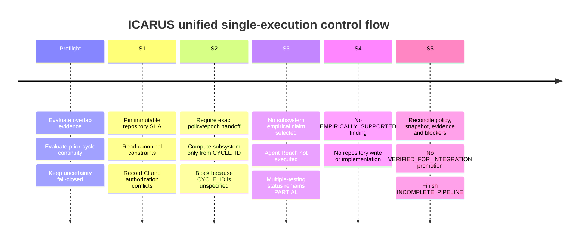
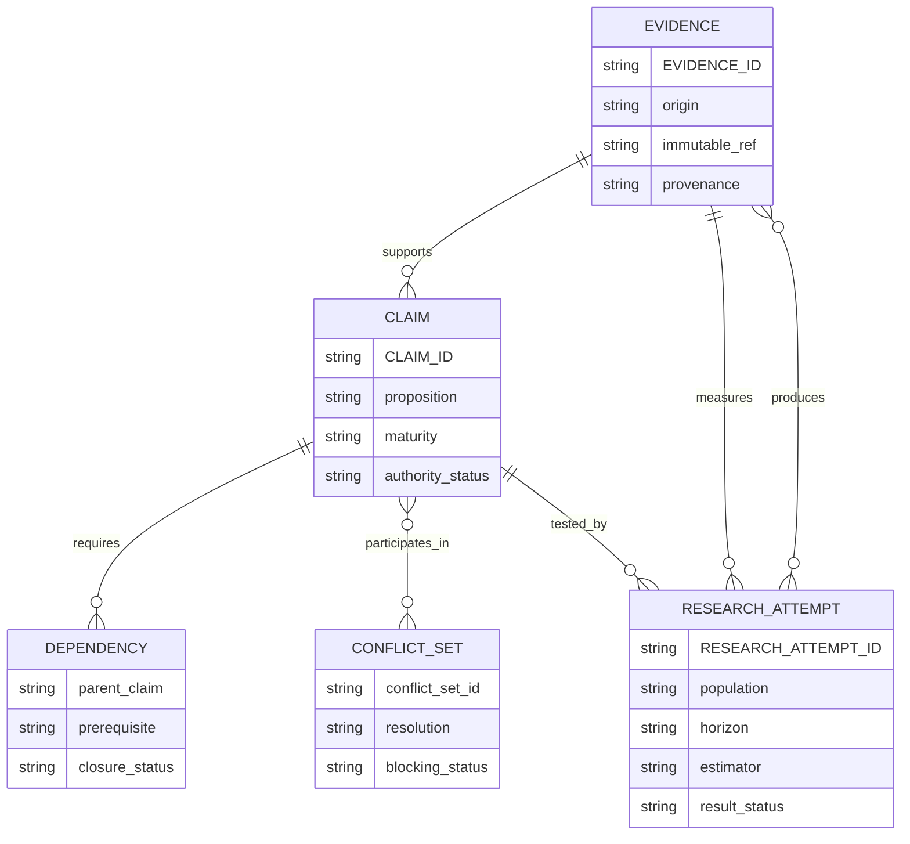

# ICARUS Unified Five-Stage Control Cycle: Research-Backed Simulation

## Executive summary

This report models one **complete S1→S5 ICARUS unified control cycle in a single execution**, preserving a single in-memory policy, snapshot, evidence, claim, dependency, conflict, and attempt state from stage to stage. It is deliberately **fail-closed**: the requested `CYCLE_ID` was not supplied, and the requester explicitly directed that unspecified dimensions not be invented. Therefore the simulated authoritative fields are `CYCLE_ID=UNSPECIFIED`, `EXECUTION_INSTANCE_ID=UNSPECIFIED`, `PIPELINE_POLICY_EPOCH=UNSPECIFIED`, `ACTIVE_SUBSYSTEM=UNKNOWN`, and `NEXT_SUBSYSTEM=UNKNOWN`. The rotation cannot legitimately be selected until a scheduled America/Chicago hour is known.

The repository baseline itself **can** be established. A fresh read of `reppiks490/Icarus/main` pins the branch to immutable commit `007e70189945b8e112904cf92b2b1a12e43792d6`; a second read at the end of the research returned the same SHA, so no main-branch drift was observed during this execution. GitHub reports the commit's signature verification as valid. fileciteturn8file0 fileciteturn22file0

The pinned repository independently reinforces several global-contract restrictions: the frozen specification says missing CSVs are to be skipped rather than replaced with synthetic bars, uses ordered `60%/20%/20%` train/validation/holdout splits with no shuffle, and fixes the trainer slots and feature set; the same repository states that `execution_authorized` is always false. fileciteturn5file0 The canonical `icarus_engine/spec.py` contains the fixed universe, feature keys, time-ordered walk split, model slots, and thresholds. fileciteturn6file0 `ASTRA_DO_NOT.md` separately prohibits a Pulse rewrite, invented ticks, and broker-order execution. fileciteturn7file0

A material finding from the fresh research is that **current CI evidence is not clean and should supersede older chat-only summaries**. The GitHub Actions endpoint now reports `total_count=11` workflow runs associated with the pinned SHA; one directly inspected run, `36073708343`, completed with `conclusion="failure"`. The Checks API reports 22 check runs associated with the same SHA, with inspected `engine` and `engine-windows` jobs failing. fileciteturn9file0 fileciteturn11file0 fileciteturn21file0 GitHub documents that Actions surfaces workflow results through the Checks API and that workflow runs generate check suites containing per-job check runs, so workflow-run counts and check-run counts must not be treated as independent replications. citeturn0search0turn0search8

There is also a concrete authorization conflict. Pinned `instruction.txt` asks for analysis of 760 CSVs followed by a direct write to `state.json`; pinned `state.json` remains `{}`. fileciteturn13file0 fileciteturn14file0 Under the requester-provided cycle contract, however, `execution_authorized=false` and repository writes are not authorized. Consequently, the repository instruction is recorded as a conflict but **not executed**. Repository content cannot raise its own authority above the current control contract.

The simulated cycle therefore terminates as:

| Control field | Research-backed cycle value |
|---|---|
| `CYCLE_ID` | `UNSPECIFIED` |
| `EXECUTION_INSTANCE_ID` | `UNSPECIFIED` — cannot construct `CYCLE_ID+"-UNIFIED"` without inventing the hour |
| `PIPELINE_POLICY_VERSION` | `icarus-control-v1` |
| `HANDOFF_SCHEMA_VERSION` | `icarus-pipeline-v1` |
| `PIPELINE_POLICY_EPOCH` | `UNSPECIFIED` because it must equal `CYCLE_ID` |
| `execution_authorized` | `false` |
| `RUN_STATUS` | `COMPLETED_DEGRADED` **for this simulation** |
| `OVERLAP_STATUS` | `UNVERIFIED` |
| `CYCLE_TIME_BUDGET_STATUS` | `UNVERIFIED` |
| `PRIOR_CYCLE_STATE_STATUS` | `UNVERIFIED` |
| `CROSS_CYCLE_CONTINUITY_STATUS` | `UNKNOWN` |
| `REPO_SNAPSHOT_SET` | `reppiks490/Icarus@007e70189945b8e112904cf92b2b1a12e43792d6` |
| `REPO_DRIFT_STATUS` | `NO_DRIFT_OBSERVED_DURING_RESEARCH` |
| `ACTIVE_SUBSYSTEM` | `UNKNOWN` |
| `NEXT_SUBSYSTEM` | `UNKNOWN` |
| `MULTIPLE_TESTING_STATUS` | `PARTIAL` |
| `STALL_STATUS` | `UNVERIFIED` |
| `STATE_PERSISTENCE_RESULT` | `UNAVAILABLE` |
| `PIPELINE_DISPOSITION` | `FAIL_CLOSED_CYCLE_ID_REQUIRED` |
| `CYCLE_OUTCOME` | `INCOMPLETE_PIPELINE` |

The central conclusion is not that the pipeline has no work to do. It is that, **under this exact request, authority stops before subsystem-specific work** because the deterministic rotation key is absent. The correct cycle behavior is to establish repository truth in S1, specify that blocking invariant in S2, short-circuit S3 and S4 rather than fabricate empirical or implementation work, and have S5 close the cycle as incomplete.

## Control baseline, provenance, and deterministic rotation

### Single-flight and continuity gate

No Baton state primitive, ChatGPT Library read/write primitive, execution lock, or other durable scheduler-state mechanism is exposed in the tools available to this execution. Previous prose in this chat is not enough to satisfy the contract's requirement for **validated durable state**, so it is not elevated into authoritative prior-cycle metadata.

Accordingly:

`OVERLAP_STATUS=UNVERIFIED`  
`PRIOR_ACTIVE_EXECUTION_INSTANCE_ID=UNKNOWN`  
`SINGLE_FLIGHT_EVIDENCE="No validated durable execution record or acquired lock primitive available in this execution."`

This does **not** mean “no overlap.” It means the absence or presence of another authoritative execution could not be proved. No distributed lock is claimed.

Because `CYCLE_ID` itself is unspecified, the identity of the immediately previous scheduled cycle is also not computable without inventing the scheduled hour:

`PRIOR_CYCLE_ID=UNKNOWN`  
`PRIOR_CYCLE_STATE_STATUS=UNVERIFIED`  
`CROSS_CYCLE_CONTINUITY_STATUS=UNKNOWN`  
`STATE_PERSISTENCE_METHOD=NONE_AVAILABLE`  
`PRIOR_STATE_EVIDENCE_REF=NONE`

The practical consequence is that cross-cycle stable-ID history, rejection history, supersession history, prior fingerprints, and the full research-attempt universe cannot be asserted. Therefore `MULTIPLE_TESTING_STATUS=PARTIAL`, not clean, and `STALL_STATUS=UNVERIFIED`.

### Repository snapshot

Only one repository is materially used in this simulated cycle:

```text
REPO_IDENTITY = reppiks490/Icarus
REPO_BRANCH = main
REPO_BASELINE_REVISION =
007e70189945b8e112904cf92b2b1a12e43792d6

REPO_SNAPSHOT_SET = [
  "reppiks490/Icarus@007e70189945b8e112904cf92b2b1a12e43792d6"
]
```

The initial branch read and final branch re-read returned the same SHA. GitHub reports that SHA as a validly verified commit. The branch is currently reported as unprotected, with required status-check enforcement off. fileciteturn8file0 fileciteturn22file0 GitHub's own documentation distinguishes commit-signature verification from CI/status-check success; a verified commit signature is provenance evidence for the Git object, not proof that its tests passed. citeturn0search3turn0search14

`REPO_DRIFT_STATUS=NO_DRIFT_OBSERVED_DURING_RESEARCH`.

### Rotation calculation

The canonical mapping is:

| `rotation_index` | Subsystem | Next |
|---:|---|---|
| 0 | NEXUS | AION |
| 1 | AION | ARGUS |
| 2 | ARGUS | ATHENA |
| 3 | ATHENA | DAEDALUS |
| 4 | DAEDALUS | ORACLE |
| 5 | ORACLE | NEXUS |

For a known scheduled Chicago hour:

\[
\text{rotation\_index}
=
\left(
\text{whole scheduled hours since 2026-09-24 07:00 America/Chicago}
\right)\bmod 6
\]

Because this cycle's hour was not supplied, the authoritative result is:

`ACTIVE_SUBSYSTEM=UNKNOWN`  
`NEXT_SUBSYSTEM=UNKNOWN`

For illustration only, **not as the cycle identity**, suppose `CYCLE_ID=20260925-18`. From September 24 at 07:00 to September 25 at 18:00 is 35 scheduled hours; `35 mod 6 = 5`, so that example would select `ORACLE`, followed by `NEXUS`. This demonstrates the deterministic calculation without treating the example as this report's authoritative cycle.



## Sequential S1–S5 cycle simulation

The same in-memory state object is assumed to flow directly from each stage to the next. Nothing is reconstructed from a stage-local summary.

| Stage | Key inputs and actual checks | Stage result / maturity | Risk / value / budget | Early-stop basis |
|---|---|---|---|---|
| **S1 — Evidence convergence** | GitHub branch pin; frozen `SPEC.md`; canonical `spec.py`; `ASTRA_DO_NOT.md`; `instruction.txt`; `state.json`; Actions runs; commit status; check runs | Snapshot and policy claims `OBSERVED`; authorization conflict recorded; fresh CI failure evidence recorded | `RISK_TIER=HIGH`; `VALUE_OF_INFORMATION=HIGH`; `WORK_BUDGET_CLASS=STANDARD` | Repository truth sufficient to identify blocking preconditions and CI risk |
| **S2 — Subsystem rotation** | Same S1 in-memory snapshot/ledgers; exact policy version; rotation formula | `CLAIM-CYCLE-ID-REQUIRED-001: OBSERVED → SPECIFIED/BLOCKED`; subsystem remains `UNKNOWN` | `HIGH / HIGH / MINIMAL` | Missing `CYCLE_ID` prevents deterministic routing; further subsystem inspection would invent ownership |
| **S3 — Empirical research** | S2 has no valid subsystem empirical candidate | No empirical promotion; no research attempt minted | `LOW / LOW / MINIMAL` | Agent Reach could not remedy missing cycle identity or internal ownership |
| **S4 — Repair / architecture forge** | No same-cycle `EMPIRICALLY_SUPPORTED` claim | No `IMPLEMENTATION_READY`; no TDD or code mutation | `LOW / LOW / MINIMAL` | Maturity prerequisite absent and writes unauthorized |
| **S5 — Verification / release assurance** | Reconcile all in-memory S1–S4 state; re-read branch SHA | No `VERIFIED_FOR_INTEGRATION`; final `INCOMPLETE_PIPELINE` | `MEDIUM / HIGH / MINIMAL` | Dependencies not closed; overlap/continuity unverified; no independent cycle-local test oracle |

### Evidence convergence

S1 first establishes one immutable repository baseline. The pinned spec explicitly prohibits synthetic-bar substitution for missing CSVs, specifies time-ordered train/validation/holdout splitting with no shuffle, fixes the feature list and model slots, and says `execution_authorized` is always false. fileciteturn5file0 `spec.py`, which `SPEC.md` itself says wins if the two disagree, defines the same fixed feature keys, walk fractions, trainer slots and model configuration. fileciteturn6file0

The repository also contains an operationally significant instruction to inspect 760 CSV files and then directly write derived values into `state.json`. fileciteturn13file0 Because the user's higher-authority cycle contract explicitly says `execution_authorized=false` and authorizes no repository mutations, this becomes `CONFLICT-WRITE-AUTH-001`; the resolution is **do not write**. The currently pinned `state.json` contains only `{}`, so it does not itself constitute a usable prior-cycle registry. fileciteturn14file0

Fresh CI evidence also matters. The workflow definition calls `pytest` against `tests_engine` on Linux, runs a narrower Windows test set, and performs plant/doctor checks. fileciteturn12file0 GitHub currently returns 11 workflow runs whose `head_sha` is the pinned commit; inspected run `36073708343` completed with failure. fileciteturn9file0 fileciteturn21file0 The Checks API returns 22 check runs for that SHA, including failed `engine` and `engine-windows` jobs. fileciteturn11file0 The legacy combined-status endpoint simultaneously has zero classic status entries; this is not contradictory because Actions uses check runs/check suites rather than necessarily populating legacy commit-status contexts. fileciteturn10file0 GitHub's official documentation confirms that Actions workflow results are represented through the Checks API. citeturn0search0turn0search8

S1 therefore records:

`PRIORITY_TARGET=QUALIFY_CYCLE_ID_BEFORE_SUBSYSTEM_ROUTING_AND_RETAIN_CI_FAILURE_AS_UNOWNED_EVIDENCE`  
`TARGET_OWNER=UNKNOWN`

S1 makes **no promotion above `OBSERVED`**.

### Subsystem rotation

The S1 handoff is internally compatible on `PIPELINE_POLICY_VERSION=icarus-control-v1` and `HANDOFF_SCHEMA_VERSION=icarus-pipeline-v1`, but the epoch cannot be made exact because `PIPELINE_POLICY_EPOCH=CYCLE_ID` and `CYCLE_ID` is unspecified.

The smallest useful S2 work product is therefore a control invariant:

> **Rotation invariant:** No NEXUS/AION/ARGUS/ATHENA/DAEDALUS/ORACLE-specific ownership, claim selection, feature, architecture, empirical test, or remediation may be assigned until the scheduled America/Chicago `CYCLE_ID` is concretely known and its deterministic modulo-six rotation has been calculated.

`CLAIM-CYCLE-ID-REQUIRED-001` is promoted from `OBSERVED` to `SPECIFIED/BLOCKED`, which stays inside S2's maturity ceiling.

The observed CI failures are deliberately **not assigned to any named subsystem**. That would require inferring ownership before deterministic routing and before pinned repository evidence establishes the selected subsystem's responsibility/interfaces.

### Empirical research

S3 has no valid empirical candidate because S2 could not select a subsystem claim.

Consequently:

`EMPIRICAL_QUESTION=NONE_SELECTED`  
`DATA_SUFFICIENCY_STATUS=INSUFFICIENT_FOR_EMPIRICAL_PROMOTION`  
`ESTIMATOR_VALIDITY_STATUS=NOT_ASSESSED`  
`ABLATION_READINESS_STATUS=BLOCKED`  
`REDUNDANCY_STATUS=UNKNOWN`  
`MULTIPLE_TESTING_STATUS=PARTIAL`

**Agent Reach is required only if a later, properly routed claim needs external empirical research. It was not executed here.** No `RESEARCH_ATTEMPT_ID` is minted merely to make the ledger look populated.

### Repair and verification

S4 receives no `EMPIRICALLY_SUPPORTED` claim, so neither systematic debugging/TDD nor design work is authorized. No failing regression test is claimed, because no test was executed by this cycle. No code, `state.json`, Pulse behavior, trainer slot, feature set, or repository object was changed.

S5 rechecks the main branch and finds the same pinned SHA, preserving snapshot integrity through the simulation. fileciteturn22file0 It then refuses integration promotion because deterministic subsystem ownership is unresolved; continuity and overlap remain unverified; the attempt universe is incomplete; CI includes observed failures; and no cycle-local independent verification oracle was executed.

`TEST_ORACLE_ORIGIN=EXISTING_REPOSITORY_CI_CONFIGURATION; NO_CYCLE_LOCAL_TEST_EXECUTION`  
`ORACLE_INDEPENDENCE_STATUS=UNVERIFIED`

No claim reaches `EMPIRICALLY_SUPPORTED`, `IMPLEMENTATION_READY`, or `VERIFIED_FOR_INTEGRATION`.

## Evidence, claim, dependency, and attempt state

Because valid prior-cycle state could not be recovered, the identifiers below are stable **inside this simulated cycle only**. They must not be represented as proven cross-cycle IDs.

| Registry | ID | Content | Status |
|---|---|---|---|
| Evidence | `EVID-REPO-ICARUS-007E7018` | Immutable Icarus snapshot including branch ref and pinned files | `OBSERVED` |
| Evidence | `EVID-CI-WORKFLOW-36073708343` | GitHub Actions run with `head_sha=007e…`, completed failure | `OBSERVED` |
| Evidence | `EVID-CI-CHECKRUNS-007E7018` | Checks API: 22 associated check runs; inspected jobs include failures | `OBSERVED` |
| Evidence | `EVID-REPO-INSTRUCTION-007E7018` | `instruction.txt` requests direct `state.json` write | `OBSERVED` |
| Claim | `CLAIM-CYCLE-ID-REQUIRED-001` | Rotation cannot be authoritative without concrete scheduled `CYCLE_ID` | `SPECIFIED/BLOCKED` |
| Claim | `CLAIM-CI-FAILURE-001` | Pinned SHA has associated observed failing CI evidence | `OBSERVED` |
| Claim | `CLAIM-WRITE-NOT-AUTHORIZED-001` | Repository instruction cannot override `execution_authorized=false` | `OBSERVED/BLOCKING` |
| Conflict | `CONFLICT-WRITE-AUTH-001` | Repository write request versus governing no-write contract | `RESOLVED_FAIL_CLOSED` |
| Research attempt | `NONE` | No external empirical experiment attempted | N/A |

The CI evidence is deduplicated correctly: a workflow run, its check suite, and its job check runs are related representations of the same execution lineage, not independent replications. GitHub describes exactly this workflow-run → check-suite → check-run relationship. citeturn0search0



The critical dependency edges are:

`CLAIM-CYCLE-ID-REQUIRED-001 → CYCLE_ID`  
`CLAIM-CI-FAILURE-001 → ACTIVE_SUBSYSTEM` for ownership/routing  
`ACTIVE_SUBSYSTEM → canonical pinned subsystem responsibility/interface evidence`  
`EMPIRICAL_PROMOTION → valid attempt ledger + sufficient data + estimator validity`  
`VERIFIED_FOR_INTEGRATION → dependency closure + independent oracle + fresh verification + no blocking overlap ambiguity`

The current-cycle canonical progress-fingerprint payload uses the active subsystem, pinned revision, selected claim, blockers, conflicts, dependencies and decisive evidence IDs. Using sorted-key compact JSON and SHA-256 yields:

`PROGRESS_FINGERPRINT=6f916454e82bb859e168d890cac79ba526a0f50ee409b9b7362ef1b7d1ee04e1`

`STALL_STATUS=UNVERIFIED`, because no valid immediately preceding fingerprint can be compared.

## Required remediation and persistence

### Remediation artifacts

| Required artifact / action | Owner | Why it is required | Gate it closes |
|---|---|---|---|
| Concrete scheduled `CYCLE_ID` in `YYYYMMDD-HH`, America/Chicago | Scheduler/request orchestration | Enables exact policy epoch and deterministic subsystem rotation | S2 rotation |
| Valid immediately preceding cycle-state record | Durable control-state owner | Restores stable IDs, attempt history, conflicts, supersession and fingerprints | Cross-cycle continuity |
| Canonical responsibility/interface evidence for whichever subsystem rotation selects | Subsystem owner / repository owner | Prevents semantic inference from names | S2 ownership |
| CI failure diagnosis tied to a distinct measurement/run | Appropriate subsystem after ownership is proven | Current GitHub evidence shows real failures but not yet routed root cause | S2/S4 |
| Independent verification oracle for any eventual repair | Verification owner | Prevents implementation-restating-itself tests from becoming decisive | S4/S5 |
| Complete research-attempt ledger | Research owner | Required before multiple-testing status can become controlled | S3 |
| Explicit repository-write authorization, only if a write is desired | Requester/owner | Current cycle expressly forbids writes | S4/persistence |

The failure evidence deserves attention once ownership is established: the existing workflow really does run a substantive test suite and platform-specific checks, and the presently inspected run failed. fileciteturn12file0 fileciteturn21file0 But diagnosing it now would exceed the requested fail-closed authority because there is no authoritative active subsystem.

### Persistence options

| Persistence option | Available here? | Authority / evidence |
|---|---:|---|
| Baton saved state | **No demonstrated access** | No Baton callable primitive was available; therefore no Baton save is claimed |
| Internal ChatGPT Library cycle state | **Not exposed in this execution** | No Library state connector was available to validate/read/write it |
| Repository `state.json` | **Technically present, but unauthorized** | File exists and is `{}`; pinned repo instruction asks for a write, but current control contract forbids mutation. fileciteturn13file0 fileciteturn14file0 |
| GitHub commit/branch write | **Not authorized** | GitHub was used read-only despite connector permissions |
| Chat response text | **Available but not authoritative durable state** | Can document the cycle, but does not satisfy the validated durable-state requirement |
| Local ephemeral computation | **Available, not durable** | Suitable for deterministic hashing only, not next-cycle continuity |

Therefore:

`STATE_PERSISTENCE_METHOD=NONE_AVAILABLE`  
`STATE_PERSISTENCE_RESULT=UNAVAILABLE`  
`STATE_PERSISTENCE_EVIDENCE="No permitted durable state primitive used; no repository mutation performed."`

No next cycle may claim continuity merely because this report exists.

## Authoritative simulated cycle record

```text
SIMULATION_MODE = true

CYCLE_ID = UNSPECIFIED
EXECUTION_INSTANCE_ID = UNSPECIFIED
RUN_STATUS = COMPLETED_DEGRADED

OVERLAP_STATUS = UNVERIFIED
PRIOR_ACTIVE_EXECUTION_INSTANCE_ID = UNKNOWN
SINGLE_FLIGHT_EVIDENCE =
  No validated durable execution-state record or acquired lock primitive.

CYCLE_TIME_BUDGET_STATUS = UNVERIFIED

PIPELINE_POLICY_VERSION = icarus-control-v1
PIPELINE_POLICY_EPOCH = UNSPECIFIED
POLICY_CHAIN_STATUS = CONSISTENT_WITHIN_SIMULATION_BUT_EPOCH_UNINSTANTIATED
HANDOFF_SCHEMA_VERSION = icarus-pipeline-v1
execution_authorized = false

PRIOR_CYCLE_ID = UNKNOWN
PRIOR_CYCLE_STATE_STATUS = UNVERIFIED
CROSS_CYCLE_CONTINUITY_STATUS = UNKNOWN
STATE_PERSISTENCE_METHOD = NONE_AVAILABLE
PRIOR_STATE_EVIDENCE_REF = NONE

REPO_SNAPSHOT_SET =
  [reppiks490/Icarus@007e70189945b8e112904cf92b2b1a12e43792d6]

REPO_DRIFT_STATUS = NO_DRIFT_OBSERVED_DURING_RESEARCH

ACTIVE_SUBSYSTEM = UNKNOWN
NEXT_SUBSYSTEM = UNKNOWN

PRIORITY_TARGET =
  QUALIFY_CYCLE_ID_BEFORE_SUBSYSTEM_ROUTING_AND_RETAIN_CI_FAILURE_AS_UNOWNED_EVIDENCE

TARGET_OWNER = UNKNOWN

EVIDENCE_LEDGER_DELTA =
  + EVID-REPO-ICARUS-007E7018
  + EVID-CI-WORKFLOW-36073708343
  + EVID-CI-CHECKRUNS-007E7018
  + EVID-REPO-INSTRUCTION-007E7018

CLAIM_LEDGER_DELTA =
  + CLAIM-CYCLE-ID-REQUIRED-001
  + CLAIM-CI-FAILURE-001
  + CLAIM-WRITE-NOT-AUTHORIZED-001

DEPENDENCY_DELTA =
  + CLAIM-CYCLE-ID-REQUIRED-001 -> CYCLE_ID
  + CLAIM-CI-FAILURE-001 -> ACTIVE_SUBSYSTEM / canonical ownership

CONFLICT_DELTA =
  + CONFLICT-WRITE-AUTH-001
    resolution = FAIL_CLOSED_NO_REPOSITORY_WRITE

RESEARCH_ATTEMPT_LEDGER_DELTA = NONE
RESEARCH_ATTEMPT_COUNT_CURRENT_CYCLE = 0

MATURITY_CHANGES =
  CLAIM-CYCLE-ID-REQUIRED-001: OBSERVED -> SPECIFIED/BLOCKED

DOWNGRADES = NONE
REJECTED = NONE

DATA_SUFFICIENCY_STATUS =
  SUFFICIENT_FOR_REPOSITORY_BASELINE_AND_CONTROL_BLOCK;
  INSUFFICIENT_FOR_EMPIRICAL_PROMOTION

ESTIMATOR_VALIDITY_STATUS = NOT_ASSESSED
ABLATION_READINESS_STATUS = BLOCKED
REDUNDANCY_STATUS = UNKNOWN
MULTIPLE_TESTING_STATUS = PARTIAL

WORK_PRODUCT =
  Unified fail-closed control record plus deterministic rotation precondition invariant.

EMPIRICAL_QUESTION = NONE_SELECTED

TESTS_ACTUALLY_RUN = NONE
CHECKS_ACTUALLY_PERFORMED =
  GitHub main-branch read at S1;
  immutable file reads;
  Actions workflow-run read;
  commit-status read;
  check-runs read;
  ORACLE repository code search for illustration only;
  main-branch drift re-read at S5;
  deterministic rotation arithmetic example;
  canonical SHA-256 progress-fingerprint computation.

TEST_ORACLE_ORIGIN =
  EXISTING_REPOSITORY_CI_CONFIGURATION;
  NO_CYCLE_LOCAL_TEST_EXECUTION

ORACLE_INDEPENDENCE_STATUS = UNVERIFIED

NET_NEW_DELTA =
  Fresh GitHub evidence establishes that workflow/check activity now exists
  for the pinned SHA and includes observed failures; repository instruction
  requests an unauthorized state.json write; cycle routing remains blocked
  because CYCLE_ID is unspecified.

STATE_CHANGE_CLASS =
  EVIDENCE_CORRECTION_AND_CONTROL_BLOCK

PROGRESS_FINGERPRINT =
  6f916454e82bb859e168d890cac79ba526a0f50ee409b9b7362ef1b7d1ee04e1

STALL_STATUS = UNVERIFIED

BLOCKERS =
  CYCLE_ID_UNSPECIFIED;
  PRIOR_STATE_UNVERIFIED;
  ACTIVE_SUBSYSTEM_UNDETERMINED;
  CANONICAL_SUBSYSTEM_OWNERSHIP_NOT_SELECTED;
  OBSERVED_CI_FAILURES_NOT_YET_OWNED;
  NO_CYCLE_LOCAL_INDEPENDENT_TEST_ORACLE;
  NO_PERMITTED_DURABLE_STATE_PRIMITIVE.

REQUIRED_REMEDIATION =
  Supply the scheduled CYCLE_ID through the real scheduler;
  validate the immediately prior durable state;
  compute rotation;
  establish pinned responsibility/interface evidence;
  then route the observed CI failure or an empirical claim to that owner.

STATE_PERSISTENCE_RESULT = UNAVAILABLE
STATE_PERSISTENCE_EVIDENCE =
  No permitted durable state primitive used and no repository write performed.

PIPELINE_DISPOSITION = FAIL_CLOSED_CYCLE_ID_REQUIRED
CYCLE_OUTCOME = INCOMPLETE_PIPELINE

REQUEST_TO_NEXT_CYCLE =
  Begin only under a concrete distinct scheduled CYCLE_ID; perform the overlap
  and continuity guards first; repin repository truth; use deterministic
  rotation rather than inheriting the illustrative ORACLE example.
```

**EXECUTION_RECEIPT:** actual routes used were the connected GitHub read-only connector for repository discovery, commit/branch reads, immutable file reads, workflow-run inspection, check-run inspection, commit-status inspection, and code search; official GitHub web documentation was consulted to interpret Actions/check semantics and commit-signature/status behavior; local deterministic arithmetic and SHA-256 computation were used. GitHub evidence objects materially used were `reppiks490/Icarus/main`, commit `007e70189945b8e112904cf92b2b1a12e43792d6`, `SPEC.md`, `icarus_engine/spec.py`, `ASTRA_DO_NOT.md`, `ASTRA_HANDOFF.md`, `.github/workflows/test.yml`, `instruction.txt`, `state.json`, Actions run `36073708343`, the pinned-SHA workflow-run collection, pinned-SHA check runs, and the pinned-SHA combined-status object. fileciteturn5file0 fileciteturn6file0 fileciteturn7file0 fileciteturn12file0 fileciteturn13file0 fileciteturn14file0 fileciteturn21file0

**Not executed or claimed:** Superpowers, Astral Orbit, Event Horizon, Baton, Akinator, Agent Reach, Enterprise, Orchestrator Lite, external workers, repository writes, `state.json` mutation, test-suite execution, backtests, synthetic-bar construction, Pulse rewriting, trainer-slot invention, merge, deployment, publication, broker/order activity, or trading execution.