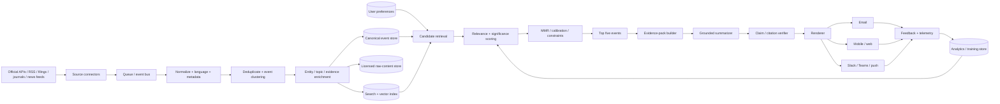
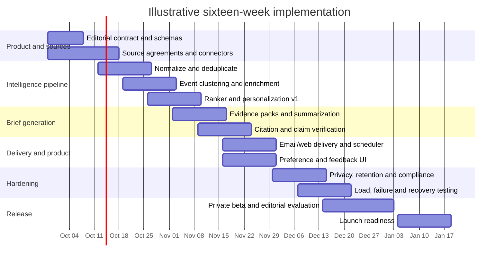

# Personalized Daily Five-Story Morning Briefing Service

## Executive summary

A high-quality personalized morning briefing should not be designed as “five articles summarized by an LLM.” It should be designed as a **small, evidence-grounded editorial system** whose output happens to contain five stories. The difficult parts are upstream: deciding what changed, separating genuinely distinct events from duplicated coverage, identifying the best available evidence, estimating importance to the individual user, balancing their interests without creating a filter bubble, and delivering the result reliably at a predictable local time.

The recommended service would continuously ingest English-language material from a source hierarchy led by **primary and official sources**—company announcements and changelogs, government and regulator releases, SEC EDGAR, central-bank and economic releases, GitHub, peer-reviewed journals and arXiv—then use high-quality news outlets such as Reuters, AP, Bloomberg, the Financial Times and The Wall Street Journal principally for independent verification, context, and developments for which no adequate primary source exists. The SEC, for example, exposes company submissions and extracted XBRL through JSON APIs that update throughout the day as filings are disseminated; GitHub exposes structured APIs but imposes both primary and secondary rate limits; arXiv supplies feeds and bulk-access mechanisms; and FRED provides a central authoritative interface to economic series. citeturn15view4turn15view5turn19search18turn19search34turn22view4

For each event, the system should create a **canonical evidence bundle**, rather than summarizing each article independently. Documents describing the same event are clustered; the primary source becomes the factual anchor; reputable secondary reporting supplies context or independent verification; contradictions and uncertainty are preserved. The five-story selector then optimizes not merely relevance but a mixture of personal relevance, objective significance, evidence quality, freshness, novelty, actionability, and portfolio-level diversity. Maximal Marginal Relevance is directly applicable because it was designed to combine relevance and novelty and reduce redundancy in ranked results; calibrated recommendation provides a complementary mechanism for matching the mix of selected items to a user's interests. citeturn15view7turn16view0turn21search5

The recommended personalization architecture begins with transparent weighted rules, then migrates to a learning-to-rank model such as LambdaMART only after sufficient high-quality interaction and editorial-label data exists. LambdaMART combines boosted trees with the LambdaRank approach and has a long history in production-style ranking problems. citeturn21search4turn21search13 Optimization should **not** reduce to click-through rate: doing so would favor sensational, volatile, or familiar subjects at the expense of importance, source quality, and useful novelty.

A good default editorial contract is:

> **Five non-duplicative developments, delivered around 7:00 a.m. local time, anchored whenever possible to primary evidence, each explaining what changed, why it matters, what remains uncertain, and what to watch next.**

The user's earlier preference screen offered six topic families, and those should become the default taxonomy:

| Default topic category | Typical coverage |
|---|---|
| **AI, agents & machine learning** | Foundation models, agents, AI infrastructure, research, safety, regulation, model economics |
| **Markets, trading & macro** | Equities, rates, inflation, employment, central banks, commodities, macro releases |
| **Crypto & digital assets** | Bitcoin and major cryptoassets, stablecoins, exchanges, protocols, regulation, tokenization |
| **GitHub, coding & developer tools** | GitHub, languages, frameworks, cloud tooling, security, open source, developer AI |
| **Science & emerging technology** | Peer-reviewed research, major preprints, space, biology, energy, quantum, materials |
| **Business & major world developments** | Material corporate actions, geopolitics, policy, supply chains, high-consequence global events |

Because the user skipped the preference questions, **topic balance, story-type emphasis, delivery time, delivery channel, tone, desired depth, weekday/weekend behavior, urgent-alert preference, tracked companies/tickers/repos, and budget remain unspecified**. The recommended starting defaults are equal long-run topic weights, an importance override for exceptional events, 7:00 a.m. America/Chicago delivery, daily delivery, executive-neutral tone, email plus an in-app/web archive, and approximately 100–160 words per story. Since six categories compete for only five daily slots, balance should be enforced over a rolling window rather than forcing every category into every edition.

The most consequential engineering recommendation is to **process news globally once and personalize late**. Event extraction, deduplication, embeddings, evidence verification, and base summaries should be computed once per event. Only final ranking and a small personalized “why this matters to you” layer should run per user. That architecture makes a service for millions of users much more tractable than independently asking an LLM to research the news for every subscriber.

## Product experience and editorial contract

The product should feel much simpler than the machinery behind it. Users should see five high-signal stories and a few understandable controls—not a configuration console for a recommendation engine.

**Recommended first-run defaults**

| Preference | Current user state | Recommended default |
|---|---|---|
| Topic categories | Categories shown previously, priorities skipped | Enable all six |
| Topic balance | Unspecified | Equal long-run weighting with importance override |
| Development type | Unspecified | Mix breakthroughs, actionable developments, releases/research, and strategic developments |
| Stories per edition | Specified | Exactly five |
| Delivery time | Unspecified | 7:00 a.m. America/Chicago |
| Frequency | “Daily” requested | Seven days per week; optionally lighter weekend threshold |
| Primary channel | Unspecified | Email + web/app archive |
| Tone | Unspecified | Neutral, analytical, concise |
| Depth | Unspecified | Standard: about 100–160 words/story |
| Breaking alerts | Unspecified | Off by default |
| Tracked entities | Unspecified | None initially; learn from explicit follows and feedback |
| English preference | Specified | English-language sources prioritized |

The home screen should expose a small set of high-value controls: topic weights, “more/less like this,” follow/mute entities, briefing time and timezone, delivery channel, length, and tone. Advanced users could additionally control geographic emphasis, specific companies/tickers/repos/labs, source preferences, technical depth, or how much the system should privilege the “biggest story” over balanced coverage.

A useful balance control is not six independent checkboxes but a few presets:

| Balance preset | Behavior |
|---|---|
| **Biggest stories** | Significance dominates; multiple stories may come from one category |
| **Balanced** | Approximate user's topic distribution over a rolling several-day window |
| **AI & technology** | Extra weight to AI, developer tools, and emerging technology |
| **Markets & trading** | Extra weight to macro, markets, crypto, filings and regulation |
| **Custom** | User sets category weights explicitly |

The rolling-window qualification is important. With six categories and five stories, rigid “one story per topic” quotas are mathematically impossible. Even where the user follows only five topics, hard quotas can force a weak science story into an edition while excluding a major geopolitical or business event. The better mechanism is calibrated exposure across, for example, the previous 3–7 editions, with a global-significance override. Calibration research frames the general problem similarly: a recommended list should reflect the distribution of the user's interests, rather than repeatedly collapsing onto only their single most obvious interest. citeturn21search1turn21search5

**The proposed story card**

Each story should use a fixed semantic structure:

> **[Category] Headline**  
> **What changed:** Two or three sentences containing only the central new facts.  
> **Why it matters:** One or two sentences interpreting significance for the reader.  
> **Watch next:** The next date, decision, release, experiment, filing, price level, or unresolved question that could materially change the story.  
> **Evidence:** Primary-source badge, corroborating-source links, publication/event timestamps, and an uncertainty label when relevant.

For research, the card should additionally distinguish **peer-reviewed**, **accepted/in press**, and **preprint** work. For market data, numerical quotes should show an “as of” timestamp. For corporate/model announcements, internally measured performance should be explicitly attributed to the vendor rather than presented as an independently established fact. These small cues substantially improve epistemic quality without making the briefing much longer.

The summarization interface should support three depth modes:

| Mode | Approximate story length | Best use | Main weakness |
|---|---:|---|---|
| **Scan** | 40–70 words | Phone notifications, very busy mornings | Loses nuance and caveats |
| **Standard** | 100–160 words | Default morning briefing | Moderate reading time |
| **Deep** | 220–350 words | Technical/executive research | Five stories become a long newsletter |

Tone can be independently controlled: **executive-neutral** by default, plus technical, conversational, skeptical, or “just the facts.” Tone must affect language rather than evidence standards; a conversational setting should never weaken attribution or uncertainty labeling.

**Illustrative five-story briefing for September 24, 2026**

This sample demonstrates the proposed product format. It is an illustrative cross-category edition rather than a claim that an editorial desk would necessarily rank these as the five objectively largest stories of the morning.

**AI, agents & machine learning — Anthropic launches Claude Opus 5.5 with a stronger focus on model economics**

**What changed:** Anthropic released Claude Opus 5.5 on September 22. Anthropic says it performs at the level of Claude Fable 5.1 on most work while costing about 40% less to run than Opus 5 on its typical-workload tests. Published API pricing is $4 per million input tokens and $20 per million output tokens, and Anthropic reports output generation more than 30% faster than Opus 5. These are primarily vendor-reported comparisons and should be presented as such. citeturn17view0turn17view1turn17view2

**Why it matters:** For production agents, inference economics can matter as much as a few benchmark points. A substantial reduction in cost or latency changes which long-running coding, research, and back-office workflows are commercially viable. The briefing should therefore rank model economics alongside benchmark performance rather than treating every model release as a leaderboard story.

**Watch next:** Independent evaluations and real-world cost-per-completed-task comparisons are more informative than token prices alone.

**Markets, trading & macro — Federal Reserve raises the federal-funds target range to 3.75%–4.00%**

**What changed:** At its September 16 meeting, the FOMC voted 12–0 to raise its target range by 25 basis points to 3.75%–4.00%. The Fed said economic activity was expanding at a solid pace and inflation remained elevated. citeturn15view1

**Why it matters:** Changes in policy rates propagate through financing conditions, rates, currencies and risk-asset valuation, so the decision remains an important macro backdrop even after the announcement day. A high-quality morning service would connect subsequent data and market moves back to this policy regime rather than repeatedly republishing the original decision as “new.” The Fed itself describes monetary-policy transmission through financial conditions and the broader economy. 

**Watch next:** Incoming inflation and labor data and the next FOMC communications should determine whether the September move is the beginning of a sustained tightening path or a more limited adjustment.

**Crypto & digital assets — Bitcoin broke through $85,000 this week as the U.S. regulatory framework continues to evolve**

**What changed:** Bitcoin traded as high as $85,166 on September 21, crossing $85,000 for the first time in eight months according to MarketWatch. Separately, the SEC's August proposal for “Regulation Crypto Assets” would create a tailored securities-offering framework for certain investment contracts involving crypto assets; the proposal includes registration exemptions and a conditional safe harbor, and remains a regulatory proposal rather than final law. citeturn22view3turn22view0

**Why it matters:** A useful crypto briefing should not treat price and regulation as separate silos. Regulatory clarity, capital-formation rules, institutional access, liquidity conditions and price momentum can all affect the investable environment—but the service should explain those connections without converting them into personalized buy/sell advice.

**Watch next:** The SEC proposal's comment and rulemaking process, as well as whether Bitcoin sustains or rejects the recent breakout.

**GitHub, coding & developer tools — GitHub adds local sandboxing to the Copilot app**

**What changed:** GitHub announced local sandboxing for the Copilot app on September 23. The mechanism can restrict filesystem, network and credential access during local sessions. It is configurable by project, is currently in public preview, and is off by default. citeturn17view3turn17view4

**Why it matters:** As coding assistants become more agentic, the important security boundary shifts from “what text can the model generate?” to “what can an agent actually touch or execute?” Local sandboxing is therefore more consequential than a cosmetic assistant update because it can reduce the blast radius of unintended commands.

**Watch next:** Enterprise policy controls, broader default adoption, and evidence about whether developers actually enable the sandbox rather than leaving it off.

**Science & emerging technology — A newly described amoeba pushes the known heat limit for eukaryotic life to 63°C**

**What changed:** Researchers reported that *Incendiamoeba cascadensis*, found in a geothermal environment at Lassen Volcanic National Park, can divide at 63°C and remain active at 64°C. Syracuse University describes it as the hottest-thriving eukaryote yet documented; Reuters reports that the research appeared in *Cell* and that the organism could recover after exposure to temperatures as high as 70°C when returned to cooler conditions. citeturn22view1turn22view2

**Why it matters:** The result revises an empirical boundary for complex cells and could inform studies of cellular heat adaptation, the search for extremophile eukaryotes, and potentially heat-stable biological machinery. Syracuse researchers also point to possible biotechnology applications, although those are prospects rather than demonstrated products. citeturn22view1

**Watch next:** Follow-up work on the molecular mechanisms of heat tolerance and whether related eukaryotes extend the limit further.

The sixth default category—**Business & major world developments**—is deliberately absent from this example because the requested example specified five other categories. In production, it should remain eligible for an importance override; a war, financial crisis, major election result, global supply-chain disruption, large merger, or systemic corporate failure should not be excluded merely because yesterday's topic quotas said otherwise.

## Data, ingestion, and source strategy

The editorial quality ceiling is determined largely by source selection. An excellent summarizer fed unreliable, duplicated material produces polished unreliability. The service should therefore attach a persistent **source-class score** to every domain/feed and a separate **evidence-role label** to each document.

The recommended hierarchy is:

| Tier | Source class | Examples | Role in final briefing |
|---|---|---|---|
| **Primary** | First-party or official evidence | SEC EDGAR, Federal Reserve, Treasury, BLS/BEA, company investor relations, product changelogs, GitHub, research journals, court/regulator documents | Preferred factual anchor |
| **Direct structured data** | Authoritative machine-readable datasets | Market-data vendors, exchanges, FRED, government APIs, filing APIs | Numeric/time-series facts |
| **Top-tier secondary** | Professional news organizations | Reuters, AP, Bloomberg, Financial Times, WSJ, major national/international desks | Independent confirmation and context |
| **Specialist secondary** | Domain-focused publications | High-quality technology, science, finance, or crypto press | Expertise and discovery |
| **Discovery-only** | Social/community signals | Hacker News, Reddit, social networks, GitHub issues, forums | Candidate generation; rarely sole evidence |

For corporate announcements and product releases, the original announcement should normally anchor factual attributes, while an independent outlet answers a different question: *is this significant, contested, or consequential outside the company's own framing?* The Opus 5.5 sample illustrates why the distinction matters: pricing and launch facts can come straight from Anthropic, while claims about comparative performance should remain clearly vendor-attributed unless independently reproduced. citeturn17view0turn17view2

For financial and regulatory subjects, SEC EDGAR should be foundational. Its data APIs expose submissions history and XBRL data without requiring authentication, and the SEC says the JSON structures update throughout the day as submissions become public; bulk datasets are republished nightly. citeturn15view4 That supports both a low-latency filing detector and an overnight completeness reconciliation job.

For economic data, prefer the original statistical agency when practical and FRED as a well-structured aggregation and normalization layer. FRED describes itself as an economic-data service maintained by the St. Louis Fed and supplies release/category/source organization suitable for automated macro monitoring. citeturn22view4

For developer news, ingest GitHub's changelog, release data, security advisories and repositories. API clients must be designed around documented limits: GitHub currently allows 60 unauthenticated REST requests per hour and generally 5,000 per hour for authenticated personal-token usage, while also maintaining secondary limits for concurrency and request intensity. GitHub recommends pacing requests according to returned rate-limit headers and backing off after rate-limit responses. citeturn15view5 A production connector should therefore queue requests, cache aggressively, use conditional requests where possible, and prefer webhooks or event feeds over repeated broad polling.

For science, prioritize published papers and journal records; use arXiv and comparable preprint repositories as a separate evidence class rather than silently mixing preprints with peer-reviewed work. arXiv offers RSS-based listings and bulk data access, including metadata/full-text distribution mechanisms, making it well suited to continuous candidate discovery. citeturn19search18turn19search34

**Ingestion pipeline**

Each fetched item should first be converted into a common document schema:

```text
source_id
canonical_url
source_domain
source_class
publisher
title
authors
publication_timestamp
event_timestamp
fetch_timestamp
language
body_or_permitted_excerpt
content_hash
entities
tickers/repos/paper_ids
topic_probabilities
document_type
license/usage_policy
embedding
```

The distinction among **publication time, event time, and fetch time** matters. An article published at 6:45 a.m. may describe an event from yesterday; an SEC filing retrieved at 5:00 a.m. may have been disseminated at 9:00 p.m.; an updated article may have an old URL but newly material facts. Ranking solely on page publication timestamps produces misleading freshness.

After normalization, apply several sequential filters:

**Language and format filtering.** English is the preferred language for this user. Non-English sources can still be retained as fallback primary evidence for foreign events, but machine translation should be visibly labeled when it materially supports a story.

**Exact and near-duplicate detection.** Use canonical URLs, hashes and title fingerprints for straightforward copies, then SimHash/MinHash or embeddings for syndicated and rewritten duplicates.

**Event clustering.** Group different documents referring to the same underlying event. “Fed raises rates,” the official FOMC statement, three wire stories and ten market reactions should ordinarily create one event object, not fourteen briefing candidates.

**Entity and topic enrichment.** Extract companies, people, countries, tickers, repositories, model names, government bodies, research fields and regulatory instruments. Use both deterministic dictionaries and model-based extraction.

**Source/evidence classification.** Identify primary evidence, independent reporting, analysis/opinion, press release, preprint, peer-reviewed paper, filing, price quote and so forth.

**Materiality filtering.** Remove low-impact product marketing, duplicate incremental commentary and stories whose “new” information is merely a rewrite of an already-covered event.

**Evidence completeness.** High-consequence stories can be held briefly if the only available information is an unverified secondary claim and a primary source is expected imminently.

A robust event record then looks more like this:

```text
event_id: evt_...
canonical_claims:
  - claim
  - evidence_document_ids
  - confidence
  - disagreement_flag

primary_evidence:
secondary_confirmation:
topic:
entities:
event_time:
latest_material_update:
novelty_vs_prior_briefings:
global_significance:
personal_relevance_features:
```

That representation makes later summaries auditable.

**Core trade-offs**

| Design trade-off | Fast/fresh extreme | Accurate/deep extreme | Recommended default |
|---|---|---|---|
| **Speed vs. verification** | Publish first credible report immediately | Wait for multiple confirmations | Primary source immediately; otherwise corroborate consequential claims before morning edition |
| **Source freshness vs. reliability** | Social posts and breaking liveblogs | Official statements only | Use fast sources for discovery, authoritative sources for evidence |
| **Summary length vs. depth** | 40–70 words | 250–350+ words | 100–160 words with expandable detail |
| **Personalization vs. diversity** | Only highest predicted interest | Rigid equal quotas | Personalized rank + MMR + rolling calibration |
| **Freshness vs. significance** | Favor anything from last hour | Favor largest multi-day story | Topic-specific freshness decay plus significance floor |
| **Primary sources vs. independent scrutiny** | Only issuer/regulator claims | Only journalism/commentary | Primary factual anchor + strong secondary context |
| **Full-text retention vs. licensing/privacy** | Cache everything forever | Store almost nothing | Store only permitted content; preserve metadata/evidence references separately |
| **LLM sophistication vs. latency/cost** | Large model on every document | Simple extractive pipeline | Cheap classification globally; high-quality model only on final event evidence packs |

The central principle is **freshness should be event-sensitive rather than universally maximized**. Crypto prices or a security incident may become stale in minutes; a science result published the prior afternoon can remain highly relevant for days. Freshness decay should therefore be parameterized by domain.

One reasonable starting policy—not a universal truth—is a 6–12 hour effective half-life for intraday markets and crypto developments, roughly 24–36 hours for product/developer releases, and several days for important science. Global significance can counteract that decay; a historic central-bank action does not become irrelevant merely because it happened 13 hours ago.

## Ranking, summarization, and personalization

The ranker's job is to answer two distinct questions:

1. **How valuable is each event individually?**
2. **Which combination of five events forms the best briefing?**

Treating these as the same problem leads to five near-identical AI stories whenever AI happens to score highest.

A transparent MVP scoring function could normalize inputs to \([0,1]\) and use:

\[
S(e,u)=
0.28P+
0.20G+
0.15A+
0.12F+
0.10D+
0.08N+
0.07H
\]

where:

- \(P\) = personal relevance to user \(u\)
- \(G\) = global/objective significance
- \(A\) = evidence authority and confidence
- \(F\) = topic-adjusted freshness
- \(D\) = decision/action relevance
- \(N\) = novelty versus the user's recent editions
- \(H\) = learned historical utility for similar events

These weights are recommended initial parameters, not empirically established constants. They should be tuned through editorial evaluation and experimentation.

**Personal relevance** should derive first from explicit preferences—topic weights, follows, mutes, chosen depth—not hidden behavioral inference. Implicit behavior can refine the model later, but an explicit “AI 30%, markets 25%, science 15%...” instruction should generally outrank a few accidental clicks.

**Global significance** should be evaluated independently from personal interest. This is the escape hatch that prevents a hyper-personalized service from ignoring a systemic banking event, major war, emergency policy decision, or scientific breakthrough.

**Evidence authority** rewards primary documents and corroboration. It should also penalize contradictions, anonymous single-source assertions, stale pages and undifferentiated opinion.

**Novelty** compares both semantic similarity and factual delta against prior briefings. An ongoing story can reappear only when something materially changed. “Bitcoin is still above $85,000” is weak; “SEC approves a rule materially changing exchange access” is a new event even if Bitcoin appeared yesterday.

After individual scores, perform **portfolio-level reranking**. MMR is a natural baseline:

\[
\operatorname*{argmax}_{e\notin B}
\left[
\lambda S(e,u)
-
(1-\lambda)\max_{b\in B}\operatorname{sim}(e,b)
\right]
\]

where \(B\) is the set of already-selected briefing stories. MMR was specifically introduced to combine query relevance with information novelty and reduce redundancy in retrieved or summarized material. citeturn15view7turn16view0 A starting \(\lambda\) around 0.7–0.8 would favor relevance while still penalizing duplicates, then be tuned empirically.

Add a **calibration penalty** so that the rolling topic distribution stays close to the user's desired mix. Calibration research defines this general objective as making the distribution of recommended item properties resemble the distribution of a user's interests. citeturn21search5 For exactly five stories, an integer optimizer or greedy constrained selector can simultaneously enforce:

- exactly five unique event clusters;
- a configurable same-topic cap;
- no near-duplicate stories;
- source-diversity preference;
- rolling topic-distribution constraints;
- significance override for exceptional events;
- minimum evidence-confidence thresholds.

Once the service has enough labeled data, replace part of the manually weighted event score with a learning-to-rank model. LambdaMART is a sensible choice because it combines boosted regression trees with ranking-specific objectives and has demonstrated strong real-world ranking performance. citeturn21search4turn21search13 It is also attractive operationally because heterogeneous numerical, categorical and interaction-derived features can be added without the inference cost of running another generative model over every candidate.

Training labels should not equal clicks. A richer utility label could blend:

\[
Y = w_1(\text{explicit helpful})+
w_2(\text{save})+
w_3(\text{meaningful read})+
w_4(\text{source open})-
w_5(\text{skip})-
w_6(\text{mute})
\]

with editorially judged relevance/importance labels included in offline training. Otherwise the model will discover that alarming headlines are highly clickable.

**Summarization should occur after ranking, not before.** The pipeline should first form an evidence pack containing canonical claims, exact numbers, source timestamps, contradictory statements, primary documents, and the relevant sections of independent coverage. The model then produces structured fields rather than unconstrained prose.

A suitable model contract is:

```json
{
  "headline": "...",
  "what_changed": "...",
  "why_it_matters": "...",
  "watch_next": "...",
  "uncertainty": "...",
  "claim_citations": [
    {"claim_id": "...", "source_ids": ["..."]}
  ]
}
```

A verifier then checks:

1. every externally checkable factual claim has evidence;
2. numbers, percentages and dates match evidence exactly;
3. proposed rules are not described as final rules;
4. preprints are not described as peer-reviewed publications;
5. company-reported benchmark claims remain attributed;
6. an article's publication date is not confused with the underlying event date;
7. “why it matters” distinguishes evidence from inference.

The final renderer can then apply tone and length controls **without regenerating the factual substrate**. That is safer than asking separate prompts to “rewrite this in a skeptical tone,” which can inadvertently alter claims.

A useful three-layer summary design is:

| Layer | Shared or personalized? | Function |
|---|---|---|
| **Canonical event summary** | Shared | Neutral facts supported by evidence |
| **Significance analysis** | Mostly shared | Broader technical/economic/scientific meaning |
| **Why it matters to you** | Personalized | Relates event to selected topics/entities/interests |

This architecture also improves caching and scalability. Thousands of users interested in the same GitHub release need not pay for thousands of independent factual summaries.

## Architecture, scheduling, scalability, and reliability

The backend should separate **source ingestion**, **event intelligence**, **personalization**, and **delivery**. A practical reference architecture is:



The ingestion layer should be **continuously running**, even though delivery is daily. That prevents a 6:45 a.m. polling job from trying to discover, parse, deduplicate, rank and verify the entire overnight news cycle in fifteen minutes.

A recommended 7:00 a.m. local-time production cadence is:

| Time relative to delivery | Activity |
|---|---|
| Continuous | High-priority source ingestion and event clustering |
| T−60 min | Generate preliminary user candidate sets |
| T−30 min | Fill evidence gaps; refresh high-volatility market/regulatory events |
| T−10 min | Final candidate refresh and personalized reranking |
| T−5 min | Generate/refresh summaries only where material facts changed |
| T−3 min | Citation validation, safety/compliance checks, rendering |
| T−0 | Dispatch |
| T+5 min | Alert if delivery/SLO threshold missed; retry failed channels |

Proposed product SLOs should include **99%+ of editions dispatched within five minutes of the user's requested time**, sub-minute candidate retrieval for ordinary users, and a p95 finalization time of a few minutes for the five-story edition after the candidate pool is stable. These are design targets to validate during load testing, not external industry benchmarks.

The system needs a special policy for data whose meaning expires quickly. Market and crypto prices should always carry quote timestamps. If the real-time feed is delayed beyond a configured threshold, the system should display a stale-data badge or omit the quote rather than silently using old data.

**Scalability comes primarily from sharing work.**

Suppose one million users receive morning briefings. It would be inefficient to ingest Reuters, process the same SEC filing, embed the same GitHub announcement and summarize the same Fed statement one million times. Instead:

- ingest each document once;
- build each canonical event once;
- compute each event embedding once;
- produce one factual/base summary per event;
- cache expensive scientific or filing analysis;
- perform lightweight per-user retrieval and ranking;
- personalize only the small final layer.

Users should also be sharded by **timezone and delivery minute**, not by a single worldwide cron at 7:00 a.m. That naturally spreads load across the day and prevents a “morning thundering herd.”

The source connectors themselves require rate-aware scheduling. GitHub, for example, publishes primary and secondary request constraints and explicitly instructs integrations to use response headers, delay retries and back off after rate limits. citeturn15view5 The same pattern should be generalized to all sources: connector-specific token buckets, retry budgets, exponential backoff with jitter, request caching, and circuit breakers.

**Reliability mechanisms**

Every workflow should be idempotent. A convenient briefing key is:

```text
(user_id, local_date, edition_type, version)
```

Delivery messages receive a separate idempotency token so retries cannot accidentally send the same morning edition three times.

Queues should provide at-least-once processing while application code deduplicates by event/document IDs. Failed parsing, model calls and deliveries should move to dead-letter queues after bounded retries rather than block the whole edition.

Graceful degradation is more important than theoretical perfection:

| Failure | Recommended behavior |
|---|---|
| Primary source temporarily unavailable | Use cached primary copy/metadata or corroborated secondary evidence; label confidence |
| Major news feed unavailable | Continue with other sources; lower coverage-health score |
| Generative model unavailable | Serve cached or extractive summary |
| Vector service down | Use lexical/topic candidate retrieval |
| Market-data feed stale | Mark stale or omit quote |
| One delivery provider fails | Retry and optionally fail over to secondary provider |
| User-personalization service unavailable | Use last known preferences/default balanced ranking |
| A final story fails verification | Replace with sixth-ranked verified candidate |

Use multi-availability-zone storage/queues at minimum for a production paid service. Multi-region active-active operation becomes justified at enterprise scale or where contractual availability requirements demand it; it need not be the MVP architecture.

Reliability monitoring should separately measure **source health**, **editorial pipeline health**, **personalization health**, and **delivery health**. A “briefing sent successfully” metric alone can be green while the system has quietly stopped ingesting SEC filings.

## Privacy, retention, compliance, and governance

Personalization creates a privacy obligation even when the underlying news is public. A profile such as “follows oncology, layoffs at employer X, Bitcoin, fertility science and a particular political movement” can reveal significantly more than a generic news subscription. The service should therefore treat inferred interests as personal data and minimize both what is collected and how long it survives.

The European Commission's GDPR guidance explicitly emphasizes data minimization, storage limitation, integrity/confidentiality and accountability, and states that personal data should be kept only as long as necessary for the relevant purpose. It also expects users to be informed of purposes, legal bases, retention periods, recipients and relevant rights. citeturn15view6 California's CPPA likewise describes the CCPA as giving consumers rights over personal information while requiring covered businesses to explain how they collect, use and retain that information. citeturn22view5

A privacy-first profile should therefore store primarily:

```text
pseudonymous_user_id
timezone
delivery configuration
explicit topic weights
followed/muted entities
tone and depth settings
feedback-derived preference features
consent/privacy flags
```

Do not require a complete reading-history dossier merely to personalize five stories.

**Recommended retention policy**

| Data class | Recommended default | Rationale |
|---|---:|---|
| Active account preferences | Account lifetime | Required to provide requested service |
| Raw story interactions | 90 days | Enough for short-term personalization and debugging |
| Aggregated preference features | 12 months, rolling | Preserves longer-term interests without indefinite click logs |
| Briefing delivery logs | 30–90 days | Operational debugging and deliverability |
| Generated editions | User-controlled; 12 months default | Useful archive without permanent retention |
| Support/security audit logs | About 12 months or policy-driven | Incident investigation; exact period should follow risk/legal requirements |
| Deleted-account profile | Delete promptly; short recovery buffer only if disclosed | Minimize post-termination data |
| Raw source content | Per publisher license/contract | Do not assume perpetual full-text storage rights |
| Source metadata, hashes, event IDs | Longer retention where permitted | Useful for dedupe and “already covered” detection |

These periods are design recommendations, not statutory universal limits. Actual retention should be mapped to business purpose, contracts and jurisdiction. GDPR's storage-limitation principle argues for explicit erasure/review deadlines rather than indefinite “just in case” storage. citeturn15view6

Security architecture should segregate PII from content/event stores, use pseudonymous identifiers in ranking logs, encrypt data in transit and at rest, restrict privileged access through role-based/least-privilege controls, rotate secrets via a managed KMS/secrets manager, and maintain an auditable deletion pipeline. GDPR guidance specifically identifies privacy by design/default and points to pseudonymization and encryption as protective measures. citeturn15view6

Users should be able to see and edit the preferences influencing recommendations. “We show more of this because you selected AI and follow Anthropic” is preferable to inscrutable inferred profiling. Users should also have practical export/delete controls, and personalization data should not automatically become foundation-model training data. A separate, explicit opt-in is the cleaner governance policy.

For EU users, international transfers require additional analysis when personal data crosses borders; the European Commission lists adequacy decisions, standard contractual clauses and binding corporate rules among the safeguards used for transfers outside the EU. citeturn22view7

**Content licensing and copyright**

The product should summarize and point users to source material, not recreate publisher articles. Store complete publisher text only where licensing or terms permit it. RSS availability does not itself imply unlimited republication rights. Paid feeds from Reuters, Bloomberg, AP or market-data vendors should be incorporated according to contractual display, caching and redistribution restrictions.

Primary government documents often offer more straightforward machine access, but each feed still requires terms-of-use review. For example, the SEC expressly provides EDGAR APIs for submissions/XBRL and real-time dissemination, making that preferable to brittle scraping. citeturn15view4

**Market-data governance**

Real-time exchange and vendor data should be treated as a distinct licensed product dependency. The service should record for every quote:

```text
provider
instrument
exchange/venue
quote_timestamp
retrieval_timestamp
redistribution entitlement
```

Do not conflate public delayed quotes with licensed real-time feeds, and do not cache or redistribute a vendor's data beyond contractual rights.

**Financial-content boundaries**

A news briefing can discuss what markets did and why an event may matter. It should avoid silently transitioning into individualized investment recommendations. “The Fed increased rates; this changes the discount-rate backdrop for growth equities” is analytical context. “Given your account holdings, sell these three securities today” is a materially different product and should trigger dedicated financial-regulatory and suitability/compliance review.

**Email and messaging**

For commercial email subject to CAN-SPAM, the FTC's compliance guidance requires accurate routing/header information and non-deceptive subject lines, among other obligations; it also discusses sender identification, postal address and opt-out requirements. citeturn18search32 Even where a purely editorial transactional briefing may receive different legal treatment, the product should implement one-click unsubscribe/preferences infrastructure from the outset.

SMS and automated messaging deserve a separate consent and revocation review rather than being treated as “just another renderer.” The conservative product policy is explicit channel opt-in, clear sender identification, easy stop/revocation, time-of-day controls, and jurisdiction-specific legal review before promotional or automated texting is enabled.

**Regulatory-content accuracy**

The summarizer needs a state model for legislation and rules:

```text
rumor
announcement
proposal
public-comment period
adopted
effective
enforced / stayed / challenged
```

This avoids one of the most damaging errors in automated regulatory briefing: converting a proposal into law. The SEC's August 2026 “Regulation Crypto Assets,” for example, is expressly described by the SEC as a **proposed** rule framework with a comment period. citeturn22view0

Finally, governance should include an editorial escalation path. Some events—armed conflict, public-health emergencies, major financial instability, election administration, allegations of criminal misconduct, or potentially dangerous scientific claims—deserve stronger verification thresholds and occasionally human review rather than ordinary automated publication.

## Tech stack, implementation roadmap, and success metrics

The best technology stack depends less on raw user count than on how ambitious the data licensing, real-time ingestion and personalization requirements become. A modular architecture allows the service to start cheaply without painting itself into a corner.

**Recommended stack by maturity**

| Component | Lean / MVP | Growth | Enterprise / high scale |
|---|---|---|---|
| API/service layer | Python + FastAPI | FastAPI/Go services | Go/Java/Python service mix |
| Relational profile DB | PostgreSQL | Managed PostgreSQL/Aurora/Cloud SQL | Distributed/global relational tier where necessary |
| Vector search | pgvector | OpenSearch/Elasticsearch or managed vector service | Distributed hybrid-search platform |
| Cache | Redis | Redis cluster | Multi-region managed cache |
| Queue/event transport | SQS / Pub/Sub / service bus | Kafka or managed Pub/Sub | Kafka/Pulsar with multi-region strategy |
| Workflow orchestration | Cloud Scheduler + workers | Temporal / managed workflows | Temporal + stream orchestration |
| Stream processing | Simple consumers | Kafka Streams / Dataflow | Flink/Spark streaming |
| Object/source storage | S3/GCS/Azure Blob | Same + lifecycle policies | Data lake with fine-grained governance |
| Analytics warehouse | Postgres initially | BigQuery/Snowflake/ClickHouse | Warehouse/lakehouse + feature platform |
| Ranking | Weighted score + MMR | LightGBM/LambdaMART | Online feature/ranking service + experimentation |
| LLM layer | One high-quality API + fallback | Multi-model router | Multi-provider, policy/routing/caching layer |
| Observability | OpenTelemetry + managed logs | Datadog/Grafana/etc. | Full tracing, SLOs, anomaly detection |
| Delivery | SES/Postmark/SendGrid + app | Multiple email/push providers | Regional providers/failover |
| Deployment | Serverless containers | Kubernetes or managed containers | Multi-region orchestration |
| Relative infrastructure cost | $ | $$–$$$ | $$$–$$$$ |
| Operational complexity | Low | Medium | High |

The dollar signs are relative architecture tiers, not price estimates. Publisher and real-time market-data licensing should have its **own budget line**; unlike commodity compute, redistribution rights and premium news/data contracts can substantially change service economics and cannot be reliably estimated without the intended vendors, audience and usage rights.

The preferred MVP is intentionally boring: **Python, managed PostgreSQL with pgvector, Redis, object storage, a managed queue, scheduled workers, one reliable LLM API, an email provider, and OpenTelemetry**. Kafka, Kubernetes, Flink, feature stores and multi-region databases should be earned by scale or availability requirements rather than introduced because they appear on an architecture diagram.

A realistic implementation can reach a strong beta in approximately four months with overlapping workstreams.



The milestones should have concrete exit criteria rather than merely “feature complete.”

| Milestone | Completion criterion |
|---|---|
| Editorial contract | Source hierarchy, five-story schema, uncertainty rules and topic taxonomy signed off |
| Ingestion | Core primary sources continuously ingest with measurable freshness/health |
| Event intelligence | Duplicate-event rate meets threshold on hand-labeled test set |
| Ranker v1 | Offline Precision@5/NDCG@5 and diversity beat recency-only baseline |
| Summarizer | Claim-level citation coverage and factuality pass editorial evaluation |
| Delivery | Timezone-correct scheduled editions, retries and idempotency verified |
| Privacy hardening | Retention/deletion/export paths tested end-to-end |
| Private beta | Real-user usefulness and topic-balance metrics meet launch gates |
| Launch | Reliability, compliance and editorial red-team signoff |

**Quality and engagement metrics**

The most important distinction is between **editorial quality**, **personalization**, **engagement**, and **operational performance**. A single “open rate” cannot measure whether the service is good.

| KPI | Definition | Why it matters |
|---|---|---|
| **Precision@5** | Fraction of selected stories editorial judges deem worthy of the user's five slots | Basic ranking quality |
| **NDCG@5** | Position-weighted relevance/utility of final ranking | Compares ranker versions |
| **Primary-source coverage** | Share of stories anchored to primary evidence where primary evidence is available | Evidence quality |
| **Claim citation coverage** | Supported factual claims / all checkable factual claims | Grounding |
| **Unsupported-claim rate** | Claims not entailed by evidence | Hallucination/factual risk |
| **Duplicate-event rate** | Briefings containing materially redundant stories | Measures clustering/MMR |
| **Stale-story rate** | Stories without a material new development inside policy window | Freshness |
| **Topic calibration error** | Distance between rolling delivered mix and user's target mix | Personalization quality |
| **Importance override quality** | Human assessment of stories admitted despite normal personalization | Filter-bubble protection |
| **Explicit useful rate** | Stories/briefings marked useful | Direct satisfaction |
| **Meaningful story interaction** | Expanded/read/saved/source-opened stories | Stronger than superficial exposure |
| **Mute / “less like this” rate** | Negative topic/entity feedback | Personalization diagnosis |
| **Retention** | Active briefing users after selected intervals | Long-term product value |
| **Unsubscribe rate** | Deliveries causing opt-out | Fatigue/relevance warning |
| **p95 briefing latency** | Time from finalization start to rendered edition | System responsiveness |
| **On-time delivery rate** | Delivered within configured window | Trust/reliability |
| **Source ingestion lag** | Time from source publication to normalized availability | Freshness |
| **Source failure rate** | Connector fetch/parse failures | Coverage reliability |
| **Cost per delivered briefing** | Infrastructure + model operations per edition, excluding/including licensing as separate views | Unit economics |
| **Cache reuse rate** | Shared event-analysis work reused across users | Scaling efficiency |

An especially useful north-star metric is **Useful Briefing Rate**: the proportion of delivered editions generating either an explicit positive assessment or a set of stronger reading actions consistent with actual consumption. It should be paired with editorial quality metrics so the optimization loop cannot simply learn how to maximize compulsive clicks.

Initial launch gates might reasonably be set as internal targets such as **>90% primary-source anchoring where a suitable primary source exists, <2% duplicate-event incidence, >99% on-time delivery, and a very low independently audited unsupported-claim rate**. These are recommended targets, not established industry norms.

An illustrative target trajectory—not observed data—could look like this:

```text
                          Launch     Month 1     Month 2     Month 3
Primary-source coverage    82%   ▃     87%   ▅     90%   ▇     92%   █
On-time delivery           97%   ▅     98%   ▆     99%   ▇    99%+   █
Editorial Precision@5      78%   ▃     83%   ▅     87%   ▇     90%   █

Duplicate-event rate        5%   █      3%   ▆      2%   ▃      1%   ▁
Unsupported-claim rate    1.5%   █    0.8%   ▅    0.4%   ▃   <0.3%   ▁
```

The purpose of such a chart is to force separate improvement objectives: authority, ranking quality and reliability should rise while duplication and unsupported claims fall. Engagement alone is not the goal.

The final product loop should therefore be:

**collect broadly → establish evidence → cluster events → rank for importance and the user → diversify/calibrate the five → summarize only from evidence → verify → deliver predictably → learn from explicit and implicit feedback → audit quality independently of engagement.**

That design produces a briefing service rather than merely a newsletter generator. It also preserves the most important editorial principle for a five-story product: **every slot is scarce**. A story should earn one of those five places because it is materially new, credibly supported, significant, and relevant—not merely because a source published something recently.