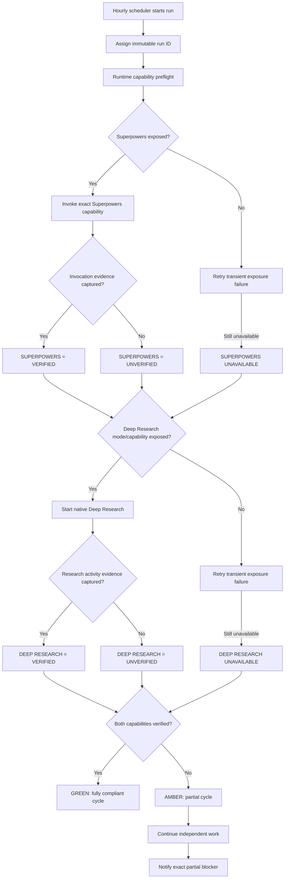
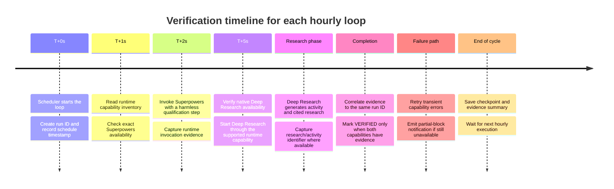

# Runtime Assurance Report for the Icarus Hourly Loops

## Executive summary

As of **September 24, 2026**, the evidence supports a more qualified conclusion than “everything is guaranteed.”

**Superpowers is genuinely installed and enabled on your account/plugin layer.** I performed a live Plugin Management check for the exact **Superpowers** plugin. It returned `installed: true`, `status: ENABLED`, `user_enabled: true`, and no unresolved dependencies. Its canonical plugin ID is `plugins~Plugin_60aea7460bd4819199fd97a9553a5e12`. OpenAI documents that installation and runtime availability are separate: a plugin can be installed while availability still varies by product surface, plan, workspace, and role. citeturn2view0turn6view1

**Deep Research is available to this interactive conversation, but I cannot establish that it is exposed inside each of the six scheduled-task runtimes.** More importantly, OpenAI's documentation treats Deep Research as a native ChatGPT research capability: the documented ways to start it are `/Deepresearch`, the **Deep research** option in the tools menu, or the sidebar. The documentation does **not** describe `@Deep research` as the mechanism for invoking the native Deep Research mode. `@` mentions are documented for plugins and apps. citeturn6view3turn1view2

That distinction matters. A task prompt containing the literal text **“@Deep research”** is not, by itself, proof that the scheduled runtime has entered Deep Research mode. OpenAI says Deep Research availability depends on plan, country/territory, workspace configuration and role, while plugin availability also depends on the surface in which the conversation runs. citeturn6view3turn6view1

The largest unresolved issue is the **Scheduled runtime itself**. OpenAI explicitly documents that Scheduled tasks can use *supported connected apps* when available to the account/workspace, but the current Scheduled-task documentation does not make an equivalent blanket promise that an arbitrary installed plugin/skill—such as Superpowers—or the native Deep Research mode will be exposed on every scheduled execution. It also says model availability depends on the task, account plan, and workspace settings. citeturn7view0turn6view2

Therefore, the honest current assurance state is:

| Assurance layer | Superpowers | Deep Research |
|---|---|---|
| Available to account | **YES — verified installed/enabled** | **YES — current interactive Deep Research session demonstrates account access** |
| Correctly referenced by prior loop configuration | **Not independently verified** | **Reportedly yes in prior patches** |
| Exposed to each hourly runtime | **UNKNOWN** | **UNKNOWN** |
| Actually invoked in each hourly runtime | **UNKNOWN** | **UNKNOWN** |
| Runtime invocation evidence collected | **NO** | **NO for the six loop runtimes** |
| Can a prompt alone guarantee exposure? | **NO** | **NO** |
| Desired final state | **Invocation + evidence every run** | **Invocation + evidence every run** |

The key correction is thus: **the six loops should not yet be described as runtime-guaranteed for both capabilities.** They are best described as *configured/intended*, with Superpowers installation verified globally, but **per-run exposure and invocation still requiring runtime evidence**.

A robust design can nevertheless make the system behave the way you expect: every cycle should attempt both capabilities, refuse to call itself fully verified unless both produce positive invocation evidence, retry transient failures, continue unrelated work under the existing fail-open policy, and generate a precise partial-block notification when either capability is unavailable. OpenAI's own plugin documentation supports this sort of scoped failure behavior: when an optional app is disabled, other plugin capabilities can continue, while a capability that actually depends on an unavailable required app cannot run. citeturn6view1


## Verified facts and platform control boundary

There are four distinct layers that have been getting conflated: **installed**, **available to the current surface**, **invoked**, and **proven invoked**. They should be treated separately.

For Superpowers, the first layer is now verified. The live Plugin Management result in this research session identifies the exact **Superpowers** plugin as installed and enabled. The dependency resolver also reports `source_plugin_installed=true`, `source_plugin_user_enabled=true`, and no plugin dependencies. No installation operation was necessary because it is already installed. This is consistent with OpenAI's architecture, where plugin installation is an account/workspace-level control and actual use happens separately in a supported conversation. citeturn6view1

OpenAI documents the normal ChatGPT invocation path for a plugin as an **@ mention**, or selecting it from `+` → `More`, when those controls are available for that surface. Crucially, OpenAI immediately qualifies this: available options depend on the product surface, plan, and workspace. An installed plugin therefore cannot be assumed to be executable in every ChatGPT execution environment. citeturn6view1

OpenAI's troubleshooting documentation is unusually explicit on this point: an app can appear connected while still being unavailable in the **current chat, selected model, or ChatGPT surface**, and availability can vary by plan, region, workspace, role, selected model, surface, and provider requirements. citeturn6view0

Deep Research has a different control model. The official Deep Research documentation says it is started using `/Deepresearch`, the Deep Research tool selector, or the sidebar. It can then research the public web, uploaded files, and eligible connected apps. It also has its own plan-based usage limits and workspace/RBAC controls. citeturn1view0turn6view3

This yields an important implementation correction:

> **`@Superpowers` is consistent with OpenAI's documented plugin invocation model. `@Deep research` should not be relied upon as the technical proof that native Deep Research has started.**

The exact string may be useful as human-readable intent in your loop prompt, but the documented native Deep Research activation path is `/Deepresearch` or selection of the Deep Research mode/tool. citeturn6view3

Scheduled tasks introduce another boundary. OpenAI says eligible paid plans can run recurring tasks up to once per hour, and that Scheduled tasks can use supported connected apps such as Gmail, Slack, and GitHub when those apps are available to the account/workspace. Scheduled tasks are subject to task/account/workspace model availability and can pause when additional action is required. citeturn7view0turn6view2

What the documentation **does not currently establish** is just as important: I found no official OpenAI statement guaranteeing that **every installed ChatGPT plugin or skill is injected into an ordinary Scheduled-task execution**, nor an official statement guaranteeing that an hourly Scheduled task can programmatically switch itself into native Deep Research mode simply because its prompt says to do so. That absence means the runtime-exposure question must be answered empirically, run by run, rather than assumed from configuration. This is an inference from the documented capability boundaries, not a claim that OpenAI definitively forbids such combinations. citeturn6view1turn6view2turn6view3

There is one potentially useful clue: OpenAI says a shared Scheduled task **may**, depending on the task, retain its selected ChatGPT mode or model when a recipient schedules a copy. The word “may” is not strong enough to treat selected-mode persistence as an assurance mechanism, but it indicates that task mode can be part of task configuration in some circumstances. citeturn7view0


## Per-loop runtime matrix

The “current configuration” column below is based on the patch state described earlier in **this conversation**. I cannot independently read the six Scheduled-task definitions from this research session because no Scheduled/Tasks management connector is exposed here. Consequently, those configuration descriptions are **reported state, not scheduler-readback evidence**.

The reported patch state is: fail-open handling; block only work directly dependent on an unavailable capability; keep independent work running; record skills/plugins actually used, unavailable capabilities and partially blocked actions; require the exact Deep Research capability rather than silently substituting Scite, Consensus, Exa, Tavily, Parallel Search, etc. What has **not** been independently demonstrated in the visible patch history is that every loop was subsequently given an equally explicit mandatory `@Superpowers` invocation clause.

| Loop name | Current configuration, as patched/reported | Runtime environment constraints | Superpowers installed? | Deep Research exposed at runtime? | Steps taken to install/enable Superpowers | Steps taken to verify Deep Research exposure | Test-cycle result: invoked / logged evidence | Remaining risks / limitations |
|---|---|---|---|---|---|---|---|---|
| **ASCENSION ∞ Series** | Active hourly; fail-open; exact Deep Research reportedly required; logs unavailable/used capabilities. Explicit mandatory Superpowers invocation is **not independently evidenced** by scheduler readback. | **Unspecified/unknown** for this task. Scheduled-task surface capability injection is not visible from this session. | **YES at account/plugin level; runtime availability UNKNOWN.** | **UNKNOWN.** | Exact Superpowers plugin searched live; verified `installed=true`, `ENABLED`, `user_enabled=true`; no reinstall necessary. | Current account can run Deep Research, and official invocation/availability rules were checked; no ASCENSION runtime probe available. | **Not verified.** No live ASCENSION cycle was launched from this session and no invocation event/log was retrieved. | Installation ≠ runtime exposure; Deep Research mode may not be injected into ordinary Scheduled runtime; prompt text is not execution proof. |
| **VECTOR ∞ Loop** | Active hourly; fail-open; exact Deep Research reportedly required; unavailable capability should block only dependent operations. Explicit Superpowers clause not independently read back. | **Unspecified/unknown.** | **YES at account level; runtime UNKNOWN.** | **UNKNOWN.** | Same verified account-level installation; no per-loop installation exists in the documented plugin model. citeturn6view1 | Current Deep Research availability established outside VECTOR; VECTOR Scheduled execution itself could not be inspected. | **Not verified.** No runtime Superpowers event or Deep Research activity record collected from VECTOR. | Same surface/runtime uncertainty; previous “blocked” behavior could recur unless capability preflight is runtime-aware. |
| **Infrastructure Loop Build** | Active hourly; fail-open and Deep Research requirement reported. Exact Superpowers runtime mandate is not independently confirmed. | **Unspecified/unknown.** | **YES at account level; runtime UNKNOWN.** | **UNKNOWN.** | Superpowers installed/enabled verified centrally. | No Infrastructure test execution available from current tooling. | **Not verified.** Evidence absent. | Scheduled tasks officially document supported apps, not blanket exposure of arbitrary skill-only plugins. citeturn6view2 |
| **Icarus Build Loop** | Reportedly re-enabled and hourly; fail-open; Deep Research exact requirement reported. Superpowers exact mandatory invocation not independently read back. | **Unspecified/unknown.** | **YES at account level; runtime UNKNOWN.** | **UNKNOWN.** | Central plugin status verified. | Account-level Deep Research works; loop-level exposure not measurable here. | **Not verified.** No test cycle/event evidence. | Prior history of the loop becoming disabled adds an independent scheduler-state risk; Scheduled UI should be treated as source of truth for enabled state. OpenAI says Scheduled is where tasks are reviewed, resumed, edited or paused. citeturn6view2turn7view0 |
| **Icarus Central Orchestration** | Active hourly by prior report; fail-open; exact Deep Research expected; Superpowers invocation requirement not independently proven from scheduler configuration. | **Unspecified/unknown.** | **YES at account level; runtime UNKNOWN.** | **UNKNOWN.** | Central plugin installation verified. | No Central Orchestration runtime inspection available. | **Not verified.** No invocation trail obtained. | Because this is orchestration-level, falsely reporting successful capability use could propagate inaccurate state to subordinate loops; evidence gating is especially important. |
| **PROMETHEUS** | **Paused intentionally** by prior report; configuration reportedly patched for fail-open/Deep Research so it behaves correctly when resumed. Explicit Superpowers runtime requirement not independently verified. | **Unspecified/unknown; no current runtime while paused.** | **YES at account level; runtime after resume UNKNOWN.** | **UNKNOWN until resumed.** | Superpowers globally installed/enabled; no further install required. | Cannot test Deep Research exposure while PROMETHEUS remains paused without intentionally running/resuming it. | **No test cycle; N/A while paused.** | First resumed run must be treated as a qualification run. It should not be labeled fully healthy until both capabilities produce positive evidence. |

The common pattern is therefore **not six different installation problems**. It is one verified account-level Superpowers installation followed by **six unresolved runtime-exposure questions**.

This is exactly the sort of distinction OpenAI's documentation requires. Installing a plugin does not override provider/workspace permissions, and plugin availability can vary by surface. Likewise, Deep Research respects plan, workspace and role controls, and merely having another app/plugin available does not make it available to Deep Research automatically. citeturn2view0turn6view3


## Assurance architecture and automated checks

The correct target is not “the prompt contains the words Superpowers and Deep Research.” The target is **positive runtime attestation on every hourly execution**.

I recommend a three-state health model:

| Run state | Required condition | Meaning |
|---|---|---|
| **VERIFIED / GREEN** | Superpowers invocation evidence **and** Deep Research invocation evidence both exist for this run ID | The run satisfies your requirement. |
| **PARTIAL / AMBER** | One capability is unavailable after policy-compliant retries; the other is verified; independent work continues | Useful work proceeds, but this hourly cycle is **not counted as a fully compliant cycle**. |
| **BLOCKED / RED** | Both capabilities are unavailable, or the specific core operation cannot truthfully proceed without the missing capability | No false success; preserve checkpoint and report exact blocker. |

A loop should therefore use a per-run evidence object conceptually like this:

```text
RUN_ID = <loop>-<UTC timestamp>

SUPERPOWERS_REQUIRED = true
SUPERPOWERS_INSTALLED_ACCOUNT_LEVEL = true|false|unknown
SUPERPOWERS_RUNTIME_EXPOSED = true|false
SUPERPOWERS_ACTUALLY_INVOKED = true|false
SUPERPOWERS_EVIDENCE = <runtime event / activity entry / none>

DEEP_RESEARCH_REQUIRED = true
DEEP_RESEARCH_RUNTIME_EXPOSED = true|false
DEEP_RESEARCH_ACTUALLY_INVOKED = true|false
DEEP_RESEARCH_EVIDENCE = <research activity / conversation activity / none>

RUN_COMPLIANCE =
  VERIFIED only if both ACTUALLY_INVOKED == true
```

The crucial rule is that **self-reported prose is not sufficient evidence**. A model printing `SUPERPOWERS ACTUALLY INVOKED = YES` does not prove a tool/skill call occurred. The strongest available evidence should come from the runtime's activity/tool record.

Deep Research has a particularly useful audit path for eligible Enterprise environments: OpenAI says Deep Research activity is detailed in the **Conversation API**, alongside the conversation where the research task was started. Scheduled tasks themselves are also included in the **Compliance API**. That creates the possibility of correlating a scheduled run with Deep Research activity rather than trusting a line of generated text. citeturn6view3turn7view0

For connected apps, OpenAI also states that app calls are logged in its Compliance Logs platform. That can help verify app-backed activity, although this should **not automatically be assumed to prove invocation of a skill-only plugin such as Superpowers**; the live Superpowers dependency check showed no external app dependencies, and OpenAI's public documentation does not establish a dedicated Compliance API event specifically for every skill invocation. citeturn1view2

The desired control flow is:



This architecture matches OpenAI's documented separation between plugin installation and runtime/surface availability, while retaining your fail-open requirement. citeturn6view0turn6view1

A full qualification sequence for each loop should look like this:



For Deep Research specifically, the qualification should look for characteristics OpenAI itself associates with a Deep Research run: a research plan/workflow, documented sources/citations, an activity history, and—where the applicable compliance tooling is available—the Deep Research activity record associated with the conversation. citeturn1view0turn6view3

For Superpowers, use the **exact canonical installed plugin**, not a similarly named skill, and require a runtime invocation event if that surface exposes one. OpenAI documents `@` mention as the normal way to explicitly select a plugin in supported ChatGPT conversations. citeturn6view1

The recommended prompt-level contract for **all six** loops is therefore:

```text
MANDATORY RUNTIME CAPABILITY POLICY

This cycle requires the exact installed ChatGPT plugin:
@Superpowers

This cycle also requires the native ChatGPT Deep Research capability.
Do not treat ordinary web search, Search, Scite, Consensus, Exa, Tavily,
Parallel Search, or another research app/plugin as equivalent to Deep Research.

At run start:

1. Attempt to invoke @Superpowers.
2. Require positive runtime evidence before setting
   SUPERPOWERS_ACTUALLY_INVOKED = YES.
3. Attempt to enter/use native Deep Research through the capability actually
   exposed by this runtime.
4. Require positive Deep Research activity evidence before setting
   DEEP_RESEARCH_ACTUALLY_INVOKED = YES.

Never infer invocation merely because a capability is installed, named in this
prompt, or available to another conversation.

A cycle is FULLY VERIFIED only when:
SUPERPOWERS_ACTUALLY_INVOKED = YES
AND
DEEP_RESEARCH_ACTUALLY_INVOKED = YES.

If either capability is unavailable:
- retry according to the capability retry policy;
- mark only work dependent on that capability as partially blocked;
- continue all safe independent work;
- never silently substitute a different capability;
- send the exact partial-block notification;
- preserve the checkpoint for the next hourly cycle.
```

That is stronger than the prior configuration because it separates **requirement**, **availability**, **invocation**, and **evidence**.


## Retry, backoff, and notification design

Retries should distinguish **transient** failures from **structural** failures.

A transient error includes a temporary tool-discovery failure, timeout, overloaded runtime, or other condition where trying again may reasonably change the result. A structural failure includes “not available on your plan,” “disabled by admin,” unsupported surface, missing workspace access, or a capability simply not being exposed to Scheduled tasks. OpenAI's troubleshooting documentation explicitly distinguishes plan, admin, workspace, surface, model and connection causes; endlessly reconnecting or retrying is not recommended when the underlying availability condition has not changed. citeturn6view0

I recommend the following policy:

| Attempt | Delay | Action |
|---|---:|---|
| Initial | 0 s | Capability discovery and invocation |
| Retry A | ~20 s ± jitter | Retry only transient failure |
| Retry B | ~60 s ± jitter | Re-check runtime capability inventory, then invoke |
| Retry C | ~180 s ± jitter | Final retry within this cycle |
| After final failure | No further same-cycle retries | Mark capability unavailable, continue independent work, notify, retry on next hourly cycle |

Admin denial, unsupported surface, plan restriction, or an explicit “not available” result should **skip exponential retries** and transition immediately to the partial-block path. This avoids wasting most of the hour repeatedly asking an execution environment for a capability it cannot supply.

For the next hourly cycle, capability discovery should run again rather than carrying the previous cycle's negative result forward. OpenAI warns that availability depends on changing surface/account/workspace state, so a previous failure should not be treated as permanent. citeturn6view0

The notification wording should make a **partial block visibly different from a dead loop**.

Sample UI text for missing Deep Research:

```text
⚠️ VECTOR ∞ — PARTIAL CAPABILITY BLOCK

DEEP RESEARCH UNAVAILABLE

Run: VECTOR-<timestamp>
Superpowers: VERIFIED — invoked successfully
Deep Research: UNAVAILABLE after runtime preflight/retries
Cycle status: PARTIAL — independent work is continuing

Blocked:
• Research operations requiring native Deep Research

Continuing:
• Work that does not depend on Deep Research
• Checkpoint refinement
• Analysis/test preparation allowed by available capabilities

No substitute research plugin was treated as Deep Research.

Next action:
Re-check Deep Research exposure automatically on the next hourly cycle.
```

Sample UI text for missing Superpowers:

```text
⚠️ ASCENSION ∞ — PARTIAL CAPABILITY BLOCK

SUPERPOWERS UNAVAILABLE

Run: ASCENSION-<timestamp>
Superpowers installation: VERIFIED at account level
Superpowers runtime exposure: UNAVAILABLE in this execution
Deep Research: VERIFIED — invoked successfully
Cycle status: PARTIAL — independent work is continuing

Blocked:
• Steps specifically requiring @Superpowers

Continuing:
• Deep Research
• Independent reasoning/research
• Checkpoint work not dependent on Superpowers

The loop did not claim @Superpowers was invoked.

Next action:
Re-check @Superpowers automatically on the next hourly cycle.
```

If both are missing:

```text
⛔ ICARUS CENTRAL ORCHESTRATION — CAPABILITY DEGRADED

SUPERPOWERS UNAVAILABLE
DEEP RESEARCH UNAVAILABLE

Run: ICARUS-CENTRAL-<timestamp>

Neither mandatory runtime capability could be verified in this execution.

Independent safe work: CONTINUE WHERE POSSIBLE
Capability-dependent work: BLOCKED
Cycle verification: FAILED
Checkpoint: PRESERVED

No substitute capability was reported as either @Superpowers or Deep Research.

Automatic capability re-check: next hourly cycle.
```

And a successful cycle should produce a much shorter positive record:

```text
✅ VECTOR ∞ — RUNTIME VERIFIED

@Superpowers: INVOKED — evidence captured
Deep Research: INVOKED — evidence captured
Run compliance: VERIFIED
Independent/required work: proceeding normally
```

This wording avoids the problem shown in your earlier screenshot: **“blocked” should no longer imply the entire loop died when only one capability-dependent branch failed.** At the same time, a partially degraded cycle must never be mislabeled as a fully verified cycle.


## Assumptions, limitations, and official sources

The following assumptions need to remain explicit until actual hourly test executions produce evidence.

**Platform exposure cannot be forced from a prompt.** A task can request or require a capability, but an instruction cannot manufacture a plugin/tool that the Scheduled runtime did not expose. OpenAI explicitly says plugin availability depends on surface, account/workspace conditions, and other controls. citeturn2view0turn6view0

**Superpowers installation is verified globally, not six times independently.** Plugin installation is an account/workspace capability, while runtime availability is surface-dependent. The live Plugin Management check performed during this research established that the exact Superpowers plugin is installed and user-enabled. It did **not** establish six separate successful scheduled invocations.

**Deep Research availability in this conversation does not prove Scheduled-task availability.** This report itself is being produced through the Deep Research environment, so your account clearly has access in this interactive context. OpenAI nevertheless makes Deep Research access dependent on plan, workspace, role and geography, and the Scheduled-task documentation does not explicitly promise native Deep Research execution in every hourly task. citeturn6view3turn6view2

**`@Deep research` should not be treated as the documented activation command.** Official documentation currently specifies `/Deepresearch`, the tools menu, or the sidebar. By contrast, `@` mention is documented for plugins/apps. Therefore the loop configuration should describe the semantic requirement as “native Deep Research” and verify that capability rather than assuming an `@Deep research` token entered Deep Research mode. citeturn6view3turn6view1

**The exact current Scheduler definitions remain unverified in this report.** This session has live Plugin Management access but no Scheduled-task read/edit/run control. I therefore cannot truthfully claim I re-opened ASCENSION, VECTOR, Infrastructure Loop Build, Icarus Build Loop, Icarus Central Orchestration, and PROMETHEUS and inspected their present task bodies. The “as patched” configuration above comes from the prior conversation record, not live Scheduler readback.

**No six-loop test cycle has been executed from this session.** Therefore every row correctly says runtime invocation is unknown rather than manufacturing “YES” results. The next meaningful milestone is not another prompt rewrite; it is a qualification execution in which the task runtime records both capability invocations.

**PROMETHEUS remains a special case because it is reportedly paused.** A paused loop cannot establish current invocation health. Its first resumed execution should therefore be treated as a qualification cycle rather than assumed healthy.

OpenAI does provide useful audit primitives. Scheduled tasks are covered by the Compliance API, while Deep Research activity is documented in the Conversation API. In an eligible managed environment, those records are preferable to trusting generated status text. citeturn7view0turn6view3

### Official OpenAI references

[Deep research in ChatGPT — OpenAI Help Center](https://help.openai.com/en/articles/10500283-deep-research-in-chatgpt) — official activation methods, availability, connected-source behavior, activity history and Conversation API coverage. citeturn1view0turn6view3

[Scheduled tasks in ChatGPT — OpenAI Help Center](https://help.openai.com/en/articles/10291617-scheduled-tasks-in-chatgpt) — hourly scheduling, task management, supported connected apps, task/runtime limitations and Compliance API coverage. citeturn1view1turn6view2turn7view0

[Plugins in ChatGPT and Codex — OpenAI Help Center](https://help.openai.com/en/articles/20001256-plugins-in-chatgpt-and-codex) — plugin installation, `@` invocation, surface-dependent availability, installation policies and dependency behavior. citeturn2view0turn6view1

[Connected apps in ChatGPT — OpenAI Help Center](https://help.openai.com/en/articles/11487775-connected-apps-in-chatgpt) — account/workspace/surface availability, `@` mentions, app permissions and logging. citeturn1view2

[Admin controls, security, and compliance for plugins and apps — OpenAI Help Center](https://help.openai.com/en/articles/11509118-admin-controls-security-and-compliance-for-plugins-and-apps) — workspace installation, role access, app/plugin separation and administrative restrictions. citeturn2view1

[Troubleshooting apps in ChatGPT — OpenAI Help Center](https://help.openai.com/en/articles/20001497-troubleshooting-apps-in-chatgpt) — why something can be installed or connected yet unavailable in a particular model, conversation or product surface. citeturn6view0

The resulting bottom line is precise: **Superpowers is installed and enabled; Deep Research works in the present interactive environment; neither fact yet proves that all six hourly loop runtimes expose and invoke both capabilities.** The loops should be considered fully compliant only after each produces **run-specific positive evidence for both Superpowers and native Deep Research**, with anything less reported as a partial capability block rather than silently treated as success.