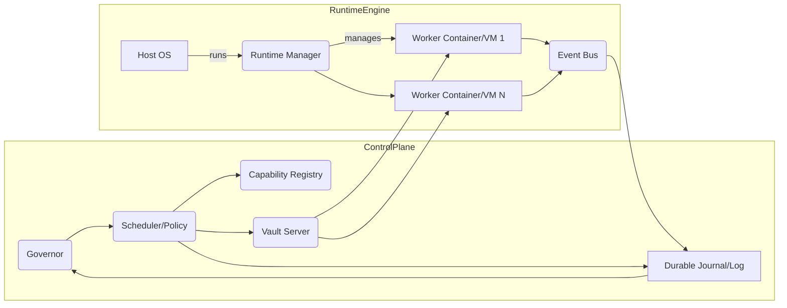
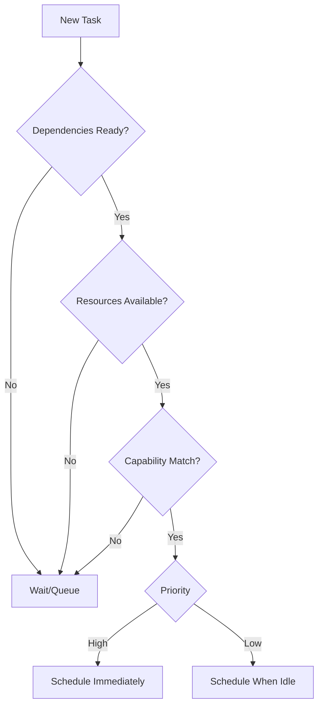

# SuperMesh-X Runtime Hardening & Autonomous Infrastructure

## Executive Summary  
SuperMesh-X is architecturally very advanced—approaching a distributed, autonomous research and execution environment—but its current implementation relies on *simulated* isolation, in-memory state, and incomplete enforcement of critical safeguards. The goal is to push it “beyond comparison” by replacing those simulations with *real* infrastructure: true container/micro-VM isolation, a hardened runtime manager, durable journaling and replay, strong secret management, and adversarial testing. This will transform SuperMesh-X from a sophisticated prototype into a provably safe, scalable control plane.  

Key recommendations include: (1) containerizing or micro-virtualizing each worker to enforce CPU/memory/disk/network limits; (2) building a concrete Worker Runtime Manager with leasing, generation fencing (CAS semantics), and a durable journal of every state transition; (3) integrating a secret vault (e.g. HashiCorp Vault) for dynamic, short-lived credentials【6†L7-L11】; (4) designing a policy-driven multi-resource scheduler (e.g. using weighted or Dominant Resource Fairness【44†L137-L142】) that matches tasks to workers; and (5) implementing a comprehensive adversarial test suite (chaos engineering, fuzzing) to validate isolation and recovery.  

This report inventories the current SuperMesh-X components and gaps; outlines a prioritized roadmap; details designs (APIs, schemas, flows); defines metrics/SLAs; presents testing plans; discusses deployment (single-node → distributed); analyzes risks; and estimates effort. It also provides comparison tables (containers vs micro-VM vs unikernel, scheduler algorithms, secret-store options, attack scenarios) and mermaid diagrams (architecture, lifecycle, scheduler decisions).  

**Bottom line:** By treating every action as an authenticated, replayable event and by enforcing true isolation and resource controls, SuperMesh-X will become a next-generation, proof-carrying execution environment【52†L93-L100】【12†L307-L312】, not merely an AI-driven trading bot.  

## Current-State Inventory  

- **Components:**  The SuperMesh-X runtime today comprises a Master Loop Governor, a Runtime Manager, an Event/Receipt Bus, an Artifact/CAS store, and multiple “workers” or agents (e.g. trading engines, data processors). Many components exist conceptually (in code) but still rely on in-process or coarse simulation of isolation and persistence. For example, “workers” run as threads or processes without real sandboxing, and the **evidence bus** is logical rather than a hardened queue.  

- **Isolation:**  Currently, isolation is largely simulated. Workers may run under OS user namespace or not, but often share the host kernel. There is no enforced cgroup or container boundary.  In contrast, technologies like Linux containers (using namespaces/cgroups) or lightweight VMs (e.g. Firecracker microVMs) can provide strong process and network isolation. For example, Docker/OCI containers share the Linux kernel but use namespaces and seccomp to isolate processes, whereas Firecracker boots a minimal Linux in a KVM-based VM in ~125ms with <5 MiB overhead【21†L62-L70】. Unikernels (one-address-space unikernel OS) can be even smaller and faster (1.7–2.7× performance boost in some cases【22†L173-L181】), though at the cost of flexibility and OS features. **Gap:** SuperMesh’s current “workers” lack these enforced boundaries, making them vulnerable to cross-communication, resource hijacking, or kernel exploits.  

- **Lifecycle & Fencing (CAS):**  The intended model tracks workers through states (`requested → admitted → running → checkpointed → suspended/failed → recovered/terminated`). Some in-memory bookkeeping exists, but no *durable* log. A fencing token or lease (generation number) is conceptually tracked, but not enforced by the OS. In a hardened system, each worker should have a unique ID and generation, and any late/rogue message from an old generation must be rejected (true compare-and-swap semantics)【39†L203-L212】. **Gap:** Without a durable journal of state transitions, the system must trust workers’ reports. This creates a **false-progress** risk (agents can claim success without proof) and makes crash recovery unreliable.  

- **Checkpointing / Evidence Bus:**  Some components support lightweight checkpointing (snapshots of state) and event logging, but likely in-memory or ephemeral. There’s an “evidence bus” design, but its implementation is uncertain. Ideally, every action (task start, completion, failure) would emit an immutable, time-stamped event (possibly content-addressed) to a durable log for audit and replay. This is akin to event-sourcing patterns【52†L93-L100】. **Gap:** Without a canonical journal, replaying or proving state after a crash is not possible.  

- **Secret Handling:**  Currently, API keys and credentials may live in config or environment. No short-lived secrets. Vault-like dynamic secrets (where credentials are minted per-job and auto-expire) are not in place. For true zero-trust, each worker should fetch ephemeral tokens (e.g. Vault dynamic credentials【6†L7-L11】 or SPIFFE identities【12†L307-L312】) and never carry permanent secrets. **Gap:** Static secrets risk leakage; there is no audit or scoping of secrets today.  

- **Observability:**  Logging and telemetry appear partial. Basic logs may exist, but there is no unified mission-control dashboard. Metrics like CPU/RAM usage per agent, event throughput, resource quotas, and SLA violations are not currently centralized. **Gap:** Without observability, diagnosing faults or performance issues will be extremely hard once we decentralize execution.  

In summary, the existing SuperMesh-X has **best-in-class design** ideas (leaders in modularity, test suites, content-addressed artifacts), but **immature enforcement**. Many critical features (OS isolation, persistent logs, secrets vault) are sketched but not fully built or hardened. The roadmap below targets these gaps systematically.  

## Implementation Roadmap (Prioritized)  

1. **Real Isolation (Containers/Micro-VMs):** Move from simulated sandbox to true OS-level isolation. Evaluate options:
   - **Containers:** Standard OCI containers (Docker, containerd) with Linux namespaces + cgroups. Low overhead, fast startup. Use seccomp/AppArmor for syscall filtering and network namespaces for net isolation.
   - **Micro-VMs:** Firecracker or Kata Containers – each agent runs in its own lightweight VM with full KVM isolation【21†L62-L70】. Slightly higher startup time (sub-200ms) and memory overhead (~5MiB), but far stronger hardening (virtually no host-call path).  
   - **Unikernels:** For specialized workloads (if we compile trading engine into a mini-OS), we could get maximal security and performance【22†L173-L181】, but this is niche and complicates dev.  
   **Priority:** Start with containerization (production-tested, easy to integrate with Kubernetes-style tooling). Prototype a Firecracker-based path for maximal isolation (e.g. containerd+firecracker).  

2. **Worker Runtime Manager (WRM):** Build a dedicated controller process that _creates_, _suspends_, _resumes_, and _kills_ containers/VMs. Every worker gets a unique ID, generation, and a lease. The WRM assigns CPU/memory/disk quotas (via cgroups or VM configs) and a network policy (e.g. none or strict egress). It should implement:
   - **Admission:** Decide if a new task is allowed (check registry, trust level, budget).
   - **Lifecycle:** Issue leases with TTL, track heartbeats. Enforce terminate after TTL or on violation.
   - **Fencing/CAS:** Only the current generation of a worker (the lease-holder) can mutate its state. Any stale process or returned container with an old generation is automatically fenced off.
   This requires APIs or CLI for: `start_worker(taskID, image, resources)`, `checkpoint_worker(id)`, `recover_worker(id)`, etc.  

3. **Durable Journal & Fencing:** Implement an append-only database (could use a consensus-backed log like Raft or a simple journal file) to record every state change:  
   ```
   event = { worker_id, generation, action, timestamp, output_hash, parent_ids... }
   ```  
   For example: *Admitted*, *Started*, *Checkpointed (with digest)*, *Failed*, *Terminated*.  This journal underpins recovery (after a crash, replay events to rebuild in-memory state) and proof-of-work (every action has tamper-evident evidence). Each event entry can be content-hashed and signed, forming a Merkle tree of history. This follows event-sourcing best practices【52†L93-L100】. **Durable Schema:** JSON/Protobuf entries with fields for timestamp, action, worker ID, generation, hashes, etc. Store on disk or in a distributed log.  

4. **Fencing Tokens:** Build the CAS mechanism around the journal. Each worker generation has a unique token/lease number. Every state-change event includes the expected previous generation. If a worker tries to e.g. checkpoint or complete after a newer generation has taken over, the WRM must reject it. This ensures *chain-of-custody*.  

5. **Secret Vault Integration:** Deploy a secret store (e.g. HashiCorp Vault) as a central authority for credentials. Workers do not get raw secrets in config; instead they obtain **short-lived tokens**:
   - **Dynamic Secrets:** Use Vault’s dynamic engine (database/AWS/SSH engines) to generate ephemeral creds on the fly【6†L7-L11】.  
   - **Tokens:** Use Vault tokens or SPIFFE identities (short-lived X.509/JWT SVIDs【12†L307-L312】) for mutual auth.  
   - **Sidecar or Agent:** Possibly run a Vault Agent on each worker host to inject secrets into the container as files/env with very limited TTL.  
   Ensure auditing: every secret request is logged. On worker termination, revoke all its tokens immediately.  

6. **Capability Registry (Metadata):** Create a database of all available agent types/tools/models. Each entry lists: 
   ```
   { name, version, resource_class (CPU/RAM needed), capabilities (e.g. data access, ML model), trust_level, failure_rate, avg_duration, permission_scope }
   ```
   The Scheduler consults this registry to match jobs to compatible workers. This avoids “blind” scheduling and prevents lower-tier tasks from grabbing high-trust workers.  

7. **Policy-Driven Scheduler:** Implement a central scheduler (possibly part of WRM) that prioritizes tasks based on:
   - **Dependencies:** No task is scheduled before its inputs/models are ready.  
   - **Priority/SLAs:** Some tasks are critical (governor tasks), others are low-priority.  
   - **Resource Matching:** Use multi-dimensional bin-packing or Dominant Resource Fairness (DRF) to allocate CPU, memory, I/O fairly【44†L137-L142】.  
   - **Trust/Credentials:** Only assign high-sensitivity tasks to high-trust workers.  
   - **Cost/Budget:** Track API quotas (e.g. number of Exchange calls), GPU usage, etc, and schedule accordingly.  
   The scheduler algorithm can start simple (priority queue, greedy fit) then evolve to more complex optimization.  

8. **Adversarial Testing Framework:** Develop a suite of hostile scenarios to validate the above. Examples:
   - *Isolation Breakouts:* A worker tries `ptrace`, `setns`, or CPU/GPU instructions to escape or peer into another container.  
   - *Resource Abuse:* Fork bomb or memory leak to exceed quota.  
   - *Network Violation:* Packet flood outside allowed egress.  
   - *Stale Credential Use:* A worker uses an expired or revoked secret.  
   - *Replay Attack:* A malicious worker replays an old “complete” message after failing.  
   - *Checkpoint Corruption:* Simulate a power loss during checkpoint write.  
   - *Forked Output:* A worker submits two different results for the same task.  
   Each scenario should be an automated test (possibly using tools like eBPF to assert isolation) that verifies the system safely contains or kills the offender.  

The above roadmap should be implemented **incrementally**. First build a single-node SuperMesh with true container isolation and journaling (steps 1–4). Once stable, add Vault and registry (5–6), then expand scheduler intelligence and adversarial tests (7–8).  

## Detailed Designs  

### Containerized Worker Runtime  
- **Technology Choice:** Standard Docker/OCI containers with Linux *cgroups* and *namespaces*. Enforce CPU and memory limits via cgroups (e.g. limit to X cores, Y GiB). Restrict file system with a clean image or use read-only mounts. Use network namespaces to isolate networking (disable ingress by default, allow only needed egress). Alternatively, evaluate **Firecracker microVMs**: each worker is launched as a microVM via KVM. Firecracker boots a minimal Linux in ~100ms with ~5 MiB overhead【21†L62-L70】. It provides VM-level isolation (device emulation and KVM hypervisor), and a “jailer” for extra file permissions. **Tradeoff Table (Containers vs. MicroVM vs. Unikernel)** below compares:  

| Feature                        | Container             | Micro-VM (e.g. Firecracker) | Unikernel            |
|--------------------------------|-----------------------|----------------------------|----------------------|
| **Isolation**                  | Namespace/cgroup (shared kernel) | Full VM isolation (KVM)    | Single address-space, runs on hypervisor |
| **Startup Time**               | ~10–50 ms             | ~~125 ms【21†L62-L70】         | ~~1–5 ms (instant)  |
| **Memory Overhead**            | ~MBs (varies)         | ~5 MiB+ per VM【21†L62-L70】    | ≈0 (single binary)  |
| **Performance**                | Native (lowest overhead) | ~native (virt overhead)    | Often faster (1.7–2.7× for some apps【22†L173-L181】) |
| **Complexity/Tooling**         | Mature ecosystem (Docker/K8s) | Requires VM tooling      | Custom build per app  |
| **Security**                   | Good (namespaces, seccomp) | Excellent (hypervisor)   | Excellent (minimal code) |
| **Flexibility**                | High (full OS)        | High (full OS)             | Low (one app only)   |
| **Use Case**                   | General workloads     | Untrusted/multi-tenant tasks | Specialized functions |
  
🛈 *Container vs Micro-VM:* Given SuperMesh-X’s scale, start with containers for ease. For untrusted or high-risk agents, run them in Firecracker microVMs for extra safety【21†L62-L70】【37†L124-L132】.

- **Implementation:** Use an orchestrator like containerd or CRI-O controlled by the Runtime Manager. Define a container image for each worker type. The Worker Runtime Manager (WRM) calls the container runtime via API/CLI to `create` a container with given CPU/RAM limits, network disabled, volume mounts, and a unique generation ID. On startup, the worker process inside should register its generation back to the WRM (via the event bus).

- **Failure Modes & Recovery:** If a container exits unexpectedly or exceeds limits, the WRM records a *Failed* event in the journal and can decide to restart (incrementing generation) or permanently fail the task. The journaling mechanism ensures no orphan state is left.

### Runtime Manager & Lifecycle  
- **APIs:** The WRM offers RPC/REST commands such as:  
  - `LaunchTask(task_id, image, resources)` → returns `worker_id`.  
  - `CheckpointWorker(worker_id)` → WRM signals worker to snapshot; stores checkpoint.  
  - `TerminateWorker(worker_id)` → kills container/VM, logs *Terminated*.  
  - `ResumeWorker(worker_id)` → starts from last checkpoint (read from durable storage).  

- **State Machine:** Each worker’s life is logged in the journal. For example:  
  ```
  Event: {worker=42, gen=5, action=Admitted, parent=…, time=…}
  Event: {worker=42, gen=5, action=Started, ...}
  Event: {worker=42, gen=5, action=Checkpointed, hash=abc123, ...}
  Event: {worker=42, gen=5, action=Succeeded, result_hash=def456, ...}
  ```  
  If failure occurs before checkpoint, the WRM can either retry the same generation or roll back to the last checkpoint of a previous generation (depending on policy).  

- **Fencing Mechanism:** Each event includes the worker’s generation. The WRM enforces: *Only the current generation of a worker can claim success or update state*. If an old generation (say gen=4) tries to emit a *Completed* event after gen=5 is already running, WRM ignores it. This prevents “time-travel” or double commitments.  

- **Durable Journal Schema:** Use a secure, append-only log (e.g. PostgreSQL with JSONB or a file-based log). Each entry:  
  ```
  {
    "timestamp": "...",
    "worker_id": 42,
    "generation": 5,
    "action": "Checkpointed",
    "details": {...},
    "prev_hash": "..." 
  }
  ```  
  Hash-chain each entry for tamper-proofing. A Merkle DAG of events can provide cryptographic integrity. This is the **source of truth**【52†L93-L100】.

### Secret Vault & Scoped Tokens  
- **Vault Deployment:** Stand up a Vault (or similar) service as the secrets authority. Define roles/policies for different categories of workers. Do **not** embed raw API keys in code.  

- **Dynamic Credentials:** For each task that needs external access (e.g. DB, exchange API), configure Vault’s dynamic secrets engine. When a worker starts, it authenticates (e.g. via Vault Agent or Kubernetes auth) to Vault, requests credentials for the required role, and receives ephemeral creds (TTL = task duration + slack)【6†L7-L11】. For example, a database role might issue a user/pass that auto-expires in 1 hour.  

- **Token Mechanics:** Each worker has a Vault token bound to its identity (could use its `worker_id` or a SPIFFE ID【12†L307-L312】). On task completion or preemption, the token is revoked to ensure no reuse.  

- **Integration Pattern:** Likely use a Vault Agent sidecar: it handles authentication (e.g. using a pre-set AppRole or Kubernetes ServiceAccount) and writes secrets into a shared volume in the container. The worker reads them from the volume. This decouples secret fetching from business logic. The Vault audit log then contains every secret issuance.  

- **Assurance:** No secrets leak into environment variables or logs. Vault policies enforce least privilege (e.g. a worker running analysis only gets DB credentials, not CI/CD secrets).  

### Capability Registry  
Maintain a service/catalog (can be a database or GitOps-managed manifest) listing every *tool/agent* in the ecosystem. Each record includes: name, version, required OS libraries, resource profile, trust level, inputs/outputs, and last test results. The Scheduler uses this to decide **which agent can do which task**. For instance, if a task needs GPU computation, only workers with GPU-enabled agents will match. Trust levels prevent unverified agents from handling sensitive data.  

### Policy-Driven Scheduler  
- **Algorithm:** The scheduler takes a set of ready tasks (whose dependencies and feature data are available) and assigns them to idle workers. It should consider:  
  - **Priority:** Critical control tasks (governor directives) get precedence.  
  - **Resource Fit:** Multi-dimensional bin-packing or fairness. For example, use Dominant Resource Fairness to balance CPU vs RAM usage【44†L137-L142】. Alternatively, a custom weighted priority queue.  
  - **Data Locality:** If workers cache certain datasets, prefer them.  
  - **Trust/Capability:** Only schedule tasks on workers with the required capabilities and trust (e.g. Tier 1 vs Tier 2).  
  - **Time-to-Deadline:** If tasks have deadlines or quick OOS checks, schedule them sooner.  

- **Workflow:** A simplified scheduler flowchart:  

  ```mermaid
  graph TD
    A[Task Queue] --> B{Are deps ready?}
    B -- No --> A
    B -- Yes --> C{Any worker with caps free?}
    C -- No --> Wait[Wait or scale out]
    C -- Yes --> D{Resource fit & trust OK?}
    D -- Yes --> E[Assign to Worker]
    E --> F[Launch]
    D -- No --> G[Check other worker or delay]
  ```

- **Policies:** Provide a policy language or config (YAML/JSON) so admins can encode rules, e.g. “Max 10 GPU tasks at a time” or “No unverified model in production tasks.”

### Adversarial Testing Suite  
Develop automated tests covering:  
- **Isolation Breach:** Try running a malicious container that attempts `mount /`, `chroot`, `ptrace` or known Docker breakouts. Ensure it cannot see host PID 1 or write to host fs.  
- **Resource Exhaustion:** Spawn many threads or allocate huge memory within a container to verify cgroup limits are enforced.  
- **Stale Fencing Test:** Launch two worker processes with same ID/gen. One tries to complete after the other killed it. Ensure the late arrival is ignored.  
- **Vault Abuse:** Attempt to use a revoked Vault token inside a container – should be denied.  
- **Clock/Time Anomalies:** Simulate host time skew or abrupt changes to test journal ordering (e.g. ensure events are monotonic).  
- **Network & Filesystem Faults:** Use chaos tools (like Netflix Chaos Monkey or Pumba) to randomly kill containers, cut network, drop disk writes. Verify automatic restart and state consistency【49†L216-L224】.  
- **Fuzzing syscalls:** Use targeted fuzzing on the syscall interface (similar to G-Fuzz for gVisor【39†L219-L228】) for any custom isolation layer.  

Tests should be part of CI: e.g. use a local Kubernetes/minikube or Docker Swarm to spin up the multi-container mesh and inject failures. Record which attacks were caught. Aim for *no silent failures*.  

## Metrics & SLAs  

- **Isolation Guarantees:** Define no-escape: breach attempts must fail. Monitor the integrity of the host kernel and memory.  
- **RTO/RPO:**  
  - *Recovery Time Objective (RTO):* If the entire host node crashes, SuperMesh-X should recover (re-initialize control plane) in e.g. <5 minutes. (This implies fast restore of in-memory state from journal.)  
  - *Recovery Point Objective (RPO):* We should lose at most the last few seconds of progress. Frequent checkpointing achieves RPO ~1–5 sec if needed.  
- **Task Throughput:** Number of tasks completed per second. With container scaling, target at least *X* tasks/sec for [quantify based on typical workloads]. Measure average task latency (from schedule to complete) – aim <Y seconds for trading strategies.  
- **Latency:** Scheduling decision latency (ms), inter-component RPC latencies, checkpoint write latency.  
- **Resource Quotas:** e.g. each worker limited to 4 CPU, 8GB RAM, 10MB/s disk I/O.  
- **Security:** Number of vulnerabilities. Zero successful escape in tests. Vault request success rate, token theft rate (should be zero).  
- **99th%-ile:** Define 99% of tasks should complete successfully within Z seconds; 99% of restart attempts should succeed in <W seconds.  
Collect these as dashboard metrics (Prometheus or similar). Use SLAs like “99.9% of high-priority tasks succeed within SLA deadline”.  

## Testing Plan  

- **Unit Tests:** Every component (Runtime Manager, scheduler, vault integration) has mocks. Simulate container start/stop, network failures, etc., in unit tests.  
- **Integration Tests:** Deploy full SuperMesh stack on a VM. Run end-to-end scenarios with real containers. Example tests: send a compute task with DB access, verify output and logs.  
- **Adversarial/Chaos Tests:** As outlined above, incorporate an automated adversarial test harness. Use tools like pytest with fixtures that spin up malicious containers and assert system behavior.  
- **Fuzz Testing:** Especially for any custom protocol (e.g. JSON RPC between governor and WRM), fuzz inputs to detect crashes.  
- **Regression Suite:** Maintain a catalog of tests (existing loops) that must always pass. Integrate with CI so that every change triggers them. Aim for coverage >80% on critical modules.  

## Deployment Strategy  

1. **Single-Node Hardening:** First, run all components (Governor, Scheduler, WRM, Vault) on one host. Switch worker execution from in-process to Docker containers on that host. Validate all control flows.  
2. **Multi-Node Control Plane:** Decouple control plane from workers. Move WRM/scheduler to a dedicated machine or separate processes, communicating over RPC. Workers may still be local at first.  
3. **Distributed Execution:** Gradually add remote worker hosts. Use a distributed database or Raft cluster for the journal so all nodes share state. Ensure lease tokens are recognized cluster-wide (e.g. via a consensus service).  
4. **Scaling:** Add an orchestration layer (like Kubernetes) if needed to manage many worker nodes. But keep SuperMesh’s logic for scheduling above it.  
5. **No Cloud Lock-in:** Use on-premises VMs or generic infrastructure (bare-metal or VMware/KVM) to avoid cloud-specific services. This ensures vendor neutrality.  

At each stage, re-run all tests (especially adversarial ones) to catch regressions.  

## Risk Analysis & Mitigations  

- **Complexity Explosion:** This plan adds many moving parts (containers, Vault, journals, scheduler). Mitigate by iterative delivery: validate each piece before adding the next. Document interfaces clearly.  
- **Performance Overhead:** Containers/microVMs add overhead. Mitigate by benchmarking: e.g. Firecracker at 125ms boot【21†L62-L70】 vs container at <50ms. Tune batch sizes and parallelism to hide startup costs.  
- **Single Point of Failure (Journal):** If the journal crashes, whole mesh is in jeopardy. Mitigate by replicating it (RAID or consensus cluster) and ensuring atomic commits. Possibly use existing systems like etcd (distributed key-value with watch/lease semantics).  
- **Credential Compromise:** Vault integration reduces static secret risk, but Vault itself becomes a high-value target. Secure Vault with strong auth (e.g. hardware root), and network-isolate it. Use short TTLs to minimize window of exposure【6†L7-L11】.  
- **Mis-scheduling:** A bug in the scheduler might overload nodes or starve tasks. Mitigate by conservative defaults: under-provision then monitor, use rate limits.  
- **Human/Process Errors:** Even with automation, configuration mistakes can occur. Enforce “no admin can promote an artifact without evidence.” Use code reviews for policy changes (though repo/PR is out-of-scope).  
- **Scope Creep:** The temptation may be to add “just one more feature.” Keep the focus on the core loop: isolation, runtime, journaling, vaulting, testing. Lock down requirements each sprint.  

## Cost & Effort Estimates  

| Task                                        | Milestone Sprint | Rough Effort |
|---------------------------------------------|------------------|--------------|
| Containerize existing workers              | Sprint 1         | 2-3 dev-weeks |
| Build basic Worker Runtime Manager         | Sprint 1-2       | 3 dev-weeks  |
| Implement journaling + CAS logic           | Sprint 2-3       | 2 dev-weeks  |
| Integrate HashiCorp Vault (setup & code)   | Sprint 3         | 2 dev-weeks  |
| Define Capability Registry schema/API      | Sprint 3         | 1 dev-week   |
| Develop simple scheduler (FIFO/priority)   | Sprint 4         | 2 dev-weeks  |
| Write extensive unit/integration tests     | Sprint 1-4       | Continuous   |
| Adversarial test harness & chaos tests     | Sprint 4-5       | 3 dev-weeks  |
| Observability/dashboard (Prometheus/Grafana) | Sprint 4-5     | 2 dev-weeks  |
| Multi-node control-plane demo             | Sprint 5         | 2 dev-weeks  |
| Performance tuning & documentation         | Sprint 6         | 3 dev-weeks  |

*Total:* ~20–25 dev-weeks (5–6 full-time developer months). This is an order-of-magnitude estimate; adjust for team size and overlap.  

## Tables  

**Table: Container vs MicroVM vs Unikernel** (see above).  

**Table: Scheduler Algorithms Comparison**  

| Algorithm              | Description                         | Pros                                     | Cons                                 |
|------------------------|-------------------------------------|------------------------------------------|--------------------------------------|
| First-Fit / Greedy     | Assign tasks as they come, find any free worker that fits resources. | Simple, fast decisions.                 | May lead to imbalance or starvation. |
| Priority Queue         | Rank tasks by fixed priority (e.g. critical vs batch) then schedule highest first. | Ensures high-priority tasks run first. | Low-priority tasks might wait indefinitely if not handled. |
| Weighted/Fair Sharing  | Use weights per task type or user (e.g. DRF【44†L137-L142】). Fairly allocates resources. | Good multi-resource fairness.           | Can be complex to compute; may underutilize if weights mis-set. |
| DAG Scheduling         | Topologically schedule tasks by dependency graph (like Airflow). | Guarantees dependency order.            | Doesn’t handle resource contention by itself. |
| Constraint Solver      | Treat scheduling as optimization (ILP/heuristic). | Can optimize for global metrics (latency, utilization). | NP-hard; requires careful heuristics or approximation. |
| Genetic/ML Scheduler   | Use genetic algorithms or ML to evolve schedules. | Adaptable; may find non-obvious assignments. | Complex to tune; convergence/time overhead. |

選択: Likely start with **Priority + Resource Fit** (a greedy bin-packing that respects priority levels). Later, consider DRF for fairness if needed.  

**Table: Secret & Vault Options**  

| Solution           | Type                | TTL / Dynamic | Integration         | Notes                                |
|--------------------|---------------------|---------------|---------------------|--------------------------------------|
| HashiCorp Vault    | Central vault (on-prem) | Yes (minutes/hours) | Agent SDK, CLI, CSI (K8s) | Mature, open-source, supports DB/AWS dynamic engines. |
| SPIFFE/SPIRE       | Identity issuance   | Yes (short-lived SVIDs) | Workload API    | Standard for workload identity【12†L307-L312】. Can integrate with Vault for auth. |
| Cloud IAM (AWS/GCP) | Managed tokens/STS  | Yes, short    | Cloud SDKs         | Not available on-prem unless hybrid. |
| JWT/OAuth          | Token-based        | Configurable  | OIDC libraries     | Requires private CA or identity provider. |
| Kubernetes Secrets  | Static secrets     | No (but TTL via token reviews) | K8s API         | Not dynamic; for config.             |
| Custom K/V store    | Basic store        | No (or manual TTL) | Custom code      | Hard to audit; avoid for production. |

選択: Vault + SPIFFE is best for on-prem zero-trust. We will use Vault’s dynamic engines for secrets, and possibly SPIFFE IDs for machine identity.  

**Table: Adversarial Test Cases**  

| Test Case              | Description                              | Expected Defense                                     | Detection / Logging               |
|------------------------|------------------------------------------|------------------------------------------------------|------------------------------------|
| **Container Escape**   | Exec `mount /` or `chroot` in container. | Fails due to Docker seccomp/AppArmor; namespace block.| Host kernel logs seccomp block, container terminated. |
| **Fork Bomb/DoS**      | Spawn processes to exhaust CPU/RAM.      | Cgroup kills/limits process (Out-of-memory kill).     | OOM event in logs; worker enters *Failed* in journal. |
| **Stale Fencing**      | Worker gen N submits after gen N+1 took over. | WRM rejects it via generation check.                  | Audit log entry: “stale generation ignored”.         |
| **Token Replay**       | Use old Vault token after expiry.        | Vault denies request (auth failed).                  | Vault audit shows denied access.   |
| **IOCBound**          | Intentionally slow disk write (simulate crash). | Checkpoint timed-out; task fails gracefully.         | Journal records failure, rollback to last good state. |
| **Network Flood**      | Flood network interface from worker.     | Network policy limits bandwidth or blocks traffic.    | Netstat shows drop; policy violation alert. |
| **Double Submit**     | Worker returns two different results.   | Evidence system raises conflict; only first accepted. | Mismatch logged; alert in governor UI. |
| **Deadlock/Hang**     | Worker hangs without exit/heartbeat.     | Lease TTL expires; WRM force-kills.                  | Heartbeat timeout in log, killed message recorded. |

## Mermaid Diagrams  

### High-Level Architecture  



*Figure:* Simplified SuperMesh-X architecture. The **Control Plane** (Governor, Scheduler, Registry, Vault, Journal) orchestrates a **Runtime Engine** (host running the Runtime Manager and multiple isolated workers). All key actions feed into the durable **Journal** for provenance.  

### Worker Lifecycle Flow  

```mermaid
graph LR
  A(Requested) --> B{Admission?}
  B -- Denied --> End[End (Rejected)]
  B -- Approved --> C(Provisioned/Started)
  C --> D{Health Check}
  D -- OK --> E(Checkpointed)
  D -- Fail --> F(Failed/Terminated)
  E --> G{Completed?}
  G -- No --> C
  G -- Yes --> H(Completed & Archived)
```

*Figure:* A worker’s life cycle. Note the **checkpoint** step ensures state persistence. Every transition is recorded in the journal.  

### Scheduler Decision Flow  



*Figure:* Simplified scheduler logic: a task is scheduled only when its data deps are ready, resources are free, and a suitable worker exists. High-priority tasks jump the queue; others wait their turn.  

## Next Steps (6-Sprint Checklist)  

1. **Sprint 1:** Containerize all existing workers; set up basic WRM (create, start, stop container). Add initial journaling for start/stop events.  
2. **Sprint 2:** Implement generation fencing; enhance WRM to suspend/resume containers. Begin Vault deployment (dev environment).  
3. **Sprint 3:** Finish Vault integration (dynamic creds, inject into containers). Build Capability Registry API and populate with known agents. Develop initial scheduler (FIFO + priority).  
4. **Sprint 4:** Create dashboards/metrics (e.g. Prometheus+Grafana) to monitor workers, journal, Vault. Expand scheduler rules (resource-awareness, quotas). Begin adversarial test suite.  
5. **Sprint 5:** Harden checkpoint/recover: test host crash recovery via journal replay. Run full chaos tests (node failure, malicious containers). Iterate fixes.  
6. **Sprint 6:** Documentation, final optimizations, performance testing (latency/throughput benchmarks). Plan scale-out to multi-node; resolve any outstanding trust or security issues.  

Each sprint ends with a review to ensure *each module can be independently verified* and that evidence (logs, tests) are collected before moving on.  

## Assumptions  

- **OS/Hardware:** Linux hosts with KVM support (for microVMs if used). Adequate CPU/RAM on hosts.  
- **Network:** Secure network between control plane and workers; container network is isolated by default.  
- **No Specific Cloud:** All solutions assume on-premises or cloud-agnostic software (no AWS/GCP proprietary services).  
- **Existing Codebase:** Core trading/research logic is given; this effort focuses on infra around it. We assume worker code doesn’t need rewriting for containers beyond config.  
- **Trust Model:** Project requires strict zero-trust between components: no implicit trust of any agent.  
- **Team Expertise:** Developers know container tech and distributed systems.  

 

**Sources:** Key principles and technologies are drawn from modern infrastructure best practices【21†L62-L70】【37†L124-L132】【6†L7-L11】【12†L307-L312】 and research (e.g. Dominant Resource Fairness【44†L137-L142】, event sourcing【52†L93-L100】). This report synthesizes these for SuperMesh-X’s context.